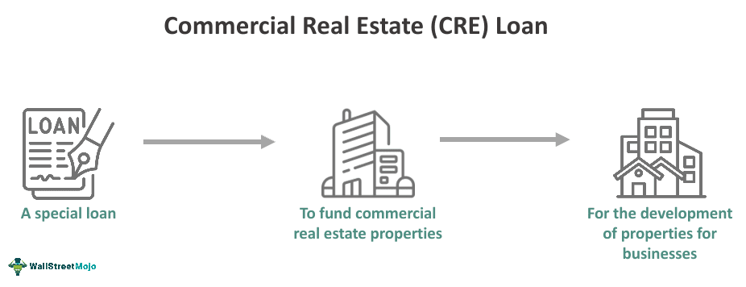

The landscape of real estate finance and commercial real estate has undergone significant transformations in recent years, driven by both technological advancements and evolving market dynamics. The convergence of business loans, commercial real estate, and the nascent field of algorithmic trading is reshaping the way stakeholders navigate real estate finance. This article investigates how these components interact to create new opportunities, emphasizing their significance for investors, developers, and entrepreneurs seeking to optimize their financial strategies.

Real estate finance is multifaceted, involving various financial instruments and processes crucial for acquiring and managing commercial property. As the sector evolves, understanding key financial tools and the impact of technology becomes paramount. The adoption of algorithmic trading in real estate introduces sophisticated data analysis, enhancing decision-making and offering competitive advantages in a fast-paced market. Investors who grasp the intricacies of these elements are better equipped to capitalize on emerging opportunities.



The role of technology cannot be understated in reshaping real estate finance. With the rise of big data and machine learning, algorithmic models provide enhanced accuracy and efficiency in portfolio management. These technological tools allow for a nuanced assessment of market trends and risks, informing strategic investment decisions. Consequently, this integration not only challenges traditional methods but also presents an avenue for innovation and growth in commercial real estate.

Our exploration aims to provide insights into how these dynamic components converge. By understanding the interplay between commercial loans, real estate transactions, and algorithmic trading, stakeholders can position themselves to navigate current challenges and harness future potential in the evolving real estate landscape.

## Table of Contents

## Understanding Real Estate Finance

Real estate finance encompasses the mechanisms used to acquire land or property for commercial use. It involves various financial structures and instruments specifically tailored to meet the unique needs of the commercial real estate market. A primary instrument in this field is the commercial real estate loan, which differs significantly from residential loans. Understanding these differences is vital for anyone engaged in the acquisition or management of commercial properties.

Commercial real estate loans are characterized by distinct terms that set them apart from residential loans. They often require more substantial upfront investments, which are typically reflected in the larger down payment amounts. Loan terms such as maturity periods, repayment structures, and loan-to-value (LTV) ratios are crucial components that determine the viability and attractiveness of a financial package. The loan-to-value ratio, in particular, is a critical metric that represents the ratio of a loan to the value of the asset purchased. A lower LTV ratio indicates less risk to the lender because lower loan amounts are involved compared to the property’s value.

To further evaluate the soundness of an investment, investors must understand financial metrics such as the Debt-Service Coverage Ratio (DSCR). The DSCR is a measure of the cash flow available to cover debt obligations and is calculated as:

$$
DSCR = \frac{\text{Net Operating Income (NOI)}}{\text{Total Debt Service}}
$$

A DSCR greater than 1 indicates that a property generates sufficient income to cover its debt service, while a DSCR below 1 signifies potential difficulty in meeting debt obligations, making it a key consideration for lenders when assessing loan applications.

Interest rates also play a pivotal role in shaping the landscape of real estate finance. They affect both the cost of borrowing and the overall return on investment for commercial properties. Interest rates can vary significantly based on the borrower's creditworthiness, the type of property, and prevailing market conditions.

In addition to understanding these financial metrics, investors must navigate the prerequisites for securing loans. Credit scores are a vital component, reflecting the borrower’s ability to repay the loan. A higher credit score can result in more favorable loan terms, such as lower interest rates. Collateral requirements are also a major consideration, where the property itself often serves as security for the loan. The valuation of this collateral can significantly impact the terms and availability of financing.

Therefore, a profound understanding of real estate finance mechanisms, financial instruments, and associated metrics is crucial for making informed decisions in the commercial real estate sector. This knowledge not only aids in evaluating investment opportunities but also equips investors with the tools to optimize their financial strategies efficiently.

## Business Loans in Commercial Real Estate

Business loans play a crucial role in supporting the acquisition and development of commercial properties. These loans provide the necessary capital for businesses to either purchase existing real estate or fund new construction projects. Among the various types of loans available, the SBA 7a and SBA 504 are prominent, each offering unique benefits tailored to specific business needs. 

The SBA 7a loan is flexible, allowing funds to be used for a wide range of purposes, including real estate acquisition, renovation, or even working capital. The maximum loan amount is typically up to $5 million, and it is particularly suited for businesses seeking funding for mixed-use developments. On the other hand, the SBA 504 loan is designed to promote economic development by providing financing for major fixed assets like land and buildings. The SBA 504 features lower down payment requirements and longer repayment terms, which make it attractive for businesses intending to purchase high-cost real estate.

Eligibility requirements, terms, and down payment stipulations for these loans vary significantly. For example, SBA 7a loans generally require a higher credit score and impose stricter requirements on the business’s operational history compared to the SBA 504. Conversely, the SBA 504 loan requires the business to meet specific job creation or public policy goals. Down payment requirements also differ; the SBA 504 usually mandates a down payment of 10%, which can be lower than traditional commercial loans.

Commercial real estate loans typically have shorter terms than residential mortgages, often ranging from five to twenty years compared to the 30-year norm for residential loans. This shorter term requires a more strategic approach to ensure that the business can meet its repayment obligations while benefiting from the property investment. Hence, careful financial planning and cash flow management are vital.

Lenders evaluate multiple variables when assessing loan applications, focusing on the business’s financial health, the value of the property being purchased, and the creditworthiness of the borrower. Financial health encompasses several metrics, including debt-to-income ratio, cash flow stability, and profit margins. The property’s asset value is crucial since it serves as collateral for the loan; lenders often use a loan-to-value (LTV) ratio to mitigate risk, where a lower LTV signifies a safer investment.

By understanding these elements, businesses can better navigate the complexities of securing appropriate loans to enhance their commercial real estate ventures, aligning their choice of financial product with both short-term needs and long-term growth objectives.

## The Role of Algorithmic Trading in Real Estate Finance

Algorithmic trading, a staple in conventional financial markets, is rapidly reshaping the landscape of real estate finance. By leveraging the capabilities of big data, [machine learning](/wiki/machine-learning), and automation, [algorithmic trading](/wiki/algorithmic-trading) tools can significantly enhance the management and optimization of real estate portfolios. This technological shift provides investors with several key advantages.

One of the primary benefits is data-driven analysis. Algorithms can process vast amounts of data related to property values, market trends, and economic indicators much faster than a human analyst. Enhanced data analysis allows for a more accurate assessment of property values and potential returns, enabling investors to make informed decisions. For example, an algorithm can be designed using Python to automatically gather data on property prices from online platforms and identify trends:

```python
import requests
from bs4 import BeautifulSoup
import pandas as pd

url = 'https://realestatewebsite.com/property-prices'
response = requests.get(url)
soup = BeautifulSoup(response.text, 'html.parser')

prices = []
for price_tag in soup.find_all(class_='price'):
    prices.append(float(price_tag.text.replace('$', '').replace(',', '')))

price_data = pd.DataFrame(prices, columns=['Price'])
print(price_data.describe())
```

Moreover, the speed and accuracy provided by algorithmic trading are unmatched. Automated processes can execute trades based on market conditions almost instantaneously, minimizing the delays typical of manual trading strategies. This rapid response capability means investors can capitalize on favorable conditions or avoid negative market shifts, enhancing portfolio performance.

Algorithm-driven systems can also assess investment risks more effectively. By utilizing predictive analytics and risk assessment models, these systems offer strategic recommendations for property acquisition and management. Investors can calibrate their algorithms to consider various risk factors, such as [interest rate](/wiki/interest-rate-trading-strategies) fluctuations or changes in property demand, to optimize their strategies.

Understanding the impact of algorithmic trading offers competitive advantages in the real estate sector. As markets evolve, those equipped with advanced algorithmic tools are better positioned to navigate the complexities of commercial real estate. The integration of these technologies provides not just operational efficiency but also strategic foresight, essential for maintaining resilience in dynamic market environments. This evolving approach represents a significant shift in how real estate finance operates, bringing both challenges and opportunities for innovation.

## Case Studies and Best Practices

### Case Studies and Best Practices

The intersection of commercial loans and algorithmic trading is opening fresh avenues for optimizing real estate investments. Examining real-world applications provides insights into how these elements can be combined effectively to maximize returns and streamline operations.

**Optimal Use of Commercial Loans and Algorithmic Trading**

Several businesses have successfully leveraged the synergy between commercial loans and algorithmic trading to boost capital efficiency and property yield. For instance, some developers have utilized algorithmically-enhanced analytics to determine the optimal structure of financing. By aligning loan terms with market conditions, companies can minimize interest costs and maximize flexibility in repayment schedules.

**Best Practices for Aligning Loans with Business Objectives**

Aligning commercial loans with business objectives requires a nuanced approach. Best practices suggest that businesses should:

1. **Selection of Loan Types**: Depending on the project's scope and commercial objectives, entities should choose appropriate loan types, such as SBA 7a or SBA 504. Each offers distinctive advantages concerning interest rates and down payment requirements. 

2. **Tech Augmentation**: Businesses that judiciously integrate technology, such as machine learning algorithms, into their financial strategies often observe better alignment with their operational goals. Such technology can facilitate predictive analytics for interest rate trends and property valuation.

**Importance of Due Diligence and Market Research**

Despite technological advancements, thorough due diligence remains a cornerstone of successful investments. Continuous market research is vital to anticipate fluctuations and adapt strategies accordingly. By maintaining a data-driven approach, businesses can mitigate risks and identify lucrative opportunities.

**Future Trends: AI and Real Estate Transactions**

Emerging trends underscore the expanding role of AI in real estate. AI applications are expected to streamline transactions, enhance forecasting models, and personalize investment strategies. As AI continues to evolve, it is poised to offer further innovations, making real estate finance more responsive and intelligent.

These practices and case studies illustrate how the convergence of loans and algorithmic trading not only addresses contemporary challenges but also unlocks potential for future growth and resilience in commercial real estate.

## Conclusion

The confluence of real estate finance, commercial loans, and algorithmic trading is transforming the landscape of opportunities within the sector. For stakeholders, including investors, developers, and businesses, mastering these tools and practices is essential to achieve success in a dynamic environment. Real estate finance provides the foundation through which properties are acquired and managed, while commercial loans facilitate the funding necessary to purchase and develop these assets efficiently.

Algorithmic trading introduces a sophisticated layer of data analysis, enabling stakeholders to harness the power of big data and machine learning. By leveraging these technologies, investors can enhance their decision-making processes, ensuring they remain responsive to market fluctuations and trends. This approach also allows for the development of optimized real estate portfolios that are better aligned with market demands.

Remaining informed about market developments and technological advancements is crucial in this evolving landscape. As real estate finance continues to intersect with algorithmic innovations, the industry will likely witness an accelerated pace of change. These shifts present not only challenges but also opportunities to capitalize on novel finance strategies that blend traditional methods with cutting-edge technology.

Investors and businesses that embrace these advancements will find themselves in a favorable position to maximize their returns and achieve sustainable growth. As such, understanding the integration of these elements is imperative, providing an avenue for stakeholders to innovate, strategize, and ultimately succeed in an increasingly competitive marketplace.

## References & Further Reading

[1]: Bergstra, J., Bardenet, R., Bengio, Y., & Kégl, B. (2011). ["Algorithms for Hyper-Parameter Optimization."](https://papers.nips.cc/paper/4443-algorithms-for-hyper-parameter-optimization) Advances in Neural Information Processing Systems 24.

[2]: ["Advances in Financial Machine Learning"](https://www.amazon.com/Advances-Financial-Machine-Learning-Marcos/dp/1119482089) by Marcos Lopez de Prado

[3]: ["Evidence-Based Technical Analysis: Applying the Scientific Method and Statistical Inference to Trading Signals"](https://www.amazon.com/Evidence-Based-Technical-Analysis-Scientific-Statistical/dp/0470008741) by David Aronson

[4]: ["Machine Learning for Algorithmic Trading"](https://github.com/stefan-jansen/machine-learning-for-trading) by Stefan Jansen

[5]: ["Quantitative Trading: How to Build Your Own Algorithmic Trading Business"](https://www.amazon.com/Quantitative-Trading-Build-Algorithmic-Business/dp/1119800064) by Ernest P. Chan