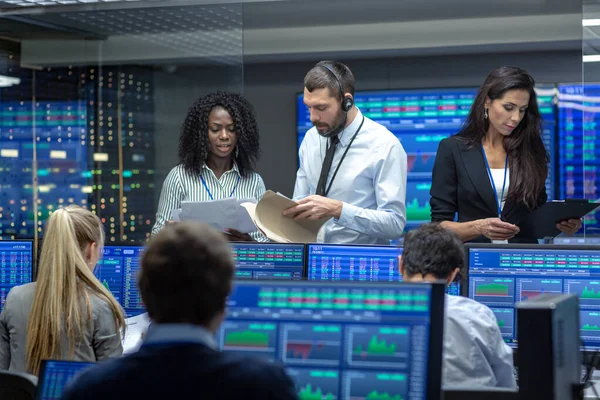

## Table of Contents

## What is a commercial trader?

A commercial trader is a business or individual that buys and sells products or services to make money. They are different from people who trade for fun or just to own things. Commercial traders focus on making a profit from their trading activities. They might trade things like farm products, metals, energy, or financial products like stocks and bonds.

These traders often work for big companies or financial institutions. Their job is to understand the market and make smart decisions about when to buy and sell. They use different strategies and tools to help them make these decisions. For example, they might use charts and data to predict how prices will change. By doing this, they try to buy low and sell high, which helps their company make more money.

## What are the primary roles and responsibilities of a commercial trader?

A commercial trader's main job is to buy and sell products or services to make a profit for their company. They need to know a lot about the market they work in, whether it's farming products, metals, energy, or financial products like stocks and bonds. Their main role is to understand market trends and make smart choices about when to buy and when to sell. They use different tools and strategies to help them make these decisions, like looking at charts and data to predict how prices will change.

Another important responsibility of a commercial trader is to manage risk. They need to be careful because the market can be unpredictable. They use different methods to protect their company from losing too much money. This might include using financial tools like futures and options to hedge against price changes. They also need to keep up with news and events that could affect the market, so they can adjust their strategies quickly.

Lastly, commercial traders often work closely with other parts of their company, like the sales and production teams. They need good communication skills to share information and coordinate plans. This teamwork helps the whole company work better and make more money. Being a commercial trader requires a mix of knowledge, skills, and the ability to make quick decisions under pressure.

## How does a commercial trader differ from other types of traders?

A commercial trader is different from other types of traders because they work for a business and focus on making money for that business. They trade things like farm products, metals, or financial products like stocks and bonds. Their main goal is to buy low and sell high to make a profit for their company. They use special tools and strategies to predict market changes and make smart decisions. This is different from people who trade just for fun or to own things, who might not care as much about making money.

Another difference is that commercial traders manage risk for their company. They use methods to protect their business from losing too much money if the market changes suddenly. They might use things like futures and options to do this. Other types of traders, like day traders or retail traders, might not have the same level of risk management because they are usually trading with their own money and for their own gain. Commercial traders also work closely with other parts of their company, like sales and production teams, to make sure everyone is working together to make money.

In short, commercial traders focus on making profits for their business, manage risk carefully, and work as part of a team. This is different from other traders who might trade for fun, personal gain, or to own things, and who might not have the same focus on risk management or teamwork.

## What types of goods or commodities do commercial traders typically deal with?

Commercial traders usually deal with a wide range of goods and commodities. Some of the most common ones are farm products like wheat, corn, and soybeans. They also trade metals like gold, silver, and copper. Energy products, such as oil and natural gas, are another big part of what they handle. These goods are important because they are used in many different industries, and their prices can change a lot.

In addition to physical goods, commercial traders often work with financial products. This includes stocks, bonds, and currencies. They might also trade in derivatives, which are financial instruments like futures and options that are based on the value of other assets. These financial products help traders manage risk and make profits by betting on how prices will change in the future. Overall, commercial traders deal with anything that can be bought and sold to make money for their company.

## What are the basic steps involved in a commercial trading operation?

A commercial trading operation starts with research and analysis. The trader looks at market trends, news, and data to understand what is happening with the goods or commodities they trade. They use charts and other tools to predict how prices might change. Based on this information, the trader decides what to buy and when. For example, if they think the price of wheat will go up, they might buy it now to sell later at a higher price.

Once the trader has made their decision, they execute the trade. This means they buy or sell the goods or commodities through a trading platform or exchange. They need to be quick and careful because the market can change fast. After the trade is done, the trader keeps an eye on the market to see if their predictions are right. If the market moves in a different direction than expected, they might need to adjust their strategy or use risk management tools like futures and options to protect their company's money.

## What skills and qualifications are necessary to become a successful commercial trader?

To become a successful commercial trader, you need to have a strong understanding of the markets you work in. This means knowing a lot about the goods or commodities you trade, like farm products, metals, or financial products. You also need to be good at analyzing data and using tools like charts to predict how prices will change. Being able to think quickly and make smart decisions is very important because the market can change fast. You should also have good math skills to calculate profits and manage risk.

Besides knowledge and skills, certain qualifications can help you become a successful commercial trader. A degree in finance, economics, or a related field can give you a good start. Many traders also get certifications like the Chartered Financial Analyst (CFA) or the Series 3 license for commodity trading. Experience is also key. Working in a trading firm or getting an internship can help you learn the ropes and understand how to handle real market situations. Good communication skills are important too, because you'll need to work closely with other teams in your company to make sure everyone is on the same page.

## How do commercial traders manage risk in their operations?

Commercial traders manage risk by using different strategies and tools. One main way is by using financial products called derivatives, like futures and options. Futures let them agree to buy or sell something at a set price in the future. This can protect them if the market price changes a lot. Options give them the choice to buy or sell at a certain price, which can help limit their losses. By using these tools, traders can protect their company's money from big price swings in the market.

Another way commercial traders manage risk is by always watching the market and staying informed. They look at news, data, and market trends to understand what might happen next. If they see something that could change prices, like a new law or a weather event, they can adjust their plans quickly. They also set limits on how much they are willing to lose on a trade. This helps them stop trading if things go badly, so they don't lose too much money. By being careful and prepared, commercial traders can handle the ups and downs of the market.

## What are the common strategies used by commercial traders to maximize profits?

Commercial traders use different strategies to make more money. One common strategy is called [trend following](/wiki/trend-following). They look at charts and data to see which way the market is moving. If they think prices will keep going up, they buy now to sell later at a higher price. If they think prices will go down, they might sell now and buy back later at a lower price. Another strategy is called [arbitrage](/wiki/arbitrage). This is when they buy something in one market where it's cheaper and sell it in another market where it's more expensive. By doing this, they can make a profit from the price difference.

Another strategy commercial traders use is hedging. They use financial tools like futures and options to protect their company's money from big price changes. For example, if they think the price of oil might go down, they can use a futures contract to lock in a price now. This way, even if the market price drops, they are safe. They also use diversification, which means they don't put all their money into one thing. By trading different goods or commodities, they can spread out their risk and increase their chances of making a profit. By using these strategies, commercial traders try to make the most money for their company.

## How do market trends and economic indicators affect commercial trading?

Market trends and economic indicators play a big role in what commercial traders do. When traders see a trend, like prices going up or down, they use that information to decide when to buy or sell. For example, if they notice that the price of wheat is going up because of a new demand, they might buy wheat now to sell later at a higher price. Economic indicators, like reports on jobs, inflation, or interest rates, also help traders predict what might happen next. If a report shows that the economy is doing well, traders might think prices will go up, so they buy more. If the report shows the economy is doing badly, they might sell to avoid losing money.

These trends and indicators can change quickly, so traders need to stay informed and be ready to adjust their plans. They use tools like charts and data to keep an eye on the market and make smart decisions. For example, if a news report says there will be a big storm that could affect oil production, traders might use that information to change their trading strategy. By understanding and reacting to market trends and economic indicators, commercial traders can make better choices and help their company make more money.

## What are the regulatory and compliance issues that commercial traders must navigate?

Commercial traders have to follow many rules and laws to make sure they are trading fairly and safely. These rules come from government agencies like the Commodity Futures Trading Commission (CFTC) and the Securities and Exchange Commission (SEC). Traders need to know about things like insider trading, which is using secret information to make money, and market manipulation, which is trying to control prices unfairly. They also have to keep good records of all their trades and report them correctly. If they don't follow these rules, they could get in big trouble, like fines or even going to jail.

Besides government rules, commercial traders also have to follow rules set by the exchanges where they trade, like the Chicago Mercantile Exchange (CME) or the New York Stock Exchange (NYSE). These rules might include how much money they need to have before they can start trading, and how they should behave while trading. Traders also need to make sure they are following their company's own rules and policies. This means they have to do things like regular training and checks to make sure they are always doing the right thing. By following all these rules, commercial traders can keep their jobs and help their companies stay out of trouble.

## How has technology impacted the operations and strategies of commercial traders?

Technology has changed a lot about how commercial traders work. Now, they can use computers and the internet to trade faster and easier. They use special software to look at lots of data and charts quickly. This helps them see what's happening in the market and make smart choices about when to buy or sell. They can also trade from anywhere, not just in an office, because they can use their phones or laptops. This makes it easier for them to keep an eye on the market all the time.

Technology also helps traders use new strategies to make money. They can use tools like algorithms, which are like computer recipes, to trade automatically. These algorithms can look at data and make trades without the trader having to do it themselves. This can help them make trades faster and more often, which can lead to more profits. Also, technology helps them talk to other people in their company and share information quickly. This teamwork can help them make better plans and manage risk better.

## What are the future trends and challenges facing commercial traders?

The future of commercial trading is going to be shaped by new technology and changes in the world. One big trend is the use of [artificial intelligence](/wiki/ai-artificial-intelligence) (AI) and [machine learning](/wiki/machine-learning). These tools can help traders look at huge amounts of data and find patterns that they might not see otherwise. This can help them make better predictions and trades. Another trend is the growth of electronic trading platforms. These platforms make it easier for traders to buy and sell things quickly and from anywhere. They also help traders reach new markets and customers around the world.

However, these new technologies also bring challenges. One big challenge is keeping up with all the new tools and learning how to use them well. Traders need to keep learning and adapting to stay ahead. Another challenge is managing more data. With so much information coming in, it can be hard to know what's important and what's not. Traders need to find ways to use this data without getting overwhelmed. Finally, there are also more rules and regulations that traders need to follow. As trading gets more complex and global, governments are making more rules to keep things fair and safe. Traders need to stay informed and make sure they are always following these rules.

## References & Further Reading

[1]: Harris, L. (2003). ["Trading and Exchanges: Market Microstructure for Practitioners."](https://academic.oup.com/book/52292) Oxford University Press.

[2]: Farmer, J. D., & Skouras, S. (2012). ["An Ecological Perspective on the Future of Computer Trading."](https://www.tandfonline.com/doi/full/10.1080/14697688.2012.757636) The Future of Computer Trading in Financial Markets.

[3]: Aldridge, I. (2013). ["High-Frequency Trading: A Practical Guide to Algorithmic Strategies and Trading Systems."](https://www.amazon.com/High-Frequency-Trading-Practical-Algorithmic-Strategies/dp/1118343506) Wiley.

[4]: Hasbrouck, J. (2007). ["Empirical Market Microstructure: The Institutions, Economics, and Econometrics of Securities Trading."](https://academic.oup.com/book/52241) Oxford University Press.

[5]: Black, F., & Scholes, M. (1973). ["The Pricing of Options and Corporate Liabilities."](https://www.cs.princeton.edu/courses/archive/fall09/cos323/papers/black_scholes73.pdf) Journal of Political Economy, 81(3), 637-654.

[6]: Treleaven, P., Galas, M., & Vidhi, M. (2013). ["Algorithmic trading review."](https://dl.acm.org/doi/10.1145/2500117) Communications of the ACM, 56(11), 76-85.