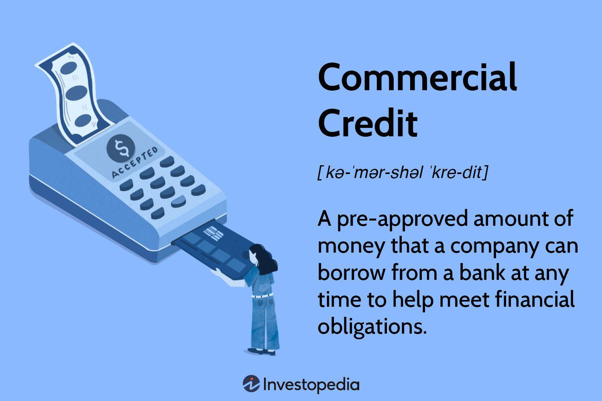

In today's globalized business environment, traveling abroad for work has become more common than ever. However, before boarding the next flight for a business meeting or conference, securing the proper documentation is crucial. This article examines the intricacies of visa applications for business travel, with a specific focus on commercial visas, and includes a perspective on algorithmic trading. Traveling for business purposes often requires a detailed understanding of visa requirements to ensure hassle-free access to international destinations. 

We will provide essential information regarding the application process and requirements for commercial visas, highlight the latest trends in business travel, and discuss the fascinating connection between business travel and algorithmic trading. This sector's rapid evolution demands continuous learning and interaction with global peers, making the acquisition of commercial visas an integral part of the process. 



Whether you are a seasoned traveler or applying for the first time, understanding these components can ease your international business endeavors significantly. By focusing on what a commercial visa is, how to apply for one, and why it is essential for business travelers, the article aims to equip professionals in understanding and navigating the global business landscape effectively.

## Table of Contents

## Understanding Commercial Visas

A commercial visa, commonly referred to as a business visa, is a crucial document for professionals seeking to engage in various business activities in a foreign country. These activities may include attending business meetings, participating in conferences, negotiating contracts, or exploring business opportunities. Each country establishes its specific criteria and categories for commercial visas to accommodate different types of business activities.

For example, in the United States, the B-1 visa is designed for individuals engaging in temporary business endeavors, such as consulting with business associates or attending scientific, educational, or professional conventions. Similarly, the United Kingdom offers a variety of business visas depending on the visitor's intent, including options for short-term business visits or more extended business stays.

The application process for a commercial visa varies by country but typically requires several common documents: a valid passport, proof of employment or a letter from the employer detailing the business purpose, and in many cases, a business invitation letter from the host company in the destination country. Some countries might also demand evidence of sufficient financial means to support one's stay, ensuring the applicant does not become a burden on the host country.

It is imperative to research the specific visa regulations of the destination country thoroughly. Fulfilling these requirements not only ensures compliance with immigration laws but also facilitates a smoother entry process at the border. Inadequate preparation or misunderstanding of visa conditions can result in delays, denial of entry, or legal repercussions.

Understanding the nuances of commercial visas involves recognizing the distinctions among different visa types and their respective eligibility criteria. Comprehending these distinctions enables business travelers to select the appropriate visa that aligns with their specific objectives and assures their business activities are conducted legally and efficiently.

## Key Requirements for Commercial Visa Applications

Applying for a commercial visa requires careful attention to detail to ensure a smooth approval process. One of the primary documents needed is a valid passport, typically with an expiration date extending at least six months beyond the intended stay. Along with the passport, applicants are required to complete a comprehensive visa application form, which varies depending on the destination country's specific requirements.

In addition to the basic documentation, a crucial component of the application is an invitation letter from the host company or organization in the destination country. This letter should clearly state the purpose of the visit, the duration of stay, and confirm the business relationship between the applicant and the host. Besides serving as proof of intent, it reassures the visa authorities of the professional nature of the trip.

Applicants are also expected to demonstrate proof of financial means during their stay. This can include bank statements, salary slips, or sponsorship letters, demonstrating that the applicant can financially support themselves without requiring additional resources from the host country. Some nations also require details of accommodations, a travel itinerary, and confirmed return travel plans to ensure the applicant does not overstay their welcome.

Ensuring a clean criminal record is another critical aspect of a commercial visa application, as many countries conduct stringent background checks to mitigate any security risks. An applicant's ability to show a clean history not only facilitates the visa process but also aligns with international security protocols.

Given the potential for processing delays and the complexity of gathering necessary documentation, it's advisable to start the visa application process well in advance. Initiating this process early allows applicants to navigate any unforeseen challenges, ensuring that all paperwork is complete and accurate before submission. Starting early minimizes the risk of missing important travel dates due to administrative hurdles.

## The Role of Commercial Visas in Business Travel

Commercial visas are indispensable for international business, providing professionals the legal means to traverse borders for varied commercial activities. These activities can include negotiating deals, attending trade fairs, and establishing the critical business relationships that drive economic progress. By facilitating the movement of business professionals across countries, these visas support the fluid exchange of ideas, expertise, and goods, which is essential in today's interconnected global economy.

The economic impact of commercial visas extends beyond the individual traveler. By enabling cross-border trade and investment, they play a crucial role in economic growth and development. For instance, a firm seeking to expand its operations globally will often need to send representatives to negotiate terms, understand local markets, and set up operations. Such endeavors typically require the legal framework commercial visas provide, ensuring that business activities are conducted lawfully and efficiently.

A thorough understanding of the specific visa requirements and regulations of the destination country is vital for business travelers. This knowledge helps in choosing the appropriate visa category and assembling the requisite documentation, minimizing the risk of legal complications. Different countries have varying prerequisites, and failing to comply can result in denied entry or other complications. Hence, an attentiveness to detail and adherence to immigration laws of the destination country remain imperative.

In summary, commercial visas are more than mere travel documents; they are catalysts for global economic interaction and personal career advancement. Business professionals who navigate these processes efficiently can ensure uninterrupted participation in international commerce, ultimately leading to broader economic involvement and success.

## Algorithmic Trading and Business Travel

Algorithmic trading, a sophisticated domain within financial markets, leverages computer programs to execute trades at speeds and frequencies unattainable by human traders. As this field experiences rapid advancements, continuous learning and networking become indispensable for professionals. Consequently, business travel emerges as a crucial component for experts in [algorithmic trading](/wiki/algorithmic-trading), facilitating engagement with industry advancements and peer networks.

Attendance at industry conferences, training sessions, and technology summits is a common facet of business travel for algo trading professionals. These events offer unique opportunities to connect with other experts, exchange innovative ideas, and learn about cutting-edge algorithms and technologies driving the sector. In such settings, participants can explore emerging trends, such as the integration of [machine learning](/wiki/machine-learning) and [artificial intelligence](/wiki/ai-artificial-intelligence) in trading strategies, and discuss market impacts.

Consider a Python-based example illustrating a basic algorithmic trading strategy using moving averages:

```python
import numpy as np
import pandas as pd

# Generate sample price data
np.random.seed(0)
price_data = pd.Series(np.random.randn(100).cumsum() + 100, name='Price')

# Calculate moving averages
short_window = 20
long_window = 50
signals = pd.DataFrame(index=price_data.index)
signals['Price'] = price_data
signals['Short_MA'] = price_data.rolling(window=short_window, min_periods=1).mean()
signals['Long_MA'] = price_data.rolling(window=long_window, min_periods=1).mean()

# Generate trading signals
signals['Signal'] = 0
signals['Signal'][short_window:] = np.where(
    signals['Short_MA'][short_window:] > signals['Long_MA'][short_window:], 1.0, 0.0
)
signals['Positions'] = signals['Signal'].diff()

print(signals.head(60))
```

In this strategy, short-term and long-term moving averages help determine trading signals, illustrating one of the many algorithmic techniques discussed during industry events.

Commercial visas play an essential role in facilitating such business travel. These visas enable algo trading professionals to participate in international forums, interact with global peers, and contribute to the collective growth of the community. Without the proper documentation, these global interactions could be severely hindered, limiting professionals' ability to stay at the forefront of their field.

In summary, for professionals involved in algorithmic trading, business travel is not merely a means of advancement but a vital component of professional growth and development. By obtaining the necessary commercial visas, they can ensure seamless participation in the global algo trading discourse, driving innovation and progress within the industry.

## Conclusion

Securing a commercial visa is an essential step for professionals engaging in international business activities. Navigating visa requirements and application processes ensures a smooth experience when crossing borders for work-related purposes. For those in algorithmic trading, travel opportunities for conferences and educational seminars amplify personal expertise and contribute to the field's development through global exchanges. Such interactions enhance understanding of innovative trading strategies and technologies.

It is advised for all business travelers to meticulously research visa requirements tailored to their destination. This involves understanding specific documentation needs, such as invitation letters or travel itineraries, and submitting complete applications to avoid potential delays. Following established procedural routes guarantees a stress-free business trip and helps maintain compliance with international travel regulations.

For professionals involved in international trade or technology sectors, like algorithmic trading, commercial visas are indispensable tools. They facilitate professional mobility, enabling the expansion of business opportunities and technical know-how. Conducting due diligence on visa matters significantly supports career growth and successful participation in the global business arena.

## References & Further Reading

[1]: ["Visa Requirements: A Guide for Global Business Travel"](https://sandee.com/blog/global-visa-and-travel-requirements) - U.S. Department of State

[2]: Jacquelyn Smith. ["What You Need To Know About Business Visas"](https://jacquelynsmithbooks.com/) - Forbes Article

[3]: ["Algorithmic Trading: A Practitioner's Guide"](https://www.amazon.com/Algorithmic-Trading-Practitioners-Jeffrey-Bacidore/dp/0578715236) by Barry Johnson

[4]: ["Business Visa Requirements and Application Process"](https://www.uscis.gov/working-in-the-united-states/temporary-visitors-for-business/b-1-temporary-business-visitor) - UK Government Website

[5]: ["Algorithmic and High-Frequency Trading"](https://www.amazon.com/Algorithmic-High-Frequency-Trading-Mathematics-Finance/dp/1107091144) by Álvaro Cartea, Sebastian Jaimungal, and José Penalva