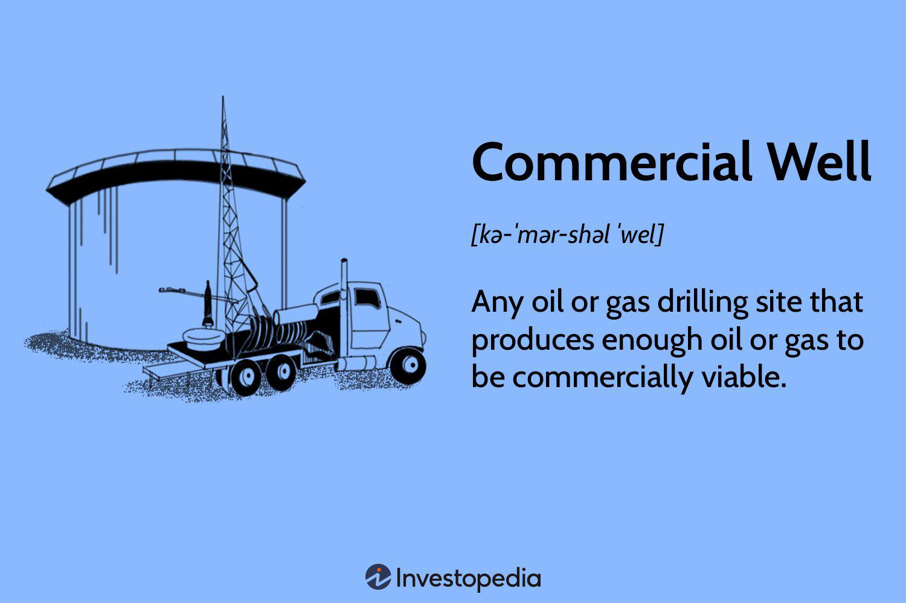

In recent years, technological advancements have dramatically altered both the oil and gas industry and the financial trading sector, reshaping how they operate and interact. The integration of these innovations necessitates a comprehensive examination of two pivotal areas: commercial well operations and algorithmic trading.

Commercial well operations focus on the extraction of oil and gas. These wells are engineered sites specifically designed for the efficient and profitable withdrawal of these natural resources. Historically, the search and development phases of well extraction encountered considerable uncertainties and financial risks. However, the intersection of modern technology with traditional extraction processes has reduced these uncertainties, enhancing the profitability and efficiency of wells. Advancements such as real-time data analytics allow operators to make more informed decisions about resource extraction and management.



In the financial dimension, algorithmic trading has introduced a new era of speed and precision to trading activities. Algo trading employs sophisticated computer programs to execute trades based on predefined criteria, mitigating human error and emotional biases. These algorithms can process vast amounts of data at high speeds, executing trades within microseconds, an ability that exceeds human capabilities. Algo trading's adoption has been widespread across various financial markets, including equities, forex, and derivatives, due to its strategic application and potential for yielding higher returns.

Exploring the intersection of commercial well operations with algo trading reveals how these two dynamic fields can complement each other in today's interconnected economy. Through innovations in data analysis and predictive modeling, algo trading can enhance investment decisions in the oil and gas sector. This integration can optimize financial returns by better predicting resource extraction productivity and hedging against market volatility in oil and gas prices.

Understanding these core components—commercial well operations and algo trading—along with their technological convergence, is crucial for stakeholders in both industries. By exploring these areas, industry professionals and investors can better navigate the evolving landscape and capitalize on emerging opportunities.

## Table of Contents

## Understanding Commercial Well Operations

A commercial well in the oil and gas industry refers to a well that produces sufficient resources to be financially viable, meaning the revenues generated from extracting oil or gas exceed the costs associated with drilling and operating the well. The financial viability of a commercial well is assessed based on the ability to produce oil or gas at a rate that yields profits over time. This viability is crucial, as it dictates the attractiveness of a well to investors and influences the investment strategies employed.

Investors are particularly drawn to commercial wells because of their potential profitability and the structured investment vehicles available in the industry. One common investment mechanism is a limited partnership, which allows investors to pool resources, share risks, and distribute profits in a tax-efficient manner. Limited partnerships benefit from a favorable tax treatment as they are generally not subjected to corporate income tax, thus providing flow-through taxation where income is taxed only at the level of the individual partners.

The development of a commercial well encompasses two primary stages: exploratory and development. Exploratory wells are drilled to determine the presence of hydrocarbons in unproven areas. These wells [carry](/wiki/carry-trading) significant risks due to the uncertainty of the resource presence and quantity. However, they are vital in identifying potential production sites. Once an exploratory well confirms the presence of hydrocarbons, development wells are drilled to optimize the extraction of these resources. Development wells focus on maximizing the recovery of oil or gas from the reservoir and improving the overall efficiency of production operations.

Tax structures play a pivotal role in enhancing the investment appeal of commercial wells. One significant tax provision is Intangible Drilling Costs (IDC), which allows operators to deduct certain expenditures associated with drilling operations. IDCs include expenses not attributable to physical drilling structures, such as wages, fuel, and the costs of drilling fluids. These costs can be expensed entirely in the year they are incurred, providing an immediate tax benefit and improving cash flow for investors. This provision incentivizes investment in drilling activities by reducing the financial burden associated with initial expenditures.

The economic impact of commercial wells extends beyond individual investors and operators to influence broader economic dynamics. Successful commercial wells contribute to local and national economies by generating employment, expanding energy infrastructure, and increasing energy independence. They also play a role in stabilizing energy prices by contributing to the overall supply of oil and gas in the market. Additionally, revenues from commercial wells can lead to increased government revenues through taxes and royalties, further supporting public infrastructure and services.

In summary, commercial well operations in the oil and gas industry involve evaluating financial viability, implementing strategic investment mechanisms, navigating the exploratory and development phases, and optimizing tax structures to enhance investment attractiveness. These operations have significant economic implications, contributing to both micro and macroeconomic outcomes.

## Basics of Algorithmic Trading

Algorithmic trading, often referred to as algo trading, is the use of computer algorithms to perform trading activities in financial markets at high speeds and with precise economic strategies. This method leverages predefined rules and mathematical models to decide the timing, price, and quantity of trades, based on specific criteria that can be as simple as timing or as complex as [artificial intelligence](/wiki/ai-artificial-intelligence)-infused predictive analytics.

### Advantages of Algorithmic Trading

Algorithmic trading offers several benefits that have contributed to its growing popularity:

1. **Efficiency and Speed**: Algorithms can execute trades within milliseconds, significantly faster than any human trader. This speed is crucial in markets where timing can influence profitability.

2. **Removal of Emotional Bias**: By automating trading decisions, algo trading eliminates the emotional and psychological biases that often affect human traders, such as the fear of loss or the allure of quick profit.

3. **Diverse Strategy Implementation**: There are numerous types of strategies used in algo trading. Some popular strategies include:
   - **Trend-Following Strategies**: These are based on moving averages, channel breakouts, and other technical indicators to predict price directions without making forecasts.
   - **Arbitrage Opportunities**: Algorithms identify price discrepancies between different markets or securities, exploiting the short window of opportunity to trade for profit.
   - **Market Making**: This strategy involves buying and selling securities to provide liquidity and earn a small margin on the bid-ask spread.

### Market Segments Utilizing Algorithmic Trading

Algo trading is prevalent across various market segments:

- **Equities**: It accounts for a substantial portion of the trading volume in stock exchanges. Traders leverage quantitative models to capitalize on price inefficiencies.

- **Forex**: Foreign exchange markets benefit from the 24-hour operation of algorithms, which can trade currencies continuously without human intervention.

- **Derivatives**: The precision in derivatives trading through algorithms allows for efficiently managing the complexity and risk associated with these financial instruments.

### General Process of Algorithmic Trading

The functioning of [algorithmic trading](/wiki/algorithmic-trading) can be summarized as follows:

1. **Strategy Formulation**: Traders or developers design a strategy based on historical market data, using statistical and quantitative techniques.

2. **Backtesting**: The proposed strategy is tested on historical data to evaluate its profitability and risk. This validation step is essential to ensure robustness.

3. **Execution**: Once validated, the strategy is implemented in a trading platform where it executes trades based on real-time data. Algorithms continuously monitor markets and adjust trading conditions based on predefined rules.

4. **Evaluation and Adjustment**: Performance is regularly assessed, and strategies are adjusted as needed based on changes in market conditions or the emergence of new data trends.

```python
# Example pseudo-code for a trend-following algorithm:

def trend_following_strategy(data, short_window, long_window):
    # Calculate moving averages
    data['short_mavg'] = data['price'].rolling(window=short_window, min_periods=1).mean()
    data['long_mavg'] = data['price'].rolling(window=long_window, min_periods=1).mean()

    # Generate signals
    data['signal'] = 0  # No signal initially
    data['signal'][short_window:] = np.where(data['short_mavg'][short_window:] > data['long_mavg'][short_window:], 1, 0)

    # Create orders (1: buy, 0: sell)
    data['positions'] = data['signal'].diff()

    return data
```

This basic overview of algorithmic trading underlines its role in modern financial markets, revolutionizing the way trades are analyzed and executed. By integrating technology and financial expertise, algo trading continues to enhance market efficiency, [liquidity](/wiki/liquidity-risk-premium), and investment strategies.

## How Commercial Well Operations Benefit from Algo Trading

Algorithmic trading significantly enhances the efficiency and effectiveness of investment strategies within commercial well operations, particularly in the oil and gas industry. By employing advanced computational algorithms, investors can process and analyze vast quantities of geological and market data, enabling more informed decision-making processes. This technological advancement optimizes investment approaches by offering precise predictions and adjustments according to evolving market conditions.

Automated trading systems help in financial planning associated with well operations. These systems can automatically execute trades based on real-time data and predefined criteria, reducing human error and emotional biases often present in traditional trading methods. Through sophisticated algorithms, they can predict price movements and optimize trade execution timing to mitigate market risks associated with the volatile oil and gas sectors.

The integration of algorithmic trading with well data is crucial for maximizing financial returns. By leveraging [machine learning](/wiki/machine-learning) and data analytics, predictions about resource extraction productivity become more accurate. This capability allows companies to adjust their operations efficiently, ensuring they capitalize on the most profitable extraction windows while minimizing costs.

Hedging strategies facilitated by algorithmic trading are particularly beneficial in counteracting fluctuations in oil and gas prices. These strategies enable traders and investors to create protective measures against adverse price movements, subsequently enhancing the profitability of commercial wells. By using derivatives and other financial instruments automatically adjusted by algorithms, firms can secure their investments against potential losses due to market [volatility](/wiki/volatility-trading-strategies).

In summary, the synergy between commercial well operations and algorithmic trading technologies provides substantial improvements in investment strategies and profitability. By automating complex trading tasks, algorithmic trading allows stakeholders in the oil and gas industry to make more informed and timely decisions, ultimately leading to greater financial success and sustainability.

## Challenges in Merging Well Functionality and Algo Trading

Merging the operations of commercial wells with algorithmic trading introduces specific challenges that require strategic considerations. One significant issue is the potential for technical failures within trading systems. Algorithmic trading heavily relies on technology, where system malfunctions can lead to erroneous trades, financial losses, or missed opportunities. Such failures are particularly consequential when integrating real-time oil and gas market data with trading algorithms, where rapid market movements can amplify risks.

Market volatility presents another substantial challenge. Oil and gas prices are notoriously volatile, influenced by geopolitical tensions, supply chain disruptions, and varying demand levels. Algorithms designed with historical data may struggle to adapt to sudden market shifts, causing pricing models to deliver inaccurate forecasts. This volatility necessitates robust algorithms capable of responding to unpredictable market conditions without compromising financial stability.

Overfitting trading strategies is a common pitfall in predictive modeling. Algorithms trained extensively on past data might perform poorly when faced with unforeseen future market dynamics. Overfitting makes these models overly complex and sensitive to historical data patterns, which might not recur. To mitigate this, employing techniques such as cross-validation and regularization ensures that models generalize well beyond their training datasets.

The costs associated with implementing sophisticated technology and infrastructure are prohibitive for small and medium-sized enterprises (SMEs). Commercial well operations and algorithmic trading integration demand advanced computing resources, high-speed data feeds, and specialized personnel. These investments can be daunting, often necessitating partnerships, shared infrastructure, or cloud-based solutions to reduce upfront expenditures.

Addressing these challenges requires building robust systems with fail-safes, conducting continuous monitoring, and strategically iterating algorithms based on real-time feedback. An emphasis on redundancy and disaster recovery plans enhances system reliability, while ongoing optimization of trading algorithms ensures adaptability. Collaborations with technology providers can furnish access to cutting-edge infrastructure at reduced costs, facilitating the deployment of scalable solutions for SMEs. By establishing a comprehensive framework for integrating commercial well operations with algorithmic trading, stakeholders can mitigate risk while capitalizing on market opportunities.

## Conclusion

Commercial well operations and algorithmic trading are profoundly transforming their respective industries by effectively utilizing data and technology to enhance efficiency and drive economic growth. The integration of these fields, though presented with notable challenges, offers substantial benefits for investors and companies. By combining the precise data analysis capabilities of algo trading with the resource extraction expertise of commercial well operations, firms can achieve more strategic financial planning and risk management.

Understanding the intricate details of both commercial well operations and algo trading is essential for making informed decisions and devising effective strategies. This comprehensive understanding can significantly improve the ability to foresee market trends, optimize resource allocation, and augment profitability. It enables stakeholders to navigate market complexities with precision and foresight.

The future holds promising possibilities as advancements in artificial intelligence and machine learning continue to unfold. These technologies are set to introduce new paradigms in both industries, pushing the boundaries of innovation and operational excellence. AI-driven predictive models and machine learning algorithms can further refine trading strategies, optimize drilling operations, and minimize uncertainties.

Staying informed about emerging trends and maintaining adaptiveness to evolving technologies will be crucial for those looking to capitalize on these advancements. As both domains continue to intersect and influence one another, the capacity to leverage cutting-edge technology and data analytics will be central to maintaining a competitive edge in the market. By embracing these developments, businesses and investors can not only overcome existing challenges but also pioneer new opportunities for growth and success.

## References & Further Reading

[1]: Bergstra, J., Bardenet, R., Bengio, Y., & Kégl, B. (2011). ["Algorithms for Hyper-Parameter Optimization."](https://dl.acm.org/doi/10.5555/2986459.2986743) Advances in Neural Information Processing Systems 24.

[2]: ["Advances in Financial Machine Learning"](https://www.amazon.com/Advances-Financial-Machine-Learning-Marcos/dp/1119482089) by Marcos Lopez de Prado

[3]: ["Evidence-Based Technical Analysis: Applying the Scientific Method and Statistical Inference to Trading Signals"](https://www.amazon.com/Evidence-Based-Technical-Analysis-Scientific-Statistical/dp/0470008741) by David Aronson

[4]: ["Machine Learning for Algorithmic Trading"](https://github.com/stefan-jansen/machine-learning-for-trading) by Stefan Jansen

[5]: ["Quantitative Trading: How to Build Your Own Algorithmic Trading Business"](https://www.amazon.com/Quantitative-Trading-Build-Algorithmic-Business/dp/1119800064) by Ernest P. Chan

[6]: ["Drilling Data Handbook"](https://www.drillingmanual.com/drilling-data-handbook-pdf/) by Gilles Gabolde and Jean-Paul Nguyen

[7]: ["Petroleum Production Systems"](https://ptgmedia.pearsoncmg.com/images/9780137031580/samplepages/0137031580.pdf) by Michael J. Economides, A. Daniel Hill, Christine Ehlig-Economides, and Ding Zhu

[8]: Fabozzi, F. J., Focardi, S. M., & Kolm, P. N. (2010). ["Quantitative Equity Investing: Techniques and Strategies."](https://www.semanticscholar.org/paper/Quantitative-Equity-Investing%3A-Techniques-and-Fabozzi-Focardi/1c49a2a53919f7e65cb96f16691b8ff726fd3cd7) Wiley Finance.