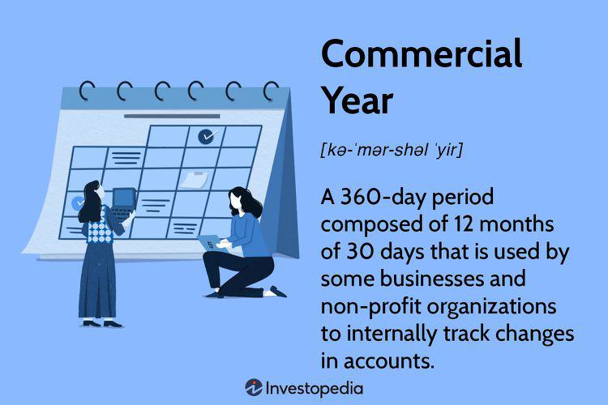

In today's dynamic business landscape, the understanding of varying timeframes such as commercial and fiscal years holds significant importance for effective financial management. The commercial year, often distinguished by its use in internal accounting and financial comparisons, provides a framework for businesses to assess monthly performance and streamline financial planning. By contrast, a fiscal year—which does not necessarily align with the calendar year—is crucial for tax management and investor relations. The selection between commercial and fiscal years is typically driven by operational needs and industry practices, influencing how organizations report and assess their financial performance.

The intersection of these timeframes with business calendars becomes even more pronounced when introduced to modern trading environments, particularly algorithmic trading. Algorithmic trading, which leverages computer algorithms to execute trades at speeds and frequencies beyond human capability, can significantly align and optimize financial outcomes based on these temporal structures. The adaptability of algorithmic systems enables businesses to enhance their fiscal strategies, integrating real-time data processing, backtesting, and predictive models. These technologies facilitate strategic financial management, providing investors and financial managers with insights and tools to refine their fiscal strategies.



The benefits and drawbacks of different fiscal strategies become evident when analyzed in contemporary trading environments. Effective integration of fiscal planning with algorithmic innovations can result in superior financial performance. Some firms have demonstrated successful integration of these strategies within their algorithmic trading frameworks, underscoring the potential for technological and strategic advancements to redefine traditional financial management practices. This article explores these intersections, offering insights into the benefits and potential limitations of various fiscal strategies for enhanced business efficacy in modern trading contexts.

## Table of Contents

## Understanding the Commercial Year

A commercial year, often referred to as the financial year for internal operations, is tailored to meet a company's specific business requirements. It differs from a calendar year as it is not bound by the conventional January-to-December timeline. Instead, businesses define their commercial year based on various factors like industry cycles, revenue patterns, or internal strategic goals. This flexibility allows companies to align their accounting and financial operations with the periods most relevant to their industry or business model.

### Definition and Characteristics

A commercial year is typically composed of four quarters, similar to a fiscal or calendar year, but the starting point is adjusted to suit the organization's planning needs. This adjustment aids in painting a more accurate picture of the company's financial health and operational metrics within its unique business cycle.

### Comparison with Calendar Years

A calendar year corresponds to the Gregorian calendar, beginning in January and ending in December. Most individuals and some businesses use this framework due to its ubiquity. However, commercial years diverge from this format to accommodate operational specificities. For example, a retail company may choose a commercial year ending in January due to the significant impact of the holiday season on its earnings. This alignment allows for a better assessment of financial performance during high-revenue periods.

### Utilization in Business Operations

Businesses leverage the commercial year for internal accounting and financial comparisons to streamline operations and enhance efficiency. They tailor profit and loss assessments, budgeting, and performance analyses to align with their commercial timelines. This alignment aids in smoothing out anomalies in financial reporting which can arise due to seasonality or periodic financial activities. Such optimization facilitates better resource allocation and strategic planning.

### 360-Day Year Format

The idea of the 360-day year emerges as a standardized accounting practice to simplify financial forecasts and monthly performance analyses. By dividing the year uniformly into 12 months of 30 days, organizations can reduce the complexity associated with variable month lengths. This format is particularly useful in financial modeling, where precision and predictability are paramount. Moreover, it enables straightforward calculations in interest computation, amortization schedules, and forecasting models. 

Here's a Python example for calculating an annual [interest rate](/wiki/interest-rate-trading-strategies) based on a 360-day format:

```python
def calculate_annual_interest(principal, daily_interest_rate):
    annual_interest = principal * daily_interest_rate * 360
    return annual_interest

principal_amount = 10000  # Example principal
daily_rate = 0.0005  # Example daily interest rate
annual_interest = calculate_annual_interest(principal_amount, daily_rate)
print("Annual Interest:", annual_interest)
```

This standardization can enhance the comparability of financial outcomes across different periods, promoting consistency in financial analysis and facilitating more informed decision-making processes.

## Fiscal Year vs. Calendar Year

A fiscal year is a 12-month period that companies use for accounting purposes and financial reporting. Unlike the calendar year, which runs from January 1 to December 31, a fiscal year can start on any date, allowing businesses to align their financial cycles with business operations, industry trends, or other strategic considerations. This flexibility can offer significant advantages in financial planning, especially for organizations with seasonal variations in income or expenses.

In contrast, the calendar year follows a fixed timeline universally recognized across most industries and regions. It simplifies external reporting, tax filings, and communication with investors, as most deadlines and regulatory requirements are based on the calendar year. Nevertheless, its rigidity might not accommodate the operational or strategic needs of some businesses.

Businesses choose between fiscal and calendar years based on several factors, including operational cycles, industry practices, and tax implications. For instance, a retail business experiencing peak sales during the holiday season might benefit from a fiscal year concluding in January, allowing it to include holiday revenue in its year-end financial statements. This can provide a more accurate reflection of the business’s performance and facilitate better strategic planning.

The choice of fiscal period can significantly impact tax management and investor relations. A company might select a fiscal year to defer tax liabilities, distribute income, or align with subsidiary reporting periods, which can optimize tax outcomes and enhance financial efficiency. For example, in jurisdictions where tax laws offer timing flexibility, aligning high-income months at the beginning or end of the fiscal year can aid in deferring tax obligations.

Moreover, choosing a fiscal year that aligns with operational rhythms can improve transparency and investor confidence by providing clearer financial representations. Enhanced predictability and accuracy in financial statements contribute to improved investor relations and potentially smoother [capital raising](/wiki/hedge-fund-capital-raising) efforts.

Several companies have adopted distinct fiscal year strategies for financial efficiency. For example, Apple Inc. uses a fiscal year beginning in October and ending in September. This timing helps accommodate product launch cycles, typically occurring in the fall, ensuring that major revenue streams are considered within the same reporting period. Similarly, Walmart’s fiscal year, ending on January 31, aligns post-holiday season sales, capturing its most critical revenue period.

These examples illustrate the strategic significance of selecting an appropriate fiscal period. By aligning fiscal years with business operations and industry practices, companies can enhance their financial reporting, tax management, and investor relations, ultimately contributing to overall financial efficiency and success.

## The Role of Algorithmic Trading in Financial Planning

Algorithmic trading refers to the use of algorithms, or automated and pre-programmed instructions, to execute trades in financial markets. This approach has revolutionized financial planning by enhancing efficiency, reducing human error, and allowing for the execution of complex strategies that were previously infeasible. Algorithmic trading accounts for a significant portion of trading [volume](/wiki/volume-trading-strategy) in many markets, underscoring its importance in modern financial practices.

Algorithmic trading strategies can be effectively aligned with fiscal and commercial planning to optimize financial outcomes. These strategies allow traders to take advantage of market inefficiencies, automate compliance with regulatory requirements, and manage risk more effectively. By aligning trading algorithms with fiscal planning, organizations can synchronize their trading strategies with their financial objectives, such as maximizing tax benefits or minimizing year-end financial discrepancies.

A variety of algorithmic tools and models facilitate strategic financial management. Key tools include moving averages, mean reversion strategies, and [arbitrage](/wiki/arbitrage) models. For example, mean reversion strategies are premised on the statistical hypothesis that the price of a security will revert to its mean over time. This can be expressed mathematically as:

$$
P(t) = \mu + \varepsilon(t)
$$

where $P(t)$ is the price at time $t$, $\mu$ is the mean price, and $\varepsilon(t)$ is the deviation from the mean.

Real-time data processing plays a critical role in aligning trading algorithms with business strategies. The ability to process data in real time allows algorithmic traders to react promptly to new information and market changes. This capability is crucial in markets where conditions can change rapidly, and even small delays in execution can result in significant financial consequences. Real-time systems collect vast amounts of market data, analyze it using sophisticated algorithms, and execute trades accordingly, thereby maintaining alignment with predefined business strategies.

The implementation of [algorithmic trading](/wiki/algorithmic-trading) strategies is often facilitated through programming languages such as Python. Python's libraries, such as NumPy and pandas, provide robust tools for numerical and data analysis, making it a preferred choice for developing trading algorithms. A basic example of a trading algorithm in Python might look like this:

```python
import numpy as np
import pandas as pd

# Generate random price data
np.random.seed(42)
prices = np.random.normal(loc=100, scale=10, size=100)

# Simple Moving Average Strategy
def sma_strategy(prices, window):
    moving_avg = pd.Series(prices).rolling(window=window).mean()
    signals = np.where(prices > moving_avg, 1, 0)  # Buy when price > moving average
    return signals

# Execute the strategy
signals = sma_strategy(prices, window=5)
```

In this example, a simple moving average strategy is implemented, where buy signals are generated when the current price exceeds the moving average of prices over a given window. By leveraging such strategies, businesses can optimize their financial planning and trading execution to meet specific fiscal objectives.

## Integrating Fiscal Strategies with Algorithmic Innovations

Integrating fiscal planning strategies with algorithmic trading technologies has become an innovative approach to achieving financial efficiency and precision. This integration facilitates the development of custom-tailored trading algorithms that align with specific fiscal strategies, thereby optimizing capital allocation and investment returns.

One method of achieving this integration is through [backtesting](/wiki/backtesting), a process where trading algorithms are tested against historical market data to evaluate their performance under various market conditions. Backtesting allows firms to refine their fiscal strategies by observing how potential trades would have performed in the past, ensuring that the strategies are robust and effective.

The development of custom algorithms is crucial for refining fiscal strategies. These algorithms can be programmed to take into account various fiscal variables such as tax implications, cash flow timings, and budget cycles. Python, with its robust libraries such as Pandas for data manipulation and [backtrader](/wiki/backtrader) for backtesting, serves as an excellent tool for this purpose. A simple example of algorithmic backtesting using Python could look like this:

```python
import backtrader as bt

class MyStrategy(bt.Strategy):
    def __init__(self):
        self.sma = bt.indicators.SimpleMovingAverage(self.data.close, period=15)

    def next(self):
        if self.data.close[0] > self.sma[0]:
            self.buy()
        elif self.data.close[0] < self.sma[0]:
            self.sell()

cerebro = bt.Cerebro()
cerebro.addstrategy(MyStrategy)
cerebro.run()
```

Machine learning and predictive models play a significant role in enhancing fiscal planning through algorithmic trading. Machine learning algorithms, like regression models and neural networks, can predict future market trends based on historical and real-time data. These predictions enable businesses to make informed decisions regarding fiscal planning and resource allocation.

A case study illustrating the successful integration of fiscal strategies with algorithmic innovations is Renaissance Technologies. Known for their Medallion Fund, they utilize quantitative models and [machine learning](/wiki/machine-learning) algorithms to identify market inefficiencies and optimize their trading strategies according to fiscal timing and tax implications. Similarly, Two Sigma applies machine learning-driven asset management strategies, which incorporate fiscal planning to forecast economic cycles and enhance investment performance.

These strategies highlight the importance and effectiveness of combining fiscal planning with advanced algorithmic technologies, demonstrating that firms can achieve superior financial results by leveraging data analytics and machine learning in their fiscal strategies.

## Case Studies: Success Stories in Algo Trading and Fiscal Planning

Goldman Sachs, Renaissance Technologies, and Two Sigma have demonstrated significant success in integrating algorithmic trading with meticulous fiscal planning, underscoring the synergy between advanced computational techniques and strategic financial management.

**Goldman Sachs' Strategic Use of Algorithms for Capital Allocation**

Goldman Sachs has been at the forefront of leveraging algorithms to optimize capital allocation. By utilizing quantitative models, the firm enhances decision-making processes in portfolio management. These models analyze vast datasets to identify investment opportunities and risks more accurately. For instance, Goldman Sachs employs high-frequency trading algorithms that assess market trends, aiming to improve returns while adjusting for risk factors. This strategic implementation also allows for dynamic reallocation of assets, adapting to changing market conditions, thereby maintaining an optimal asset mix as per predefined risk parameters and fiscal targets.

**Renaissance Technologies and the Integration of Quantitative Models with Fiscal Cycles**

Renaissance Technologies, founded by Jim Simons, is renowned for its use of [quantitative trading](/wiki/quantitative-trading) strategies that align closely with fiscal cycles. The firm employs intricate mathematical models and statistical analyses to predict price movements and optimize trading strategies. By systematically adjusting its trading algorithms to reflect changes in fiscal policy and market cycles, Renaissance Technologies ensures that its trading decisions are informed by both historical data and current fiscal dynamics. This integration helps in mitigating risks associated with tax changes and interest rates, thereby refining the precision of their investment strategies.

**Two Sigma’s Machine Learning-Driven Asset Management Strategies**

Two Sigma utilizes machine learning and [artificial intelligence](/wiki/ai-artificial-intelligence) to drive its asset management strategies, setting itself apart in the world of quantitative investing. The firm applies a data-centric approach, leveraging big data analytics to refine its predictive models and trading systems. By employing machine learning algorithms, Two Sigma can recognize patterns and trends that are imperceptible to traditional financial analysis. These insights provide Two Sigma with a competitive edge, enabling the firm to adjust its strategies in line with fiscal constraints and opportunities. By aligning its investment framework with fiscal and economic forecasts, Two Sigma effectively manages its portfolios for optimal performance amidst fluctuating market conditions.

These case studies highlight the critical intersection of algorithmic innovation and strategic fiscal planning, showcasing how financial firms can achieve superior results by marrying advanced technology with comprehensive fiscal insight.

## Conclusion

In conclusion, aligning fiscal strategies with commercial years and algorithmic trading is essential for businesses aiming to optimize their financial management and achieve sustainable growth. Understanding the differences between various fiscal timeframes, such as calendar and fiscal years, allows businesses to tailor their strategic planning to meet specific operational and industry requirements. The strategic choice of fiscal timeframes can significantly impact tax management, investor relations, and overall financial efficiency.

Moreover, the integration of algorithmic trading with fiscal planning enables businesses to leverage advanced technologies for more accurate forecasting and dynamic capital allocation. Algorithmic trading, with its real-time data processing and advanced quantitative models, provides businesses with the tools necessary for effective financial strategy refinement. By employing machine learning and predictive analytics, companies can enhance the precision of their financial plans and improve decision-making processes.

Successful businesses demonstrate the advantages of embracing technological and strategic innovations to improve financial outcomes. These firms effectively combine fiscal strategies with cutting-edge algorithmic trading technologies to achieve superior performance and enhanced shareholder value. Businesses are encouraged to adopt these integrated approaches, which offer a competitive edge in the rapidly evolving financial landscape.

To further explore these concepts and enhance financial management practices, businesses can consult resources such as "Advances in Financial Machine Learning" by Marcos Lopez de Prado and "Quantitative Trading: How to Build Your Own Algorithmic Trading Business" by Ernest P. Chan. Such literature provides valuable insights into the tools and methodologies that support the successful integration of fiscal strategies with algorithmic innovations.

## References & Further Reading

- "Advances in Financial Machine Learning" by Marcos Lopez de Prado is a seminal work that provides a comprehensive overview of the applications of machine learning in finance. The book discusses advanced concepts such as backtesting, feature importance, and time series analysis, making it an essential resource for understanding the intersection of fiscal strategies and algorithmic trading. [Lopez de Prado, M. (2018). Advances in Financial Machine Learning. Wiley Finance Series.]

- "Quantitative Trading: How to Build Your Own Algorithmic Trading Business" by Ernest P. Chan focuses on practical aspects of creating and operating a quantitative trading business. It offers insights into building trading systems, developing strategies, and the operational requirements of algorithmic trading. This book is particularly useful for those seeking to understand how algorithmic trading can be integrated into fiscal planning. [Chan, E. P. (2008). Quantitative Trading: How to Build Your Own Algorithmic Trading Business. Wiley.]

- "Machine Learning for Asset Managers" by Marcos Lopez de Prado discusses how asset managers can harness machine learning to improve investment performance. It outlines various machine learning approaches that can be aligned with fiscal strategies for outcome optimization.

- "Algorithmic Trading and DMA" by Barry Johnson is a comprehensive guide that covers the details of algorithmic trading strategies and Direct Market Access (DMA). The book provides practical insights into designing, implementing, and optimizing algorithmic strategies, which can be pivotal for firms looking to align these with their fiscal planning frameworks. [Johnson, B. (2010). Algorithmic Trading & DMA: An Introduction to Direct Access Trading Strategies. 4Myeloma Press.]

- Academic articles such as “The Role of Fiscal Policy in Financial Markets” provide in-depth analysis and empirical evidence on how different fiscal policies impact financial markets, including implications for algorithmic trading. Journals such as the Journal of Financial Economics and the Review of Financial Studies often feature articles that can expand one’s understanding in this area.

- Online resources such as Investopedia and industry blogs like QuantStart offer beginner to intermediate level articles explaining the basics of algorithmic trading, fiscal strategies, and commercial years. They can be helpful for those new to these concepts and for keeping up with recent trends and updates.

- For those interested in programming and implementation, Python’s libraries for financial and algorithmic trading, such as NumPy, pandas, and PyAlgoTrade, offer tutorials and documentation that facilitate practical application of theories discussed in the literature. Exploring these programming resources can be beneficial for understanding the technical aspects of implementing algorithmic strategies. 

By engaging with these resources, individuals and businesses can deepen their understanding of how to effectively combine fiscal strategies, commercial years planning, and algorithmic trading to achieve financial efficiency and success.

