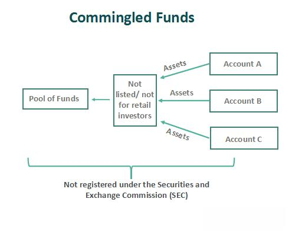

## Table of Contents

## What is a commingled fund?

A commingled fund is a type of investment where money from many different people is pooled together. This pool of money is then used to buy a variety of investments, like stocks, bonds, or real estate. It's like a big shared pot where everyone contributes and then the fund manager decides how to invest the money to try to make it grow.

These funds are often used by big investors, like pension funds or insurance companies, because they can offer lower costs and more diversification than if each investor managed their money separately. By combining resources, the fund can buy a wider range of investments, which can help spread out risk. It's a way for smaller investors to access opportunities that might be out of reach if they were investing on their own.

## How does a commingled fund differ from a mutual fund?

A commingled fund and a mutual fund both pool money from many investors to buy a variety of investments. The main difference is who can invest in them. Commingled funds are usually only available to big investors like pension funds or insurance companies. They are not sold to the general public. Mutual funds, on the other hand, are available to anyone who wants to invest, making them more accessible to regular people.

Another difference is how they are regulated. Mutual funds are tightly regulated by government agencies, like the SEC in the United States. This means they have to follow strict rules about what they can invest in and how they report their performance. Commingled funds have less strict rules because they are meant for big, experienced investors who can handle more risk. This can mean lower costs for commingled funds, but it also means they might be riskier for someone who isn't used to investing big sums of money.

## What are the primary purposes of commingled funds?

The main purpose of commingled funds is to pool money from many big investors so they can buy a variety of investments together. This allows them to spread out their risk more than if they were investing on their own. By combining their money, these big investors can buy into more types of investments, like stocks, bonds, or real estate, which might be too expensive for them to buy on their own.

Another important purpose of commingled funds is to lower the costs of investing. When big investors pool their money, they can hire one fund manager to handle all their investments, which is usually cheaper than if each investor had to pay for their own manager. Also, because commingled funds are not as strictly regulated as mutual funds, they can have lower fees and expenses, which means more of the money can be used to try to make a profit.

## Who typically invests in commingled funds?

Commingled funds are mainly used by big investors like pension funds, insurance companies, and endowments. These are groups that have a lot of money to invest and want to do it in a smart way. By pooling their money together, they can buy a lot of different investments, like stocks, bonds, or real estate, which helps them spread out their risk.

These big investors choose commingled funds because they can get into investments that might be too expensive or hard to buy on their own. Also, because commingled funds are not as strictly regulated as other types of funds, they can often have lower fees. This means more of the money can be used to try to make a profit, which is good for these big investors who want to grow their money over time.

## What are the benefits of investing in a commingled fund?

Investing in a commingled fund has several benefits. One big advantage is that it allows big investors to pool their money together. This means they can buy a lot of different investments, like stocks, bonds, or real estate, all at once. By spreading their money across many different types of investments, they can lower their risk. If one investment doesn't do well, it won't hurt as much because they have other investments that might do better.

Another benefit of commingled funds is that they often have lower costs. Because these funds are not as strictly regulated as other types of funds, like mutual funds, they can charge lower fees. This means more of the money can be used to try to make a profit. Big investors like pension funds or insurance companies can save money on fees and still get access to a wide range of investments that might be too expensive or hard to buy on their own.

## What are the potential risks associated with commingled funds?

One risk of investing in a commingled fund is that they are not as strictly regulated as other types of funds, like mutual funds. This means there might be less information available about what the fund is investing in and how it's doing. Big investors who put money into these funds need to be ready to handle more risk because they might not get the same level of protection that comes with more regulated funds.

Another risk is that the value of the investments in the fund can go up and down. Even though the fund spreads the money across many different types of investments to lower the risk, there's still a chance that some or all of those investments could lose value. If the fund's investments don't do well, the big investors who put money into the fund could lose money too.

Also, because commingled funds are often used by big investors like pension funds or insurance companies, they might not be as easy to get out of if someone decides they want their money back. These funds can have rules about when and how investors can take their money out, which might not be as flexible as other types of investments.

## How is a commingled fund structured and managed?

A commingled fund is set up when a bunch of big investors, like pension funds or insurance companies, put their money together into one big pool. This pool of money is then used to buy a variety of investments, like stocks, bonds, or real estate. The fund is usually run by a professional manager or a management company. Their job is to decide which investments to buy and sell to try to make the fund grow. Because these funds are for big investors, they often have fewer rules to follow than other types of funds, which can help keep costs down.

The management of a commingled fund is all about making smart choices with the money in the pool. The manager looks at the market and decides where to put the money to try to get the best return. They might buy stocks one day and sell them the next, or they might hold onto bonds for a long time. The goal is to spread the money across different types of investments to lower the risk. Because the fund is for big investors, the manager might not have to report as much about what they're doing, but they still need to keep an eye on the investments and make sure they're doing what's best for the fund.

## What types of assets are commonly held in commingled funds?

Commingled funds usually hold a mix of different types of assets to spread out risk and try to make money. Common assets in these funds include stocks, which are shares in companies that can go up or down in value. They also often hold bonds, which are like loans to companies or governments that pay back with interest. Real estate is another big type of asset in commingled funds, where the fund might own buildings or land that can be rented out or sold for a profit.

Sometimes, commingled funds also invest in other things like commodities, which are raw materials like oil or gold, or in private equity, which means investing in companies that are not publicly traded. These types of investments can be riskier but might also offer bigger rewards. The goal is to have a mix of these different assets so that if one type doesn't do well, the others might still make money, helping to keep the overall value of the fund stable.

## How do fees and expenses work in a commingled fund?

Fees and expenses in a commingled fund are usually lower than in other types of funds, like mutual funds. This is because commingled funds are not as strictly regulated, so they can charge less. The main fee is the management fee, which is what the fund manager charges for [picking](/wiki/asset-class-picking) the investments and running the fund. This fee is often a small percentage of the total money in the fund, like 0.5% to 1% a year. There might also be other small costs, like trading fees when the fund buys or sells investments.

Even though the fees are lower, they still come out of the money in the fund. So, if the fund makes money, the fees will take a little bit away from the profit. But because the fees are lower than in other funds, more of the money can stay in the fund to try to make more profit. Big investors like pension funds or insurance companies often choose commingled funds because saving on fees can add up to a lot of money over time.

## What regulatory considerations should be noted for commingled funds?

Commingled funds are not as tightly regulated as other types of funds, like mutual funds. This means they don't have to follow as many strict rules about what they can invest in or how they have to report their performance. The main reason for this is that commingled funds are meant for big investors, like pension funds or insurance companies, who are expected to understand and handle more risk. Because of this, the government doesn't watch over them as closely as it does with funds that regular people can invest in.

Even though commingled funds have less regulation, they still have to follow some rules. For example, they need to make sure they are fair to all the investors who put money into the fund. They also have to be careful about how they handle the money and make sure they are not doing anything that could get them in trouble. But because they are for big investors, the rules are not as strict, which can help keep costs down but also means that investors need to be careful and do their homework before putting money into these funds.

## How can an investor evaluate the performance of a commingled fund?

To evaluate the performance of a commingled fund, an investor should look at how the fund has done over time. This means checking the fund's returns, which show how much money the fund has made or lost. It's important to compare these returns to a benchmark, like a stock market index, to see if the fund is doing better or worse than the market as a whole. Big investors should also look at the fund's risk level, which shows how much the fund's value goes up and down. A fund with high returns but also high risk might not be a good choice if the investor wants to keep their money safe.

Another thing to consider is the fees and expenses of the fund. Even though commingled funds usually have lower fees than other types of funds, these costs still affect the overall performance. An investor should subtract the fees from the fund's returns to see the real profit. It's also a good idea to talk to the fund manager and ask about their strategy and how they choose investments. This can help the investor understand if the fund is a good fit for their goals and how much trust they can put in the people managing their money.

## What are some advanced strategies used in managing commingled funds?

Advanced strategies in managing commingled funds often involve something called tactical asset allocation. This means the fund manager tries to guess which types of investments, like stocks or bonds, will do well in the short term. They might move money around a lot, buying and selling different investments to try to make more money. Another strategy is called alternative investments, where the fund might put money into things like private companies or real estate that are not traded on public markets. These can be riskier but might offer bigger rewards if they do well.

Another advanced strategy is risk management. Fund managers use fancy math and computer models to figure out how much risk the fund is taking and try to keep it at a level that the big investors are okay with. They might use something called hedging, which is like buying insurance against big losses. For example, they might use financial tools like options or futures to protect the fund if the market goes down. These strategies need a lot of knowledge and skill, so the fund manager has to be really good at their job to make them work.

## References & Further Reading

[1]: Bergstra, J., Bardenet, R., Bengio, Y., & Kégl, B. (2011). ["Algorithms for Hyper-Parameter Optimization."](https://papers.nips.cc/paper/4443-algorithms-for-hyper-parameter-optimization) Advances in Neural Information Processing Systems 24.

[2]: ["Advances in Financial Machine Learning"](https://www.amazon.com/Advances-Financial-Machine-Learning-Marcos/dp/1119482089) by Marcos Lopez de Prado

[3]: ["Evidence-Based Technical Analysis: Applying the Scientific Method and Statistical Inference to Trading Signals"](https://www.amazon.com/Evidence-Based-Technical-Analysis-Scientific-Statistical/dp/0470008741) by David Aronson

[4]: ["Machine Learning for Algorithmic Trading"](https://github.com/stefan-jansen/machine-learning-for-trading) by Stefan Jansen

[5]: ["Quantitative Trading: How to Build Your Own Algorithmic Trading Business"](https://www.amazon.com/Quantitative-Trading-Build-Algorithmic-Business/dp/1119800064) by Ernest P. Chan