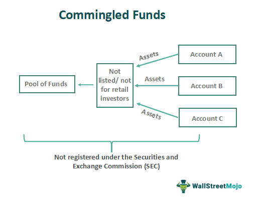

In financial services, the integration of asset management, finance commingling, and algorithmic trading has produced innovative methodologies to effectively manage and enhance wealth. The convergence of these elements plays a critical role in shaping modern investment strategies, catering to the increasingly sophisticated needs of investors.

Asset management dedicates itself to constructing and overseeing a client's investment portfolio in alignment with their specific financial objectives. This involves a systematic approach to selecting a diverse range of assets, such as stocks, bonds, and other securities, to achieve not only portfolio growth but also risk management in accordance with the client’s risk profile and financial aspirations.



Finance commingling, on the other hand, concentrates on pooling funds from multiple investors into a unified portfolio, thereby optimizing investment returns and reducing individual costs. This aggregation offers investors access to a wider array of investment opportunities, often at a more manageable expense, as the costs are shared among all participants. Commingled structures are prevalent in mutual funds, exchange-traded funds (ETFs), and various collective investment vehicles that facilitate efficient portfolio management.

The technological advancements driving algorithmic trading offer unprecedented speed and precision in executing large volumes of trades. By employing sophisticated algorithms and real-time data analytics, traders can navigate market fluctuations and capitalize on fleeting opportunities with remarkable accuracy. The automation of trading strategies not only enhances efficiency but also mitigates human error, thus providing a competitive edge in the fast-paced arena of financial markets.

Collectively, the convergence of asset management, finance commingling, and algorithmic trading constitutes a transformative framework, guiding investors and financial institutions toward maximizing returns while adeptly managing risks. The synergy of these innovative mechanisms underscores the importance of leveraging technology and strategic fund management in today's financial landscape.

## Table of Contents

## Understanding Asset Management

Asset management plays a critical role in the financial services industry, involving the structured management of a wide range of investment products such as stocks, bonds, and other securities. The primary aim is to assist clients in meeting their financial objectives by optimizing the growth of their investment portfolios while effectively managing potential risks. At the core of asset management is the strategic alignment of investment choices with the client's specific risk tolerance and financial goals. This requires a deep understanding of both the financial markets and individual client needs.

Professional asset managers utilize a variety of strategies and practices to achieve these aims. These strategies can include diversification to spread risk, active management to exploit market inefficiencies, and passive management to track specific market indices. Risk management is another critical aspect, with portfolio managers employing techniques such as hedging or the use of derivatives to mitigate potential downside risk.

In recent years, technology and data analysis have become integral components of asset management. Advanced technologies, including [artificial intelligence](/wiki/ai-artificial-intelligence) and [machine learning](/wiki/machine-learning), are increasingly employed to enhance the decision-making process. These technologies allow asset managers to process and analyze vast amounts of data, gaining insights into market trends and performance metrics that manual analysis might miss.

Furthermore, data-driven strategies such as [algorithmic trading](/wiki/algorithmic-trading) are employed to optimize trade execution and performance. For example, Python programming can be used to design algorithms that analyze historical stock data, identify potential buy or sell signals, and execute trades. Below is a simple Python snippet that illustrates the use of moving averages to identify potential trade opportunities:

```python
import pandas as pd

def moving_average_strategy(prices, short_window, long_window):
    signals = pd.DataFrame(index=prices.index)
    signals['signal'] = 0.0

    signals['short_mav'] = prices.rolling(window=short_window, min_periods=1, center=False).mean()
    signals['long_mav'] = prices.rolling(window=long_window, min_periods=1, center=False).mean()

    signals['signal'][short_window:] = \
        np.where(signals['short_mav'][short_window:] > signals['long_mav'][short_window:], 1.0, 0.0)   

    signals['positions'] = signals['signal'].diff()

    return signals

# Example usage with a DataFrame `df` containing historical price data
signals = moving_average_strategy(df['Close'], short_window=40, long_window=100)
```

The continuous evolution of technology and data analysis tools is reshaping the field of asset management, providing new opportunities for creating value via innovation and efficiency. As these technologies continue to advance, they promise to further transform asset management, enabling more precise and personalized investment strategies that align with clients' evolving needs and goals.

## The Concept of Finance Commingling

Finance commingling refers to the practice of aggregating investment funds from multiple investors into a single portfolio, effectively creating a pool of assets. This method offers several key advantages, primarily by reducing the costs associated with individual investments and broadening the spectrum of investment opportunities available to participants.

One of the principal benefits of finance commingling is cost reduction. When investors pool their funds, the economies of scale can significantly decrease the per-unit cost of transactions, management fees, and other associated expenses. For instance, a single large transaction can incur substantially lower fees compared to multiple smaller transactions. This efficiency not only reduces overall expenses but also allows investors to leverage collective bargaining power to obtain more favorable terms.

Commingled funds form the backbone of various investment vehicles such as mutual funds, exchange-traded funds (ETFs), and other collective investment schemes. These vehicles are designed to harness the benefits of commingling by offering a diversified portfolio that would typically be beyond the reach of individual investors. By pooling resources, investors gain access to a wider array of asset classes, geographic markets, and investment styles, which collectively enhance portfolio diversification and risk management.

However, finance commingling is not without its complexities, particularly regarding legal and regulatory implications. Proper management and transparency are paramount to ensure that the commingled funds are aligned with regulatory standards and investor agreements. Failure to appropriately handle these funds can lead to legal consequences. For instance, the improper separation of assets can result in severe legal penalties and loss of investor confidence.

In summary, finance commingling represents a strategic approach to investment management, offering cost efficiencies and enhanced portfolio opportunities. Nonetheless, careful consideration of the legal framework and adherence to regulatory guidelines are essential to avoid potential pitfalls associated with this investment strategy.

## Algorithmic Trading: The Future of Investment

Algorithmic trading employs sophisticated algorithms and computer programs to automate trading activities and refine strategies for buying and selling securities. This method leverages the power of technology to execute trades with minimal human intervention, thereby increasing efficiency and reducing the potential for human error.

A prominent aspect of algorithmic trading is high-frequency trading ([HFT](/wiki/high-frequency-trading-strategies)), characterized by the rapid execution of large volumes of trades driven by small price discrepancies across various markets or securities. HFT systems critically depend on speed and are usually deployed by financial institutions possessing highly sophisticated and fast computational systems. These systems exploit ultra-low latency data networks to complete transaction cycles within microseconds or milliseconds, thereby capitalizing on fleeting [arbitrage](/wiki/arbitrage) opportunities.

The advantages of algorithmic trading rest mainly on its speed, accuracy, and data-driven nature. Algorithms can process vast amounts of market data and execute orders far quicker than any human trader. This efficiency enhances the likelihood of achieving optimal prices by executing trades at optimal times. Algorithmic systems use a dynamic range of data inputs and historical indicators to chart trading signals, optimize portfolio management, and manage risks more effectively.

Programming languages like Python hold a significant role in developing complex trading algorithms due to their versatility and the availability of extensive libraries. For instance, NumPy and pandas are crucial for handling and analyzing large datasets. NumPy enables efficient numerical calculations, making it fundamental for financial mathematics, while pandas is invaluable for managing and analyzing time-series data. These libraries, combined with Python's user-friendly nature, simplify the development of intricate trading models that can predict price movements, optimize order flow, and manage risks.

In a typical Python algorithm, a basic structure might involve extracting data using pandas, performing numerical analysis with NumPy, and using machine learning libraries like scikit-learn to implement predictive models. For instance:

```python
import numpy as np
import pandas as pd
from sklearn.linear_model import LinearRegression

# Load and prepare the data
data = pd.read_csv('historical_data.csv')
X = np.array(data['feature']).reshape(-1, 1)
y = np.array(data['target'])

# Build a predictive model
model = LinearRegression()
model.fit(X, y)

# Predict future values
predictions = model.predict(X_new)
```

In this code snippet, an algorithm is developed using linear regression to predict future stock prices based on historical data, demonstrating a simplified version of the data-driven approaches utilized in financial markets.

Overall, as market complexities increase, algorithmic trading stands at the frontier of innovative investment strategies, providing significant leverage to those who can harness its capabilities effectively.

## Integrating Asset Management with Commingling and Algo Trading

The integration of asset management, finance commingling, and algorithmic trading represents a formidable investment management framework, combining the strengths of each component to optimize financial outcomes. Asset management benefits from finance commingling by enabling the pooling of funds, thus amplifying the capacity to deploy sophisticated algorithmic trading strategies at reduced costs. This pooling significantly lowers the barriers to accessing advanced trading methodologies by spreading costs and risks across a larger asset base, ultimately enhancing the return on investment potential for each participating investor.

Leveraging large datasets and real-time data is integral to this combined strategy. In asset management, the ability to use detailed analytics to make informed decisions is critical. Algorithmic trading thrives on the availability of precise, timely data, using it to execute trades swiftly and efficiently. This real-time data, often sourced from high-frequency trading environments, allows for the execution of trades in milliseconds, thus optimizing the timing and accuracy of market entries and exits. For instance, Python libraries such as NumPy and pandas can be employed to handle data manipulation and processing, facilitating rapid analysis and decision-making based on streaming market data.

From a risk management perspective, this integrated approach offers notable advantages. By combining the comprehensive oversight of asset management with the precise execution capabilities of algorithmic trading, investors can better balance risk and reward. This balanced approach is crucial in minimizing exposure to volatile market conditions while enhancing return probabilities. Moreover, risk models can be enhanced using statistical methods and machine learning algorithms that dynamically adjust strategies based on predictive analytics derived from historical and current data patterns.

The synergy between asset management, commingling, and algorithmic trading not only optimizes resource allocation but also fosters strategic innovation. As asset managers leverage pooled resources to utilize more sophisticated trading algorithms, they can expand their strategic toolkit, experimenting with complex models that might be too costly or risky to implement on a smaller scale. This strategic innovation is vital for staying competitive in an ever-evolving financial marketplace and can lead to the development of proprietary trading algorithms that provide a unique edge over competitors.

Overall, this integrated framework not only enhances decision-making capacity through access to broader datasets and real-time information but also aligns with the overarching goal of achieving superior financial performance by balancing operational costs, risk, and investment returns through strategic execution.

## Challenges and Considerations

Deploying algorithmic trading strategies necessitates a robust IT infrastructure and significant expertise in data analysis to ensure effective and efficient operation. The infrastructure must support high-frequency data processing and real-time transaction capabilities, crucial for implementing strategies that react to rapidly changing market conditions. Expertise in data analysis is paramount as well, as these strategies rely heavily on analyzing large datasets to identify patterns and formulate trading decisions.

Market [volatility](/wiki/volatility-trading-strategies) introduces substantial risks to automated trading strategies, requiring constant monitoring and adjustment. Automated systems, while fast, can fall prey to unforeseen market movements or anomalies, leading to unexpected losses. To mitigate these risks, strategies must incorporate mechanisms for error-handling and adaptive algorithms capable of adjusting to changing conditions. These adaptive systems often use machine learning models to understand and predict market behavior, necessitating regular updates to the models with the latest data.

In terms of finance commingling, compliance with regulatory requirements is critical. Different jurisdictions have varying regulations regarding the pooling of investment funds, necessitating thorough understanding and adherence to these legal frameworks to avoid potential penalties. Asset managers must ensure that they are operating within these legal boundaries, often requiring collaboration with legal experts to maintain compliance.

Balancing speed with accuracy is another crucial consideration for asset managers. Algorithmic trading prioritizes speed to capitalize on fleeting market opportunities, but this must not compromise the accuracy and reliability of the trade executions. Strategies should incorporate measures such as redundancy systems to maintain data integrity and precise execution.

Adhering to fiduciary responsibilities remains a significant challenge in this integrated approach. Asset managers are entrusted with managing their investors’ funds responsibly, necessitating transparent operations and decision-making processes that align with their clients' financial goals. This involves comprehensive risk assessments and maintaining open communication with clients regarding potential risks and expected returns. Subsequent models or algorithms must always be geared towards serving the best interest of the client, balancing innovation with accountability.

## Conclusion

The fusion of asset management, finance commingling, and algorithmic trading represents a cutting-edge approach to modern finance. This combination equips investors with robust tools to maximize returns while effectively managing risks. By integrating advanced technology such as high-frequency trading algorithms and leveraging large datasets, investors can achieve enhanced analytical capabilities and strategic fund management. Algorithmic trading, facilitated by programming languages like Python, allows for precise, data-driven decisions that capitalize on market inefficiencies and reduce latency in order execution.

As the financial landscape continues to evolve, embracing these innovations is crucial for maintaining competitiveness. In a fast-paced market environment, the agility provided by technology-enabled strategies allows for rapid adaptation and resilience against unforeseen market shifts. The practice of commingling funds offers additional layers of diversification and cost efficiency, making sophisticated investment methods accessible to a broader array of investors.

Future advancements in artificial intelligence (AI) and machine learning (ML) are anticipated to further enhance capabilities in this domain. These technologies can provide predictive insights and automate complex decision-making processes, thereby refining risk assessment models and optimizing portfolio strategies. AI and ML could enable the development of self-learning trading systems capable of autonomously adapting to changing market conditions. As these technologies mature, their integration into financial strategies will likely transform how investments are managed, making them more sophisticated and responsive. Embracing these advancements is not just a path to profitability; it's an imperative for sustaining relevance in the dynamic world of finance.

## References & Further Reading

[1]: Bai, Y. & Wu, S. (2016). ["Algorithmic and High-Frequency Trading."](https://assets.cambridge.org/97811070/91146/frontmatter/9781107091146_frontmatter.pdf) World Scientific Publishing Company.

[2]: Huberman, G. (2010). ["High-Frequency Trading and the New Market Makers."](https://www.sciencedirect.com/science/article/pii/S1386418113000281) Annual Review of Financial Economics, 2, 47-59.

[3]: Lopez de Prado, M. (2018). ["Advances in Financial Machine Learning."](https://www.amazon.com/Advances-Financial-Machine-Learning-Marcos/dp/1119482089) Wiley & Sons.

[4]: Chan, E. P. (2009). ["Quantitative Trading: How to Build Your Own Algorithmic Trading Business."](https://github.com/ftvision/quant_trading_echan_book) Wiley Trading.

[5]: Naldi, M., & D'Acquisto, G. (2019). ["Algorithmic Trading and Black Box Algorithms."](https://link.springer.com/chapter/10.1007/978-3-030-69583-5_10) Renewable and Sustainable Energy Reviews, 105, 259-272.