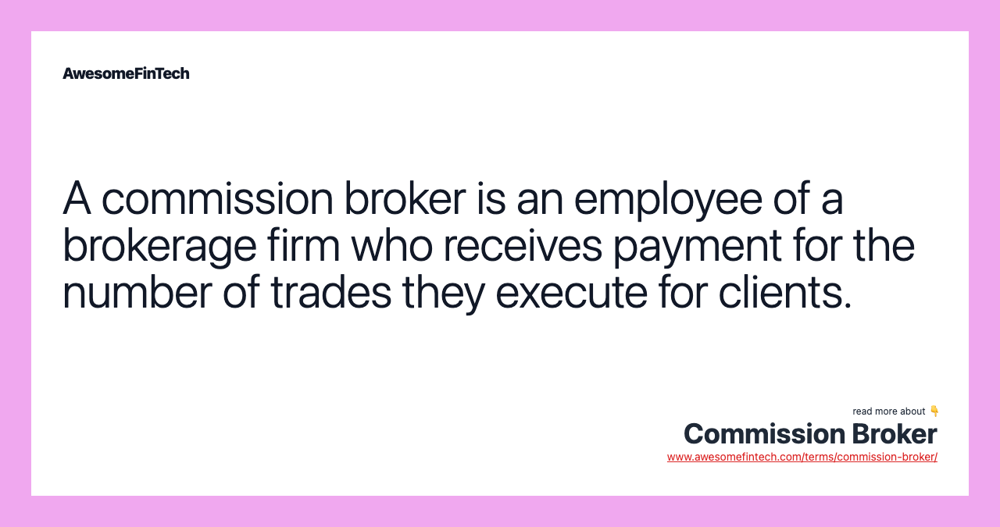

## Table of Contents

## What is a commission broker?

A commission broker is a person or a company that helps people buy and sell things like stocks, bonds, or real estate. They get paid a fee, called a commission, every time they make a trade for someone. This fee is usually a small percentage of the total amount of the trade.

People use commission brokers because they can be experts in the market and help make good choices about buying and selling. The broker's job is to get the best price possible for their client, whether they are buying or selling. This can be really helpful for people who don't have the time or knowledge to do it themselves.

## What are the primary roles of a commission broker?

A commission broker's main job is to help people buy and sell things like stocks, bonds, or real estate. They act like a middle person between the buyer and the seller. Their big role is to make trades happen. They use their knowledge of the market to find good deals and the right time to buy or sell. When they complete a trade, they get paid a fee called a commission.

Another key role of a commission broker is to give advice and help their clients make smart choices. They look at market trends and use their experience to suggest what their clients should do. This can be really helpful for people who don't know a lot about investing. The broker's goal is to help their clients make money or save money by getting the best deals possible.

## How does a commission broker differ from other types of brokers?

A commission broker is different from other types of brokers mainly because they get paid a fee, called a commission, every time they make a trade. This fee is usually a percentage of the total amount of the trade. Other types of brokers, like fee-based brokers, might charge a flat fee for their services instead of a commission. This means that no matter how many trades they do, their pay stays the same. Commission brokers are motivated to make more trades because they get paid more for each one.

Another difference is in how they work with their clients. Commission brokers often work with people who want to buy or sell things like stocks or real estate, and they focus on making those trades happen. They use their market knowledge to help their clients get the best deals. On the other hand, fee-based brokers or financial advisors might offer more ongoing advice and help with long-term planning, not just making trades. They might help with things like retirement planning or building a whole investment plan, and their fee covers all of this work, not just the trades they make.

## What qualifications are needed to become a commission broker?

To become a commission broker, you usually need at least a bachelor's degree in a related field like finance, economics, or business. This education helps you understand the markets and how to make good trades. Some brokers also get special licenses like the Series 7 and Series 63, which are required by the Financial Industry Regulatory Authority (FINRA). These licenses show that you know the rules and can work in the industry.

Besides education and licenses, you need to have good skills in math and talking to people. You'll be working with numbers a lot, so being good at math helps you understand the trades and make smart choices. Talking to people is important too because you'll be helping clients and explaining things to them. It's also helpful to have some experience working in finance or sales, because this can teach you how to work with clients and understand the market better.

## How do commission brokers earn their income?

Commission brokers earn their income by getting paid a fee every time they help someone buy or sell something like stocks, bonds, or real estate. This fee is called a commission, and it's usually a small percentage of the total amount of the trade. For example, if a client buys $10,000 worth of stocks and the commission rate is 1%, the broker earns $100 for that trade.

The more trades a commission broker makes, the more money they can earn. This is because they get a commission for each trade they complete. So, it's in their interest to help their clients make a lot of trades. This can motivate them to find good deals and the right times to buy or sell, which helps both them and their clients.

## What is the typical commission rate for a commission broker?

The typical commission rate for a commission broker can vary a lot. It often depends on what kind of thing they are helping to buy or sell, like stocks or real estate. For stocks, the commission rate might be around 0.5% to 2% of the total amount of the trade. But, with more people using online trading platforms, some brokers now charge much less, sometimes even as low as $0.01 per share.

For real estate, the commission rate is usually higher. It can be around 5% to 6% of the home's sale price. This fee is often split between the buyer's broker and the seller's broker. So, if a house sells for $300,000 and the commission rate is 6%, the total commission is $18,000, which might be split between two brokers, giving each $9,000.

## Can you explain the process of how a commission broker facilitates a trade?

When someone wants to buy or sell something like stocks or real estate, they can use a commission broker to help them. The broker starts by talking to the client to find out what they want to do. If the client wants to buy stocks, for example, the broker will look at the market to see what stocks are available and at what price. They use their knowledge to find the best deal for the client. Once they find a good price, the broker places the order to buy the stocks. If the client wants to sell, the broker does the same thing but looks for someone who wants to buy the stocks at a good price.

After the broker finds a buyer or seller and makes the trade happen, they get paid a fee called a commission. This fee is usually a small percentage of the total amount of the trade. For example, if the client buys $10,000 worth of stocks and the commission rate is 1%, the broker earns $100. The broker then gives the client a report of the trade, showing what was bought or sold, at what price, and how much the commission was. This way, the client knows exactly what happened and how much it cost.

## What are the common challenges faced by commission brokers?

Commission brokers often face the challenge of keeping their clients happy. Since they get paid a fee for each trade, they need to find good deals and the right time to buy or sell. This can be hard because the market changes all the time. If they don't make good trades, their clients might not want to work with them anymore. Also, they need to explain things clearly to their clients, who might not know a lot about investing. If clients don't understand what's going on, they can get upset or confused.

Another challenge is competition. There are a lot of other brokers out there, and some might charge less or offer better services. This means commission brokers always have to work hard to be better than others. They need to keep learning about the market and finding new ways to help their clients. Plus, with more people using online trading platforms, some clients might decide to trade on their own instead of using a broker. This can make it harder for commission brokers to find and keep clients.

## How has technology impacted the role of commission brokers?

Technology has changed the way commission brokers work a lot. Now, with online trading platforms, people can buy and sell stocks on their own without needing a broker. This means commission brokers have to do more than just make trades. They need to give good advice and help their clients understand the market better. If they don't, their clients might just use an app to trade by themselves.

Also, technology helps commission brokers do their job better. They can use special software to look at market trends and find the best times to buy or sell. This can make them more helpful to their clients. But, it also means they need to keep learning about new technology and how to use it. If they don't, they might fall behind other brokers who are using the latest tools.

## What strategies can commission brokers use to increase their earnings?

Commission brokers can increase their earnings by making more trades. Since they get paid a fee for each trade, the more trades they do, the more money they make. They can do this by finding new clients and helping them buy and sell things like stocks or real estate. They can also talk to their current clients more often and suggest good times to trade. This way, their clients might make more trades, which means more commissions for the broker.

Another strategy is to give really good advice to their clients. If clients are happy with the advice and make money, they will want to keep working with the broker. This can lead to more trades and more commissions. Brokers can also learn more about the market and use new technology to find the best deals for their clients. By being better at their job, they can attract more clients and make more money.

## How do regulatory changes affect the work of commission brokers?

Regulatory changes can have a big impact on how commission brokers do their job. When new rules come out, brokers have to follow them. This might mean they need to get new licenses or learn about new laws. For example, if the government changes the rules about what brokers can and can't do, the brokers have to change how they work to follow these rules. This can make their job harder because they need to spend time learning and making sure they are doing everything right.

These changes can also affect how much money brokers make. Sometimes, new rules might mean they can't charge as much for their services or they have to be more careful about the advice they give. This can make it harder for them to earn a lot of money. But, if brokers can adapt to the new rules and still give good service to their clients, they can keep their clients happy and keep making money. It's all about staying up to date and being able to change how they work when the rules change.

## What advanced skills or knowledge can significantly enhance a commission broker's performance?

Having advanced skills in understanding the market can really help a commission broker do a better job. They need to know a lot about how the stock market works and be able to predict what might happen next. This means they should keep learning about new trends and use special tools to look at data. By being good at this, they can find the best times to buy and sell for their clients, which makes the clients happy and helps the broker make more money.

Good communication skills are also very important for a commission broker. They need to explain things clearly to their clients, who might not know a lot about investing. If a broker can talk about complicated ideas in a simple way, their clients will trust them more. Also, being good at building relationships can help a broker keep their clients and find new ones. By being friendly and helpful, they can make sure their clients keep coming back to them for more trades.

## References & Further Reading

[1]: Bergstra, J., Bardenet, R., Bengio, Y., & Kégl, B. (2011). ["Algorithms for Hyper-Parameter Optimization."](https://papers.nips.cc/paper/4443-algorithms-for-hyper-parameter-optimization) Advances in Neural Information Processing Systems 24.

[2]: ["Advances in Financial Machine Learning"](https://www.amazon.com/Advances-Financial-Machine-Learning-Marcos/dp/1119482089) by Marcos Lopez de Prado

[3]: ["Evidence-Based Technical Analysis: Applying the Scientific Method and Statistical Inference to Trading Signals"](https://www.amazon.com/Evidence-Based-Technical-Analysis-Scientific-Statistical/dp/0470008741) by David Aronson

[4]: ["Machine Learning for Algorithmic Trading"](https://github.com/stefan-jansen/machine-learning-for-trading) by Stefan Jansen

[5]: ["Quantitative Trading: How to Build Your Own Algorithmic Trading Business"](https://www.amazon.com/Quantitative-Trading-Build-Algorithmic-Business/dp/1119800064) by Ernest P. Chan