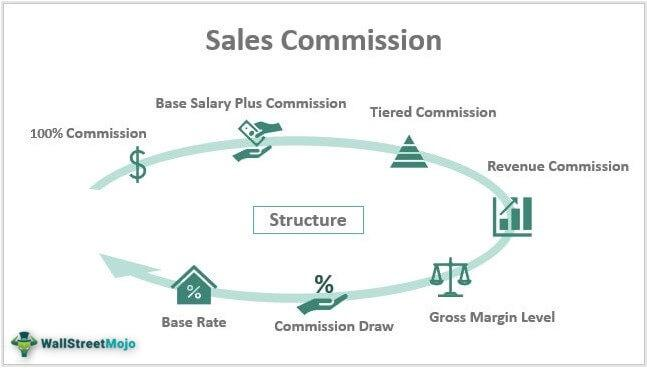

In today's dynamic business environment, understanding the intersection of business compensation, sales commissions, and algorithmic trading is increasingly essential for businesses aiming to secure a competitive advantage. These elements, although distinct in their primary functions, collectively drive business growth, efficiency, and employee motivation. Companies that effectively integrate these components are better positioned to boost sales, optimize trading strategies, and ensure fair and motivating compensation for their workforce.

In this article, we explore the synergies between these pivotal business components. We intend to guide you through the fundamentals of each concept, as well as some of the more nuanced strategies that can be employed. Business compensation encompasses the total pay structure offered to employees, including salaries, bonuses, and various incentives, which is crucial for attracting and maintaining top talent. Sales commissions, a key part of compensation plans in sales roles, offer various structures such as straight, tiered, and profit-based commissions, which need to be carefully assessed to ensure they motivate and fit company goals.



On the other hand, algorithmic trading represents the cutting-edge of trading strategy. Utilizing computer algorithms, it enables rapid execution of trades, minimizes human error, and offers sophisticated strategies to navigate complex financial markets. Algorithmic trading is widely adopted due to its efficiency and effectiveness, transforming traditional trading practices.

By exploring these concepts, whether you are part of a sales team or involved in trading operations, you can gain insights that are crucial for enhancing your success. Understanding how these areas of business interplay not only positions you to meet sales targets but also ensures trading processes are streamlined and efficient, ultimately benefiting the organization as a whole.

## Table of Contents

## Understanding Business Compensation

Business compensation encompasses the comprehensive pay structures provided by companies to compensate their employees, including salaries, bonuses, and incentives. A well-structured compensation strategy is vital for firms aiming to secure high-caliber talent, particularly within sales-driven environments.

**Types of Business Compensation Structures**:

1. **Base Salary**: The core component of any compensation package, offering employees financial stability. This fixed remuneration is essential for fulfilling basic lifestyle needs and assures a steady income irrespective of individual or team performance metrics.

2. **Bonuses**: Performance-linked financial rewards that are typically grounded on achieving specified benchmarks or attaining predefined targets. Bonuses can be distributed annually, quarterly, or, on certain occasions, monthly. They serve to motivate employees by aligning their personal economic interests with the company’s performance objectives.

3. **Incentives**: These are additional rewards intended to boost employees' drive to meet specific short-term goals. Incentives can be monetary or non-monetary, such as gift cards, trips, or special recognition, and are designed to spur immediate or near-term productivity enhancements.

**Impact on Employee Motivation and Performance**:

- **Motivation**: Compensation is a critical factor in employee motivation. Financial rewards can enhance an individual’s commitment to organizational objectives, thereby increasing workplace enthusiasm and reducing attrition rates. The prospect of additional monetary gains through bonuses and incentives can stimulate performance beyond the baseline requirements.

- **Performance**: Structuring compensation packages to include a mix of fixed and variable components can optimize employee performance. The variable elements, linked directly to individual or group outcomes, can encourage superior results by fostering a performance-oriented culture.

Effective compensation strategies should be aligned with the organization’s overarching goals and employee expectations. They should consider industry standards and economic conditions to maintain competitiveness. Additionally, clear communication regarding the structure and objectives of compensation plans is crucial to ensure transparency and employee buy-in.

By strategically balancing salary, bonuses, and incentives, businesses can not only attract but also retain top-performing employees, which in turn drives organizational success and continuity.

## Exploring Sales Commission Structures

Sales commissions are a fundamental aspect of compensation plans, particularly crucial for roles centered on sales performance. These commissions serve as incentives aligned with sales objectives, motivating sales personnel to achieve set targets and driving business revenue. Various commission structures exist, each suited to different business needs and goals.

The straight commission structure is one of the simplest forms, where sales representatives earn a fixed percentage of the sales they generate. It directly ties compensation to sales performance, fostering a results-driven environment. For example, if a salesperson earns a 10% commission on a sale, a transaction worth $5,000 would yield a commission of $500. This approach can be advantageous for organizations seeking to minimize fixed salary expenses and incentivize high performance. However, it may also lead to income instability for employees, particularly during periods of low sales volumes.

Tiered commission structures introduce different commission rates that apply after reaching specific sales thresholds. This system encourages sales personnel to exceed their targets by offering progressively higher rates as they achieve more sales. For example, a salesperson might earn a 5% commission on the first $10,000 of sales, 7% on the next $10,000, and 10% on any sales beyond $20,000. This model not only incentivizes higher sales but also rewards sustained effort, aligning the salesperson's interests with the company’s growth objectives.

Profit-based commissions link the salesperson's earnings to the profitability of the sales made. This structure is particularly effective in industries with substantial cost variability, where it is crucial to emphasize not just [volume](/wiki/volume-trading-strategy), but also the profitability of transactions. By aligning commission with profit margins, sales representatives are encouraged to focus on high-margin products and efficient selling strategies, fostering a balanced approach between revenue generation and cost management.

Selecting an appropriate commission structure requires careful consideration of industry standards, company goals, and the typical sales cycle. For instance, businesses in highly competitive sectors might favor a tiered or profit-based commission system to discourage aggressive discounting and promote value-based selling. Conversely, industries with a rapid sales cycle may benefit from a straight commission approach to reward quick turnovers.

In conclusion, an optimal sales commission plan should support the company's objectives, motivate employees effectively, and remain flexible to adapt to changing business environments. By aligning compensation strategies with company goals, businesses can foster a motivated sales force and drive sustained growth.

## Algorithmic Trading: An Overview

Algorithmic trading involves the use of computer programs to execute trades in financial markets based on pre-defined rules and algorithms. This method leverages the computational power and speed of computers to conduct trades that human traders would find impossible to process due to the sheer speed and volume.

One of the primary advantages of [algorithmic trading](/wiki/algorithmic-trading) is its speed and efficiency. These systems can evaluate multiple market conditions simultaneously, making rapid decisions that capitalize on fleeting opportunities. This ability not only enhances the execution of trades but also significantly reduces the likelihood of human error, which can be costly in high-frequency trading environments.

The algorithms themselves are crafted using historical data and market variables, allowing them to predict future price movements and make decisions accordingly. These predictive algorithms employ statistical techniques to identify patterns within massive datasets, which might include pricing histories, trading volumes, or even news sentiment analysis.

Various strategies are employed in algorithmic trading. Some common ones include:

1. **Trend Following**: This strategy relies on identifying and riding trends in the market. It uses technical indicators such as moving averages or momentum indicators to establish buy or sell signals.

2. **Arbitrage**: Arbitrage strategies take advantage of price discrepancies between similar or related assets. For example, an algorithm might simultaneously buy and sell the same asset in different markets where price differences have been detected.

3. **Market Making**: This involves continuously quoting both buy and sell prices in a financial instrument or commodity, intending to make profit on the bid–ask spread.

4. **Mean Reversion**: This approach assumes that asset prices will revert to their historical averages. Algorithms identifiy discrepancies from the average and make trades based on the expectation of a reversion.

5. **Statistical Arbitrage**: This involves complex statistical models to identify trading opportunities from statistical mispricings in securities.

The development of these algorithms typically involves several stages: data collection, model building, back-testing, and real-time implementation. During the back-testing phase, traders ensure that the algorithm performs well on historical data before risking real capital in live trading.

Here's a simple Python example demonstrating a basic strategy using moving averages:

```python
import numpy as np

def simple_moving_average(data, period=30):
    return np.convolve(data, np.ones(period)/period, mode='valid')

# Example price data
prices = np.array([100, 102, 101, 105, 107, 109, 108, 110, 108, 107])

# Calculate the 3-period moving average
sma = simple_moving_average(prices, period=3)

# Basic buy/sell signals based on the moving average
buy_signals = np.where(prices[:-2] < sma)[0]
sell_signals = np.where(prices[:-2] > sma)[0]

print("Buy signals at: ", buy_signals)
print("Sell signals at: ", sell_signals)
```

Advanced algorithms may incorporate [machine learning](/wiki/machine-learning) techniques to adapt to changing market conditions, making them both robust and flexible. While algorithmic trading offers significant advantages, it also requires a solid technological infrastructure and careful monitoring due to potential risks such as market [volatility](/wiki/volatility-trading-strategies) and algorithmic errors.

## Integrating Compensation and Trading Strategies

Combining strategic sales compensation strategies with sophisticated trading tactics can significantly boost business growth and operational efficiency. One key approach involves using algorithms to automate and optimize commission tracking. This not only increases efficiency but also ensures accuracy in commission calculations, reducing administrative overhead and minimizing human errors. By leveraging technology, businesses can offer more transparent and fair compensation plans, fostering trust and motivation among employees.

The integration of technology in compensation plans involves several dimensions. Firstly, data analytics play a crucial role. By analyzing large datasets, companies can tailor compensation strategies that align with sales performance and market trends. This involves creating dynamic and adaptable commission structures that can respond to business needs and sales objectives.

Algorithmic interventions can streamline trading operations through programmatic decision-making. For instance, algorithms can be implemented to monitor market conditions and execute trades based on pre-set criteria, such as price movements and market indices. This automation allows for swift adaptations to market changes, enhancing the precision and timing of trades.

In a Python framework, businesses can automate commission tracking and trading operations through various libraries and tools. For instance:

```python
import pandas as pd

# Example data for sales and commissions
sales_data = pd.DataFrame({
    'sales_rep': ['Rep A', 'Rep B', 'Rep C'],
    'total_sales': [15000, 25000, 10500],
})

# Define a function to calculate commission based on a tiered structure
def calculate_commission(total_sales):
    if total_sales > 20000:
        return total_sales * 0.10  # 10% commission
    elif total_sales > 10000:
        return total_sales * 0.07  # 7% commission
    else:
        return total_sales * 0.05  # 5% commission

# Apply the function to each sales record
sales_data['commission'] = sales_data['total_sales'].apply(calculate_commission)

print(sales_data)
```

In this example, we established a tiered commission structure, where sales representatives receive commissions based on specified sales brackets. Such automation simplifies the calculation of commissions, reduces the potential for error, and allows sales managers to make informed adjustments.

To further streamline trading operations, algorithmic trading can be optimized through back-testing strategies, allowing traders to evaluate the effectiveness of different algorithms before live deployment. This involves simulating trades over historical data to identify potential risks and optimize strategy performance.

Ultimately, the integration of compensation and trading strategies through advanced technology lends businesses a competitive edge. By making use of algorithmic tools and data-driven insights, companies can create a responsive and adaptive business model that meets the demands of a dynamic market environment. This leads to not only enhanced profitability but also a more motivated and productive workforce, ensuring sustained business success.

## Key Challenges and Solutions

Implementing complex compensation plans and trading strategies comes with a unique set of challenges. One significant issue is the misalignment of incentives. When compensation structures do not align with company goals, it can lead to behaviors that are detrimental to organizational objectives. For instance, if sales commissions are solely based on volume without considering profit margins, it may encourage employees to focus on closing deals regardless of their profitability. This misalignment can be detrimental to a company’s financial health.

Inadequate technology infrastructure is another obstacle. For complex compensation plans and algorithmic trading to function effectively, robust technological systems are necessary. The absence of advanced systems can lead to inefficiencies and errors in calculating commissions and executing trades. Systems must be capable of handling large volumes of data in real-time to provide accurate and timely information.

Addressing these challenges requires strategic solutions. Transparent communication is critical. Clear communication about compensation plans and performance goals ensures that employees understand what is expected of them and what they stand to gain. This clarity helps in aligning personal goals with organizational objectives.

Continuous training is another vital component. As both the sales and trading landscapes evolve, it is essential to keep teams updated with the latest strategies and technologies. Training programs should focus on developing skills necessary for understanding and implementing complex strategies effectively.

Investing in robust trading platforms and compensation management systems is also crucial. Advanced systems should handle real-time data processing and analysis, and provide comprehensive insights into trading performance and compensation metrics. For example, the use of algorithmic trading platforms with machine learning capabilities can enhance decision-making by predicting market trends more accurately.

Furthermore, code-based solutions like automation scripts can facilitate efficient management of compensation plans. A simple Python script might be used for calculating commission payouts:

```python
def calculate_commission(sales, commission_rate):
    """Calculates commission based on sales and rate."""
    return sales * commission_rate

sales_data = [10000, 25000, 30000]  # Example sales data
commission_rate = 0.05  # 5% commission rate
commissions = [calculate_commission(sale, commission_rate) for sale in sales_data]

print("Commissions:", commissions)
```

This script automates the calculation of commissions based on sales data, reducing errors associated with manual computation.

By understanding these challenges and implementing effective solutions, companies can better align compensation with business goals and optimize trading operations, thus ensuring sustainable growth and improved competitive positioning.

## Conclusion

Understanding the synergy between compensation and algorithmic trading is essential for maximizing business performance. A strategic approach that integrates thoughtful compensation structures with algorithmic trading ensures that sales targets are met effectively, while trading operations are optimized, thereby minimizing errors and maximizing efficiency.

Sales compensation plans, when aligned with business objectives, motivate employees to achieve predefined targets. This alignment not only bolsters employee performance but also streamlines efforts toward broader organizational goals. Algorithmic trading, on the other hand, leverages technology to execute trades at speeds and frequencies that are impossible for human traders, enhancing the precision and potential profitability of trading practices.

The integration of effective compensation strategies with algorithmic trading technologies can significantly enhance a company's competitive edge. By employing best practices in these areas, organizations can ensure that compensation plans reward desired behaviors and trading decisions are driven by data and analytics.

The adoption of robust technology platforms to automate and monitor compensation and trading activities is crucial. Such platforms reduce administrative overhead and provide real-time insights into both employee performance and market conditions. This transparency supports informed decision-making and fosters a culture of accountability.

In conclusion, by understanding and harnessing the power of both compensation strategies and algorithmic trading, organizations position themselves for sustainable growth. The dual approach of motivating sales teams through well-structured compensation and optimizing trading operations through algorithmic solutions can lead to enhanced performance metrics and a solidified competitive standing in the market.

## References & Further Reading

[1]: Bergstra, J., Bardenet, R., Bengio, Y., & Kégl, B. (2011). ["Algorithms for Hyper-Parameter Optimization."](https://proceedings.neurips.cc/paper/2011/file/86e8f7ab32cfd12577bc2619bc635690-Paper.pdf) Advances in Neural Information Processing Systems 24.

[2]: ["Advances in Financial Machine Learning"](https://www.amazon.com/Advances-Financial-Machine-Learning-Marcos/dp/1119482089) by Marcos Lopez de Prado

[3]: ["Evidence-Based Technical Analysis: Applying the Scientific Method and Statistical Inference to Trading Signals"](https://www.amazon.com/Evidence-Based-Technical-Analysis-Scientific-Statistical/dp/0470008741) by David Aronson

[4]: ["Machine Learning for Algorithmic Trading"](https://github.com/PacktPublishing/Machine-Learning-for-Algorithmic-Trading-Second-Edition) by Stefan Jansen

[5]: ["Quantitative Trading: How to Build Your Own Algorithmic Trading Business"](https://books.google.com/books/about/Quantitative_Trading.html?id=j70yEAAAQBAJ) by Ernest P. Chan