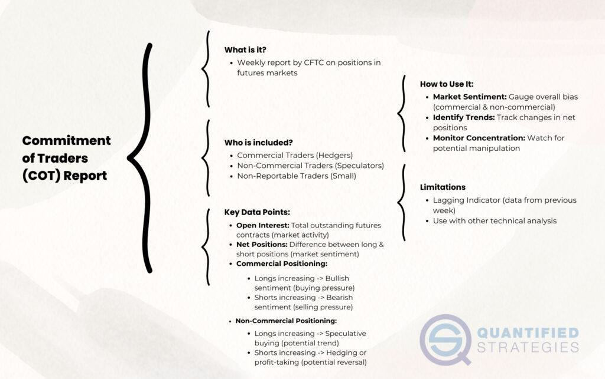

## Table of Contents

## What is the Commitments of Traders (COT) Report?

The Commitments of Traders (COT) Report is a weekly report issued by the Commodity Futures Trading Commission (CFTC) in the United States. It provides a breakdown of the open interest in futures markets, showing how different types of traders are positioned in various futures contracts. This includes data on commodities like gold, oil, and agricultural products, as well as financial instruments like currencies and stock indices. The report helps investors and traders understand market trends and the sentiment of different market participants.

The COT Report divides traders into three main categories: commercial traders, non-commercial traders, and non-reportable positions. Commercial traders are typically businesses that use futures contracts to hedge against price changes in the commodities they deal with. Non-commercial traders, often referred to as speculators, are usually large investors or hedge funds that trade futures to profit from price movements. Non-reportable positions are smaller traders whose positions are not large enough to be reported individually. By analyzing the positions of these groups, traders can gain insights into potential future market movements and make more informed trading decisions.

## Who publishes the Commitments of Traders Report?

The Commitments of Traders Report is published by the Commodity Futures Trading Commission (CFTC). The CFTC is a government agency in the United States that oversees the futures and options markets.

The report comes out every week. It shows how different types of traders are positioned in the futures markets. This helps people understand what is happening in the markets and make better trading decisions.

## How often is the COT Report released?

The COT Report comes out every week. It is released by the Commodity Futures Trading Commission, or CFTC for short. They put it out on Fridays at 3:30 PM Eastern Time. This timing lets people look at the report over the weekend and plan their trading for the next week.

The report shows how different traders are positioned in the futures markets. It breaks down the data into groups like commercial traders, non-commercial traders, and smaller traders. This helps people see trends and understand what might happen next in the markets.

## What are the main categories of traders in the COT Report?

The COT Report breaks down traders into three main groups: commercial traders, non-commercial traders, and non-reportable positions. Commercial traders are usually businesses that use futures to protect themselves from price changes in the things they buy or sell. For example, a farmer might use futures to lock in a price for their crops. These traders are often called hedgers because they are hedging against price risks.

Non-commercial traders are usually big investors or hedge funds that trade futures to make money from price changes. They are often called speculators because they are trying to guess which way prices will go. These traders can have a big impact on the market because they trade a lot.

Non-reportable positions are the smaller traders. Their trades are not big enough to be reported on their own, so they are grouped together. This group can still be important because there are a lot of them, and together they can move the market too.

## How can the COT Report be used to understand market sentiment?

The COT Report helps people see what different types of traders are doing in the futures markets. By looking at how commercial traders, non-commercial traders, and smaller traders are positioned, you can get a sense of what they think about the market. For example, if a lot of commercial traders are buying futures, it might mean they expect prices to go up. On the other hand, if many non-commercial traders are selling, it could mean they think prices will go down.

This information can be very useful for understanding market sentiment. If you see that big speculators are betting heavily on one side of the market, it can tell you where they think prices are headed. By comparing the positions of different groups, you can see if there is a strong agreement or disagreement about the market's direction. This can help you make better trading decisions by understanding the overall mood of the market.

## What is the difference between Commercial and Non-Commercial traders in the COT Report?

Commercial traders in the COT Report are businesses that use futures to protect themselves from price changes. They are often called hedgers because they are trying to reduce the risk of price changes in the things they buy or sell. For example, an airline might use futures to lock in a price for fuel. These traders are usually more interested in protecting their business than making money from trading.

Non-commercial traders, on the other hand, are usually big investors or hedge funds that trade futures to make money from price changes. They are often called speculators because they are trying to guess which way prices will go. These traders are not directly involved in the production or use of the commodity they are trading. Instead, they are trying to profit from the market movements. Their positions can have a big impact on the market because they often trade large amounts.

## How does the COT Report help in identifying potential market trends?

The COT Report helps people spot potential market trends by showing how different types of traders are positioned in the futures market. If you see that a lot of commercial traders are buying futures, it might mean they expect prices to go up. They use futures to protect their business, so if they are buying a lot, it could be a sign that they think prices will rise. On the other hand, if many non-commercial traders, who are often called speculators, are selling, it might mean they think prices will go down. These traders are trying to make money from price changes, so their actions can give clues about what they think will happen next.

By comparing the positions of these groups, you can see if there is a strong agreement or disagreement about where the market is heading. If both commercial and non-commercial traders are betting in the same direction, it can be a strong sign of an upcoming trend. For example, if both groups are heavily buying, it might mean a bullish trend is coming. But if they are betting in opposite directions, it might mean the market is unsure and could go either way. This information helps traders make better decisions by understanding the overall mood and potential direction of the market.

## What are some limitations of using the COT Report for trading decisions?

The COT Report is helpful, but it has some limits when you use it to make trading choices. One big problem is that the report comes out late. It is released on Fridays, but it shows data from the Tuesday before. This means the information might be old by the time you see it. Markets can change a lot in a few days, so you might be making decisions based on outdated information.

Another issue is that the COT Report only gives you a broad view of the market. It does not tell you about the actions of smaller traders or give you details about why big traders are making their moves. It just shows you numbers, not the reasons behind them. This can make it hard to understand what is really going on in the market.

Also, the COT Report can be hard to understand if you are new to trading. It uses a lot of special terms and needs some knowledge to use it well. If you do not know how to read it right, you might make wrong guesses about what the market will do next. So, while the COT Report can be useful, it is important to use it along with other tools and information to make the best trading decisions.

## Can you explain the significance of the 'Open Interest' in the COT Report?

Open Interest in the COT Report is very important because it shows the total number of futures contracts that are still open and not yet settled. This number tells us how many people are actively trading in the market. If the Open Interest is going up, it means more people are getting involved, which can make the market more active and possibly more volatile. On the other hand, if the Open Interest is going down, it means people are closing their positions and leaving the market, which can make the market quieter.

By looking at the Open Interest along with the positions of different types of traders, you can get a better idea of what is happening in the market. For example, if the Open Interest is increasing and non-commercial traders are buying more futures, it might mean they expect prices to go up. This can help you understand the market's direction and make better trading decisions. But remember, Open Interest is just one piece of the puzzle, and you should use it with other information to get the full picture.

## How do 'Long' and 'Short' positions in the COT Report influence trading strategies?

In the COT Report, 'Long' and 'Short' positions show what traders think about future price movements. A 'Long' position means a trader is buying a futures contract because they think the price will go up. On the other hand, a 'Short' position means a trader is selling a futures contract because they expect the price to go down. By looking at how many Long and Short positions different types of traders have, you can get an idea of what they think will happen next in the market.

This information can help you make better trading decisions. For example, if you see that a lot of big speculators, or non-commercial traders, are taking Long positions, it might be a sign that they expect prices to rise. You might decide to buy futures too, hoping to make money if the price goes up. But if many commercial traders, who are often trying to protect their business, are taking Short positions, it could mean they think prices will fall. You might then decide to sell futures or stay out of the market to avoid losing money. So, knowing about Long and Short positions in the COT Report can help you guess where the market is headed and plan your trades accordingly.

## What advanced metrics or additional data can be derived from the COT Report for expert analysis?

Expert traders can use the COT Report to look at advanced metrics like the Net Position, which is the difference between Long and Short positions for each group of traders. By looking at the Net Position, you can see if a group is betting more on prices going up or down. Another useful metric is the Change in Open Interest, which shows how the total number of open contracts has changed from the last report. If the Change in Open Interest is going up and the price is also going up, it might mean the market trend is getting stronger. But if the price is going up and the Open Interest is going down, it might mean the trend is getting weaker.

You can also look at the Percentage of Open Interest, which shows what part of the total open contracts each group of traders holds. This can help you see if one group is having a bigger impact on the market than others. Another thing to look at is the Concentration Ratio, which shows how much of the market is controlled by the biggest traders. If the Concentration Ratio is high, it means a few big traders are making big moves, which can make the market more volatile. By using these advanced metrics, expert traders can get a deeper understanding of market trends and make better trading decisions.

## Can you provide real-world examples of how the COT Report has been used to predict major market movements?

One real-world example of using the COT Report to predict major market movements happened in the gold market in 2011. At that time, the COT Report showed that non-commercial traders, or speculators, had built up a very large number of Long positions in gold futures. This meant they were betting heavily that the price of gold would go up. Soon after, the price of gold hit an all-time high of nearly $1,900 per ounce. Traders who paid attention to the COT Report and saw the big Long positions from speculators could have guessed that gold prices were going to rise and made money by buying gold futures before the peak.

Another example is from the oil market in 2014. The COT Report showed that commercial traders, who are usually companies that use oil, had a lot of Short positions. This meant they were betting that oil prices would go down. At the same time, non-commercial traders had a lot of Long positions, betting that prices would go up. The COT Report showed a big difference between what these two groups thought would happen. Soon after, oil prices started to fall sharply, dropping from over $100 per barrel to below $50. Traders who saw the large Short positions from commercial traders in the COT Report could have predicted the fall in oil prices and made money by selling oil futures before the drop.

## References & Further Reading

[1]: Bergstra, J., Bardenet, R., Bengio, Y., & Kégl, B. (2011). ["Algorithms for Hyper-Parameter Optimization."](https://papers.nips.cc/paper/4443-algorithms-for-hyper-parameter-optimization) Advances in Neural Information Processing Systems 24.

[2]: ["Advances in Financial Machine Learning"](https://www.amazon.com/Advances-Financial-Machine-Learning-Marcos/dp/1119482089) by Marcos Lopez de Prado

[3]: ["Evidence-Based Technical Analysis: Applying the Scientific Method and Statistical Inference to Trading Signals"](https://www.amazon.com/Evidence-Based-Technical-Analysis-Scientific-Statistical/dp/0470008741) by David Aronson

[4]: ["Machine Learning for Algorithmic Trading"](https://github.com/stefan-jansen/machine-learning-for-trading) by Stefan Jansen

[5]: ["Quantitative Trading: How to Build Your Own Algorithmic Trading Business"](https://www.amazon.com/Quantitative-Trading-Build-Algorithmic-Business/dp/1119800064) by Ernest P. Chan