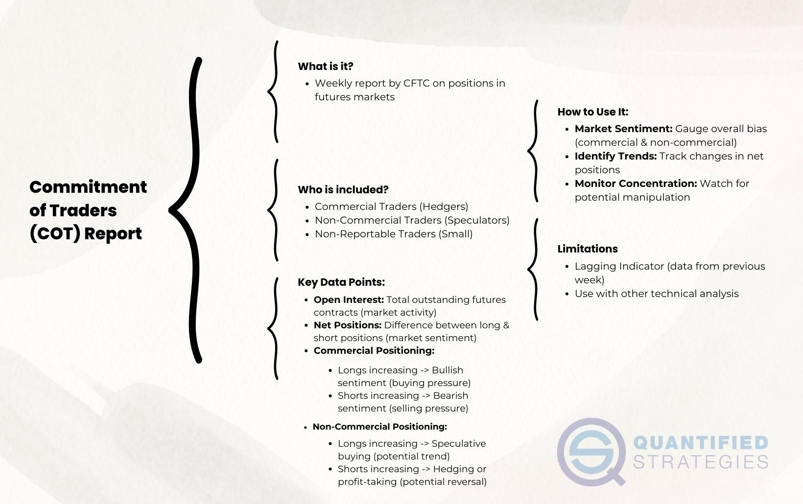

## Table of Contents

## What is the Commitments of Traders (COT) report?

The Commitments of Traders (COT) report is a weekly report issued by the Commodity Futures Trading Commission (CFTC) in the United States. It provides a breakdown of the open interest for futures markets, showing how different types of traders are positioned in various futures contracts. This includes contracts for commodities like gold, oil, and agricultural products, as well as financial instruments like currencies and stock indices.

The report divides traders into three main categories: commercial traders, who use futures to hedge their business activities; non-commercial traders, often referred to as large speculators, who trade to profit from price movements; and nonreportable positions, which are smaller traders not required to report their positions. By analyzing the COT report, investors and analysts can gain insights into market trends and sentiment, helping them make more informed trading decisions.

## Who publishes the Commitments of Traders report?

The Commitments of Traders report is published by the Commodity Futures Trading Commission (CFTC). The CFTC is a government agency in the United States that oversees the futures and options markets.

The report comes out every week. It shows how different types of traders are positioned in futures markets for things like gold, oil, and even financial instruments. This helps people understand what is happening in these markets and make better trading choices.

## How often is the COT report released?

The Commitments of Traders (COT) report is released every week. It comes out on Friday afternoons, usually around 3:30 PM Eastern Time. This schedule helps traders and investors stay updated on the latest market positions.

The report is important because it shows how different types of traders are positioned in futures markets. This includes markets for things like gold, oil, and financial instruments. By looking at the COT report, people can understand market trends and make better trading decisions.

## What types of positions are included in the COT report?

The Commitments of Traders report shows different types of positions in futures markets. It includes positions from commercial traders, who are businesses that use futures to protect themselves from price changes. For example, a farmer might use futures to lock in a price for their crops. These traders are also called hedgers because they are hedging their risks.

The report also shows positions from non-commercial traders, who are often called large speculators. These traders are trying to make money from price movements in the market. They don't have a business that they need to protect, so they are just trading to profit. Lastly, the report includes nonreportable positions, which are smaller traders who don't have to report their positions because they are not big enough.

By looking at these different types of positions, the COT report helps people understand what is happening in the market. It shows if more traders are betting that prices will go up or down. This can give investors and traders clues about where the market might be headed next.

## How can the COT report be used to gauge market sentiment?

The Commitments of Traders report can be a useful tool for understanding how people feel about the market. By looking at the positions of different types of traders, you can see if more people are betting that prices will go up or down. For example, if you see that a lot of large speculators are buying futures, it might mean they think prices will rise soon. On the other hand, if many commercial traders are selling, it could mean they are worried about falling prices and want to protect their business.

This information can help investors make better decisions. If the report shows that many traders are betting on prices going up, it might be a good time to buy. But if a lot of traders are betting on prices going down, it might be wiser to wait or sell. The COT report doesn't tell you exactly what will happen, but it gives you a good idea of what other traders are thinking and doing, which can be very helpful in planning your own trades.

## What are the different categories of traders in the COT report?

The Commitments of Traders report divides traders into three main groups: commercial traders, non-commercial traders, and nonreportable positions. Commercial traders are businesses that use futures to protect themselves from price changes. For example, a farmer might use futures to lock in a price for their crops. These traders are also called hedgers because they are hedging their risks. They are not trying to make money from trading but want to make sure their business is safe from big price swings.

Non-commercial traders, on the other hand, are often called large speculators. These traders are trying to make money from price movements in the market. They don't have a business that they need to protect, so they are just trading to profit. They might buy futures if they think prices will go up or sell if they think prices will go down. The COT report shows how many of these traders are betting on prices going up or down.

The last group is nonreportable positions, which are smaller traders who don't have to report their positions because they are not big enough. These traders might be individuals or small businesses that trade in smaller amounts. The COT report includes these positions to give a complete picture of the market, but they are not broken down into as much detail as the positions of commercial and non-commercial traders.

## How do you interpret long and short positions in the COT report?

In the COT report, long positions mean that traders are betting that prices will go up. They buy futures contracts hoping to sell them later at a higher price. For example, if a lot of non-commercial traders have long positions in oil futures, it might mean they think the price of oil will rise soon. On the other hand, commercial traders might take long positions to lock in a good price for something they need to buy later, like a factory needing oil.

Short positions in the COT report mean that traders are betting that prices will go down. They sell futures contracts hoping to buy them back later at a lower price. If many non-commercial traders have short positions in gold futures, it might mean they think the price of gold will fall. Commercial traders might take short positions to protect themselves from falling prices, like a farmer selling future crops to lock in a price before the harvest.

By looking at the balance between long and short positions, you can get a sense of what the market thinks will happen next. If there are more long positions, it might mean the market is feeling hopeful about rising prices. If there are more short positions, it might mean the market is worried about falling prices. This can help you decide whether to buy or sell, but remember, the COT report is just one tool and doesn't predict the future perfectly.

## Can the COT report predict market trends?

The Commitments of Traders report can help you understand what people think about the market, but it can't predict the future for sure. It shows how different types of traders, like businesses and speculators, are betting on prices going up or down. By looking at these positions, you can see if more people think prices will rise or fall. This can give you a good idea of what might happen next, but it's not a perfect prediction. Markets can change quickly because of things like news, weather, or other unexpected events.

For example, if you see a lot of speculators taking long positions in oil futures, it might mean they think oil prices will go up. But if something unexpected happens, like a big oil discovery or a sudden drop in demand, the market could move the other way. So, while the COT report is a useful tool for understanding market sentiment, it's best used with other information and analysis. It can help you make smarter guesses about market trends, but you should always be ready for surprises.

## What are the limitations of using the COT report for trading decisions?

The COT report can give you a good idea of what people think about the market, but it has some limitations. One big problem is that it comes out once a week, on Friday afternoons. This means the information might be a bit old by the time you see it. Markets can change a lot in just a few days, so you might miss out on new trends or events that happened after the report was made.

Another issue is that the COT report doesn't tell you everything. It shows how different types of traders are betting on prices, but it doesn't say why they are doing it. There might be news or other things affecting the market that the report doesn't cover. Also, the report groups traders into big categories, so you might not get a clear picture of what smaller traders or individual investors are doing. This can make it hard to make the best trading decisions based on the report alone.

Because of these limitations, it's smart to use the COT report with other tools and information. Look at news, other market reports, and your own analysis to get a fuller picture. The COT report can be helpful, but it's just one piece of the puzzle when you're trying to understand and predict market trends.

## How has the COT report evolved over time?

The Commitments of Traders report has changed a lot since it first started. It was first released by the Commodity Futures Trading Commission in 1962. Back then, it was a simple report that showed how many futures contracts were open in different markets. Over time, the report got more detailed. It started to break down traders into different groups like commercial traders and non-commercial traders. This helped people understand who was betting on prices going up or down. The report also started to come out every week instead of less often, so people could get more up-to-date information.

In 2009, the CFTC made the report even better by adding more categories. They split non-commercial traders into "managed money" and "other reportables." Managed money traders are big investment funds that trade a lot, while other reportables are other big traders who aren't in those funds. This made the report more useful because it gave a clearer picture of what different types of big traders were doing. The report also started to include more markets, not just commodities but also financial instruments like currencies and stock indices. These changes made the COT report a more powerful tool for understanding market trends and making trading decisions.

## What are some advanced strategies for analyzing the COT report?

One advanced strategy for analyzing the COT report is to look at the changes in positions over time. Instead of just looking at the numbers in one week's report, you can compare several weeks or months to see how the positions of different types of traders are changing. For example, if you see that non-commercial traders are slowly increasing their long positions in gold over several weeks, it might mean they think gold prices will keep going up. By tracking these changes, you can get a better sense of what the market might do next and make smarter trading decisions.

Another strategy is to focus on the positions of managed money traders. These are big investment funds that trade a lot, and their actions can have a big impact on the market. If you see that managed money traders are heavily short in a certain market, like oil, it might mean they think prices will go down soon. But if they start to cover their short positions and move to long positions, it could be a sign that they think prices will go up. By paying attention to what these big players are doing, you can get a better idea of where the market might be headed.

## How can the COT report be integrated with other market analysis tools?

The COT report can be a great help when used with other market analysis tools. For example, you can look at the COT report along with technical analysis, which uses charts and patterns to predict price movements. If the COT report shows that a lot of traders are betting on prices going up, and your technical analysis also shows signs of an upward trend, it can give you more confidence in your trading decision. You can also use the COT report with [fundamental analysis](/wiki/fundamental-analysis), which looks at things like economic reports and company news. If the COT report suggests that traders are worried about falling prices, and fundamental analysis shows bad news for the market, it might be a good idea to be careful with your trades.

Another way to use the COT report is with sentiment analysis tools. These tools look at what people are saying on social media, news, and other places to see how they feel about the market. If the COT report shows that traders are betting on prices going up, but sentiment analysis shows that people are feeling negative about the market, it might mean there's a mismatch that could affect prices. By combining the COT report with these other tools, you get a fuller picture of what's happening in the market. This can help you make better trading decisions, but remember, no tool can predict the future perfectly, so always be ready for surprises.

## References & Further Reading

[1]: Commodity Futures Trading Commission (n.d.). ["Commitments of Traders (COT) Reports."](https://www.cftc.gov/MarketReports/CommitmentsofTraders/index.htm)

[2]: Fein, S. (2020). ["Using Commitments of Traders (COT) Reports in Trading."](https://www.investopedia.com/terms/c/cot.asp) Investopedia.

[3]: Williams, L. L. (2005). ["Trade Stocks & Commodities with the Insiders: Secrets of the COT Report."](https://www.amazon.com/Trade-Stocks-Commodities-Insiders-Secrets/dp/0471741256) Wiley.

[4]: Irwin, S. H., & Sanders, D. R. (2012). ["Financialization and Structural Change in Commodity Futures Markets."](https://caia.org/sites/default/files/membersonly/Financialization_and_Structural_Change_in_Commodity_Future_Markets.pdf) Journal of Economic Perspectives, 30(2), 3-50.

[5]: Pardo, R. (2008). ["The Evaluation and Optimization of Trading Strategies."](https://onlinelibrary.wiley.com/doi/book/10.1002/9781119196969) Wiley.

[6]: Chan, E. P. (2013). ["Algorithmic Trading: Winning Strategies and Their Rationale."](https://github.com/ftvision/quant_trading_echan_book) Wiley.