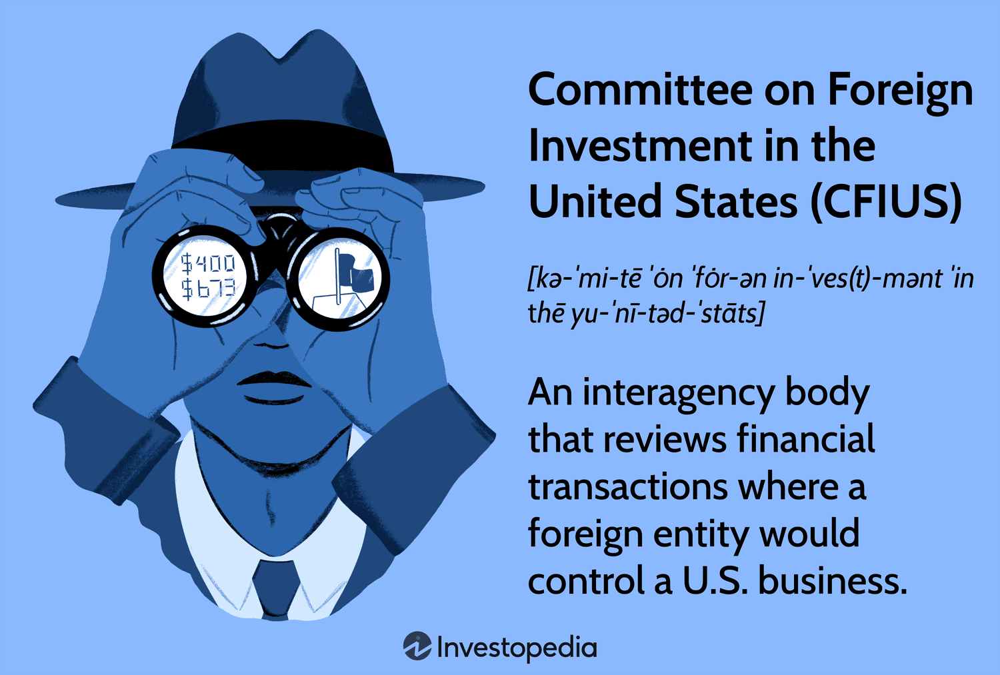

## Table of Contents

## What is the Committee on Foreign Investment in the United States (CFIUS)?

The Committee on Foreign Investment in the United States (CFIUS) is a group within the U.S. government that looks at deals where foreign people or companies want to buy or invest in American businesses. The main job of CFIUS is to make sure these deals do not harm the national security of the United States. They review these investments and can decide to let them happen, ask for changes, or even stop them if they think it's too risky.

CFIUS is made up of people from different parts of the U.S. government, like the Treasury Department, the Department of Defense, and others. They work together to look at the details of each investment. If they find that a deal could be a problem for national security, they can take steps to protect the country. This process helps keep the U.S. safe while still allowing foreign investment that is good for the economy.

## What is the primary purpose of CFIUS?

The main goal of the Committee on Foreign Investment in the United States (CFIUS) is to protect the country's national security. They do this by reviewing deals where foreign people or companies want to invest in or buy American businesses. CFIUS looks closely at these investments to make sure they won't harm the safety of the United States.

CFIUS is made up of members from different parts of the U.S. government, like the Treasury Department and the Department of Defense. They work together to decide if a foreign investment is safe or if it needs changes to protect the country. By doing this, CFIUS helps keep the U.S. secure while still allowing good foreign investments that can help the economy grow.

## Who are the members of CFIUS?

The Committee on Foreign Investment in the United States (CFIUS) is made up of people from different parts of the U.S. government. The main group includes members from the Department of the Treasury, the Department of Justice, the Department of Homeland Security, the Department of Commerce, the Department of Defense, the Department of State, and the Office of the U.S. Trade Representative. The Treasury Department leads the group.

Other parts of the government can also join in if they need to. This includes the Office of Science and Technology Policy, the Council of Economic Advisers, and sometimes even the National Security Council and the Office of Management and Budget. All these groups work together to make sure that foreign investments in the U.S. do not harm the country's safety.

## How does CFIUS review foreign investments?

CFIUS reviews foreign investments by looking at deals where foreign people or companies want to buy or invest in American businesses. They start by checking if the investment could be a problem for the national security of the United States. If a deal seems risky, CFIUS can ask for more details about it. They might talk with the company that wants to invest and the American business they are investing in to understand everything better.

After gathering information, CFIUS decides if the investment is safe or if it needs changes to protect the country. They can suggest ways to make the deal less risky, like having the foreign company agree to certain rules or limits. If CFIUS thinks the deal is too dangerous, they can stop it from happening. This process helps keep the U.S. safe while still letting good foreign investments come in.

## What types of transactions does CFIUS review?

CFIUS reviews transactions where foreign people or companies want to buy or invest in American businesses. These can be big deals where a foreign company wants to take over an American company completely, or smaller investments where they just want to own a part of it. CFIUS also looks at deals where foreign investors want to buy important things like land, buildings, or technology in the U.S.

The main focus for CFIUS is to see if these transactions could harm the safety of the United States. They pay special attention to deals that involve sensitive areas like defense, technology, or important infrastructure. If a deal seems risky, CFIUS will look at it closely to make sure it won't hurt the country's security.

## What are the stages of the CFIUS review process?

The CFIUS review process starts when a foreign person or company wants to invest in an American business. They can either tell CFIUS about their plan or CFIUS might find out about it on their own. Once CFIUS knows about the deal, they start the review. This first part of the review is called the "initial review" and it lasts for 45 days. During this time, CFIUS looks at the deal to see if it could harm the safety of the United States. They might ask for more details from the companies involved to understand everything better.

If CFIUS thinks the deal might be risky after the initial review, they move to the next stage, which is called the "investigation." This stage can last up to another 45 days. During the investigation, CFIUS looks even closer at the deal. They might talk with the companies to see if there are ways to make the deal safer, like asking the foreign company to agree to certain rules or limits. If CFIUS still thinks the deal is too dangerous after the investigation, they can decide to stop it from happening. If they think it's safe or can be made safe, they let the deal go through.

## What powers does CFIUS have to mitigate national security risks?

CFIUS has the power to make deals safer for the United States. If they find a foreign investment that might harm national security, they can ask for changes to the deal. These changes, called mitigation measures, can include things like setting up security rules, making sure the foreign company does not get access to sensitive information, or having someone watch over the deal to make sure it stays safe. CFIUS can also ask the foreign company to agree to follow certain rules even after the deal is done.

If the foreign company does not agree to these changes, CFIUS can stop the deal from happening. They have the power to tell the President about the deal, and the President can decide to block it if it's too risky. This way, CFIUS helps keep the country safe while still letting good foreign investments come in.

## Can CFIUS block or unwind a transaction? If so, under what circumstances?

Yes, CFIUS can block or unwind a transaction if they believe it poses a risk to the national security of the United States. They start by reviewing the deal to see if it might be dangerous. If they find problems, they can ask for changes to make the deal safer. If the foreign company does not agree to these changes, CFIUS can move to block the deal completely. They tell the President about the deal, and the President can decide to stop it from happening if it's too risky.

Sometimes, CFIUS might find out about a deal after it has already happened. If they think this deal is a problem for national security, they can ask the companies to undo the deal. This is called unwinding the transaction. They can also ask for changes to make it safer, even after the deal is done. If the companies do not agree to unwind or change the deal, CFIUS can still tell the President, and the President can decide to force the companies to undo the deal if it's necessary to protect the country.

## How has the role of CFIUS evolved over time?

The role of CFIUS has changed a lot since it started in 1975. At first, CFIUS was just a group that watched foreign investments in the U.S. They did not have much power to stop deals. But over time, people in the U.S. started to worry more about how foreign investments might affect the country's safety. So, in 1988, the government gave CFIUS more power with a new law called the Exon-Florio amendment. This law let CFIUS look at deals more closely and even stop them if they were too risky.

Later on, CFIUS got even more powers. In 2007, after a big deal involving a foreign company and American ports caused a lot of worry, the government made another law called the Foreign Investment and National Security Act (FINSA). This law made CFIUS's job even clearer and gave them more ways to look at deals and make them safer. They could now ask for changes to deals before they happened, and if needed, they could tell the President to stop a deal. Today, CFIUS keeps changing to deal with new kinds of risks, like investments in technology and important parts of the economy.

## What are some notable cases where CFIUS intervened?

One famous case where CFIUS stepped in was the Dubai Ports World deal in 2006. A company from Dubai wanted to buy some American port operations. This deal made a lot of people in the U.S. worried because it involved important places where ships come and go. CFIUS looked at the deal and thought it might be risky for the country's safety. In the end, Dubai Ports World decided to sell the American ports to an American company instead of going through with the deal.

Another big case was when a Chinese company, Fujian Grand Chip Investment, tried to buy an American company called Lattice Semiconductor in 2017. Lattice makes chips that are important for technology. CFIUS worried that if the Chinese company owned Lattice, it might get access to sensitive technology. After CFIUS reviewed the deal and talked with the companies, the President decided to block it. This showed how CFIUS can stop deals that might hurt the country's safety.

## How does CFIUS coordinate with other government agencies and international bodies?

CFIUS works closely with many parts of the U.S. government to make sure they understand all the details of a foreign investment. They talk with agencies like the Department of Defense, the Department of Homeland Security, and the Department of Commerce. Each of these agencies might have different worries about the deal. For example, the Department of Defense might care about military technology, while the Department of Commerce might focus on how the deal affects the economy. By working together, CFIUS can get a full picture of the deal and decide if it's safe or if it needs changes to protect the country.

Sometimes, CFIUS also talks with other countries about foreign investments. They might share information with international groups like the Organization for Economic Cooperation and Development (OECD) to learn about how other countries handle similar deals. This helps CFIUS understand global trends and make better decisions. However, CFIUS mainly focuses on what's best for the U.S., so their main job is working with other U.S. government agencies to keep the country safe.

## What are the current challenges and future directions for CFIUS?

CFIUS faces many challenges today. One big problem is keeping up with new kinds of technology, like [artificial intelligence](/wiki/ai-artificial-intelligence) and cybersecurity. These technologies can be very important for national security, so CFIUS has to learn about them quickly and figure out if foreign investments in these areas are safe. Another challenge is dealing with more and more investments from countries like China, which can be tricky because of political tensions. CFIUS needs to balance letting good investments in while making sure they do not harm the country's safety. Also, they need to work faster and be clearer about their rules so that companies know what to expect.

In the future, CFIUS might change in a few ways. They might get more powers to look at smaller investments that could still be risky, not just the big ones. They might also work more closely with other countries to share information and make better decisions about global investments. As technology keeps changing, CFIUS will need to keep learning and updating their rules to stay ahead of new risks. The goal will always be to protect the United States while still letting foreign investments help the economy grow.

## References & Further Reading

[1]: Jackson, J. K. (2022). ["The Committee on Foreign Investment in the United States (CFIUS)."](https://home.treasury.gov/policy-issues/international/the-committee-on-foreign-investment-in-the-united-states-cfius) Congressional Research Service. 

[2]: "The Foreign Investment Risk Review Modernization Act of 2018," Public Law 115-232, U.S. Congress. Available at: [GovInfo](https://www.congress.gov/bill/115th-congress/house-bill/5841/text)

[3]: Lopez de Prado, M. (2018). ["Advances in Financial Machine Learning."](https://www.amazon.com/Advances-Financial-Machine-Learning-Marcos/dp/1119482089) Wiley.

[4]: Aronson, D. R. (2007). ["Evidence-Based Technical Analysis: Applying the Scientific Method and Statistical Inference to Trading Signals."](https://onlinelibrary.wiley.com/doi/book/10.1002/9781118268315) Wiley.

[5]: Chan, E. P. (2009). ["Quantitative Trading: How to Build Your Own Algorithmic Trading Business."](https://github.com/ftvision/quant_trading_echan_book) Wiley.

[6]: Van de Linde, P. (2010). [“Role of CFIUS in U.S. National Security and Finance,”](https://scholar.google.com/citations?user=20w_gicAAAAJ) American University International Law Review.

[7]: Jansen, S. (2020). ["Machine Learning for Algorithmic Trading."](https://github.com/stefan-jansen/machine-learning-for-trading) Packt Publishing.

[8]: Browder, J. (2019). ["CFIUS's Disintegrated Approach to National Security."](https://www.emerald.com/insight/content/doi/10.1108/joic-09-2020-0025/full/html) Fordham International Law Journal.