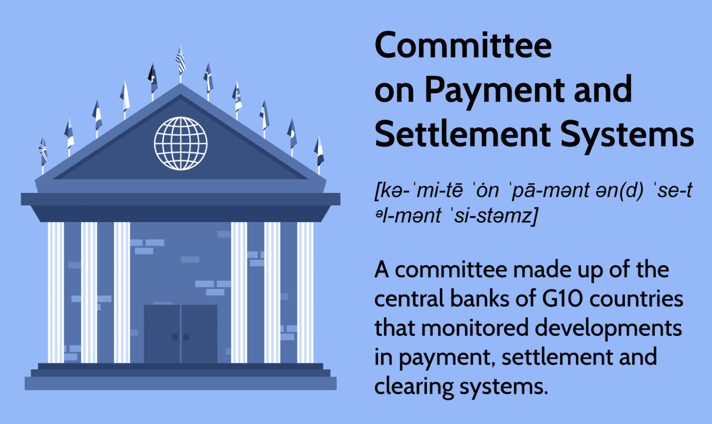

The rapid evolution of finance and technology has necessitated the development of robust systems to manage transactions efficiently and securely. At the heart of this evolution are payment and settlement systems, which serve as the backbone of financial infrastructures globally. These systems enable the seamless transfer of funds, ensuring that payments are processed accurately and in a timely manner.

A crucial player in the evolution of these systems has been the Committee on Payment and Settlement Systems (CPSS), established by the central banks of the Group of Ten (G10) countries under the auspices of the Bank for International Settlements (BIS). The CPSS was instrumental in setting international standards and guidelines to bolster the efficiency and security of payment and settlement systems. By 2014, the financial landscape had become increasingly complex, prompted by developments such as globalization and technological innovation. In response, the CPSS transitioned to the Committee on Payments and Market Infrastructures (CPMI). This shift was designed to better address the intricacies of the financial markets, focusing not just on payment systems but also on broader market infrastructures.

In understanding modern finance, it is essential to explore the role of payment systems and how they interact with other components like algorithmic trading. The advent of algorithmic trading, which employs fast-processing computer algorithms to execute trades, has significantly impacted transaction volumes and speeds in financial markets. This integration demands that payment and settlement systems be robust enough to handle high-frequency transactions, thereby ensuring market stability.

This article examines these critical components, offering insight into their roles and mutual interactions in the financial ecosystem. Understanding the operation and evolution of these systems is crucial to grasping the current dynamics and challenges of contemporary financial centers, reflecting the constant interplay between innovation and regulatory oversight in maintaining financial stability.

## Table of Contents

## Understanding Payment and Settlement Systems

Payment systems serve as integral mechanisms that facilitate the efficient transfer of funds among participants within a financial network. These systems enable the completion of financial transactions by ensuring that monetary values are accurately exchanged between entities. Settlement systems, which are a fundamental component of the broader payment system framework, play a critical role in ensuring the finality of payments, thereby significantly reducing counterparty risk. Counterparty risk arises from the possibility that one party involved in a transaction may default before the final settlement. By guaranteeing that transactions are irrevocably settled, settlement systems enhance the trust and reliability of financial operations.

The Committee on Payment and Settlement Systems (CPSS) was established by the central banks of the Group of Ten (G10) countries with the aim of enhancing and overseeing these crucial systems. The primary objective of the CPSS was to set international standards and provide guidance for the secure and efficient functioning of payment and settlement infrastructures. In 2014, recognizing the evolving needs of global financial markets, the CPSS was reconfigured to form the Committee on Payments and Market Infrastructures (CPMI). This transition reflected an expanded focus on not only payment and settlement systems but also broader market infrastructure considerations essential for maintaining global financial stability and efficiency.

The significance of robust payment and settlement systems is underscored by their role in preserving the integrity of financial markets. These systems are crucial in preventing systemic risks and ensuring that financial markets operate smoothly. Without effective payment and settlement systems, the reliability of transactions could be compromised, potentially leading to disruptions in financial markets. The CPMI continues to work towards enhancing the resilience and functionality of these systems, addressing emerging challenges such as cybersecurity threats and the implications of digital currency adoption.

Overall, understanding the intricacies of payment and settlement systems is essential for ensuring the continuous integrity and stability of financial markets. Improvements and innovations in these systems are necessary to adapt to the dynamic nature of the global financial landscape, ensuring efficient and secure financial operations across borders.

## The Role and Evolution of CPSS and CPMI

The Committee on Payment and Settlement Systems (CPSS) was a key entity in establishing international standards for payment and settlement processes, instrumental in fostering collaborative efforts among central banks worldwide. Globally operational under the auspices of the Bank for International Settlements (BIS), the CPSS provided a crucial platform for addressing financial infrastructure challenges. It sought to enhance the safety and efficiency of payment, clearing, and settlement systems, thereby offering stability to the financial sector.

In 2014, the CPSS was renamed the Committee on Payments and Market Infrastructures (CPMI), reflecting a broadened mandate. The renaming symbolized an evolution towards encompassing a wider range of responsibilities related to financial stability. The CPMI now includes not just payments and settlements but also other types of financial market infrastructures, addressing both risks and technological advancements that have shaped the global financial landscape over recent years.

The CPMI's role in setting global standards is essential to secure the unimpeded operation of payment systems. By formulating policies and standards, such as the Principles for Financial Market Infrastructures (PFMI), the committee provides frameworks designed to mitigate systemic risks. These standards ensure that transactions across borders are processed smoothly and reduce financial turbulence, providing guidelines for risk management, transparency, and legal certainty.

CPMI's initiatives aid in protecting the financial ecosystem from threats that could destabilize markets. The organization's strategic focus is on addressing vulnerabilities in financial market infrastructures, promoting resilience against cyber threats, and ensuring that technological integrations do not compromise system integrity. Through ongoing dialogue and cooperation with various international bodies, the CPMI remains at the forefront of efforts to uphold robust and secure financial conditions worldwide.

In essence, the evolution of CPSS to CPMI epitomizes a shift towards addressing the complexities and risks introduced by modern technological and financial developments, ensuring that global payment and settlement frameworks are resilient, stable, and efficient.

## The Impact of Algorithmic Trading on Payment Systems

Algorithmic trading employs computer algorithms to perform trades with exceptional speed, redefining the landscape of financial markets. This innovation requires payment systems that are not only robust but also capable of handling the unprecedented volumes and velocities characteristic of high-frequency transactions. In this context, the Committee on Payments and Market Infrastructures (CPMI) plays a vital role in ensuring these systems are well adapted to the demands of [algorithmic trading](/wiki/algorithmic-trading).

The integration of algorithmic trading into payment systems presents multiple challenges. One primary concern is managing the complexities associated with the rapid execution of trades. These trades, often occurring in microseconds, necessitate that payment systems promptly process a vast number of transactions. Any delay or failure to settle can lead to significant market disruptions and financial losses.

CPMI addresses these challenges by setting global standards that aid in the creation of resilient payment infrastructures. By promoting best practices and technological innovations, CPMI helps ensure that payment systems are equipped to handle the rigors of high-frequency trading environments. Moreover, effective settlement systems, as endorsed by CPMI, play an essential role in mitigating operational risks. They do so by ensuring that each transaction is completed accurately and swiftly, thus maintaining market integrity.

Algorithmic trading also introduces risks like latency in communication networks and potential algorithmic failures. Payment systems must, therefore, incorporate mechanisms for real-time monitoring and risk management to detect and resolve issues expediently. For example, measures such as throttling—limiting the number of transactions per second from any one source—can help prevent system overloads.

In conclusion, the intersection of algorithmic trading and payment systems is characterized by a need for innovation and resilience. By adhering to standards set by bodies like CPMI, these systems can effectively support the dynamic nature of modern financial markets, ensuring transactions are executed with both speed and reliability.

## Future Perspectives and Challenges

The payment and settlement systems landscape is undergoing significant transformation driven by technological innovation. As the financial ecosystem embraces these advancements, there is a heightened focus on enhancing system resilience and addressing the growing threats of cybersecurity. In an era where data breaches and cyber-attacks are increasingly sophisticated, ensuring the security of payment infrastructures has become paramount. The introduction of blockchain technology and digital currencies, such as central bank digital currencies (CBDCs), represents a potential shift in the way transactions are conducted. This shift necessitates systems that can adapt to these new forms of currency while maintaining operational integrity and security.

The role of global cooperation cannot be overstated, as the challenges posed by these evolving technologies are best addressed through coordinated efforts. The CPMI and other international bodies play a crucial role in fostering collaboration among nations to establish and uphold standards that support secure and efficient financial systems. Through initiatives that promote dialogue and knowledge exchange, these organizations help ensure that payment and settlement systems can withstand the pressures of a rapidly changing financial environment.

Another area of focus is the integration of innovative technologies which must balance efficiency gains against the imperative of financial stability. Technologies such as [artificial intelligence](/wiki/ai-artificial-intelligence) (AI) and [machine learning](/wiki/machine-learning) have the potential to revolutionize transaction processing through improved speed and accuracy. However, these benefits must be carefully weighed against the risks of increased complexity and potential for systemic vulnerabilities. The adoption of these technologies requires robust regulatory frameworks that safeguard against disruptions while promoting innovation.

Understanding the interplay between payment systems, settlements, and algorithmic trading is fundamental to navigating the future financial landscape. Algorithmic trading, with its high-speed execution capabilities, places unique demands on payment systems. Ensuring that these systems can handle high-frequency transactions with minimal latency is crucial for maintaining market stability. Effective coordination between payment infrastructures and trading platforms is necessary to mitigate risks associated with rapid transaction environments.

In summary, the continuous evolution of payment and settlement systems presents both opportunities and challenges. By strengthening system resilience, fostering global cooperation, integrating innovative technologies with caution, and comprehending the complexities of algorithmic trading, the financial sector can aspire to achieve a secure and stable future.

## Conclusion

The stability of global financial markets relies heavily on the orderly operation of payment and settlement systems. The Committee on Payments and Market Infrastructures (CPMI) plays a pivotal role by setting international standards that underpin secure and efficient financial transactions. These standards are designed to ensure the reliability and resilience of the systems that support intricate and time-critical financial operations.

Algorithmic trading, characterized by the use of sophisticated computer algorithms to execute trades at high speeds, presents both significant opportunities and substantial challenges within these payment and settlement systems. Its adoption has contributed to increased market [liquidity](/wiki/liquidity-risk-premium) and more efficient price discovery. However, it also introduces complexities such as heightened [volatility](/wiki/volatility-trading-strategies), systemic risk, and the potential for cascading failures. These challenges necessitate robust frameworks and adaptive mechanisms to maintain financial stability.

As the financial landscape continues to transform with technological advancements, ongoing adaptation of payment and settlement systems is imperative. This encompasses addressing emerging risks, enhancing system resilience, and fortifying cybersecurity defenses. The integration of innovative technologies, such as blockchain and digital currencies, mandates a careful balance between seizing efficiency gains and ensuring financial stability.

Furthermore, the evolving nature of finance calls for constant vigilance and collaborative efforts among global financial institutions and oversight bodies. Such cooperation is essential for maintaining harmony within payment and settlement infrastructures, ensuring these systems remain robust amid continuing market and technological changes. This concerted approach helps safeguard against disruptions and fosters confidence in the financial markets worldwide.

## References & Further Reading

[1]: Bank for International Settlements. (2012). ["Principles for financial market infrastructures."](https://www.bis.org/cpmi/publ/d101a.pdf) CPMI Publications.

[2]: Bank for International Settlements. (2023). ["Improving the operational resilience of wholesale payments systems."](https://www.bis.org/publ/othp70.pdf) CPMI Publications.

[3]: Gomber, P., Arndt, B., Lutat, M., & Uhle, T. (2011). ["High-frequency trading."](https://papers.ssrn.com/sol3/papers.cfm?abstract_id=1858626) Business & Information Systems Engineering, 3(2).

[4]: Lopez de Prado, M. (2018). ["Advances in Financial Machine Learning."](https://www.amazon.com/Advances-Financial-Machine-Learning-Marcos/dp/1119482089) John Wiley & Sons.

[5]: Swary, I., & Topf, B. (1992). ["Global Financial Deregulation: Commercial Banking at the Crossroads."](https://www.nypl.org/research/research-catalog/bib/b11558190) Blackwell Publishers.