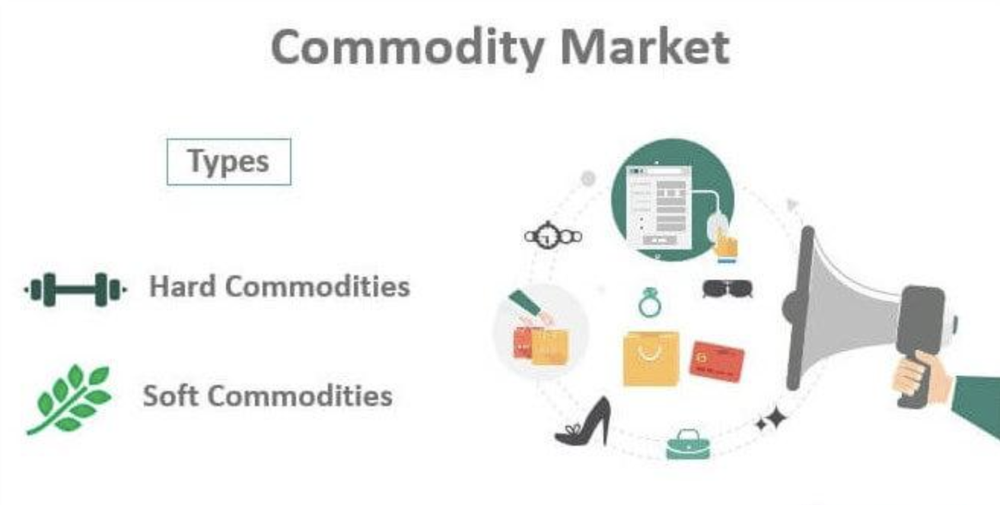

## Table of Contents

## What is a commodities exchange?

A commodities exchange is a place where people buy and sell things like oil, gold, and wheat. These things are called commodities. The exchange helps set prices for these items and makes it easier for people to trade them. It's like a big market where buyers and sellers from all over the world can come together.

The exchange works by using contracts. These contracts say how much of a commodity will be bought or sold and when it will happen. This helps everyone know what to expect and makes trading smoother. It's important because it helps farmers, miners, and other producers know how much money they will get for their goods, and it helps businesses know how much they will have to pay for the things they need.

## What are the main functions of a commodities exchange?

A commodities exchange has several important jobs. One big job is to help set prices for things like oil, gold, and wheat. It does this by bringing together people who want to buy these things with people who want to sell them. This way, everyone can see what others are willing to pay or accept, and that helps decide the price. It's like a big marketplace where everyone can see what's happening.

Another job of a commodities exchange is to make trading easier and safer. It does this by using contracts. These contracts say exactly what will be bought or sold, how much, and when it will happen. This makes everything clear and helps prevent problems. It's important because it helps farmers, miners, and other people who produce these things know how much money they will get, and it helps businesses know how much they will have to pay for what they need.

Lastly, a commodities exchange helps manage risk. People can use the exchange to protect themselves from big changes in prices. For example, a farmer might use the exchange to make sure they get a certain price for their wheat, even if the price goes down later. This way, they know they will have enough money to keep their farm running. It's like having a safety net for people who work with commodities.

## How does trading occur on a commodities exchange?

Trading on a commodities exchange happens through the use of contracts. These contracts are agreements between buyers and sellers about what commodity will be traded, how much of it, and when the trade will happen. For example, a farmer might agree to sell a certain amount of wheat in three months. The exchange makes sure that both the buyer and the seller follow the rules of the contract. This makes trading fair and helps everyone know what to expect.

The exchange also has a place where people can see the prices of different commodities. This is called the trading floor, and it can be a physical place or an online platform. On the trading floor, buyers and sellers come together to make deals. They can shout out their offers or use computers to place their bids. The exchange keeps track of all these deals and updates the prices so everyone can see them. This helps set the price for the commodity and makes sure that trading is open and fair for everyone involved.

## What are the different types of commodities traded on exchanges?

Commodities exchanges trade many different things, which can be grouped into a few big categories. The first category is agricultural products. These are things that farmers grow, like wheat, corn, soybeans, and cotton. They also include things that come from animals, like meat and dairy products. Another important category is energy products. These include things like oil, natural gas, and gasoline. People use these to power their cars, heat their homes, and run factories.

The second category is metals. This group includes things like gold, silver, copper, and platinum. These are used in jewelry, electronics, and construction. Some metals, like gold and silver, are also seen as a way to store value, kind of like money. The last category is called "soft commodities." These are things like coffee, sugar, cocoa, and orange juice. They are called "soft" because they are grown rather than mined or drilled, and they can spoil more easily than other commodities. All these different types of commodities are traded on exchanges, helping people buy and sell them all over the world.

## What is the difference between a spot market and a futures market in commodities trading?

In commodities trading, the spot market is where people buy and sell commodities right away. When you trade on the spot market, you get the commodity and pay for it at the same time. It's like going to the store and buying something off the shelf. The price you pay is the current market price, which can change from day to day or even hour to hour. This market is good for people who need the commodity right away, like a bakery that needs wheat to make bread today.

The futures market is different because it's about buying and selling commodities for a future date. When you trade on the futures market, you make a deal to buy or sell a commodity at a certain price, but you don't get it until later. This helps people plan for the future. For example, a farmer might sell wheat on the futures market to make sure they get a good price, even if the price goes down later. This market is good for people who want to manage the risk of price changes, like farmers and big companies that need to plan their budgets.

## How do futures contracts work in commodities exchanges?

Futures contracts in commodities exchanges are agreements to buy or sell a specific amount of a commodity at a set price on a future date. For example, a farmer might agree to sell 100 bushels of wheat for $5 each in three months. This helps the farmer know how much money they will get, even if the price of wheat changes. On the other side, a bakery might buy this futures contract to make sure they can get the wheat they need at a price they can afford, even if the price goes up later.

The exchange makes sure that both the buyer and the seller follow the rules of the contract. This means that the farmer has to deliver the wheat, and the bakery has to pay for it, at the agreed time and price. If the price of wheat goes up, the bakery is happy because they got a good deal. If the price goes down, the farmer is happy because they sold their wheat for more than it's worth now. Futures contracts help people plan and manage the risk of price changes, making it easier for them to run their businesses.

## What are the roles of clearing houses in commodities exchanges?

Clearing houses play a very important role in commodities exchanges. They act like a middleman between buyers and sellers. When someone wants to buy or sell a commodity, the clearing house makes sure that the deal is fair and safe. They do this by checking that both the buyer and the seller have enough money or resources to make the trade happen. This way, if something goes wrong, the clearing house can step in and make sure that everyone still gets what they were promised.

Another big job of clearing houses is to manage risk. They keep track of all the trades happening on the exchange and make sure that no one is taking on too much risk. If someone can't pay for what they bought, the clearing house has a special fund to cover the loss. This makes trading on the exchange safer for everyone. By doing these things, clearing houses help keep the commodities exchange running smoothly and make sure that people can trust the system.

## What are the major global commodities exchanges and their specialties?

The Chicago Mercantile Exchange (CME) is one of the biggest and most well-known commodities exchanges in the world. It's famous for trading a lot of different things, like agricultural products such as wheat, corn, and soybeans, and also livestock like cattle and pigs. The CME is also a big place for trading energy products like oil and natural gas, and metals like gold and silver. People from all over the world use the CME to buy and sell these commodities.

The Intercontinental Exchange (ICE) is another major global commodities exchange. It's known for being a big place for trading energy products, especially oil and natural gas. ICE also trades a lot of soft commodities like coffee, sugar, and cocoa. These are things that come from plants and can spoil easily. The London Metal Exchange (LME) is the world's leading market for trading industrial metals like copper, aluminum, and zinc. It helps people all over the world buy and sell these metals, which are important for making things like cars and buildings.

The Multi Commodity Exchange of India (MCX) is a big exchange in Asia. It's known for trading a lot of different commodities, but it's especially famous for gold and silver. MCX also trades a lot of energy products like [crude oil](/wiki/crude-oil) and natural gas, and agricultural products like cotton and spices. These exchanges help people from different parts of the world trade commodities safely and easily.

## How do regulations impact the operations of commodities exchanges?

Regulations have a big impact on how commodities exchanges work. Governments make rules to make sure that trading is fair and safe for everyone. These rules say things like who can trade, what they can trade, and how they have to report their trades. For example, regulations might require exchanges to check that people have enough money before they can start trading. This helps stop people from making trades they can't pay for. Regulations also make sure that the prices on the exchange are fair and not being controlled by just a few people.

These rules can also affect how new products are added to the exchange. Before a new commodity can be traded, it has to be approved by the regulators. This can take time and might slow down the exchange from adding new things to trade. But, these rules are important because they help keep the exchange honest and protect people who trade there. Without regulations, the exchange could be risky and people might not want to use it. So, while regulations can make things more complicated, they help make the commodities exchange a safe and trusted place for trading.

## What are the risks associated with trading commodities on an exchange?

Trading commodities on an exchange can be risky because prices can go up and down a lot. Things like weather, politics, and how much people want a commodity can change its price. For example, if there's a drought, the price of wheat might go up because there's less of it. This means that if you buy a commodity and the price goes down, you could lose money. On the other hand, if you sell a commodity and the price goes up, you might not make as much money as you could have.

Another risk is that trading on an exchange involves using contracts, and sometimes things can go wrong with these contracts. For example, if someone can't pay for what they bought, it can cause problems for everyone involved. Clearing houses help with this, but there's still a chance that something could go wrong. Also, trading commodities can be complicated, and if you don't understand it well, you might make mistakes that cost you money. It's important to know what you're doing and to be careful when trading commodities on an exchange.

## How can technology and innovation influence the future of commodities exchanges?

Technology and innovation can change the future of commodities exchanges a lot. One big way is by making trading faster and easier. With new computer systems and online platforms, people from all over the world can trade commodities at any time, without needing to be in a specific place. This can make the market more active and help set prices more accurately. Also, new technology like blockchain can make trading safer and more transparent. It can keep track of every trade and make sure that everyone follows the rules, which helps build trust in the exchange.

Another way technology can influence commodities exchanges is by helping with new kinds of products and better ways to manage risk. For example, new data tools can help people predict what will happen to commodity prices in the future. This can be really useful for farmers and businesses that need to plan ahead. Also, new financial products like options and swaps can give people more ways to protect themselves from price changes. As technology keeps getting better, it will probably bring even more new ideas to commodities exchanges, making them more useful and efficient for everyone who uses them.

## What advanced trading strategies are used by expert traders on commodities exchanges?

Expert traders on commodities exchanges often use a strategy called hedging to protect themselves from big price changes. Hedging means making a trade that will balance out a risk. For example, a farmer might sell wheat on the futures market to make sure they get a good price, even if the price goes down later. This way, they know how much money they will get, and they don't have to worry as much about the price changing. Another strategy is called spread trading, where traders buy and sell related commodities at the same time. For example, they might buy wheat and sell corn, hoping that the price difference between the two will change in a way that makes them money.

Another advanced strategy is called technical analysis. This is when traders use charts and other tools to try to predict what will happen to commodity prices. They look at things like past prices and trading volumes to find patterns that might tell them what to do. For example, if they see that a price usually goes up after a certain pattern, they might buy the commodity when they see that pattern again. These strategies help expert traders make smarter decisions and manage their risks better, but they also take a lot of knowledge and experience to use well.

## References & Further Reading

[1]: Bergstra, J., Bardenet, R., Bengio, Y., & Kégl, B. (2011). ["Algorithms for Hyper-Parameter Optimization."](https://papers.nips.cc/paper/4443-algorithms-for-hyper-parameter-optimization) Advances in Neural Information Processing Systems 24.

[2]: ["Advances in Financial Machine Learning"](https://www.amazon.com/Advances-Financial-Machine-Learning-Marcos/dp/1119482089) by Marcos Lopez de Prado

[3]: ["Evidence-Based Technical Analysis: Applying the Scientific Method and Statistical Inference to Trading Signals"](https://www.amazon.com/Evidence-Based-Technical-Analysis-Scientific-Statistical/dp/0470008741) by David Aronson

[4]: ["Machine Learning for Algorithmic Trading"](https://github.com/stefan-jansen/machine-learning-for-trading) by Stefan Jansen

[5]: ["Quantitative Trading: How to Build Your Own Algorithmic Trading Business"](https://www.amazon.com/Quantitative-Trading-Build-Algorithmic-Business/dp/1119800064) by Ernest P. Chan