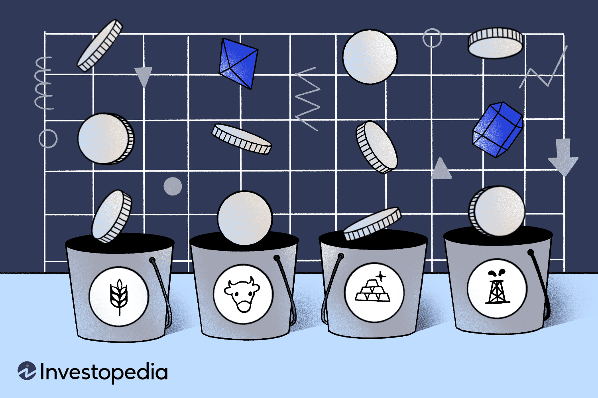

In an ever-evolving financial market, investors continuously seek strategies that offer both risk management and return optimization. Integrating a commodities portfolio hedge with a robust investment strategy and leveraging algorithmic trading forms an intricate framework for navigating these dynamic markets. Commodities, which include both hard resources such as gold and oil, as well as soft goods like wheat, have unique properties that make them essential components in diversified investment portfolios.

These assets offer a potential hedge against inflation, as their prices typically rise with increasing demand for goods and services. This makes them particularly appealing during periods of economic uncertainty, when traditional equity investments might falter. Commodities tend to exhibit a low to negative correlation with conventional assets like stocks and bonds, thus providing significant diversification benefits to investors.



Algorithmic trading, historically the territory of equity markets, is increasingly being applied to commodities trading. This method enhances both execution efficiency and strategic precision by utilizing complex algorithms to automate trades. It leverages historical data, market trends, and advanced machine learning models to forecast price movements and make informed trading decisions. In commodities markets, real-time analysis and trade execution through algorithmic trading overcome the limitations of manual trading processes. This transition is driven by the demand for speed, accuracy, and a competitive edge in fast-paced markets.

By the end of this piece, you will gain a comprehensive understanding of how commodities, when combined with a well-formulated investment strategy and cutting-edge algorithmic trading, contribute to effective financial management in modern markets. The integration of these elements can offer substantial benefits in terms of risk mitigation and return enhancement, particularly in volatile economic environments.

## Table of Contents

## Understanding Commodities as an Asset Class

Commodities represent a vital asset class in the financial market, encompassing raw materials or agricultural products that are fungible, meaning they can be bought and sold interchangeably with similar items. These assets are broadly categorized into two main types: hard commodities and soft commodities. Hard commodities include natural resources that require extraction, like metals (e.g., gold, silver) and energy products (e.g., oil, natural gas). Soft commodities, on the other hand, consist of agricultural goods or livestock such as wheat, corn, coffee, and cattle.

Investors often incorporate commodities into their portfolios for diversification purposes and as a hedge against inflation. Historically, commodity prices have demonstrated resilience against inflationary pressures, often rising in conjunction with increasing demand for goods and services. This characteristic makes them appealing as their price movements are expected to act inversely or with low correlation to traditional asset classes such as stocks and bonds. Empirical studies have shown that the inclusion of commodities in an investment portfolio can enhance its risk-adjusted returns due to their typically low to negative correlation with traditional financial instruments.

A critical aspect of integrating commodities into a portfolio is understanding the supply-demand dynamics and their inherent [volatility](/wiki/volatility-trading-strategies). Commodity markets are heavily influenced by factors such as geopolitical events, seasonality, weather patterns, and technological changes, which can significantly affect supply and demand. For instance, adverse weather can reduce agricultural yields, while technological advances can increase resource extraction efficiency. These factors contribute to the intrinsic volatility of commodities, requiring investors to stay informed and adept at analyzing trends.

Another consideration is the mode of investment in commodities. Investors can gain exposure through direct investment in physical commodities, commodity futures contracts, exchange-traded funds (ETFs), and mutual funds focusing on commodity-based assets. Futures contracts are particularly prominent, enabling market participants to speculate on the future prices of commodities or hedge against price fluctuations.

In conclusion, commodities as an asset class offer unique benefits such as diversification and inflation protection, accompanied by challenges like price volatility. A strategic approach that factors in the multifaceted supply-demand dynamics can effectively incorporate commodities into a well-rounded investment portfolio.

## The Role of Commodities in Portfolio Hedging

Commodities play a crucial role in hedging investment portfolios, primarily due to their ability to safeguard against unexpected inflation. Inflation can erode the value of traditional equity investments; however, commodities tend to appreciate in such environments. This appreciation occurs because commodities are often priced in relation to the cost of goods and services, and their prices typically rise when there is an increase in inflationary pressures.

Hard commodities, such as precious metals like gold and silver, are frequently utilized as inflation hedges. Their intrinsic value and limited supply make them particularly effective in providing a store of value during periods of economic uncertainty. For example, when fiat currencies depreciate, the value of precious metals usually increases, thus preserving the investor's purchasing power.

When considering commodity allocations, investors should assess their risk tolerance. Commodities can introduce significant volatility to a portfolio, and their prices can be influenced by a myriad of factors, including geopolitical events and changes in supply-demand dynamics. Consequently, a typical portfolio allocation to commodities ranges from 5% to 10%, aligning with the investor's overall risk profile and investment objectives.

Including commodities in a portfolio can reduce overall volatility due to their unique return profiles and low to negative correlation with traditional financial assets like stocks and bonds. This diversification benefit enhances the portfolio's resilience against market fluctuations, offering protection against downside risks. For instance, during an economic downturn, while stocks may suffer, commodities might perform well due to increased demand or decreased supply, thereby mitigating portfolio losses.

The strategic use of commodities necessitates a keen understanding of market indicators and geopolitical influences. Commodity prices are often responsive to geopolitical tensions, natural disasters, and policy changes that can affect supply chains and production levels. Consequently, investors and portfolio managers should remain vigilant of these factors to make informed decisions about when and how to adjust commodity allocations within their portfolios.

In summary, commodities serve as a vital component in portfolio hedging strategies by providing a buffer against unexpected inflation and volatility, while offering diversification benefits. Their effective integration requires a careful assessment of risk tolerance, market conditions, and potential external influences on pricing.

 to Algorithmic Trading

Algorithmic trading represents a significant advancement in the financial markets, utilizing sophisticated algorithms to execute trades under optimal conditions. This approach enhances market efficiency by improving price accuracy and order execution speed. At its core, [algorithmic trading](/wiki/algorithmic-trading) involves the deployment of computer programs that follow a defined set of instructions to place trades. These instructions are typically based on historical data analytics, market trends, and [machine learning](/wiki/machine-learning) models designed to predict price movements and automate trading decisions.

In the context of commodities, algorithmic trading presents a transformative shift from traditional manual trading processes to a more efficient and real-time framework. Traditionally, commodities trading has been labor-intensive, relying heavily on manual input and decision-making. With algorithmic trading, this process can be automated, allowing for real-time analysis and execution of trades. The transition towards algorithmic trading in commodities is primarily driven by the search for agility, precision, and competitive advantage in the trading environment.

One of the fundamental components of algorithmic trading is the use of historical price data and market indicators to predict future market movements. By leveraging historical data, traders can develop models that identify patterns and trends, which are then used to make informed trading decisions. Machine learning models further enhance this capability by providing tools to analyze vast datasets and improve predictive accuracy over time. These models can adjust to new data, enabling traders to adapt to changing market conditions quickly.

A critical aspect of algorithmic trading is the development of robust algorithms capable of operating in various market conditions. Traders must ensure that their algorithms are not only effective in [backtesting](/wiki/backtesting) scenarios but also adaptable to real-time market fluctuations. To achieve seamless integration with existing trading systems, algorithmic strategies must be designed with flexibility and scalability in mind. This adaptability ensures that as market conditions evolve, the algorithms can continue to perform optimally.

In summary, algorithmic trading revolutionizes commodities trading by bringing speed, accuracy, and efficiency to the forefront. By employing advanced data analytics and machine learning models, traders can enhance their decision-making processes and achieve a significant strategic edge in the market. With continued advancements in technology, the prevalence of algorithmic trading in commodities is set to grow, further emphasizing the importance of developing robust and adaptable trading algorithms.

## Developing a Commodities Portfolio Using Algorithmic Trading

Integrating algorithmic trading into the development of a commodities portfolio involves automating the processes of trade selection and execution through the establishment of pre-set conditions. This approach leverages advanced quantitative models that consider various factors such as market volatility, historical price behavior, and key economic indicators, enhancing the precision and speed of trading operations.

One of the primary tools utilized in this strategy is commodity futures contracts, which enable traders to speculate on the future price movements of commodities without owning the physical goods. These contracts are vital for hedging risk and providing [liquidity](/wiki/liquidity-risk-premium) to the market. Additionally, exchange-traded funds (ETFs) that specialize in commodities offer a diversified investment vehicle that allows traders to gain exposure to a particular commodity sector or a broad range of commodities. These financial instruments provide an easy entry point for algorithmic systems to engage in commodities markets.

Moreover, investments in commodities-related stocks can complement the diversified approach. These are shares of companies involved in the extraction, production, or distribution of commodities, offering indirect exposure to commodity prices. By incorporating these stocks into an algorithmic trading system, traders can create a more resilient and diversified commodities portfolio.

For successful implementation, algorithmic trading systems must be continuously optimized to reflect real-time market data and changing economic conditions. This involves recalibrating the systems frequently to adapt to new information and ensure they align with market trends. Traders employ machine learning techniques and statistical analysis to refine these algorithms, making them more effective at predicting market movements.

A well-constructed algorithmic trading system enhances decision-making by minimizing human errors and providing a systematic approach to identifying and capitalizing on market opportunities. This system not only processes vast amounts of market data efficiently but also makes rapid decisions that human traders may find challenging to execute promptly.

In Python, traders often use libraries such as pandas for data manipulation, numpy for numerical operations, and scikit-learn for developing machine learning models to facilitate the construction of these algorithms. Below is a simple Python snippet that demonstrates how historical price data might be manipulated to feed into a trading algorithm:

```python
import pandas as pd
import numpy as np
import matplotlib.pyplot as plt

# Load commodity price data
data = pd.read_csv('commodity_prices.csv')

# Calculate historical volatility
data['returns'] = data['price'].pct_change()
volatility = np.std(data['returns'])

# Plot price and volatility
plt.figure(figsize=(10, 5))
plt.subplot(2, 1, 1)
plt.plot(data['date'], data['price'], label='Price')
plt.title('Commodity Price over Time')
plt.legend()

plt.subplot(2, 1, 2)
plt.plot(data['date'], data['returns'].rolling(window=20).std(), label='Volatility', color='red')
plt.title('Historical Volatility')
plt.legend()

plt.tight_layout()
plt.show()
```

This code snippet is a basic example, illustrating how historical price data can be loaded, analyzed for volatility, and visualized. Such analyses form the foundation upon which more complex models and algorithms are built, enabling traders to develop robust systems for commodities trading.

## Benefits and Risks of Algorithmic Commodities Trading

Algorithmic trading in commodities has revolutionized the way trades are executed by providing unparalleled speed, precision, and consistency. This technological advancement significantly reduces transaction costs by minimizing the human intervention required in traditional trading. The automation allows for the rapid processing and analysis of large datasets, enhancing the technical analysis of market trends and improving the accuracy of price predictions.

Algorithms are particularly adept at handling massive volumes of data to identify patterns and execute trades without the delay associated with manual processes. Given the inherent volatility of commodities markets, such capabilities are essential for maintaining a competitive edge.

However, this approach is not without risks. One significant concern involves technological failures, which can disrupt the continuous operation of trading systems. Moreover, the models used in algorithmic trading may exhibit inadequacies or be prone to overfitting market data. Overfitting occurs when a model becomes too tailored to historical data, reducing its predictive power in unseen scenarios. To mitigate these risks, robust risk assessment tools are critical. These tools might include stress testing, scenario analysis, and implementing fallback mechanisms to ensure continuity during system downtimes.

The development and maintenance of algorithmic trading systems require specialized expertise. Professionals need a comprehensive understanding of both finance and programming to build reliable and efficient trading strategies. As markets evolve, continuous monitoring and adjustment of algorithmic models are necessary to sustain their effectiveness. This adaptability ensures that the strategies remain aligned with the latest market developments and data trends.

Ensuring the robustness of these systems also involves incorporating feedback loops to learn from trade outcomes, which might be implemented in Python as follows:

```python
def adjust_model(parameters, trade_outcomes, learning_rate=0.01):
    for i, param in enumerate(parameters):
        gradient = compute_gradient(param, trade_outcomes)
        parameters[i] -= learning_rate * gradient
    return parameters

def compute_gradient(param, trade_outcomes):
    # This function computes the gradient of the parameter considering the outcomes
    gradient = 0.0
    for outcome in trade_outcomes:
        # Assuming a simple linear model for illustration
        error = (outcome - param) ** 2
        gradient += 2 * error
    return gradient
```

In summary, algorithmic trading in commodities offers a multitude of benefits, including enhanced trade execution efficiency and improved analytical capabilities. Nonetheless, traders must remain vigilant about the associated risks, necessitating a careful balance between automation and strategic oversight.

## Conclusion

The landscape of commodities trading is undergoing significant transformation with the incorporation of algorithmic strategies. This evolution provides investors with enhanced opportunities to optimize portfolio hedging. A meticulously crafted strategy that amalgamates the inherent stability of commodities with the precision afforded by algorithmic trading can offer notable advantages, particularly in markets characterized by volatility. 

As technology continues to advance at a rapid pace, the demarcation between human decision-making and automated processes is increasingly becoming indistinct. This shift underscores the growing need for skilled professionals equipped to manage these integrated systems effectively. The future of commodities trading is poised to witness a more profound synergy between AI-driven insights and traditional investment strategies, amalgamating the best of both worlds to enhance trading outcomes.

Investors are strongly encouraged to remain abreast of technological advancements and emerging trends, which are crucial to leveraging algorithmic trading effectively. By doing so, they can ensure that their trading strategies are not only robust but also adaptive to the ever-changing market conditions. This adaptability is essential in capitalizing on the opportunities presented by the evolving landscape of commodities trading.

## References & Further Reading

[1]: Bergstra, J., Bardenet, R., Bengio, Y., & Kégl, B. (2011). ["Algorithms for Hyper-Parameter Optimization."](https://dl.acm.org/doi/10.5555/2986459.2986743) Advances in Neural Information Processing Systems 24.

[2]: ["Advances in Financial Machine Learning"](https://www.amazon.com/Advances-Financial-Machine-Learning-Marcos/dp/1119482089) by Marcos Lopez de Prado

[3]: ["Evidence-Based Technical Analysis: Applying the Scientific Method and Statistical Inference to Trading Signals"](https://books.google.com/books/about/Evidence_Based_Technical_Analysis.html?id=MeoJAQAAMAAJ) by David Aronson

[4]: ["Machine Learning for Algorithmic Trading"](https://github.com/stefan-jansen/machine-learning-for-trading) by Stefan Jansen

[5]: ["Quantitative Trading: How to Build Your Own Algorithmic Trading Business"](https://github.com/LucindaYa/quant-resources/blob/master/Quantitative%20Trading%20How%20to%20Build%20Your%20Own%20Algorithmic%20Trading%20Business.pdf) by Ernest P. Chan