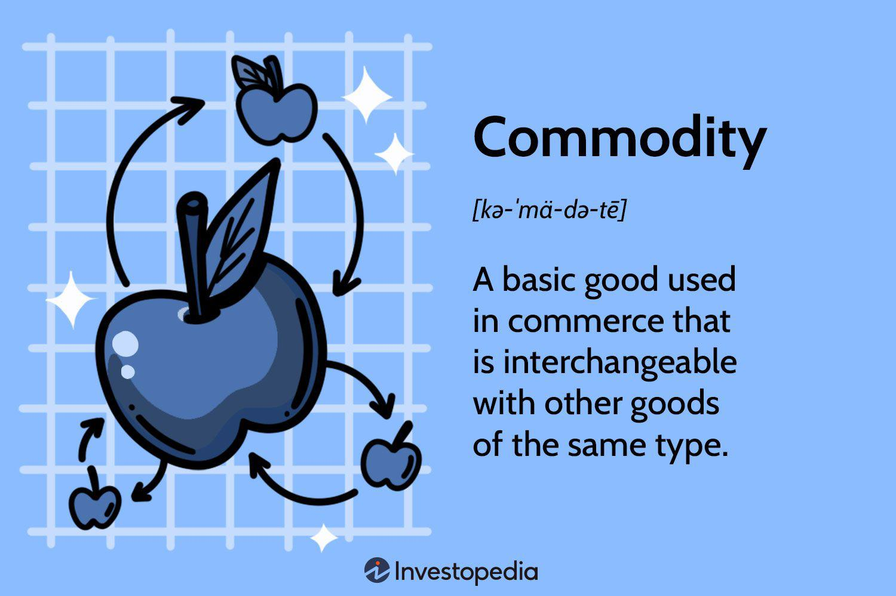

The landscape of modern investing is continually evolving, with commodities investing, the stock market, and algorithmic trading forming a complex but rewarding intersection for investors. Understanding how these elements interplay is crucial for seizing new opportunities and mitigating risks inherent in global financial markets.

Commodities investing involves the buying and trading of raw materials such as oil, gold, and agricultural products. Such investments are a traditional hedge against inflation, providing diversification away from stocks and bonds. Unlike equities, which are tethered to corporate performance, commodities operate under unique market dynamics influenced by factors like geopolitical events and supply chain disruptions.

On the other hand, the stock market serves as a pivotal infrastructure where publicly traded company shares are issued, bought, and sold. It functions as a barometer of economic health in capitalist economies worldwide. The stock market can significantly affect investment strategies in commodity markets, where understanding the interplay between stock and commodities is advantageous for strategic decision-making.

Algorithmic trading introduces a technological paradigm to these traditional investment strategies. By using computer algorithms to execute trades based on predefined criteria, this advanced method enhances efficiency and accuracy, minimizing human error and allowing traders to navigate complex markets with ease. The role of technology here cannot be overstated; it has reshaped investment strategies across both commodities and stock markets, requiring investors to embrace a deeper understanding of algorithmic tools.

As technology continues to influence finance, a closer examination of algorithmic trading is imperative. Through algorithms, traders gain the ability to manage the complexities of the commodities market more effectively. These tools enable real-time analysis and execution of trades, providing an edge in rapidly moving markets. The intricacies of commodities trading, combined with the vast data available from stock markets, make algorithmic trading an indispensable technique for modern investors.

In addition to offering enhanced trading capabilities, algorithmic trading in commodities also presents risks and ethical considerations that need addressing. As we progress through this exploration of commodities investing, the stock market, and algorithmic trading, we will define key concepts, examine opportunities and challenges, and present insights into how traders leverage these tools to enhance their strategies. Understanding this multi-faceted dynamic is essential for investors looking to navigate the complexities and capitalize on technological advancements in global markets.

## Table of Contents

## What is Commodities Investing?

Commodities investing encompasses the buying and trading of basic goods and raw materials such as oil, gold, and various agricultural products. This form of investing serves as a strategic tool for traders and investors aiming to manage risks and seize opportunities tied to global economic dynamics.

One of the primary motivations for investing in commodities is hedging against inflation. Unlike conventional equities, the prices of commodities generally move in an opposite direction compared to inflation. Thus, commodities can act as a safeguard, preserving purchasing power when inflation erodes the value of currency. Additionally, diversification benefits arise as commodities do not typically correlate strongly with stock market movements. Their price is determined by supply and demand factors specific to their market, independent of corporate performance. This characteristic offers a buffer against stock market [volatility](/wiki/volatility-trading-strategies).

Commodities investing can be executed through various vehicles. Futures contracts are perhaps the most direct method, allowing investors to agree on a purchase or sale of a specific quantity of a commodity at a predetermined price and date. These contracts require an understanding of market timing and significant capital. Another popular method is through commodity Exchange-Traded Funds (ETFs), which offer exposure without the need to deal with the complexities of futures markets. ETFs track commodity indexes or futures contracts, providing an accessible and less volatile entry point for average investors.

The pricing of commodities is influenced by numerous factors, both predictable and unforeseen. Geopolitical events can lead to significant shifts in supply, hence affecting prices. For instance, tensions in oil-rich regions frequently lead to speculation-driven price hikes. Similarly, supply chain disruptions, as witnessed during global crises, can severely restrict the availability of commodities, thus driving up prices due to shortages. Events such as natural disasters or political instability often have immediate effects on commodity availability and consequently on prices.

Moreover, the consumption and demand landscape play a crucial role. Global demand shifts, especially in emerging markets with growing industrial activity, can lead to increased commodity consumption. For example, a surge in infrastructure development may heighten the demand for metals and construction materials.

Such dynamic factors underscore the complexity and unique appeal of commodities as an investment class. Understanding these elements is crucial for stakeholders looking to effectively navigate and capitalize on the commodities markets. Investors must remain vigilant, adapting to the swiftly changing variables that define commodity pricing and market behavior.

## Overview of the Stock Market

The stock market serves as a centralized venue for the issuance, buying, and selling of shares in publicly held companies. It is integral to the functioning of capitalist economies, acting both as a barometer for economic health and as a facilitator of capital formation. By enabling companies to access public capital, the stock market facilitates growth and innovation while allowing investors to participate in corporate success and wealth accumulation. 

The structure of the stock market comprises several key components, each playing a vital role in its operations:

1. **Exchanges**: These are formal organizations where stocks and other securities are traded. Prominent examples include the New York Stock Exchange (NYSE) and the Nasdaq. Exchanges provide a regulated environment that ensures transparency, liquidity, and security, thereby fostering investor confidence.

2. **Brokers**: Brokers are intermediaries who facilitate transactions between buyers and sellers, connecting them to stock exchanges when necessary. They provide essential services such as market analysis, investment advice, and trade execution. Brokers can be full-service, offering a wide range of financial services, or discount brokers, who mainly execute trades at lower costs.

3. **Indices**: Stock market indices, such as the S&P 500 or the Dow Jones Industrial Average, provide valuable insights into market performance. They represent a specific segment of the stock market and are used to gauge overall market trends and investor sentiment. Indices are constructed using various methodologies, such as market capitalization weighting or price weighting, and are essential tools for benchmarking portfolio performance.

The performance of the stock market can significantly influence investment strategies in commodities. For instance, a rising stock market often indicates robust economic growth, leading to increased demand for commodities such as oil and industrial metals. Conversely, during a downturn, reduced industrial activity can lead to decreased commodity demand. Therefore, understanding the stock market's health can be crucial for making informed decisions about commodity investments.

Moreover, the interplay between the stock and commodities markets offers opportunities for diversification and risk management. Stocks and commodities often exhibit inverse correlations; when stock prices fall, commodities like gold often rise as they are perceived as safe-haven assets. This relationship allows investors to balance their portfolios, potentially offsetting losses in one asset class with gains in another.

In conclusion, a comprehensive understanding of the stock market's structure and its interaction with commodities markets can significantly enhance investment decision-making. By recognizing the interconnectedness of these markets, investors can devise strategies that utilize both to achieve desired financial outcomes.

## Demystifying Algorithmic Trading

Algorithmic trading, often known as algo trading, employs computer programs to conduct trades at high speeds based on predetermined rules. These algorithms aim to enhance trading efficiency and accuracy, significantly reducing the likelihood of human error typically associated with manual trading. By automating the trading process, algorithmic systems can rapidly analyze vast amounts of market data, execute orders at optimal prices, and manage several trades simultaneously, providing a competitive edge in today's fast-paced financial markets.

Algorithms operate by following specific strategies that can be categorized into several types. One common strategy is [trend following](/wiki/trend-following), which involves algorithmically detecting and riding the waves of price movements in a given market. This method relies on technical indicators to identify upward or downward trends, automatically placing trades based on these signals. Arbitrage is another popular strategy, where algorithms exploit price discrepancies of the same asset across different markets or exchanges, capitalizing on these differences to generate profits. Furthermore, [market making](/wiki/market-making) involves using algorithms to provide [liquidity](/wiki/liquidity-risk-premium) to a market by simultaneously offering buy and sell prices, [earning](/wiki/earning-announcement) a profit from the bid-ask spread.

The integration of [artificial intelligence](/wiki/ai-artificial-intelligence) (AI) and [machine learning](/wiki/machine-learning) (ML) into [algorithmic trading](/wiki/algorithmic-trading) systems is increasingly transforming the financial landscape. AI can analyze complex datasets more profoundly, identifying patterns and making predictions that may not be immediately apparent to human traders. Machine learning, in particular, allows models to evolve and improve over time, learning from vast amounts of historical data to enhance decision-making processes. This technological advancement can lead to more adaptive and sophisticated trading strategies, offering the potential for greater returns.

However, there are risks and ethical considerations associated with algo trading. One potential risk is the occurrence of flash crashes, rapid market declines caused by algorithmic trading errors or market anomalies. These events can result in significant financial losses and have raised concerns about the stability of automated markets. Ethical considerations include the "black-box" nature of some algorithms, where the decision-making process is opaque, making it challenging to ascertain how or why certain trades are executed. This lack of transparency can make it difficult to ensure that trading practices adhere to regulatory standards and ethical norms.

In conclusion, while algorithmic trading offers numerous advantages in terms of speed, efficiency, and potential profitability, it is essential to balance these benefits against the associated risks and ethical challenges. The ongoing development and regulation of such technologies will be crucial in shaping the future of the financial markets.

## The Intersection of Commodities, Stock Market, and Algo Trading

Algorithmic trading significantly influences the dynamics between commodities and the stock market by allowing traders to automate and optimize their strategies, particularly in sectors demanding rapid decision-making and complex computations. This section examines how algorithmic trading reshapes interactions within these financial domains, emphasizing its advantages, challenges, and enhancements through data integration.

**Advantages of Algorithmic Trading in Commodities**

Algorithmic trading offers distinct benefits in commodities markets. One of the primary advantages is rapid trade execution. Algorithms can process market data and execute trades far quicker than human traders. In markets where prices can fluctuate within seconds based on geopolitical news or economic reports, this speed is crucial.

Moreover, algorithmic trading allows for the management of complex trades efficiently. Traders can implement strategies that automatically adjust for variables such as price fluctuations, trading [volume](/wiki/volume-trading-strategy), and time, ensuring they maximize profits or minimize losses. This flexibility is particularly valuable in commodities, where market dynamics can be more volatile compared to equities.

**Challenges in Volatile Commodity Markets**

Despite these advantages, algorithmic trading in commodities faces challenges, chiefly stemming from market volatility. Commodities are notably sensitive to external factors like weather patterns, political instability, and supply chain disruptions. These variables can introduce significant uncertainty and risk to algorithmic models, which may not account for unexpected events outside their programmed parameters.

This volatility requires continuous refinement of algorithms and risk management strategies. Traders must implement robust [backtesting](/wiki/backtesting) and continuously update their models to reflect new data and scenarios. Additionally, the reliance on technology introduces the risk of technical failures, which can have abrupt and significant financial impacts.

**Integration of Stock Market Data**

Leveraging stock market data can enhance algorithmic trading models in commodities. By integrating such data, traders gain insights into broader economic indicators and trends that might impact commodity prices. For example, changes in the stock market indices can signal shifts in economic conditions that correlate with commodity demand.

Furthermore, the correlation analysis between stock prices and commodity prices can help identify patterns and develop predictive models. This synergy enables traders to formulate more comprehensive strategies that account for the interconnected nature of global markets.

**Case Studies of Successful Algo Trading Strategies**

Several case studies highlight the successful application of algorithmic trading in commodities. For instance, a study of a trend-following strategy using moving averages and [momentum](/wiki/momentum) indicators demonstrated consistent profitability in trading oil futures. By automating the identification of trends and executing trades based on technical indicators, traders achieved significant returns without the need for constant manual oversight.

Another example is the use of machine learning algorithms to predict price movements in the agricultural commodities market. By analyzing historical pricing data alongside external factors like weather forecasts, these algorithms could anticipate price changes with remarkable accuracy, allowing traders to make informed preemptive trades.

In conclusion, algorithmic trading offers substantial improvements in managing the complexities and rapid executions needed in commodities and stock market dynamics. While challenges persist, particularly due to market volatility and technical risks, the integration of diverse data sources, including stock market information, enriches these trading models, enabling more robust strategies and, potentially, higher profitability.

## Benefits and Risks of Algorithmic Trading in Commodities

Algorithmic trading in commodities has significantly transformed how trades are executed, offering numerous advantages. One of the primary benefits is enhanced liquidity. Algorithms can swiftly analyze vast amounts of market data, executing trades at speeds far beyond human capability. This rapid execution facilitates greater market liquidity, allowing traders to enter and [exit](/wiki/exit-strategy) positions more efficiently. Additionally, algorithms improve cost efficiency by minimizing the impact of trader biases and reducing transaction costs associated with manual trading.

Moreover, algorithmic trading enhances market access for both individual and institutional investors. Automated systems democratize trading by enabling access to complex trading strategies that were previously available only to large financial institutions. Individual investors can now leverage sophisticated algorithms to participate in the market with a competitive edge, often through platforms providing algorithmic trading solutions as a service.

However, algorithmic trading also presents significant technical risks. System failures, such as software bugs or connectivity issues, can lead to substantial financial losses if not addressed promptly. Additionally, algorithms might trigger market anomalies; for example, they may react simultaneously to market signals, causing flash crashes or exacerbating market volatility. These incidents highlight the importance of robust system design and regular testing to ensure stability and reliability.

Regulatory challenges accompany these technical difficulties. As algorithmic trading evolves, so too do the associated regulations. Authorities are increasingly scrutinizing algorithmic trading practices to prevent market manipulation and ensure fairness. For instance, regulations often require algorithmic traders to implement pre-trade risk controls and continuous monitoring systems. The evolving regulatory landscape necessitates traders to stay informed and compliant, balancing innovation with adherence to rules that safeguard market integrity.

In weighing the pros and cons, algorithmic trading undeniably brings opportunities for enhanced trading efficiency and broader market participation. However, it simultaneously introduces complexities and risks that require careful management. Market participants must balance technological advantages with the potential for technical failures and regulatory scrutiny. Successful navigation of these aspects can result in significant benefits, but it demands vigilance, continuous learning, and adaptation to the shifting financial environment.

## Future Trends in Commodities and Algo Trading

In the rapidly evolving landscape of finance, commodities investing and algorithmic trading are increasingly influenced by technological advancements and global trends. One of the most significant drivers shaping algorithmic trading strategies is the role of big data and analytics. With the colossal influx of data generated daily, traders now leverage sophisticated algorithms to process and analyze large datasets in real time. This capability not only enhances the accuracy of predictions but also enables more informed decision-making. Advanced analytics tools use machine learning models and statistical techniques to identify patterns and anomalies, allowing for the development of more robust trading strategies.

Global shifts such as the transition towards renewable energy sources are significantly impacting both commodity markets and trading algorithms. As demand for traditional hydrocarbons wanes and interest in renewable energy commodities like lithium and cobalt surges, traders must adapt their strategies accordingly. This shift requires the incorporation of new data sets and market variables into trading algorithms. For instance, the increased focus on electric vehicles and battery technology necessitates a reevaluation of metals markets, influencing algorithmic models to account for this evolving landscape.

Looking forward, advances in technology, particularly quantum computing, are poised to revolutionize trading environments. Quantum computers, with their ability to process complex calculations at unprecedented speeds, offer the potential to solve optimization problems far more efficiently than classical computers. This could lead to breakthroughs in algorithmic trading, allowing for the swift execution of complex strategies that account for a multitude of variables and stochastic elements.

Furthermore, the regulatory landscape surrounding algorithmic trading is continually evolving, with potential implications for market participants. Regulators worldwide are increasingly focused on ensuring market stability and preventing systemic risks associated with high-frequency trading. As a result, we can expect the development of more comprehensive policies designed to manage these risks. This evolving regulatory framework will likely necessitate adaptations in how algorithms are designed and implemented, prioritizing not only performance and efficiency but also transparency and compliance.

In summary, the future of commodities investing and algorithmic trading will be shaped by the confluence of big data analytics, technological advancements such as quantum computing, and the global shift towards renewable energy. Market participants must remain agile, integrating these dynamic factors into their trading strategies while navigating an evolving regulatory landscape.

## Conclusion

The integration of commodities investing within the stock market, particularly through algorithmic trading, highlights critical opportunities and challenges. Algorithmic trading, with its ability to process vast amounts of data rapidly and accurately, is reshaping the landscape of commodities and stock trading. This fusion enables investors to tap into new opportunities by leveraging speed and precision in trade execution, offering potential profit maximization and risk mitigation.

As technology evolves, the importance of ongoing education in trading strategies and technological innovations cannot be overstated. Adaptability to these technological changes is crucial for maintaining a competitive edge and optimizing investment strategies. Investors must recognize that while algorithmic trading offers new efficiencies, it also introduces complexities that necessitate a thorough understanding of both the technology and market mechanisms.

A balanced approach is vital, weighing the benefits against potential risks, such as system failures and market volatility. The evolving financial environment requires investors to continually update their knowledge and be agile in their trading decisions. Monitoring global trends and regulatory developments is essential for staying informed and adapting to the rapid advancements in trading technologies.

As technology and global trends continue to influence markets, investors are encouraged to remain vigilant, seizing opportunities while managing risks effectively in an ever-changing landscape.

## References & Further Reading

[1]: Bergstra, J., Bardenet, R., Bengio, Y., & Kégl, B. (2011). ["Algorithms for Hyper-Parameter Optimization."](https://papers.nips.cc/paper/4443-algorithms-for-hyper-parameter-optimization) Advances in Neural Information Processing Systems 24.

[2]: ["Advances in Financial Machine Learning"](https://www.amazon.com/Advances-Financial-Machine-Learning-Marcos/dp/1119482089) by Marcos Lopez de Prado

[3]: ["Evidence-Based Technical Analysis: Applying the Scientific Method and Statistical Inference to Trading Signals"](https://www.amazon.com/Evidence-Based-Technical-Analysis-Scientific-Statistical/dp/0470008741) by David Aronson

[4]: ["Machine Learning for Algorithmic Trading"](https://github.com/stefan-jansen/machine-learning-for-trading) by Stefan Jansen

[5]: ["Quantitative Trading: How to Build Your Own Algorithmic Trading Business"](https://www.amazon.com/Quantitative-Trading-Build-Algorithmic-Business/dp/1119800064) by Ernest P. Chan