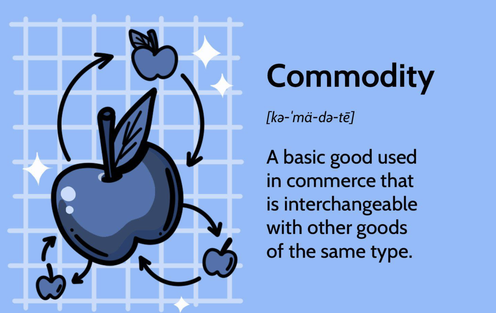

## Table of Contents

## What are commodities?

Commodities are basic goods that are the same no matter who produces them. Things like oil, gold, and wheat are examples of commodities. They are traded on special markets where buyers and sellers come together to exchange these goods. The price of commodities can go up and down based on how much people want them and how much is available.

People use commodities in many ways. For example, oil is used to make gasoline for cars, gold is used to make jewelry, and wheat is used to make bread. Because these goods are important for everyday life, changes in their prices can affect the economy. Investors also trade commodities to make money, hoping to buy low and sell high as prices change.

## How are commodities different from stocks?

Commodities and stocks are different in what they are and how they work. Commodities are things you can touch, like oil, gold, or wheat. They are the same no matter who makes them. Stocks, on the other hand, are pieces of a company. When you buy a stock, you own a little bit of that company. The value of stocks can go up or down based on how well the company is doing.

The way you trade commodities and stocks is different too. Commodities are traded on special markets called commodity exchanges. These markets help people buy and sell things like oil or wheat. Stocks are traded on stock exchanges, like the New York Stock Exchange. People buy and sell stocks hoping the company will do well and the stock price will go up. Both commodities and stocks can be risky, but they are affected by different things. Commodities prices can change because of things like weather or how much is available, while stock prices can change because of how the company is doing or what's happening in the economy.

## What are the main types of commodities traded in the market?

Commodities are things you can touch that are the same no matter who makes them. They are split into two big groups: hard commodities and soft commodities. Hard commodities come from the ground or under the sea. Examples are oil, natural gas, gold, and copper. These things are often used to make other things or to give us energy.

Soft commodities are different because they come from farms or animals. Examples are wheat, corn, coffee, sugar, and cotton. These things are important because they are used to make food or clothes. Both hard and soft commodities are traded a lot because they are needed every day.

There is also another group called energy commodities, which are a part of hard commodities. These include oil, natural gas, and sometimes coal. They are very important because they power our cars, heat our homes, and run factories. The prices of energy commodities can change a lot because they are affected by things like politics, weather, and how much people need them.

## How do commodities influence the stock market?

Commodities can affect the stock market because they are important for many businesses. When the price of commodities like oil or wheat goes up, it can cost more for companies to make their products. If a company makes cars, and the price of oil goes up, it will cost more to make those cars. This can make the company's profits go down, and when that happens, the price of their stock might go down too. On the other hand, if the price of a commodity goes down, it can help a company's profits go up, and that might make their stock price go up.

Commodities can also affect the whole economy. When the price of important commodities like oil changes a lot, it can change how much people spend on things. If oil prices go up, people might have less money to spend on other things, and this can slow down the economy. When the economy slows down, it can make stock prices go down too. So, even if a company doesn't use a lot of commodities, changes in commodity prices can still affect its stock price because of how they impact the economy.

## What are commodity futures and how do they work?

Commodity futures are agreements to buy or sell a commodity at a set price on a future date. They are traded on special markets called futures exchanges. People use commodity futures to guess about what the price of a commodity, like oil or wheat, will be in the future. If someone thinks the price of oil will go up, they might buy a futures contract now to sell it later at a higher price. If they think the price will go down, they might sell a futures contract now to buy it back later at a lower price.

Futures help farmers, miners, and other people who make commodities to plan ahead. For example, a farmer can sell wheat futures to lock in a price for their crop before it's even harvested. This way, they know how much money they will get, even if the price of wheat changes later. On the other side, a company that needs wheat can buy futures to make sure they can get the wheat they need at a price they can afford. Futures help both sides manage the risk of price changes, making it easier for them to do business.

## What role do commodity exchanges play in the stock market?

Commodity exchanges are special markets where people buy and sell things like oil, wheat, and gold. These exchanges help people trade commodities easily and safely. They set rules and make sure everyone follows them. This helps keep trading fair and stops people from cheating. Because commodities are important for many businesses, what happens on commodity exchanges can affect the stock market. If the price of a commodity goes up or down a lot, it can change how much money companies make, and this can make their stock prices go up or down too.

Commodity exchanges also offer futures contracts, which are agreements to buy or sell a commodity at a set price in the future. These futures help businesses plan ahead and manage the risk of price changes. For example, if a company knows it will need oil in the future, it can buy oil futures now to lock in a price. If the price of oil goes up later, the company will still pay the lower price it agreed on. This can help the company's profits stay steady, which can make its stock price more stable. So, commodity exchanges and the futures they offer can play a big role in how the stock market works.

## How can investors use commodities to diversify their portfolios?

Investors can use commodities to diversify their portfolios by adding things like oil, gold, or wheat to their investments. Commodities often move in different ways than stocks and bonds. This means when stocks go down, commodities might go up or stay the same. By having some commodities in their portfolio, investors can spread out their risk. If one part of their investments is not doing well, the commodities might help balance it out.

For example, if an investor has a lot of money in tech stocks and those stocks start to fall, having some gold in their portfolio might help. Gold often goes up when the stock market goes down, so it can protect the investor's money. Adding commodities like oil or wheat can also be good because their prices can change based on different things, like weather or how much is available. This can make an investor's portfolio more stable and less likely to lose a lot of money all at once.

## What are the risks associated with investing in commodities?

Investing in commodities can be risky because their prices can change a lot. Things like oil, gold, or wheat can go up and down quickly because of things like weather, politics, or how much is available. If an investor buys a commodity and its price goes down a lot, they could lose a lot of money. Also, commodities don't always pay dividends like stocks do, so the only way to make money is if the price goes up. This makes it harder to predict how much money an investor might make.

Another risk is that commodities can be hard to understand. They are affected by many things that can be hard to keep track of. For example, if a big oil-producing country has problems, it can make the price of oil go up or down. This can be confusing for investors who are used to stocks, which are more about how a company is doing. Also, trading commodities often involves using futures contracts, which can be tricky. If an investor guesses wrong about where prices are going, they could lose money on the futures contract.

## How do global economic factors affect commodity prices?

Global economic factors can change the prices of commodities like oil, gold, and wheat a lot. When the economy is doing well, people and businesses use more commodities. For example, if more people are driving, they need more gasoline, which comes from oil. This can make the price of oil go up. On the other hand, if the economy is not doing well, people might use less of these things, and the price can go down. Also, things like interest rates can affect commodity prices. If interest rates go up, borrowing money becomes more expensive, and this can make businesses use fewer commodities because they have less money to spend.

Politics and events around the world can also affect commodity prices. If there is a war or a problem in a country that makes a lot of oil, the price of oil can go up because there might be less oil available. Weather can also play a big role, especially for things like wheat or coffee. If there is a drought or a big storm, it can hurt crops, and this can make the price of those commodities go up because there is less of them to go around. All these things show how global economic factors can make commodity prices go up and down in ways that are hard to predict.

## What are some strategies for trading commodities effectively?

One way to trade commodities effectively is to pay attention to what's happening in the world. Things like weather, politics, and how the economy is doing can change the prices of commodities like oil, gold, or wheat. For example, if there's a big storm that might hurt crops, the price of wheat could go up because there will be less of it. By keeping an eye on the news and understanding how these things can affect commodity prices, traders can make better guesses about when to buy or sell.

Another strategy is to use futures contracts. Futures are agreements to buy or sell a commodity at a set price in the future. They can help traders manage risk. If a trader thinks the price of oil will go up, they can buy a futures contract now and sell it later at a higher price. But futures can be tricky, so it's important to learn how they work before using them. Also, spreading out investments across different commodities can help. If one commodity's price goes down, another might go up, which can balance things out.

Lastly, it's good to have a plan and stick to it. Trading commodities can be exciting, but it can also be risky. Setting clear goals and knowing when to buy or sell can help traders avoid making quick decisions based on feelings. It's also smart to start small and learn as you go. As traders get more experience, they can try more complex strategies and maybe take on more risk. But always remember, the goal is to make smart choices and manage risk well.

## How do commodity prices impact inflation and economic policy?

Commodity prices can have a big impact on inflation. Inflation is when the prices of things we buy go up over time. When the prices of important commodities like oil or wheat go up, it can cost more for businesses to make their products. This means they might have to raise the prices of things like gasoline or bread. When these prices go up, it can make the overall level of prices in the economy go up too, which is inflation. So, if commodity prices are high, it can push inflation higher, and if they are low, it can help keep inflation down.

Economic policy can also be affected by commodity prices. Governments and central banks watch commodity prices closely because they can tell them a lot about what's happening in the economy. If commodity prices are going up a lot, it might mean that there is too much money chasing too few goods, which can lead to inflation. In this case, a central bank might decide to raise interest rates to slow down spending and cool off the economy. On the other hand, if commodity prices are falling, it might mean the economy is slowing down, and the central bank might lower interest rates to encourage spending and help the economy grow. So, commodity prices can play a big role in how economic policy is made.

## What advanced analytical tools are used to predict commodity price movements?

People use special tools to guess where commodity prices might go. One tool is called technical analysis. This means looking at past price data and charts to find patterns. Traders think these patterns can help them predict what will happen next. They use things like moving averages, which smooth out price data over time, and the Relative Strength Index (RSI), which tells them if a commodity is being bought or sold too much. These tools can help traders decide when to buy or sell.

Another tool is called [fundamental analysis](/wiki/fundamental-analysis). This means looking at the real reasons why commodity prices might change. Traders look at things like how much of a commodity is available, how much people want it, and what's happening in the world that could affect it. For example, they might look at weather reports to see if a drought could hurt crops, or they might check news about oil-producing countries to see if there could be problems that affect oil prices. By understanding these things, traders can make better guesses about where prices might go.

Some traders also use computer programs and math models to help them. These programs can look at a lot of data very quickly and find patterns that people might miss. They can use things like [machine learning](/wiki/machine-learning), which is a way for computers to learn from data and get better at making predictions over time. These advanced tools can help traders make more accurate guesses about commodity prices, but they are not perfect, and there is always some risk involved.

## References & Further Reading

[1]: Bergstra, J., Bardenet, R., Bengio, Y., & Kégl, B. (2011). ["Algorithms for Hyper-Parameter Optimization."](https://papers.nips.cc/paper/4443-algorithms-for-hyper-parameter-optimization) Advances in Neural Information Processing Systems 24.

[2]: ["Advances in Financial Machine Learning"](https://www.amazon.com/Advances-Financial-Machine-Learning-Marcos/dp/1119482089) by Marcos Lopez de Prado

[3]: ["Evidence-Based Technical Analysis: Applying the Scientific Method and Statistical Inference to Trading Signals"](https://www.amazon.com/Evidence-Based-Technical-Analysis-Scientific-Statistical/dp/0470008741) by David Aronson

[4]: ["Machine Learning for Algorithmic Trading"](https://github.com/stefan-jansen/machine-learning-for-trading) by Stefan Jansen

[5]: ["Quantitative Trading: How to Build Your Own Algorithmic Trading Business"](https://www.amazon.com/Quantitative-Trading-Build-Algorithmic-Business/dp/1119800064) by Ernest P. Chan