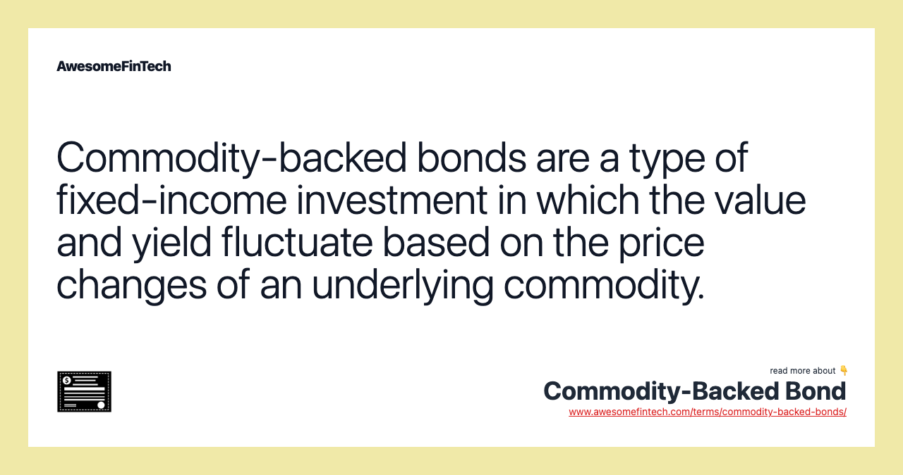

## Table of Contents

## What are commodity-backed bonds?

Commodity-backed bonds are a type of bond where the repayment of the bond is linked to the value of a specific commodity, like gold or oil. This means that if you invest in these bonds, the money you get back when the bond matures depends on how well the commodity is doing in the market. For example, if the price of the commodity goes up, you might get more money back than you expected. But if the price goes down, you might get less.

These bonds can be attractive to investors who want to invest in commodities without directly buying them. They offer a way to potentially benefit from the commodity market while also getting the regular interest payments that come with bonds. However, they also come with risks because the value of the commodity can be unpredictable. If the commodity's price drops a lot, the bond might not be worth as much, and you could lose money.

## How do commodity-backed bonds differ from traditional bonds?

Commodity-backed bonds are different from traditional bonds because their value is tied to a specific commodity, like oil or gold. With traditional bonds, the value depends on the creditworthiness of the issuer, like a government or a company. But with commodity-backed bonds, if the price of the commodity goes up, the bond might be worth more, and you could get more money back when it matures. On the other hand, if the commodity's price goes down, the bond might be worth less, and you could lose money.

Traditional bonds usually give you regular interest payments, and the amount you get back at the end is fixed. They are seen as safer because their value doesn't change much unless the issuer runs into financial trouble. Commodity-backed bonds can offer higher potential returns because they are linked to the commodity market, but they are also riskier. This makes them attractive to investors who want to bet on commodities without directly buying them, but it also means they need to be comfortable with the ups and downs of the commodity market.

## What types of commodities are typically used to back these bonds?

Commodity-backed bonds often use commodities like gold, oil, and agricultural products like wheat or corn. These are popular because they are widely traded and their prices can go up and down a lot, which can affect the bond's value. Gold is used a lot because it's seen as a safe investment during uncertain times. Oil is also common because it's crucial for the world's economy, and its price can change a lot based on what's happening around the world.

Sometimes, other commodities like copper, silver, or even natural gas are used to back these bonds. These commodities are also important in industry and can have big price swings. The choice of commodity depends on what the bond issuer thinks will be a good bet for investors. By choosing a commodity that's likely to go up in value, the issuer hopes to make the bond more attractive and potentially give investors a good return on their money.

## What is the mechanism behind commodity-backed bonds?

Commodity-backed bonds work by linking the bond's value to a specific commodity, like gold or oil. When you buy one of these bonds, you're not just lending money to the issuer; you're also betting on the price of the commodity. If the price of the commodity goes up, the bond could be worth more when it matures, and you might get more money back than you expected. But if the price goes down, the bond could be worth less, and you might lose money.

The issuer of the bond uses the commodity to back the bond's value. This means they might hold onto the commodity or use it in some way to make sure they can pay back the bond at the end. For example, if the bond is backed by oil, the issuer might own oil reserves or have contracts to buy oil at a set price. This way, they can use the oil to pay back the bond if its price goes up. But if the price drops, they might not be able to cover the bond's full value, which is why these bonds can be risky.

## How are the commodities stored and managed in these bonds?

In commodity-backed bonds, the commodities like gold or oil are usually stored and managed by the issuer or a third party. The issuer might have their own storage facilities or use warehouses and vaults to keep the commodities safe. For example, if the bond is backed by gold, the gold might be kept in a secure vault, and if it's oil, it might be stored in tanks or underground reserves. The issuer needs to make sure the commodities are kept safe and secure so they can use them to pay back the bond when it matures.

Managing the commodities involves keeping track of their quantity and quality. The issuer might hire experts to check on the commodities regularly to make sure they are still in good condition. They also need to keep an eye on the commodity market to know how much the commodities are worth. This is important because the value of the bond depends on the price of the commodity. If the price goes up, the issuer might need to sell some of the commodity to pay back the bondholders more money. If the price goes down, they need to figure out how to cover the bond's value with less valuable commodities.

## What are the potential benefits of investing in commodity-backed bonds?

Investing in commodity-backed bonds can offer you a chance to make more money than with regular bonds. Since these bonds are tied to the price of a commodity like gold or oil, if the commodity's price goes up, you might get more money back when the bond matures. This can be a good way to benefit from the commodity market without having to buy the commodities yourself. Plus, like regular bonds, you still get regular interest payments, which can give you a steady income while you wait to see if the commodity's price goes up.

But these bonds also come with some risks, so they might not be right for everyone. If the price of the commodity goes down, the bond could be worth less, and you might lose money. Still, if you're okay with taking on more risk for the chance of a bigger reward, commodity-backed bonds can be a good addition to your investment mix. They can help you spread out your investments and maybe even protect against inflation, since commodities often go up in price when inflation is high.

## What risks are associated with commodity-backed bonds?

Commodity-backed bonds come with some risks that you should know about. The biggest risk is that the price of the commodity, like gold or oil, can go down. If that happens, the bond might be worth less when it matures, and you could lose money. This is different from regular bonds, where the value usually stays the same unless the company or government that issued the bond runs into financial trouble.

Another risk is that the issuer might not handle the commodities well. If they don't store the commodities safely or if they can't manage them properly, it could affect the bond's value. Also, the commodity market can be unpredictable. Things like natural disasters, political changes, or economic shifts can make commodity prices go up and down a lot, which adds more risk to your investment. So, while commodity-backed bonds can offer higher rewards, they also come with higher risks that you need to be ready for.

## How do commodity price fluctuations impact these bonds?

Commodity price fluctuations can have a big impact on commodity-backed bonds. If the price of the commodity, like gold or oil, goes up, the bond might be worth more when it matures. This is good for you because you could get more money back than you expected. But if the price of the commodity goes down, the bond might be worth less. This means you could lose money if the commodity's price drops a lot before the bond matures.

The reason for this is that the bond's value is tied directly to the commodity's price. When you buy a commodity-backed bond, you're betting on the price of the commodity going up. If it does, you win. But if the price goes down, you could lose. This makes commodity-backed bonds riskier than regular bonds, where the value doesn't change much unless the issuer has financial problems. So, while you might make more money with commodity-backed bonds, you also have to be ready for the possibility of losing money if the commodity's price doesn't go your way.

## What role do commodity-backed bonds play in portfolio diversification?

Commodity-backed bonds can be a good way to mix up your investments. When you put your money into different kinds of investments, it's called diversification. This helps spread out the risk so that if one investment does badly, the others might do better and balance it out. Commodity-backed bonds are different from regular bonds because their value depends on the price of a commodity like gold or oil. By adding these bonds to your portfolio, you're not just betting on the bond issuer staying financially healthy, but also on the commodity market doing well. This can be a good way to protect your money from inflation because commodities often go up in price when inflation is high.

But remember, commodity-backed bonds come with their own risks. If the price of the commodity goes down, the bond might be worth less when it matures, and you could lose money. This makes them riskier than regular bonds, but the potential for higher returns can be attractive if you're okay with taking on more risk. So, by including commodity-backed bonds in your portfolio, you're adding another layer of diversification. This can help balance out your investments and maybe even give you a chance to make more money, but you need to be ready for the ups and downs of the commodity market.

## How are commodity-backed bonds rated and what factors influence their ratings?

Commodity-backed bonds are rated by credit rating agencies like Moody's, Standard & Poor's, and Fitch. These agencies look at how likely the bond issuer is to pay back the money they borrowed. They also think about the risks that come with the commodity that backs the bond. If the commodity's price goes up and down a lot, the bond might get a lower rating because it's riskier. The rating can be anything from AAA, which is the best and safest, to D, which means the bond is in big trouble.

The factors that influence the ratings of commodity-backed bonds include the financial health of the issuer, the stability of the commodity market, and how well the issuer manages the commodity. If the issuer has a good track record and strong finances, the bond might get a better rating. But if the commodity's price is unpredictable or if the issuer doesn't store or manage the commodity well, the rating could be lower. The rating helps investors understand how safe their investment is and what kind of return they might expect.

## What are the regulatory considerations for issuing commodity-backed bonds?

When a company or government wants to issue commodity-backed bonds, they need to follow rules set by financial regulators. These rules are meant to protect investors and make sure the bond market is fair. The issuer has to tell investors all about the bond, like how it's linked to the commodity, the risks involved, and how the commodity is being stored and managed. They also need to follow rules about how they can advertise the bond and what they can say about it. Different countries might have different rules, so the issuer needs to know what's allowed where they are selling the bonds.

Regulators also keep an eye on how the issuer is doing after the bonds are sold. They want to make sure the issuer is managing the commodity well and can pay back the bond when it matures. If the issuer doesn't follow the rules, they could get in trouble and have to pay fines or face other penalties. This helps keep the bond market safe and trustworthy for everyone involved.

## How have commodity-backed bonds performed historically compared to other investment vehicles?

Commodity-backed bonds have had ups and downs over the years, just like the commodities they're tied to. When commodity prices go up, these bonds can do really well, sometimes even better than regular bonds or stocks. For example, if oil prices go up a lot, oil-backed bonds might give investors a good return. But when commodity prices drop, these bonds can lose value, and investors might not get back as much money as they hoped. This makes them riskier than regular bonds, but they can still be a good choice for investors who want to mix things up and maybe make more money.

Compared to other investments like stocks or regular bonds, commodity-backed bonds can be a bit of a wild ride. Stocks can go up and down a lot too, but they're not tied to just one commodity. Regular bonds are usually safer because their value doesn't change much unless the issuer runs into financial trouble. But commodity-backed bonds can offer higher returns when the commodity market is doing well. So, while they might not always beat other investments, they can be a good way to diversify your portfolio and protect against inflation, which can be important for long-term investing.

## References & Further Reading

[1]: Tuckman, B., & Serrat, A. (2011). ["Fixed Income Securities: Tools for Today's Markets"](https://www.amazon.com/Fixed-Income-Securities-Todays-Markets/dp/0470891696), Wiley.

[2]: ["Commodity Markets and Derivatives"](https://www.wallstreetmojo.com/commodity-derivatives-forwards-futures-options/) by Jessie S. Siscoe

[3]: Hull, J. (2017). ["Options, Futures, and Other Derivatives"](https://elibrary.pearson.de/book/99.150005/9781292212920), Pearson.

[4]: Geman, H. (2005). ["Commodities and Commodity Derivatives: Modeling and Pricing for Agriculturals, Metals and Energy"](https://download.e-bookshelf.de/download/0000/5675/90/L-G-0000567590-0015270354.pdf), Wiley.

[5]: Aldridge, I. (2013). ["High-Frequency Trading: A Practical Guide to Algorithmic Strategies and Trading Systems"](https://www.amazon.com/High-Frequency-Trading-Practical-Algorithmic-Strategies/dp/1118343506), Wiley.

[6]: Shapiro, R. J. (2003). ["Politics, Costs, and Benefits of Algorith Trading"](https://onlinelibrary.wiley.com/doi/epdf/10.1111/j.1748-5991.2012.01131.x), Journal of Economic Perspectives.

[7]: Fabozzi, F. J., & Mann, S. V. (2012). ["The Handbook of Fixed Income Securities"](https://www.mhebooklibrary.com/doi/book/10.1036/9781260473902), McGraw-Hill Education.