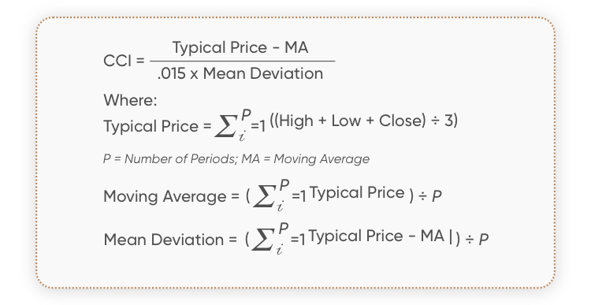

## Table of Contents

## What is the Commodity Channel Index (CCI)?

The Commodity Channel Index (CCI) is a technical indicator used in trading to help figure out if a market is overbought or oversold. It was created by Donald Lambert and first appeared in 1980. The CCI compares the current price of a commodity to its average price over a period of time, usually 20 days. Traders use it to spot trends and possible turning points in the market. When the CCI value goes above +100, it suggests the market might be overbought, and when it drops below -100, it suggests the market might be oversold.

The CCI is useful because it can help traders make decisions about when to buy or sell. For example, if the CCI moves from below -100 to above -100, it might be a good time to buy because the price could start to go up. On the other hand, if the CCI moves from above +100 to below +100, it might be a good time to sell because the price could start to go down. While the CCI is a helpful tool, it's important to use it along with other indicators and analysis to make the best trading decisions.

## Who developed the Commodity Channel Index and when?

The Commodity Channel Index, or CCI, was developed by Donald Lambert. He introduced this technical indicator in 1980. Donald Lambert wanted to create a tool that could help traders figure out if a market was overbought or oversold.

The CCI is used to look at the price of a commodity compared to its average price over time, usually 20 days. This helps traders see trends and possible changes in the market. When the CCI goes above +100, it might mean the market is overbought, and when it goes below -100, it might mean the market is oversold.

## What is the purpose of using the CCI in trading?

The purpose of using the Commodity Channel Index (CCI) in trading is to help traders understand if a market is overbought or oversold. The CCI looks at the current price of a commodity compared to its average price over a period of time, usually 20 days. This helps traders see if the price is too high or too low compared to what is normal. If the CCI goes above +100, it suggests the market might be overbought, meaning the price could be too high and might start to go down soon. If the CCI goes below -100, it suggests the market might be oversold, meaning the price could be too low and might start to go up soon.

Traders use the CCI to spot trends and possible turning points in the market. For example, if the CCI moves from below -100 to above -100, it might be a good time to buy because the price could start to go up. On the other hand, if the CCI moves from above +100 to below +100, it might be a good time to sell because the price could start to go down. While the CCI is a helpful tool, it's important to use it along with other indicators and analysis to make the best trading decisions.

## How is the typical price calculated in the CCI formula?

The typical price in the Commodity Channel Index (CCI) formula is calculated by taking the average of the high, low, and closing prices of a commodity for a given day. This means you add up the high price, the low price, and the closing price, then divide that total by three. This gives you a single number that represents the typical price for that day.

Using the typical price helps the CCI to consider all three important price points of a trading day. This makes the CCI a more complete measure of where the price is compared to its average over time. By using the typical price, the CCI can better show if a market is overbought or oversold, which is very helpful for traders.

## What is the formula for calculating the Commodity Channel Index?

The Commodity Channel Index (CCI) is calculated using a specific formula that helps traders figure out if a market is overbought or oversold. The formula starts by finding the typical price for each day. The typical price is the average of the high price, the low price, and the closing price of a commodity for that day. You add up these three prices and then divide by three. Once you have the typical price for each day, you calculate the simple moving average (SMA) of the typical prices over a period of time, usually 20 days. This gives you the average typical price.

Next, you find the mean deviation, which shows how much the typical prices vary from the average typical price. To do this, you subtract the SMA of the typical prices from each day's typical price, take the absolute value of the difference, and then find the average of these values over the same period, usually 20 days. Finally, you calculate the CCI by subtracting the SMA of the typical prices from the current day's typical price, dividing that by the mean deviation, and then multiplying by a constant, usually 0.015. The formula is: CCI = (Typical Price - SMA of Typical Prices) / (0.015 * Mean Deviation).

## How do you determine the simple moving average of the typical price in CCI?

To find the simple moving average (SMA) of the typical price in the Commodity Channel Index (CCI), you start by calculating the typical price for each day. The typical price is found by adding up the high price, the low price, and the closing price of a commodity for that day, then dividing by three. Once you have the typical price for each day, you add up the typical prices for a certain number of days, usually 20 days, and then divide by that number of days. This gives you the average typical price over that period, which is the SMA.

The SMA of the typical price helps to smooth out the price data and show the average price over time. By using the SMA in the CCI formula, you can compare the current typical price to the average typical price to see if the market is overbought or oversold. If the current typical price is much higher than the SMA, it might mean the market is overbought, and if it's much lower, it might mean the market is oversold. This comparison is important for traders to make decisions about buying or selling.

## What is the mean deviation in the CCI calculation and how is it computed?

The mean deviation in the Commodity Channel Index (CCI) calculation is a way to measure how much the typical prices of a commodity vary from their average over a certain period, usually 20 days. It helps traders see how spread out the prices are. The mean deviation is important because it shows how much the current price differs from what's normal, which can help traders decide if the market is overbought or oversold.

To compute the mean deviation, you first find the typical price for each day by adding the high price, the low price, and the closing price, then dividing by three. Next, you subtract the simple moving average (SMA) of these typical prices from each day's typical price. You then take the absolute value of these differences, which means you make all the numbers positive. Finally, you add up all these absolute differences and divide by the number of days, usually 20, to get the mean deviation. This number is used in the CCI formula to help figure out if the market's price is too high or too low compared to its average.

## How does the constant factor of 0.015 affect the CCI calculation?

The constant factor of 0.015 in the Commodity Channel Index (CCI) calculation helps to scale the results so that they fit within a certain range. This number is used to make sure the CCI values are easy to understand and compare. When you multiply the mean deviation by 0.015, it makes the CCI values smaller and more manageable. This scaling helps traders see if the market is overbought or oversold more clearly because the CCI values are usually between -100 and +100.

Without the constant factor of 0.015, the CCI values would be much larger and harder to interpret. The constant helps to keep the CCI values in a range that traders can easily use to make decisions. For example, if the CCI goes above +100, it suggests the market might be overbought, and if it goes below -100, it suggests the market might be oversold. The constant factor of 0.015 makes these key levels more meaningful and useful for traders.

## What are the common time periods used for calculating the CCI?

The most common time period used for calculating the Commodity Channel Index (CCI) is 20 days. This means that traders usually look at the typical price, the simple moving average of the typical price, and the mean deviation over the last 20 days to figure out if the market is overbought or oversold. Using a 20-day period helps to smooth out short-term price changes and gives a good picture of the market's trend.

Sometimes, traders might use shorter or longer time periods depending on what they are trying to find out. For example, a shorter time period like 10 days can be used to see more quick changes in the market, while a longer time period like 30 days can be used to see bigger trends over time. No matter what time period is used, the CCI helps traders make decisions about buying or selling based on whether the market looks overbought or oversold.

## How can the CCI be interpreted for overbought and oversold conditions?

The Commodity Channel Index (CCI) helps traders figure out if a market is overbought or oversold. When the CCI goes above +100, it means the market might be overbought. This means the price could be too high and might start to go down soon. Traders might want to sell when they see the CCI above +100 because the price could drop. On the other hand, when the CCI goes below -100, it means the market might be oversold. This means the price could be too low and might start to go up soon. Traders might want to buy when they see the CCI below -100 because the price could rise.

The CCI is not just about numbers; it's also about watching how the CCI moves. If the CCI moves from below -100 to above -100, it might be a good time to buy because the price could be starting to go up. If the CCI moves from above +100 to below +100, it might be a good time to sell because the price could be starting to go down. Traders use these movements to make decisions about when to buy or sell, but it's important to use the CCI along with other tools to make the best choices.

## What are the limitations of using the CCI as a trading indicator?

Using the Commodity Channel Index (CCI) as a trading indicator has some limitations. One big problem is that the CCI can give false signals. This means it might tell you to buy or sell when the price doesn't actually move that way. The CCI is good at showing when a market might be overbought or oversold, but it doesn't always get it right. This can lead to traders making bad decisions and losing money.

Another limitation is that the CCI works best when used with other indicators. If you only use the CCI, you might miss important information about the market. For example, the CCI might say the market is overbought, but other signs might show the price will keep going up. So, it's important to look at other things like price trends and other indicators to make the best trading choices. Using the CCI alone can be risky because it doesn't give you the whole picture of what's happening in the market.

## How can traders combine the CCI with other technical indicators for better results?

Traders can combine the Commodity Channel Index (CCI) with other technical indicators to get better results and make smarter trading decisions. One common way is to use the CCI with the Relative Strength Index (RSI). The RSI also helps show if a market is overbought or oversold, but it uses a different method. By looking at both the CCI and RSI, traders can see if both indicators agree that the market is overbought or oversold. If they do, it can be a stronger sign that it's time to buy or sell. For example, if the CCI goes above +100 and the RSI goes above 70, it might be a good time to sell because both indicators show the market is overbought.

Another useful combination is the CCI with moving averages. Moving averages help traders see the general direction of the market's price. By using a moving average along with the CCI, traders can check if the price is following a trend. If the CCI shows the market is overbought or oversold, and the moving average confirms that the price is moving in that direction, it can give traders more confidence in their decisions. For instance, if the CCI goes below -100 and the price is below a long-term moving average, it might be a good time to buy because both signs suggest the price could go up. Combining the CCI with other indicators helps traders get a fuller picture of the market and make better choices.

## What is the Commodity Channel Index (CCI)?

The Commodity Channel Index (CCI) is a technical analysis tool developed by Donald Lambert in the early 1980s. It is widely recognized as a momentum-based oscillator that gauges a security's current price level relative to an average over a specified period. Lambert introduced the CCI to measure the cyclical behavior of different commodities, but its utility has since expanded to other asset classes, including stocks and forex.

The primary purpose of the CCI is to help traders identify cyclical price trends, which may occur due to market behavior that repeats over time. Lambert observed that commodities and other assets move in cycles, exhibiting periods where prices rise and fall in a consistent pattern. By evaluating these price movements against their average levels, the CCI provides traders with insights into the cyclical dynamics at play.

The CCI works by comparing the current price levels to the average price level over a predetermined period. The calculation involves three primary components: the Typical Price (TP), Simple Moving Average (SMA), and Mean Deviation. The Typical Price is computed as the average of the high, low, and close prices for a given period:

$$
\text{Typical Price} (TP) = \frac{\text{High} + \text{Low} + \text{Close}}{3}
$$

The Simple Moving Average is then calculated using the Typical Price over a specific number of periods. Finally, the Mean Deviation measures the average deviation of the Typical Price from the SMA. The formula for CCI is expressed as:

$$
\text{CCI} = \frac{(TP - \text{SMA})}{0.015 \times \text{Mean Deviation}}
$$

The constant 0.015 is used to ensure that approximately 70% to 80% of CCI values fall within the range of -100 to +100, a centering range that allows traders to quickly assess whether an asset is overbought or oversold. By comparing the current price to its historical average, traders can detect potential reversals, continuations, or breakouts, making CCI a valuable component in technical trading strategies.

## How do you calculate the CCI?

The Commodity Channel Index (CCI) is commonly used in technical analysis to evaluate cyclical price trends. It is calculated using the formula:

$$
\text{CCI} = \frac{\text{Typical Price} - \text{Simple Moving Average (SMA)}}{0.015 \times \text{Mean Deviation}}
$$

### Components of the CCI Formula

1. **Typical Price (TP)**: This is the average of the high, low, and close prices for a given period. It serves as a representative price and is calculated using the formula:

   \[ \text{Typical Price (TP)} = \frac{\text{High} + \text{Low} + \text{Close}}{3}
$$

2. **Simple Moving Average (SMA)**: This is the average of the Typical Prices over a specified number of periods. It smooths out price fluctuations and helps identify trends.

3. **Mean Deviation**: This measures the average deviation of each period's Typical Price from the Simple Moving Average. It is calculated by taking the mean of the absolute differences between each period's Typical Price and the SMA over the specified period.

   \[ \text{Mean Deviation} = \frac{\sum|\text{Typical Price}_i - \text{SMA}|}{n}
$$

   where $n$ is the number of periods.

4. **Constant (0.015)**: This scaling constant was introduced by Donald Lambert, the creator of CCI, to produce a majority of CCI values within a range of -100 to +100. This convention allows for easier identification of extreme price movements.

### Example Calculation

Suppose you have the following sample data for a five-day period:

- Day 1: High = 50, Low = 47, Close = 49
- Day 2: High = 51, Low = 48, Close = 50
- Day 3: High = 52, Low = 49, Close = 51
- Day 4: High = 53, Low = 50, Close = 52
- Day 5: High = 54, Low = 51, Close = 53

First, calculate the Typical Price for each day:

- TP Day 1 = (50 + 47 + 49) / 3 = 48.67
- TP Day 2 = (51 + 48 + 50) / 3 = 49.67
- TP Day 3 = (52 + 49 + 51) / 3 = 50.67
- TP Day 4 = (53 + 50 + 52) / 3 = 51.67
- TP Day 5 = (54 + 51 + 53) / 3 = 52.67

Next, calculate the SMA for these five days:

- SMA = (48.67 + 49.67 + 50.67 + 51.67 + 52.67) / 5 = 50.67

Then, determine the Mean Deviation:

- Mean Deviation = (|48.67 - 50.67| + |49.67 - 50.67| + |50.67 - 50.67| + |51.67 - 50.67| + |52.67 - 50.67|) / 5 = 1.47

Finally, calculate the CCI for Day 5:

- CCI = (52.67 - 50.67) / (0.015 * 1.47) ≈ 90.48

### Tools and Software

There are several tools and software that can efficiently compute CCI, including popular platforms like MetaTrader, TradingView, and financial software such as Bloomberg Terminal. Additionally, various programming languages and libraries, such as Python with the Pandas library, can be used to automate the calculation process.

Here is a simple Python example using the Pandas library:

```python
import pandas as pd

# Sample data for high, low, close prices
data = {
    'High': [50, 51, 52, 53, 54],
    'Low': [47, 48, 49, 50, 51],
    'Close': [49, 50, 51, 52, 53]
}

# Create a DataFrame
df = pd.DataFrame(data)

# Calculate Typical Price
df['TP'] = (df['High'] + df['Low'] + df['Close']) / 3

# Calculate Simple Moving Average (SMA)
df['SMA'] = df['TP'].rolling(window=5).mean()

# Calculate Mean Deviation
df['Mean Deviation'] = df['TP'].rolling(window=5).apply(lambda x: pd.Series(x).mad())

# Calculate CCI
df['CCI'] = (df['TP'] - df['SMA']) / (0.015 * df['Mean Deviation'])

print(df)
```

This code snippet demonstrates how to automate CCI calculation for a series of prices, streamlining the process for larger datasets and more complex analyses.

## How can CCI be implemented in algorithmic trading?

The Commodity Channel Index (CCI) is a valuable tool for [algorithmic trading](/wiki/algorithmic-trading), facilitating the automation of trading strategies based on its momentum-based oscillator capabilities. Implementing CCI in trading algorithms involves using programming languages such as Python, which is particularly popular due to its vast ecosystem of libraries and ease of use.

### Automation with Python

Python's versatility makes it an ideal choice for implementing CCI in algorithmic trading. Libraries like `pandas`, `numpy`, and `ta (Technical Analysis)` offer functions to efficiently calculate CCI and integrate it into trading strategies. 

To automate CCI in Python, the following steps can be employed:

**1. Data Preparation:**
   - Use `pandas` to fetch and handle historical price data.
   - Calculate the Typical Price as $\text{Typical Price} = \frac{\text{High} + \text{Low} + \text{Close}}{3}$.

**2. CCI Calculation:**
   - Compute the Simple Moving Average (SMA) of the Typical Price.
   - Determine the Mean Deviation of the Typical Prices over a specified period.
   - Apply the CCI formula:
$$
     \text{CCI} = \frac{\text{Typical Price} - \text{SMA}}{0.015 \times \text{Mean Deviation}}

$$

```python
import pandas as pd
import numpy as np

# Example data
data = pd.DataFrame({'High': [...], 'Low': [...], 'Close': [...]})
# Calculate Typical Price
data['Typical Price'] = (data['High'] + data['Low'] + data['Close']) / 3

# Calculate CCI
def calculate_cci(data, period=20):
    tp_sma = data['Typical Price'].rolling(window=period).mean()
    mean_deviation = data['Typical Price'].rolling(window=period).apply(lambda x: np.mean(np.abs(x - np.mean(x))))
    cci = (data['Typical Price'] - tp_sma) / (0.015 * mean_deviation)
    return cci

data['CCI'] = calculate_cci(data)
```

### Benefits of Algorithmic Trading with CCI

Implementing CCI in automated systems offers several advantages:

- **Efficiency:** Algorithms can process large datasets and execute trades faster than manual methods.
- **Emotionless Trading:** Removes human emotional biases from trading decisions.
- **Consistency:** Enables the application of a strategy consistently across different market conditions.

### Example Algorithm

Consider a simple trading algorithm wherein positions are entered when CCI crosses certain thresholds. For instance, buying when CCI rises above -100 and selling when it falls below +100.

```python
def generate_signals(data):
    buy_signal = (data['CCI'] < -100)
    sell_signal = (data['CCI'] > 100)
    data['Signal'] = 0
    data['Signal'][buy_signal] = 1
    data['Signal'][sell_signal] = -1
    return data

signals = generate_signals(data)
```

### Backtesting and Strategy Optimization

Backtesting is vital to evaluate the performance of an algorithmic strategy across historical data. It helps refine strategies by tuning parameters for optimal performance before live deployment. Tools like `Backtrader` in Python provide robust frameworks for [backtesting](/wiki/backtesting) and optimizing trading algorithms.

In conclusion, automating CCI in trading algorithms enhances the ability to make quick, data-driven decisions. By leveraging Python and backtesting frameworks, traders can optimize their strategies to maximize performance and effectively manage risks.

## References & Further Reading

[1]: Lambert, D. (1980). "Commodities Channel Index: Tools for Trading Cyclical Trends." Commodities.

[2]: Murphy, J. J. (1999). ["Technical Analysis of the Financial Markets: A Comprehensive Guide to Trading Methods and Applications"](https://archive.org/details/technicalanalysi0000murp) New York Institute of Finance.

[3]: Pring, M. J. (2002). ["Technical Analysis Explained: The Successful Investor's Guide to Spotting Investment Trends and Turning Points"](https://www.amazon.com/Technical-Analysis-Explained-Fifth-Successful/dp/0071825177) McGraw-Hill.

[4]: Wilder, J. W. (1978). ["New Concepts in Technical Trading Systems"](https://archive.org/details/newconceptsintec00wild) Trend Research.

[5]: Brown, C. (1999). ["Technical Analysis for the Trading Professional"](https://www.amazon.com/Technical-Analysis-Trading-Professional-Second/dp/007175914X) McGraw-Hill.