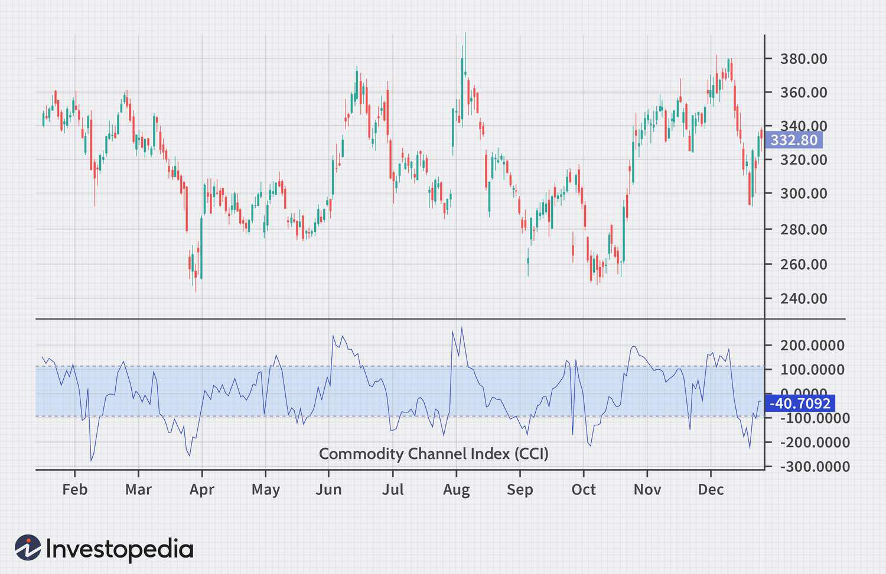

The Commodity Channel Index (CCI) is a pivotal technical indicator used by traders to discern potential buy and sell signals in the financial markets. Developed by Donald Lambert in the 1980s, CCI has become an integral part of technical analysis, offering valuable insights into market momentum and potential price reversals. This indicator is particularly revered for its ability to highlight cyclical trends, thereby aiding traders in making informed decisions. The purpose of this article is to provide a comprehensive guide on understanding the CCI, its calculation, and its application in algorithmic trading.

As the trading landscape continues to evolve, there is an increasing interest in leveraging technical indicators to enhance trading strategies. Traders globally are exploring tools like the CCI to gain a competitive edge in the markets. The CCI's ability to identify significant changes in market trends makes it an attractive option for traders seeking reliable indicators to inform their trading decisions.



This article is structured to cover the fundamental aspects of CCI, starting with its definition and significance in technical analysis. We will explore its origins and development, followed by a detailed explanation of its calculation. The article will also delve into interpreting the CCI and how it can be implemented effectively in algorithmic trading. Additionally, we will examine the advantages and limitations of using CCI, providing insights into how traders can optimize its usage.

The use of CCI in trading offers multiple benefits, most notably its capacity to identify oversold or overbought conditions in the market, which can signal potential price reversals. Furthermore, by integrating CCI into algorithmic trading systems, traders can automate their strategies, improving efficiency and execution speed. The growing interest in such technical indicators underscores their integral role in crafting sophisticated trading strategies. In conclusion, understanding the Commodity Channel Index and its application in trading can serve as a valuable addition to any trader’s technical analysis toolkit, enabling more strategic and informed trading decisions.

## Table of Contents

## What is the Commodity Channel Index (CCI)?

The Commodity Channel Index (CCI) is a technical analysis tool developed by Donald Lambert in the early 1980s. It is widely recognized as a momentum-based oscillator that gauges a security's current price level relative to an average over a specified period. Lambert introduced the CCI to measure the cyclical behavior of different commodities, but its utility has since expanded to other asset classes, including stocks and forex.

The primary purpose of the CCI is to help traders identify cyclical price trends, which may occur due to market behavior that repeats over time. Lambert observed that commodities and other assets move in cycles, exhibiting periods where prices rise and fall in a consistent pattern. By evaluating these price movements against their average levels, the CCI provides traders with insights into the cyclical dynamics at play.

The CCI works by comparing the current price levels to the average price level over a predetermined period. The calculation involves three primary components: the Typical Price (TP), Simple Moving Average (SMA), and Mean Deviation. The Typical Price is computed as the average of the high, low, and close prices for a given period:

$$
\text{Typical Price} (TP) = \frac{\text{High} + \text{Low} + \text{Close}}{3}
$$

The Simple Moving Average is then calculated using the Typical Price over a specific number of periods. Finally, the Mean Deviation measures the average deviation of the Typical Price from the SMA. The formula for CCI is expressed as:

$$
\text{CCI} = \frac{(TP - \text{SMA})}{0.015 \times \text{Mean Deviation}}
$$

The constant 0.015 is used to ensure that approximately 70% to 80% of CCI values fall within the range of -100 to +100, a centering range that allows traders to quickly assess whether an asset is overbought or oversold. By comparing the current price to its historical average, traders can detect potential reversals, continuations, or breakouts, making CCI a valuable component in technical trading strategies.

## How to Calculate the CCI

The Commodity Channel Index (CCI) is commonly used in technical analysis to evaluate cyclical price trends. It is calculated using the formula:

$$
\text{CCI} = \frac{\text{Typical Price} - \text{Simple Moving Average (SMA)}}{0.015 \times \text{Mean Deviation}}
$$

### Components of the CCI Formula

1. **Typical Price (TP)**: This is the average of the high, low, and close prices for a given period. It serves as a representative price and is calculated using the formula:

   \[ \text{Typical Price (TP)} = \frac{\text{High} + \text{Low} + \text{Close}}{3}
$$

2. **Simple Moving Average (SMA)**: This is the average of the Typical Prices over a specified number of periods. It smooths out price fluctuations and helps identify trends.

3. **Mean Deviation**: This measures the average deviation of each period's Typical Price from the Simple Moving Average. It is calculated by taking the mean of the absolute differences between each period's Typical Price and the SMA over the specified period.

   \[ \text{Mean Deviation} = \frac{\sum|\text{Typical Price}_i - \text{SMA}|}{n}
$$

   where $n$ is the number of periods.

4. **Constant (0.015)**: This scaling constant was introduced by Donald Lambert, the creator of CCI, to produce a majority of CCI values within a range of -100 to +100. This convention allows for easier identification of extreme price movements.

### Example Calculation

Suppose you have the following sample data for a five-day period:

- Day 1: High = 50, Low = 47, Close = 49
- Day 2: High = 51, Low = 48, Close = 50
- Day 3: High = 52, Low = 49, Close = 51
- Day 4: High = 53, Low = 50, Close = 52
- Day 5: High = 54, Low = 51, Close = 53

First, calculate the Typical Price for each day:

- TP Day 1 = (50 + 47 + 49) / 3 = 48.67
- TP Day 2 = (51 + 48 + 50) / 3 = 49.67
- TP Day 3 = (52 + 49 + 51) / 3 = 50.67
- TP Day 4 = (53 + 50 + 52) / 3 = 51.67
- TP Day 5 = (54 + 51 + 53) / 3 = 52.67

Next, calculate the SMA for these five days:

- SMA = (48.67 + 49.67 + 50.67 + 51.67 + 52.67) / 5 = 50.67

Then, determine the Mean Deviation:

- Mean Deviation = (|48.67 - 50.67| + |49.67 - 50.67| + |50.67 - 50.67| + |51.67 - 50.67| + |52.67 - 50.67|) / 5 = 1.47

Finally, calculate the CCI for Day 5:

- CCI = (52.67 - 50.67) / (0.015 * 1.47) ≈ 90.48

### Tools and Software

There are several tools and software that can efficiently compute CCI, including popular platforms like MetaTrader, TradingView, and financial software such as Bloomberg Terminal. Additionally, various programming languages and libraries, such as Python with the Pandas library, can be used to automate the calculation process.

Here is a simple Python example using the Pandas library:

```python
import pandas as pd

# Sample data for high, low, close prices
data = {
    'High': [50, 51, 52, 53, 54],
    'Low': [47, 48, 49, 50, 51],
    'Close': [49, 50, 51, 52, 53]
}

# Create a DataFrame
df = pd.DataFrame(data)

# Calculate Typical Price
df['TP'] = (df['High'] + df['Low'] + df['Close']) / 3

# Calculate Simple Moving Average (SMA)
df['SMA'] = df['TP'].rolling(window=5).mean()

# Calculate Mean Deviation
df['Mean Deviation'] = df['TP'].rolling(window=5).apply(lambda x: pd.Series(x).mad())

# Calculate CCI
df['CCI'] = (df['TP'] - df['SMA']) / (0.015 * df['Mean Deviation'])

print(df)
```

This code snippet demonstrates how to automate CCI calculation for a series of prices, streamlining the process for larger datasets and more complex analyses.

## Interpreting the CCI

The Commodity Channel Index (CCI) is a versatile tool used by traders to interpret market conditions and make informed trading decisions. One of the primary interpretations of the CCI involves identifying overbought and oversold conditions within a given market. Typically, a CCI value above +100 is considered indicative of overbought conditions, suggesting that a security might be trading at a price higher than its average value and could be poised for a downward price correction. Conversely, CCI values below -100 suggest oversold conditions, indicating that a security may be trading below its intrinsic value and could be set for an upward price movement.

The CCI is also valuable in detecting potential price reversals and breakouts. When CCI crosses above +100 and continues upward, it might signal a strong uptrend and the potential for price continuation. Similarly, a downward crossing below -100 may suggest a strong downtrend. Traders often look for such crossovers as potential entry and [exit](/wiki/exit-strategy) points for trades.

Divergence is another critical aspect of using CCI in technical analysis. Divergence occurs when the price of a security moves in the opposite direction of the CCI. For instance, if prices are making higher highs while the CCI is making lower highs, it may indicate weakening [momentum](/wiki/momentum) and a potential reversal. Conversely, if prices are making lower lows and the CCI is making higher lows, this positive divergence could signal an upcoming bullish reversal.

In practice, traders often employ a combination of strategies to enhance the reliability of CCI signals. A common approach is using the CCI in conjunction with other technical indicators, such as moving averages or the Relative Strength Index (RSI), to confirm signals and filter out noise. For example, traders may wait for both the CCI to cross above +100 and the price to cross above a moving average before entering a long position.

Here is a hypothetical example of CCI interpretation in a trading scenario. Suppose a stock has been on a steady uptrend, and the CCI value rises above +100, signaling an overbought condition. A vigilant trader might decide to monitor the stock closely for signs of reversal or take profit to mitigate risk. If the stock's price begins to decline and the CCI drops below +100, the trader might interpret this as confirmation of the reversal and decide to exit the position.

Overall, the CCI provides traders with crucial insights, but it is most effective when used as part of a broader analysis that incorporates additional indicators and market context to refine trading decisions.

## Implementing CCI in Algorithmic Trading

The Commodity Channel Index (CCI) is a valuable tool for [algorithmic trading](/wiki/algorithmic-trading), facilitating the automation of trading strategies based on its momentum-based oscillator capabilities. Implementing CCI in trading algorithms involves using programming languages such as Python, which is particularly popular due to its vast ecosystem of libraries and ease of use.

### Automation with Python

Python's versatility makes it an ideal choice for implementing CCI in algorithmic trading. Libraries like `pandas`, `numpy`, and `ta (Technical Analysis)` offer functions to efficiently calculate CCI and integrate it into trading strategies. 

To automate CCI in Python, the following steps can be employed:

**1. Data Preparation:**
   - Use `pandas` to fetch and handle historical price data.
   - Calculate the Typical Price as $\text{Typical Price} = \frac{\text{High} + \text{Low} + \text{Close}}{3}$.

**2. CCI Calculation:**
   - Compute the Simple Moving Average (SMA) of the Typical Price.
   - Determine the Mean Deviation of the Typical Prices over a specified period.
   - Apply the CCI formula:
$$
     \text{CCI} = \frac{\text{Typical Price} - \text{SMA}}{0.015 \times \text{Mean Deviation}}

$$

```python
import pandas as pd
import numpy as np

# Example data
data = pd.DataFrame({'High': [...], 'Low': [...], 'Close': [...]})
# Calculate Typical Price
data['Typical Price'] = (data['High'] + data['Low'] + data['Close']) / 3

# Calculate CCI
def calculate_cci(data, period=20):
    tp_sma = data['Typical Price'].rolling(window=period).mean()
    mean_deviation = data['Typical Price'].rolling(window=period).apply(lambda x: np.mean(np.abs(x - np.mean(x))))
    cci = (data['Typical Price'] - tp_sma) / (0.015 * mean_deviation)
    return cci

data['CCI'] = calculate_cci(data)
```

### Benefits of Algorithmic Trading with CCI

Implementing CCI in automated systems offers several advantages:

- **Efficiency:** Algorithms can process large datasets and execute trades faster than manual methods.
- **Emotionless Trading:** Removes human emotional biases from trading decisions.
- **Consistency:** Enables the application of a strategy consistently across different market conditions.

### Example Algorithm

Consider a simple trading algorithm wherein positions are entered when CCI crosses certain thresholds. For instance, buying when CCI rises above -100 and selling when it falls below +100.

```python
def generate_signals(data):
    buy_signal = (data['CCI'] < -100)
    sell_signal = (data['CCI'] > 100)
    data['Signal'] = 0
    data['Signal'][buy_signal] = 1
    data['Signal'][sell_signal] = -1
    return data

signals = generate_signals(data)
```

### Backtesting and Strategy Optimization

Backtesting is vital to evaluate the performance of an algorithmic strategy across historical data. It helps refine strategies by tuning parameters for optimal performance before live deployment. Tools like `Backtrader` in Python provide robust frameworks for [backtesting](/wiki/backtesting) and optimizing trading algorithms.

In conclusion, automating CCI in trading algorithms enhances the ability to make quick, data-driven decisions. By leveraging Python and backtesting frameworks, traders can optimize their strategies to maximize performance and effectively manage risks.

## Advantages and Limitations of Using CCI

The Commodity Channel Index (CCI) offers distinct advantages for traders aiming to identify significant price trend changes. One of its primary strengths is detecting overbought and oversold conditions, allowing traders to anticipate potential reversals in price trends. This predictive ability can be particularly advantageous for capturing optimal entry and exit points. Additionally, its capacity to identify cyclical trends makes it beneficial for traders looking to exploit predictable patterns across different timeframes.

However, the CCI is not without its limitations. One significant drawback is the propensity to generate false signals, especially in volatile market conditions. These false signals can lead traders to make ill-timed trades, potentially resulting in losses. The CCI's sensitivity to market [volatility](/wiki/volatility-trading-strategies) necessitates caution and may require context-specific adjustments.

When comparing the CCI to other oscillators, such as the Relative Strength Index (RSI) and Stochastic Oscillator, each tool brings unique strengths and weaknesses. The RSI focuses on price momentum over a set period, often with a fixed range between 0 and 100, while the Stochastic Oscillator compares a particular closing price to a range of prices over a set period. Unlike CCI, which can be more variable, RSI and Stochastic provide bounded metrics. This characteristic of CCI allows for detecting extremes beyond the typical range indicators offer, giving more flexibility, albeit at the cost of increased noise.

To mitigate the limitations inherent in using CCI, traders can adjust its parameters, such as the time period over which it is calculated. Techniques like lengthening the time period can reduce sensitivity to short-term volatility, decreasing false signals. Moreover, combining CCI with other technical indicators can enhance signal reliability. For example, confirming CCI signals with moving averages or incorporating [volume](/wiki/volume-trading-strategy) analysis can provide additional confirmation of trends, improving the robustness of trading decisions.

In summary, while the CCI is a powerful indicator for identifying trend changes, traders must attentively navigate its limitations. By fine-tuning its parameters and combining it with additional indicators, they can potentially enhance their trading strategies, making the most of the insights CCI provides.

## Conclusion

The Commodity Channel Index (CCI) serves as a valuable tool for traders aiming to enhance their technical analysis capabilities. This article has explored the CCI's origins, calculation, and practical application in trading strategies, shedding light on its role as a momentum-based oscillator. Proper understanding and implementation of CCI can significantly improve trading outcomes. By identifying cyclical price trends and aiding in forecasting potential price reversals and breakouts, CCI provides traders with insightful data that can influence trading decisions. When used in conjunction with other indicators, CCI enhances the robustness of trading strategies, enabling traders to better navigate market volatility and capitalize on market opportunities.

The importance of correctly calculating and interpreting the CCI cannot be overstated. With the accurate application of its formula, traders can extract meaningful insights from seemingly chaotic price movements. Furthermore, integrating CCI into algorithmic trading frameworks can automate crucial aspects of trade execution, offering the potential for increased trading efficiency and precision.

Given the growing interest in algorithmic trading, readers are encouraged to incorporate CCI into their technical analysis toolkit while continuing to refine and adapt their strategies. Whether through manual analysis or automation, exploring the CCI's potential can lead to more informed trading practices. As a call to action, traders should engage in ongoing learning and experimentation with CCI and other technical indicators to build resilient trading systems that align with their risk tolerance and performance objectives.

## References & Further Reading

[1]: Lambert, D. (1980). "Commodities Channel Index: Tools for Trading Cyclical Trends." Commodities.

[2]: Murphy, J. J. (1999). ["Technical Analysis of the Financial Markets: A Comprehensive Guide to Trading Methods and Applications"](https://archive.org/details/technicalanalysi0000murp) New York Institute of Finance.

[3]: Pring, M. J. (2002). ["Technical Analysis Explained: The Successful Investor's Guide to Spotting Investment Trends and Turning Points"](https://www.amazon.com/Technical-Analysis-Explained-Fifth-Successful/dp/0071825177) McGraw-Hill.

[4]: Wilder, J. W. (1978). ["New Concepts in Technical Trading Systems"](https://archive.org/details/newconceptsintec00wild) Trend Research.

[5]: Brown, C. (1999). ["Technical Analysis for the Trading Professional"](https://www.amazon.com/Technical-Analysis-Trading-Professional-Second/dp/007175914X) McGraw-Hill.