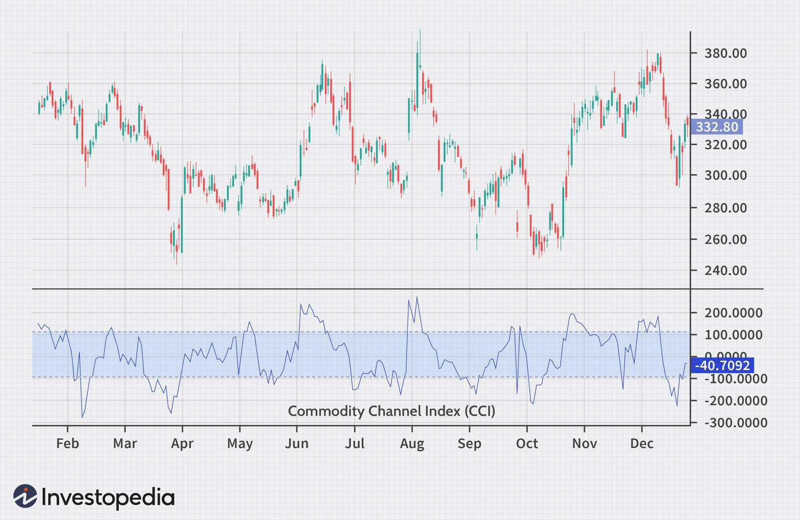

The Commodity Channel Index (CCI) is a significant analytical tool employed across various trading disciplines to assist traders in recognizing cyclical trends within markets. Conceived by Donald Lambert, the CCI was initially tailored for commodities but has since found broad applicability in stocks, forex, and a host of other financial instruments. This article explores how the CCI is used to identify stock trends and develop advanced trading strategies, including its integration into algorithmic trading systems. By grasping the principles and applications of the CCI, traders can substantially improve their decision-making capabilities for both short-term and long-term investments.

## Table of Contents



## What is the Commodity Channel Index (CCI)?

The Commodity Channel Index (CCI) is a prominent technical analysis tool used to measure the deviation of an asset's price from its average price over a certain period. Created by Donald Lambert in 1980, the CCI helps traders detect cyclical trends in financial markets, offering valuable insights regardless of market preference. Although originally intended for commodities, this index has been effectively adapted for stocks, Exchange-Traded Funds (ETFs), and other securities, broadening its utility across different asset classes.

The mathematical formula for calculating the CCI is as follows:

$$
CCI = \frac{{\text{{Typical Price}} - \text{{SMA}}}}{{0.015 \times \text{{Mean Deviation}}}}
$$

Where:
- The Typical Price is usually calculated as the average of the high, low, and closing prices $\left(\frac{{\text{{High}} + \text{{Low}} + \text{{Close}}}}{3}\right)$.
- SMA represents the Simple Moving Average of the typical price over a set period.
- Mean Deviation is the average absolute deviation of the typical price from the SMA.
- 0.015 is a constant to ensure that approximately 70% to 80% of CCI values oscillate between -100 and +100.

Trading with CCI involves analyzing various market conditions to detect long-term trend changes. The indicator provides traders with the capability to spot divergences and potential trend reversals, allowing them to adjust their strategies accordingly. CCI values oscillate around zero, with levels above +100 typically signaling overbought conditions, and levels below -100 indicating oversold conditions. This ability to measure these conditions makes CCI a valuable tool for identifying optimal entry and [exit](/wiki/exit-strategy) points in different market environments.

## Using CCI to Identify Stock Trends

The Commodity Channel Index (CCI) assists traders in identifying stock trends by highlighting overbought or oversold conditions. This indicator oscillates primarily between +100 and -100, where readings above +100 suggest an overbought condition and readings below -100 indicate an oversold condition. Such oscillations are crucial as they provide traders with signals for potential market reversals.

The CCI achieves this by calculating the deviation of the current price from its average price over a specific time period, typically 20 periods. The formula for CCI is expressed as:

$$
CCI = \frac{(Typical \ Price - SMA_{20})}{0.015 \times Mean \ Deviation}
$$

where the Typical Price is the average of the high, low, and close prices for a given period, the SMA is the Simple Moving Average of the typical price over 20 periods, and the Mean Deviation is the average absolute deviation of the typical price from the SMA.

By observing divergences between the CCI and actual price movement, traders can identify potential trend changes. A bullish divergence occurs when the price makes a new low while the CCI fails to reach a new low, suggesting a potential upward reversal. Conversely, a bearish divergence arises when the price makes a new high but the CCI does not reach a new high, indicating a possible downward reversal.

Traders utilize these divergences, along with the threshold signals of +100 and -100, to make informed decisions about market entry and exit points. This strategic approach helps traders anticipate market movements, optimizing their trading activities in both trending and ranging markets.

## CCI Trading Strategies

The Commodity Channel Index (CCI) can be effectively deployed in various trading strategies, including those based on [momentum](/wiki/momentum) and multi-timeframe analyses. These strategies leverage the CCI's ability to highlight potential overbought and oversold conditions, aiding traders in making informed decisions about market entry and exit points.

### Momentum-Based CCI Strategies

Momentum-based strategies use the CCI to detect shifts in price momentum. These strategies often focus on the CCI's crossing of key thresholds, such as +100 and -100. When the CCI crosses above +100, it may signal a strong buying momentum, prompting a potential buy action, while a drop below -100 could indicate emerging selling momentum, suggesting a possible sell action. This approach benefits from respecting the fundamental principle that "the trend is your friend," aiming to capture significant portions of price movements by following established trends.

**Python Example for Momentum-Based Strategy:**

```python
import pandas as pd
import numpy as np

# Assume 'df' is a DataFrame with columns 'Close', 'High', 'Low'
def calculate_cci(df, period=20):
    TP = (df['Close'] + df['High'] + df['Low']) / 3
    SMA = TP.rolling(window=period).mean()
    MAD = TP.rolling(window=period).apply(lambda x: np.mean(np.abs(x - x.mean())), raw=True)
    CCI = (TP - SMA) / (0.015 * MAD)
    return CCI

df['CCI'] = calculate_cci(df)

# Signal generation
def generate_signals(df):
    df['Signal'] = 0
    df.loc[df['CCI'] > 100, 'Signal'] = 1  # Buy signal
    df.loc[df['CCI'] < -100, 'Signal'] = -1  # Sell signal
    return df

df = generate_signals(df)
```

### Multi-Timeframe CCI Strategies

Multi-timeframe strategies enhance trading precision by integrating CCI readings from different timeframes. This approach involves using short-term CCI signals to execute trades while long-term CCI readings provide context on overarching trends. Traders might rely on daily CCI signals for finer entries while weekly CCI values offer an understanding of the broader market direction—ensuring trades align with both immediate momentum and long-term trends.

### Combining CCI with Other Indicators

The confidence level of CCI signals can be improved by combining it with additional indicators, such as moving averages. A popular method is to use moving average crossovers to confirm CCI signals, which helps in reducing the likelihood of false signals. For example, if the CCI indicates a buying opportunity, a trader could wait for the price to also move above a certain moving average as an extra confirmation before entering a trade.

In conclusion, while employing CCI-based strategies, traders must remain adaptable, tailoring their approach for varied market conditions and personal trading objectives. A profound understanding of how CCI integrates within different strategies can enhance a trader's ability to harness its potential effectively.

## CCI in Algorithmic Trading

Algorithmic trading utilizes the Commodity Channel Index (CCI) as a vital component in automated systems, significantly enhancing the efficiency of trading decisions. The CCI is particularly valuable because it provides data-driven insights that facilitate the execution of trades at opportune moments, using its ability to signal overbought or oversold market conditions.

In [algorithmic trading](/wiki/algorithmic-trading), CCI is often integrated into complex strategies designed to interpret market data and make informed decisions autonomously. By employing the CCI, algorithms can gauge the momentum of an asset and predict potential price reversals, allowing traders to enter or exit positions at more favorable prices.

One of the primary advantages of using CCI in algo trading is its quantitative nature, which aligns well with the inherently data-centric approach of automated systems. The CCI is computed as follows:

$$
CCI = \frac{\text{Typical Price} - \text{SMA}}{0.015 \times \text{Mean Deviation}}
$$

where the Typical Price is the average of the high, low, and close prices of an asset, SMA is the Simple Moving Average of the typical price, and the Mean Deviation refers to the average deviation of the typical price from the SMA.

Implementing CCI-based algorithms requires meticulous [backtesting](/wiki/backtesting) to ensure their reliability and performance in real market situations. Backtesting involves running the strategy on historical data to evaluate how it would have performed, thus allowing traders to refine their approach before deploying it live. Here is a simple Python code snippet illustrating how CCI could be calculated using the popular pandas library:

```python
import pandas as pd

# Assume df is a DataFrame with 'High', 'Low', and 'Close' columns
df['Typical Price'] = (df['High'] + df['Low'] + df['Close']) / 3
df['SMA'] = df['Typical Price'].rolling(window=20).mean()
df['Mean Deviation'] = df['Typical Price'].rolling(window=20).apply(lambda x: pd.Series(x).mad())
df['CCI'] = (df['Typical Price'] - df['SMA']) / (0.015 * df['Mean Deviation'])
```

Through rigorous testing and refinement, traders can enhance the robustness of these strategies, ensuring that algorithms using the CCI can adapt to varying market conditions. Properly configured CCI-based algorithmic systems can optimize trade execution, reduce emotional bias, and potentially increase profitability by reacting swiftly to changes in market dynamics.

## Pros and Cons of Using CCI

The Commodity Channel Index (CCI) is valued for its ability to offer clear signals for identifying overbought and oversold market conditions, which supports traders in assessing potential trend reversals. By quantifying how far an asset's price has moved from its average, the CCI provides traders with a framework to forecast potential price movements. This can be particularly useful for identifying emerging trends and enhancing decision-making processes in trading.

However, while the CCI is a powerful tool, it is not without limitations. In volatile or range-bound markets, the CCI can produce false signals, leading traders to anticipate reversals that may not materialize. These inaccuracies often arise when market conditions change rapidly, causing the CCI to reflect short-lived anomalies in price data rather than genuine market trends. Thus, relying solely on CCI without additional confirmation can lead to erroneous trading decisions.

To mitigate the impact of false signals, it is advisable to use the CCI in conjunction with other technical indicators or methods. For instance, integrating moving averages with CCI readings can provide a more comprehensive view of market conditions, thereby increasing the reliability of the signals. Additionally, employing trendlines or support and resistance levels can help in confirming the signals that CCI generates.

In conclusion, while the CCI is a significant component in a trader's toolkit for market analysis, a nuanced understanding of its limitations is crucial. This includes recognizing when the market conditions might undermine the indicator's effectiveness. Appropriate application of CCI, complemented by other analytical tools, can bolster its utility and help traders navigate complex market dynamics more effectively.

## Conclusion

The Commodity Channel Index (CCI) continues to be an advantageous instrument for traders seeking to exploit market opportunities. As an indicator, the CCI provides valuable insights by measuring the deviation of an asset's price from its typical price, offering signals about potential overbought or oversold conditions. This capability is particularly useful for identifying market trends and reversals, making it a popular choice among traders across various financial markets.

Integrating CCI with algorithmic trading frameworks enhances trading efficiency and execution. In automated trading systems, the CCI's quantitative insights enable the timely execution of trades, optimizing the decision-making process. Algorithms can be programmed to react to CCI signals, allowing for systematic trading strategies that are capable of handling large volumes of data and executing trades at precise moments.

To fully exploit the potential of CCI-based strategies, it is essential to combine technical indicators with [fundamental analysis](/wiki/fundamental-analysis). This integrated approach allows traders to understand the broader market context and make well-informed decisions. The CCI, by quantifying market trends, can complement fundamental analyses, which consider economic indicators, industry conditions, and company performance.

Traders should also account for the limitations of the CCI, such as the risk of false signals in volatile or range-bound markets. By employing additional confirmation methods and adapting strategies to specific market conditions, traders can mitigate these risks.

In conclusion, the CCI is a versatile tool that, when used effectively within algorithmic and discretionary trading frameworks, can significantly enhance a trader's ability to analyze market conditions and execute profitable trades.

## References & Further Reading

[1]: Lambert, D. (1980). ["Commodity Channel Index: Tools for Trading Cyclical Trends."](https://store.traders.com/-v01-c05-comm-pdf.html) Lambert/Gann Publishing.

[2]: Murphy, J. J. (1999). ["Technical Analysis of the Financial Markets: A Comprehensive Guide to Trading Methods and Applications."](https://archive.org/details/technicalanalysi0000murp) New York Institute of Finance.

[3]: Pring, M. J. (2002). ["Technical Analysis Explained: The Successful Investor's Guide to Spotting Investment Trends and Turning Points."](https://www.amazon.com/Technical-Analysis-Explained-Fifth-Successful/dp/0071825177) McGraw-Hill Education.

[4]: Chan, E. (2009). ["Quantitative Trading: How to Build Your Own Algorithmic Trading Business."](https://github.com/ftvision/quant_trading_echan_book) Wiley.

[5]: Apel, J. (2010). ["Financial Trading Systems Design and Development."](https://www.chegg.com/textbooks/financial-trading-systems-design-and-development-with-c-1st-edition-9780471667704-0471667706) Wiley.