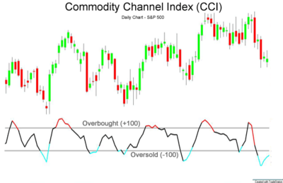

## Table of Contents

## What is the Commodity Channel Index (CCI) and how is it used in trading?

The Commodity Channel Index (CCI) is a technical indicator used by traders to help identify if an asset is overbought or oversold. It was developed by Donald Lambert and is often used to spot potential trend reversals in the price of commodities, stocks, or other financial instruments. The CCI measures the difference between an asset's current price and its average price over a certain period, usually 20 days, and then compares this difference to the average deviation from the average price. When the CCI value moves above +100, it suggests that the asset might be overbought, and when it falls below -100, it indicates that the asset might be oversold.

Traders use the CCI to make decisions about when to buy or sell an asset. If the CCI moves above +100 and then starts to fall back below this level, it might signal that the asset's price is about to drop, which could be a good time to sell. Conversely, if the CCI falls below -100 and then starts to rise back above this level, it might suggest that the asset's price is about to increase, which could be a good time to buy. However, like all technical indicators, the CCI is not perfect and should be used alongside other tools and analysis to make more informed trading decisions.

## Who developed the Commodity Channel Index and when was it introduced?

The Commodity Channel Index, or CCI, was developed by a man named Donald Lambert. He introduced this tool to the world in 1980. Donald Lambert was interested in finding a way to measure how much a commodity's price was moving away from its average price.

The CCI became popular because it helped traders see when a commodity might be overbought or oversold. This means it could help them decide when to buy or sell. Since 1980, many traders have used the CCI to make better trading decisions.

## How is the CCI calculated?

The Commodity Channel Index, or CCI, is calculated by looking at the difference between the current price of a commodity and its average price over a certain time, usually 20 days. First, you find the average price, which is called the Typical Price. The Typical Price is calculated by adding the high price, low price, and closing price of the commodity for each day, then dividing by three. Next, you find the average of these Typical Prices over the last 20 days. This is called the Simple Moving Average (SMA) of the Typical Price.

After finding the SMA, you then calculate the Mean Deviation. The Mean Deviation is the average of how much each day's Typical Price differs from the SMA. To find this, you take the absolute difference between each day's Typical Price and the SMA, then find the average of these differences over the last 20 days. Finally, the CCI is calculated using the formula: CCI = (Typical Price - SMA) / (0.015 x Mean Deviation). The number 0.015 is a constant that helps make the CCI more useful for traders.

## What are the typical settings for the CCI indicator?

The typical setting for the Commodity Channel Index, or CCI, is a 20-day period. This means that when you calculate the CCI, you use the data from the last 20 days to find the average price and the average deviation. The 20-day period is popular because it gives a good balance between being responsive to price changes and not being too jumpy.

In addition to the 20-day period, the CCI uses two important levels: +100 and -100. When the CCI goes above +100, it suggests that the price might be too high, or overbought. When it goes below -100, it suggests that the price might be too low, or oversold. Traders watch these levels to decide when to buy or sell.

## How can the CCI help identify overbought and oversold conditions in stocks?

The Commodity Channel Index, or CCI, helps traders figure out if a stock's price is too high or too low. It does this by comparing the current price of the stock to its average price over the last 20 days. If the CCI goes above +100, it means the stock might be overbought. This means the price has gone up a lot and might be ready to go down soon. Traders might see this as a signal to sell the stock before the price drops.

On the other hand, if the CCI goes below -100, it means the stock might be oversold. This means the price has gone down a lot and might be ready to go back up. Traders might see this as a signal to buy the stock before the price goes up again. By watching the CCI, traders can make better decisions about when to buy or sell stocks, helping them to possibly make more money.

## What are the common trading signals generated by the CCI?

The Commodity Channel Index, or CCI, gives traders signals to buy or sell stocks. One common signal is when the CCI goes above +100 and then comes back down below +100. This can mean the stock's price was too high and might go down soon. Traders might see this as a time to sell the stock before its price drops.

Another common signal is when the CCI goes below -100 and then comes back up above -100. This can mean the stock's price was too low and might go up soon. Traders might see this as a time to buy the stock before its price rises.

Sometimes, traders also look for what's called a "divergence." This happens when the stock's price is going one way, but the CCI is going the other way. For example, if the stock's price is going up but the CCI is going down, it might mean the price will change direction soon. Traders use these signals to make decisions about buying and selling stocks.

## Can the CCI be used effectively in different market conditions, and how?

The Commodity Channel Index, or CCI, can be used in different market conditions because it helps traders see if a stock's price is too high or too low. In a strong trend, the CCI can stay above +100 if the market is going up, or below -100 if the market is going down. Traders can use this to stay in the trend longer, buying when the CCI dips but stays above -100 in an uptrend, or selling when it rises but stays below +100 in a downtrend.

In a sideways market, where prices don't go up or down much, the CCI can help traders find good times to buy and sell. When the CCI goes above +100 and then comes back down, it might be a good time to sell. When it goes below -100 and then comes back up, it might be a good time to buy. This way, traders can make money even when the market isn't moving much.

## How does the CCI compare to other momentum indicators like the RSI?

The Commodity Channel Index (CCI) and the Relative Strength Index (RSI) are both popular tools that traders use to see if a stock's price is too high or too low. The CCI measures how much the current price of a stock is different from its average price over a period, usually 20 days. If the CCI is above +100, it means the stock might be overbought, and if it's below -100, it might be oversold. On the other hand, the RSI looks at how fast the price is going up or down and compares it to recent price changes. The RSI is usually set to a 14-day period, and if it's above 70, it means the stock might be overbought, and if it's below 30, it might be oversold.

Both the CCI and the RSI can help traders decide when to buy or sell stocks, but they work a bit differently. The CCI is good at showing strong trends because it can stay above +100 or below -100 for a long time during a big move in the market. This makes it useful for traders who want to stay in a trend longer. The RSI, however, is better at showing when a stock might be ready to change direction because it tends to move back to the middle more quickly. Traders often use both the CCI and the RSI together to get a better picture of what the market is doing.

## What are the limitations and potential pitfalls of using the CCI in trading?

Using the Commodity Channel Index, or CCI, for trading can be tricky because it's not perfect. One big problem is that the CCI can give false signals. This means it might tell you to buy or sell a stock, but the price doesn't actually move the way you expected. For example, the CCI might go above +100 and then come back down, making you think the price will drop, but the price keeps going up instead. This can lead to losing money if you follow the CCI's signals without thinking about other things.

Another issue with the CCI is that it can be slow to react to quick changes in the market. Sometimes, the market moves very fast, and the CCI might not catch these moves right away. This means you might miss out on good trading chances because the CCI didn't update fast enough. It's also important to remember that the CCI works best when used with other tools. If you only use the CCI, you might not see the whole picture of what's happening in the market, which can lead to bad trading decisions.

## How can traders combine the CCI with other technical indicators for better results?

Traders can combine the CCI with other technical indicators to make better trading decisions. One popular way is to use the CCI with the Moving Average Convergence Divergence, or MACD. The MACD helps show the strength and direction of a trend. When the CCI goes above +100 and the MACD line crosses above the signal line, it might be a good time to buy. On the other hand, if the CCI goes below -100 and the MACD line crosses below the signal line, it might be a good time to sell. By using both indicators together, traders can feel more confident that the signals they see are strong and worth acting on.

Another useful combination is using the CCI with the Relative Strength Index, or RSI. The RSI helps traders see if a stock is overbought or oversold too. If both the CCI and RSI show that a stock is overbought (CCI above +100 and RSI above 70), it might be a strong sign to sell. If both show that a stock is oversold (CCI below -100 and RSI below 30), it might be a strong sign to buy. Using these two indicators together can help traders avoid false signals and make more accurate predictions about when to buy or sell.

## What advanced strategies can be employed using the CCI for trend trading?

One advanced strategy for trend trading with the CCI is to use it to stay in a trend longer. In an uptrend, the CCI can stay above +100 for a long time. Instead of selling when the CCI first dips below +100, traders can wait for it to come back above +100 again. This way, they can ride the trend longer and make more money. In a downtrend, the opposite is true. Traders can wait for the CCI to go below -100 and then come back down below -100 again before selling. This helps them stay in the downtrend longer and avoid selling too early.

Another strategy is to use the CCI with other trend indicators like moving averages. For example, a trader might use a 50-day moving average to confirm the trend direction. If the price is above the 50-day moving average and the CCI is above +100, it's a strong sign of an uptrend. The trader can buy the stock and keep it as long as these conditions are met. If the price falls below the 50-day moving average or the CCI falls below +100, it might be time to sell. This combination helps traders confirm the trend and make better decisions about when to enter and exit trades.

## How can the CCI be optimized for algorithmic trading systems?

To optimize the CCI for algorithmic trading systems, traders can adjust the period length of the CCI to better fit the specific market they are trading in. The standard setting is 20 days, but changing this to a shorter period like 10 days can make the CCI more sensitive to price changes, which is useful for short-term trading. On the other hand, using a longer period like 30 days can make the CCI less sensitive and better for longer-term trends. Traders can test different period lengths to see which one gives the best results for their trading strategy.

Another way to optimize the CCI is to combine it with other indicators in the algorithm. For example, using the CCI with the Moving Average Convergence Divergence (MACD) can help confirm trading signals. If the CCI goes above +100 and the MACD line crosses above the signal line, the algorithm can generate a buy signal. If the CCI goes below -100 and the MACD line crosses below the signal line, it can generate a sell signal. By using these indicators together, the algorithm can make more accurate predictions and improve its performance.

## What is the Commodity Channel Index (CCI)?

The Commodity Channel Index (CCI) is a prominent technical analysis tool used to measure the deviation of an asset's price from its average price over a certain period. Created by Donald Lambert in 1980, the CCI helps traders detect cyclical trends in financial markets, offering valuable insights regardless of market preference. Although originally intended for commodities, this index has been effectively adapted for stocks, Exchange-Traded Funds (ETFs), and other securities, broadening its utility across different asset classes.

The mathematical formula for calculating the CCI is as follows:

$$
CCI = \frac{{\text{{Typical Price}} - \text{{SMA}}}}{{0.015 \times \text{{Mean Deviation}}}}
$$

Where:
- The Typical Price is usually calculated as the average of the high, low, and closing prices $\left(\frac{{\text{{High}} + \text{{Low}} + \text{{Close}}}}{3}\right)$.
- SMA represents the Simple Moving Average of the typical price over a set period.
- Mean Deviation is the average absolute deviation of the typical price from the SMA.
- 0.015 is a constant to ensure that approximately 70% to 80% of CCI values oscillate between -100 and +100.

Trading with CCI involves analyzing various market conditions to detect long-term trend changes. The indicator provides traders with the capability to spot divergences and potential trend reversals, allowing them to adjust their strategies accordingly. CCI values oscillate around zero, with levels above +100 typically signaling overbought conditions, and levels below -100 indicating oversold conditions. This ability to measure these conditions makes CCI a valuable tool for identifying optimal entry and [exit](/wiki/exit-strategy) points in different market environments.

## How can CCI be used to identify stock trends?

The Commodity Channel Index (CCI) assists traders in identifying stock trends by highlighting overbought or oversold conditions. This indicator oscillates primarily between +100 and -100, where readings above +100 suggest an overbought condition and readings below -100 indicate an oversold condition. Such oscillations are crucial as they provide traders with signals for potential market reversals.

The CCI achieves this by calculating the deviation of the current price from its average price over a specific time period, typically 20 periods. The formula for CCI is expressed as:

$$
CCI = \frac{(Typical \ Price - SMA_{20})}{0.015 \times Mean \ Deviation}
$$

where the Typical Price is the average of the high, low, and close prices for a given period, the SMA is the Simple Moving Average of the typical price over 20 periods, and the Mean Deviation is the average absolute deviation of the typical price from the SMA.

By observing divergences between the CCI and actual price movement, traders can identify potential trend changes. A bullish divergence occurs when the price makes a new low while the CCI fails to reach a new low, suggesting a potential upward reversal. Conversely, a bearish divergence arises when the price makes a new high but the CCI does not reach a new high, indicating a possible downward reversal.

Traders utilize these divergences, along with the threshold signals of +100 and -100, to make informed decisions about market entry and exit points. This strategic approach helps traders anticipate market movements, optimizing their trading activities in both trending and ranging markets.

## What is the role of CCI in Algorithmic Trading?

Algorithmic trading utilizes the Commodity Channel Index (CCI) as a vital component in automated systems, significantly enhancing the efficiency of trading decisions. The CCI is particularly valuable because it provides data-driven insights that facilitate the execution of trades at opportune moments, using its ability to signal overbought or oversold market conditions.

In [algorithmic trading](/wiki/algorithmic-trading), CCI is often integrated into complex strategies designed to interpret market data and make informed decisions autonomously. By employing the CCI, algorithms can gauge the [momentum](/wiki/momentum) of an asset and predict potential price reversals, allowing traders to enter or exit positions at more favorable prices.

One of the primary advantages of using CCI in algo trading is its quantitative nature, which aligns well with the inherently data-centric approach of automated systems. The CCI is computed as follows:

$$
CCI = \frac{\text{Typical Price} - \text{SMA}}{0.015 \times \text{Mean Deviation}}
$$

where the Typical Price is the average of the high, low, and close prices of an asset, SMA is the Simple Moving Average of the typical price, and the Mean Deviation refers to the average deviation of the typical price from the SMA.

Implementing CCI-based algorithms requires meticulous [backtesting](/wiki/backtesting) to ensure their reliability and performance in real market situations. Backtesting involves running the strategy on historical data to evaluate how it would have performed, thus allowing traders to refine their approach before deploying it live. Here is a simple Python code snippet illustrating how CCI could be calculated using the popular pandas library:

```python
import pandas as pd

# Assume df is a DataFrame with 'High', 'Low', and 'Close' columns
df['Typical Price'] = (df['High'] + df['Low'] + df['Close']) / 3
df['SMA'] = df['Typical Price'].rolling(window=20).mean()
df['Mean Deviation'] = df['Typical Price'].rolling(window=20).apply(lambda x: pd.Series(x).mad())
df['CCI'] = (df['Typical Price'] - df['SMA']) / (0.015 * df['Mean Deviation'])
```

Through rigorous testing and refinement, traders can enhance the robustness of these strategies, ensuring that algorithms using the CCI can adapt to varying market conditions. Properly configured CCI-based algorithmic systems can optimize trade execution, reduce emotional bias, and potentially increase profitability by reacting swiftly to changes in market dynamics.

## References & Further Reading

[1]: Lambert, D. (1980). ["Commodity Channel Index: Tools for Trading Cyclical Trends."](https://store.traders.com/-v01-c05-comm-pdf.html) Lambert/Gann Publishing.

[2]: Murphy, J. J. (1999). ["Technical Analysis of the Financial Markets: A Comprehensive Guide to Trading Methods and Applications."](https://archive.org/details/technicalanalysi0000murp) New York Institute of Finance.

[3]: Pring, M. J. (2002). ["Technical Analysis Explained: The Successful Investor's Guide to Spotting Investment Trends and Turning Points."](https://www.amazon.com/Technical-Analysis-Explained-Fifth-Successful/dp/0071825177) McGraw-Hill Education.

[4]: Chan, E. (2009). ["Quantitative Trading: How to Build Your Own Algorithmic Trading Business."](https://github.com/ftvision/quant_trading_echan_book) Wiley.

[5]: Apel, J. (2010). ["Financial Trading Systems Design and Development."](https://www.chegg.com/textbooks/financial-trading-systems-design-and-development-with-c-1st-edition-9780471667704-0471667706) Wiley.