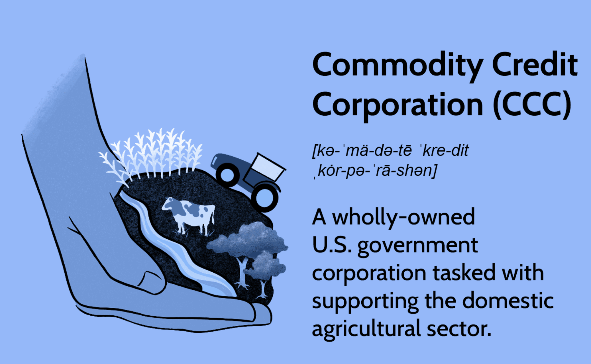

The global agriculture sector is expansive and complex, characterized by a myriad of entities and programs designed to bolster and stabilize the industry. Among these key players is the Commodity Credit Corporation (CCC), a vital component of the U.S. government connected to the Department of Agriculture (USDA). The CCC is instrumental in ensuring the economic stability and viability of American agriculture by providing farmers with essential financial assistance through various subsidies and support mechanisms. 

This article aims to highlight the significance of federal agriculture programs under the USDA, emphasizing the instrumental role played by the CCC in boosting agricultural markets both domestically and internationally. Moreover, the piece will explore contemporary advancements in the agricultural market, such as algorithmic trading, which is rapidly transforming the landscape by automating transactions and improving market efficiency. These developments not only mitigate risks associated with price volatility but also allow stakeholders to make more informed and strategic decisions.



Through a nuanced understanding of these elements, this article provides insights into how federal programs and technological advancements are paving the way for increased innovation and sustainability in agriculture, ensuring that it remains a robust pillar of economic growth and food security.

## Table of Contents

## Understanding the Commodity Credit Corporation (CCC)

The Commodity Credit Corporation (CCC) is a fundamental entity within the U.S. government, especially in terms of agricultural affairs. Instituted during the tumultuous period of the Great Depression in 1933, the CCC was created to address the dire economic conditions faced by farmers due to plummeting crop prices and widespread agricultural failure. Its primary mission remains to stabilize, support, and bolster farm income and commodity prices, ensuring the viability and sustainability of the agricultural industry.

Functioning as a wholly-owned government corporation, the CCC operates under the aegis of the U.S. Department of Agriculture (USDA). It employs a variety of mechanisms to offer financial assistance to American farmers. These include providing subsidies, offering farm income support, and implementing price stabilization strategies. By purchasing, selling, lending, and making payments directly to farmers, the CCC plays an instrumental role in cushioning the agricultural sector against economic fluctuations and market volatility. This not only helps stabilize individual farm incomes but also contributes to greater economic stability across rural communities and the agricultural industry as a whole.

Additionally, the CCC works closely with the USDA to cultivate both domestic and international markets for U.S. agricultural products. This collaboration is crucial in enhancing U.S. competitiveness on a global scale, opening new markets for American farmers, and reducing trade barriers. By promoting exports through various programs, the CCC helps to create a demand that supports domestic prices and farm incomes.

The CCC also administers several crucial programs under its mandate, such as non-recourse marketing assistance loans and loan deficiency payments, which provide farmers with interim financing at harvest time to meet cash flow needs. This financial support mitigates the pressure on farmers to sell immediately after harvest when prices are typically at their lowest.

Overall, the CCC's multifaceted approach is designed to offer robust support to the agricultural sector, helping farmers navigate market challenges and achieve more stable and predictable incomes. Through its strategic initiatives, the CCC continues to be a pivotal force in promoting agricultural prosperity and sustainability in the United States.

## Key Federal Agriculture Programs Under USDA

The U.S. Department of Agriculture (USDA) administers numerous programs designed to support the agricultural sector, addressing challenges such as income variability, environmental conservation, and market risks. A significant portion of these initiatives focuses on providing financial stability and promoting sustainable farming practices.

One essential component of USDA's support structure is income support programs like Agriculture Risk Coverage (ARC) and Price Loss Coverage (PLC). These programs offer financial safety nets to farmers facing substantial price drops in global markets, ensuring a more stable income stream. The ARC program provides revenue loss coverage based on historical production, while the PLC program offers protection when national crop prices fall below reference prices set by law. Together, these programs help mitigate the financial risks inherent in the agricultural sector, providing essential support to farm income.

Conservation efforts, another vital aspect of USDA's initiatives, are encapsulated in programs such as the Conservation Reserve Program (CRP). The CRP aims to assist farm owners in converting environmentally-sensitive acreage into resource-conserving uses. By incentivizing the preservation of land, CRP not only aids in maintaining biodiversity but also helps to improve water quality, control soil erosion, and enhance wildlife habitats. Farmers enrolled in the program receive annual rental payments and cost-share assistance for establishing long-term conservation practices, contributing to the sustainability of agricultural landscapes.

These programs underscore USDA's comprehensive approach to addressing the multifaceted challenges faced by the agricultural sector, balancing economic support with environmental stewardship. By providing a robust framework of financial assistance and conservation incentives, USDA ensures the vitality and sustainability of U.S. agriculture.

## Advanced Technologies in Agriculture: Algorithmic Trading

Algorithmic trading within the agricultural sector represents a significant technological advancement, optimizing the execution of trades by leveraging automated systems based on pre-defined criteria. This modern approach has become increasingly essential in commodities markets, where the volatile nature of prices demands rapid and efficient trading responses. By automating decision-making processes, [algorithmic trading](/wiki/algorithmic-trading) enhances market efficiency and reduces transaction costs, offering substantial advantages to traders who can respond instantaneously to market fluctuations.

Through algorithmic trading, agricultural commodities are traded by deploying algorithms that analyze data patterns and execute trades instantaneously. These algorithms consider numerous market variables such as price, [volume](/wiki/volume-trading-strategy), and time, to make decisions that align with predetermined trading strategies. For example, if the goal is to buy low and sell high, the algorithm can monitor market conditions continuously and execute trades whenever these criteria are met without human intervention.

Machine learning and data analytics play a pivotal role in the development and implementation of algorithmic trading platforms. As a branch of [artificial intelligence](/wiki/ai-artificial-intelligence), [machine learning](/wiki/machine-learning) enables systems to learn from data inputs and improve their performance over time without being explicitly programmed. This capability is crucial in agriculture, where markets are influenced by a myriad of unpredictable factors, including weather patterns, geopolitical events, and economic shifts.

By integrating machine learning, algorithmic trading platforms can identify trends and anomalies within the market data that may not be immediately apparent to human traders. The algorithms can be coded in various programming languages like Python, which offers libraries such as NumPy for numerical computing, Pandas for data manipulation, and Scikit-learn for machine learning tasks. Here is a simplified example of a basic algorithmic trading strategy implemented in Python:

```python
import numpy as np
import pandas as pd
from sklearn.linear_model import LinearRegression

# Sample data for demonstration purposes
data = pd.DataFrame({
    'price': [100, 102, 104, 103, 105, 106, 105, 107, 108, 107],
    'volume': [200, 220, 250, 230, 240, 260, 240, 270, 280, 260]
})

# Define features and target
X = data[['price', 'volume']]
y = np.sign(np.diff(data['price'], prepend=data['price'][0]))

# Initialize and train the model
model = LinearRegression()
model.fit(X, y)

# Predict the price movement
predictions = model.predict(X)
trade_signals = np.where(predictions > 0, 'buy', 'sell')

print(trade_signals)
```

In this example, a linear regression model predicts future price movements based on historical price and volume data, generating buy or sell signals. Such models provide traders with a systematic approach to manage risks by anticipating market movements.

The transformation spurred by algorithmic trading is paving the way for a more sophisticated and resilient agricultural market infrastructure. By continuously advancing with machine learning capabilities, these platforms enable stakeholders in the agricultural industry to make well-informed decisions, hedging against risks while maximizing potential returns. As these systems become more integrated, market participants can expect even greater accuracy in trade executions and advanced risk management solutions.

## The Future of Agriculture with Technology Integration

The integration of advanced technologies such as Artificial Intelligence (AI), the Internet of Things (IoT), and big data analytics is poised to dramatically transform agricultural practices. These innovations are not merely enhancements but are set to reconfigure the landscape of agriculture towards increased productivity, efficiency, and sustainability.

AI technologies contribute significantly to precision agriculture, where machine learning algorithms analyze data from various sources to optimize planting schedules, irrigation, and harvesting. For instance, AI can predict weather patterns and assess soil health, allowing farmers to make informed decisions that improve yield outcomes. Moreover, AI-driven crop monitoring systems using drones can detect pest infestation or disease spread at an early stage, enabling timely intervention.

The application of IoT devices in agriculture enables real-time data collection and feedback through sensors placed in fields. These sensors monitor a range of environmental conditions, including soil moisture, nutrient levels, and temperature. This continuous stream of data facilitates efficient resource management by adjusting irrigation systems and fertilizer use precisely where needed, thus conserving resources and reducing environmental impact.

Big data analytics further enhances agricultural productivity by processing vast amounts of data collected from farms. These analyses help in understanding complex agricultural processes, identifying trends, and predicting future events with high accuracy. For example, modeling techniques using big data can simulate different farming scenarios, offering insights that lead to improved decision-making strategies.

Smart farming solutions, which integrate AI, IoT, and big data, offer promising improvements in the agricultural sector. Such technologies enable comprehensive farm management systems that automate tasks, reduce manual labor, and improve operational efficiency. This enhances not only production but also aligns agricultural practices with sustainable development goals.

The U.S. Department of Agriculture (USDA) and the Commodity Credit Corporation (CCC) play pivotal roles in implementing policies that support and promote these technologies. By funding research and encouraging partnerships between tech developers and farmers, they facilitate the integration of cutting-edge technologies into traditional farming practices. This strategic support ensures that the technological advancements translate into tangible benefits for the U.S. agricultural sector, fostering innovation that bolsters economic growth and environmental stewardship.

## Conclusion

The Commodity Credit Corporation (CCC), operating under the umbrella of the U.S. Department of Agriculture (USDA), remains a fundamental support structure for the U.S. agricultural sector. By providing financial assistance to farmers and stabilizing market conditions, the CCC ensures the continuity and resilience of U.S. agriculture. As technology advances, the integration of algorithmic trading and other technological innovations enhances the sector’s operational efficiency. Algorithmic trading simplifies complex market transactions through automation, offering a systematic approach to buying and selling commodities. This advancement not only optimizes trading activities but also contributes to a more robust agricultural market infrastructure capable of quickly responding to dynamic market shifts.

The alignment of technology with agriculture signals a promising era of increased innovation and growth, potentially revolutionizing traditional practices. Smart farming technologies harnessing artificial intelligence, Internet of Things (IoT), and big data analytics are poised to significantly enhance productivity and sustainability. These advancements promise a more efficient use of resources, precise monitoring of crop health, and better adaptation strategies for climate change impacts.

Moving forward, the collaboration between entities like the CCC and USDA, along with stakeholders across the agricultural supply chain, will be pivotal in driving policy and development initiatives. These initiatives aim to integrate cutting-edge technologies into agricultural practices, ensuring the sector’s sustained growth and competitiveness. A future where agriculture is intertwined with technology presents opportunities for substantial progress, promising a more secure and innovative agricultural landscape. Stakeholders in this evolving field should anticipate rapid advancements and prepare to leverage these tools to their advantage, thus fostering a robust and forward-looking agricultural ecosystem.

## References & Further Reading

[1]: US Department of Agriculture. ["The Role of the Commodity Credit Corporation in Agricultural Support."](https://www.usda.gov/farming-and-ranching/resources-small-and-mid-sized-farmers/commodity-credit-corporation)

[2]: Michaels, S. (2019). ["Algorithmic Trading in Commodity Markets."](https://www.sciencedirect.com/science/article/pii/S0957417423022133) Investopedia.

[3]: Lopez, M. (2018). ["Advances in Financial Machine Learning."](https://www.amazon.com/Advances-Financial-Machine-Learning-Marcos/dp/1119482089) Wiley.

[4]: Aronson, D. (2006). ["Evidence-Based Technical Analysis: Applying the Scientific Method and Statistical Inference to Trading Signals."](https://www.amazon.com/Evidence-Based-Technical-Analysis-Scientific-Statistical/dp/0470008741) Wiley.

[5]: Jansen, S. (2018). ["Machine Learning for Algorithmic Trading."](https://github.com/stefan-jansen/machine-learning-for-trading) Packt Publishing.

[6]: Chan, E. (2009). ["Quantitative Trading: How to Build Your Own Algorithmic Trading Business."](https://github.com/ftvision/quant_trading_echan_book) Wiley.