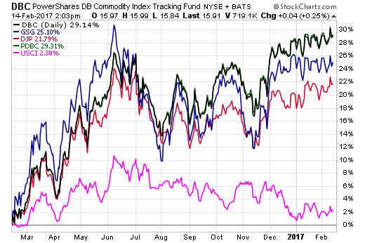

## Table of Contents

## What is a Commodity ETF?

A Commodity ETF, or Exchange-Traded Fund, is a type of investment fund that focuses on commodities. Commodities are basic goods like gold, oil, or agricultural products that can be traded. A Commodity ETF allows investors to buy and sell shares of the fund on a stock exchange, just like they would with stocks. This makes it easier for people to invest in commodities without having to buy the actual physical goods.

These ETFs can track the price of a single commodity, like silver, or a basket of commodities, like a mix of energy and metals. They do this by either holding the actual commodities, investing in futures contracts, or using other financial instruments. This gives investors a way to diversify their portfolios and potentially protect against inflation, as commodity prices often rise when the value of money goes down.

## How does a Commodity ETF work?

A Commodity ETF works by letting people invest in commodities without having to buy them directly. Instead of buying gold or oil, you can buy shares of a Commodity ETF that tracks the price of these goods. These ETFs are traded on stock exchanges, so you can buy and sell them easily, just like you would with regular stocks. The ETF holds the commodities or uses financial tools like futures contracts to follow the price movements of the commodities it's focused on.

When you invest in a Commodity [ETF](/wiki/etf-trading-strategies), your money is pooled with other investors' money. The fund manager then uses this money to buy the commodities or related financial instruments. If the price of the commodity goes up, the value of the ETF usually goes up too, and vice versa. This way, you can benefit from changes in commodity prices without having to store or manage the physical goods yourself. It's a simple way to diversify your investments and possibly protect against inflation, as commodity prices often rise when the value of money falls.

## What are the different types of Commodity ETFs?

There are several types of Commodity ETFs, each designed to give investors different ways to invest in commodities. Some ETFs focus on a single commodity, like gold or oil. These are called single-commodity ETFs. They track the price of just one type of commodity, so if you believe the price of gold will go up, you might buy shares in a gold ETF. Other ETFs are broader and track a group of commodities, like a mix of energy, metals, and agriculture. These are called diversified commodity ETFs. They spread the risk across different types of commodities, which can be safer but might also mean smaller gains if one commodity does really well.

Another type of Commodity ETF is the physically backed ETF. These ETFs actually hold the physical commodity, like gold bars in a vault, and the value of the ETF is based on the value of that commodity. This can be a good way to invest if you want to own the actual commodity but don't want to store it yourself. On the other hand, there are ETFs that use futures contracts instead of holding the physical commodity. Futures-based ETFs invest in contracts that promise to buy or sell a commodity at a future date. These can be riskier because the price of the futures contract might not always match the price of the commodity itself, but they can also offer more flexibility and sometimes higher returns.

## What are the benefits of investing in Commodity ETFs?

Investing in Commodity ETFs can help you spread out your money and lower your risk. Instead of putting all your money into one thing like stocks or bonds, you can put some into commodities. This way, if something bad happens to the stock market, your commodity investments might still do well. Commodities like gold and oil often go up in price when other investments go down, so they can protect your money when times are tough.

Another good thing about Commodity ETFs is that they are easy to buy and sell. You don't have to worry about storing physical goods like gold or oil, because the ETF does that for you. You can buy and sell shares of the ETF on a stock exchange just like you would with regular stocks. This makes it simple to get in and out of your investment whenever you want. Plus, Commodity ETFs can help you fight inflation. When the value of money goes down, the prices of commodities often go up, so your investment might grow even when other things don't.

## What are the risks associated with Commodity ETFs?

Investing in Commodity ETFs can be risky because the prices of commodities can change a lot. Things like weather, politics, or big economic changes can make commodity prices go up and down quickly. If you invest in a Commodity ETF and the price of the commodity it tracks goes down, you could lose money. Also, some Commodity ETFs use futures contracts, which are agreements to buy or sell a commodity at a future date. These can be even riskier because the price of the futures contract might not match the actual price of the commodity, which can lead to unexpected losses.

Another risk is that Commodity ETFs can be less liquid than other investments. This means it might be harder to buy or sell shares of the ETF quickly, especially if the market is doing badly. If a lot of people want to sell their shares at the same time, the price of the ETF can drop a lot. Also, some Commodity ETFs have high fees, which can eat into your profits over time. So, while Commodity ETFs can be a good way to diversify your investments, you need to be aware of these risks and think carefully before you invest.

## How can Commodity ETFs be used in a diversified investment portfolio?

Commodity ETFs can be a helpful part of a diversified investment portfolio because they let you invest in things like gold, oil, and farm products without buying them directly. By adding Commodity ETFs to your portfolio, you spread your money across different types of investments. This can help lower your risk because if the stock market goes down, the prices of commodities might go up. This way, you're not putting all your eggs in one basket, and your overall investments might be safer.

Using Commodity ETFs can also help you fight inflation. When the value of money goes down, the prices of commodities often go up. So, if you have some of your money in Commodity ETFs, your investments might grow even when other things don't. Just remember that while Commodity ETFs can make your portfolio more diverse, they also come with risks. The prices of commodities can change a lot because of things like weather, politics, or big economic changes. So, it's important to think carefully and maybe talk to a financial advisor before you invest.

## What factors should be considered when choosing a Commodity ETF?

When choosing a Commodity ETF, it's important to think about what kind of commodity you want to invest in. Some ETFs focus on just one commodity, like gold or oil, while others invest in a mix of different commodities. If you believe the price of a specific commodity will go up, you might choose a single-commodity ETF. But if you want to spread your risk across different types of commodities, a diversified commodity ETF could be a better choice. Also, consider whether you want the ETF to hold the actual commodity or use futures contracts. Physically backed ETFs hold the real commodity, which can be less risky but might have higher costs. Futures-based ETFs use contracts, which can be riskier but might offer more flexibility and higher returns.

Another thing to think about is the fees and costs of the ETF. Some Commodity ETFs have high fees, which can eat into your profits over time. Look for ETFs with lower expense ratios to keep more of your money. Also, check the [liquidity](/wiki/liquidity-risk-premium) of the ETF. This means how easy it is to buy and sell shares. More liquid ETFs are easier to trade and might have smaller price changes when you buy or sell. Finally, consider the performance history of the ETF. While past performance doesn't guarantee future results, it can give you an idea of how the ETF has done in different market conditions. By looking at all these factors, you can choose a Commodity ETF that fits your investment goals and risk tolerance.

## How do Commodity ETFs compare to other investment vehicles like futures and stocks?

Commodity ETFs are different from futures and stocks in a few key ways. When you invest in a Commodity ETF, you're buying shares of a fund that tracks the price of commodities like gold or oil. This is easier than buying futures contracts, which are agreements to buy or sell a commodity at a future date. Futures can be riskier and more complicated because their prices might not match the actual commodity prices. Stocks, on the other hand, are shares in a company. When you buy stocks, you're betting on the company's success, not the price of a commodity. Commodity ETFs let you invest in commodities without having to deal with the complexities of futures or the company-specific risks of stocks.

Another difference is how easy it is to buy and sell these investments. Commodity ETFs are traded on stock exchanges, just like stocks, so you can buy and sell them easily during market hours. This makes them more liquid than futures, which might be harder to trade quickly. Stocks are also easy to trade, but their value depends on the company's performance, not just the commodity market. Commodity ETFs can help diversify your portfolio because they often move differently from stocks and bonds. This can protect your money when other investments are doing badly, but they also come with their own risks, like big price swings in the commodity markets.

## What are the tax implications of investing in Commodity ETFs?

When you invest in Commodity ETFs, you need to think about taxes. If you buy and sell shares of a Commodity ETF within a year, any profit you make is considered a short-term capital gain. This is taxed as regular income, which can be higher than other types of investment gains. If you hold the ETF for more than a year, the profit is a long-term capital gain, which usually has a lower tax rate. Some Commodity ETFs that use futures contracts might also be taxed differently. They can generate what's called "unrelated business taxable income" (UBTI), which can affect how you report your taxes, especially if you hold them in a retirement account like an IRA.

Another thing to consider is that Commodity ETFs might give you dividends or interest, which can also be taxed. Dividends are usually taxed at a special rate, but it depends on how long you've held the ETF. If the ETF holds physical commodities, like gold, you might not get dividends, but any profit you make when you sell the ETF is still taxable. It's a good idea to talk to a tax advisor to understand how investing in Commodity ETFs will affect your taxes, as the rules can be different based on your situation and the type of ETF you choose.

## How have Commodity ETFs performed historically?

Commodity ETFs have had ups and downs over the years. They often do well when the economy is growing and demand for things like oil and metals goes up. For example, during the early 2000s, many Commodity ETFs saw big gains because of rising commodity prices. But they can also lose money when the economy slows down or there's a big drop in commodity prices. Like in 2008, during the financial crisis, many Commodity ETFs lost a lot of value because people were buying less and prices fell.

Looking at the long term, Commodity ETFs can be a good way to protect against inflation. When the value of money goes down, the prices of commodities often go up. So, over time, these ETFs might help keep your money's value from shrinking. But they can be risky because commodity prices can change a lot. That's why it's important to think about how much risk you're willing to take and maybe mix Commodity ETFs with other types of investments to balance things out.

## What are some strategies for trading Commodity ETFs?

One strategy for trading Commodity ETFs is to use them as a way to protect your money from inflation. When the value of money goes down, the prices of commodities like gold and oil often go up. So, you can buy Commodity ETFs when you think inflation is going to get worse. This way, your investment might grow even when other things don't. You can hold onto these ETFs for a long time to ride out the ups and downs of the commodity market.

Another strategy is to trade Commodity ETFs based on what's happening in the world. Things like weather, politics, and big economic changes can make commodity prices move a lot. For example, if there's a big storm that might hurt crop production, you might buy an agricultural Commodity ETF because the price of those commodities could go up. You can buy and sell these ETFs quickly to take advantage of short-term price changes. Just remember, this can be riskier because commodity prices can be hard to predict.

A third strategy is to use Commodity ETFs to spread out your investments. Instead of putting all your money into stocks or bonds, you can put some into commodities. This can help lower your risk because if the stock market goes down, the prices of commodities might go up. You can buy a mix of Commodity ETFs that track different types of commodities, like energy, metals, and agriculture. This way, you're not betting on just one thing, and your overall investments might be safer.

## What are the future trends and developments expected in the Commodity ETF market?

The Commodity ETF market is expected to keep growing as more people look for ways to invest in things like gold, oil, and farm products. One big trend is that more and more Commodity ETFs are being made that focus on green and sustainable commodities. This means there will be more ETFs that invest in things like renewable energy or eco-friendly metals. As people care more about the environment, these kinds of ETFs might become more popular. Another trend is the use of technology to make trading Commodity ETFs easier. With better trading tools and more information available online, it's becoming simpler for people to buy and sell these ETFs and make smart investment choices.

Another development to watch is how Commodity ETFs might change to fit new rules and laws. Governments around the world are starting to pay more attention to how commodities are traded and how they affect the environment. This might mean new rules for Commodity ETFs, which could change how they work or what they can invest in. Also, as the world's economy keeps changing, the demand for different commodities might shift. For example, if more countries start using electric cars, the demand for oil might go down, but the demand for metals used in batteries might go up. This could lead to new types of Commodity ETFs that focus on these changing trends.

## References & Further Reading

[1]: Bhardwaj, G., Gorton, G. B., & Rouwenhorst, K. G. (2008). ["Fooling Some of the People All of the Time: The Inefficient Performance and Persistence of Commodity Trading Advisors."](https://papers.ssrn.com/sol3/papers.cfm?abstract_id=1279594) Review of Financial Studies, 21(1), 177-219.

[2]: Lopez de Prado, M. (2018). ["Advances in Financial Machine Learning."](https://www.amazon.com/Advances-Financial-Machine-Learning-Marcos/dp/1119482089) Wiley.

[3]: Aronson, D. R. (2007). ["Evidence-Based Technical Analysis: Applying the Scientific Method and Statistical Inference to Trading Signals."](https://onlinelibrary.wiley.com/doi/book/10.1002/9781118268315) Wiley.

[4]: Jansen, S. (2020). ["Machine Learning for Algorithmic Trading."](https://github.com/stefan-jansen/machine-learning-for-trading) Packt Publishing.

[5]: Chan, E. P. (2009). ["Quantitative Trading: How to Build Your Own Algorithmic Trading Business."](https://github.com/ftvision/quant_trading_echan_book) Wiley.