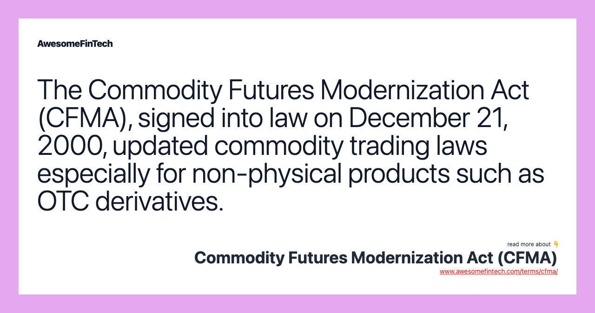

## Table of Contents

## What is the Commodity Futures Modernization Act (CFMA)?

The Commodity Futures Modernization Act (CFMA) is a law that was passed in the United States in 2000. It made big changes to how trading of futures and derivatives worked. Before the CFMA, there were a lot of rules about these kinds of trades. The CFMA made it easier for people to trade futures and derivatives without so many restrictions.

One big thing the CFMA did was to say that certain kinds of trades did not have to follow the old rules. This included trades that happened between big banks and other big financial companies. The idea was to let these companies do more business and make more money. But some people think that the CFMA also made it easier for risky trades to happen, which could lead to problems in the economy.

## When was the Commodity Futures Modernization Act signed into law?

The Commodity Futures Modernization Act was signed into law on December 21, 2000. This was a big change for how trading worked in the United States. The law made it easier for big banks and financial companies to trade futures and derivatives without following a lot of old rules.

Before the CFMA, there were many restrictions on these kinds of trades. The new law said that certain trades between big companies did not have to follow the old rules. This was meant to help these companies do more business and make more money. But some people worry that it also made risky trades easier, which could cause problems in the economy.

## What were the main objectives of the CFMA?

The main goal of the Commodity Futures Modernization Act (CFMA) was to update the rules about trading futures and derivatives. Before the CFMA, there were a lot of strict rules that made it hard for big banks and financial companies to trade these products. The CFMA wanted to make it easier for these big companies to do business by getting rid of some of the old rules. This was supposed to help the economy by letting these companies trade more and make more money.

Another important objective of the CFMA was to make the market for futures and derivatives more flexible. The law said that certain trades between big companies did not have to follow the old rules. This was meant to encourage more trading and innovation in the financial markets. However, some people were worried that making the rules less strict could lead to risky trades and problems in the economy.

## How did the CFMA change the regulation of futures and derivatives markets?

The Commodity Futures Modernization Act (CFMA) made big changes to how futures and derivatives were regulated. Before the CFMA, there were a lot of strict rules that made it hard for big banks and financial companies to trade these products. The CFMA got rid of some of these rules, making it easier for big companies to trade futures and derivatives without so many restrictions. This was supposed to help the economy by letting these companies do more business and make more money.

Another big change from the CFMA was that it made the market for futures and derivatives more flexible. The law said that certain trades between big companies did not have to follow the old rules. This was meant to encourage more trading and innovation in the financial markets. However, some people were worried that making the rules less strict could lead to risky trades and problems in the economy.

## What is the significance of the 'Enron loophole' in the CFMA?

The 'Enron loophole' in the Commodity Futures Modernization Act (CFMA) is a big deal because it let energy companies like Enron trade energy futures and derivatives without following the old rules. Before the CFMA, these trades had to go through special exchanges and follow strict rules. But the CFMA said that if these trades happened between big companies, they did not have to follow those rules. This made it easier for Enron to do risky trades that helped them make a lot of money, but it also made it easier for them to hide problems and lie about their business.

The 'Enron loophole' became famous because it was one of the reasons Enron was able to do the things that led to their big scandal. Enron used this loophole to trade energy futures and derivatives in a way that was not watched closely by the government. This let them hide how much debt they had and make their business look better than it really was. When people found out about Enron's lies, it caused a huge problem and showed that making the rules less strict could lead to big problems in the economy.

## How did the CFMA affect the oversight of over-the-counter (OTC) derivatives?

The Commodity Futures Modernization Act (CFMA) changed the rules about over-the-counter (OTC) derivatives a lot. Before the CFMA, OTC derivatives had to follow strict rules and go through special exchanges. But the CFMA said that if big companies traded these derivatives between themselves, they did not have to follow those old rules. This made it easier for big banks and financial companies to trade OTC derivatives without as much government oversight.

This change was supposed to help the economy by letting these big companies do more business and make more money. But some people worried that it could also lead to risky trades. The CFMA's changes to OTC derivatives were a big part of why companies like Enron could do risky things that led to big problems later. The less strict rules made it easier for companies to hide their problems and lie about their business, which caused a lot of trouble when people found out.

## What role did the CFMA play in the financial crisis of 2007-2008?

The Commodity Futures Modernization Act (CFMA) played a big role in the financial crisis of 2007-2008. The CFMA made it easier for big banks and financial companies to trade over-the-counter (OTC) derivatives without following a lot of old rules. This was supposed to help the economy by letting these companies do more business and make more money. But it also made it easier for them to do risky trades. Because the rules were less strict, these companies could trade things like credit default swaps without much government oversight. This led to a lot of risky bets that helped cause the financial crisis.

One big problem was that the CFMA's changes let companies like AIG make huge bets on the housing market without much regulation. When the housing market crashed, these bets went bad and caused big losses. AIG and other companies had to be bailed out by the government to stop the whole financial system from falling apart. The CFMA's role in the crisis showed that making the rules less strict can lead to big problems when risky trades go wrong. It was a lesson about the importance of having good rules to keep the financial system safe.

## How did the CFMA influence the development of the swaps market?

The Commodity Futures Modernization Act (CFMA) had a big impact on the swaps market. Before the CFMA, there were a lot of strict rules about trading swaps, which are a kind of derivative. These rules made it hard for big banks and financial companies to trade swaps without going through special exchanges and following a lot of rules. But the CFMA changed that. It said that if big companies traded swaps between themselves, they did not have to follow the old rules. This made it a lot easier for these companies to trade swaps without much government oversight.

This change helped the swaps market grow a lot. Because the rules were less strict, big banks and financial companies could do more business and make more money by trading swaps. They started trading more and more swaps, like credit default swaps, which are bets on whether someone will pay back their debt. But this also made it easier for them to do risky trades. When the financial crisis happened in 2007-2008, a lot of these risky bets went bad and caused big problems. The CFMA's influence on the swaps market showed that making the rules less strict can lead to big growth, but also big risks.

## What were the key criticisms of the CFMA at the time of its passage?

When the Commodity Futures Modernization Act (CFMA) was passed, a lot of people were worried about it. They thought that making the rules less strict would let big banks and financial companies do risky trades. Without the old rules, these companies could trade things like futures and derivatives without much government oversight. Some people were afraid this would lead to problems in the economy. They thought that the CFMA was too focused on letting big companies make more money and not focused enough on keeping the financial system safe.

Another big criticism was about the 'Enron loophole.' This part of the CFMA let energy companies like Enron trade energy futures and derivatives without following the old rules. Critics said this made it easier for Enron to do risky trades and hide their problems. When Enron's lies were found out, it caused a huge scandal. This showed that the CFMA's less strict rules could lead to big problems. Many people thought the CFMA was a mistake because it put too much trust in big companies to do the right thing without enough rules to keep them in check.

## How has the CFMA been amended or impacted by subsequent legislation?

After the financial crisis of 2007-2008, people saw that the Commodity Futures Modernization Act (CFMA) had made it too easy for big banks and financial companies to do risky trades. So, the government passed new laws to fix some of the problems caused by the CFMA. One big law was the Dodd-Frank Act in 2010. This law put back some of the rules that the CFMA had taken away. It made it harder for companies to trade risky things like OTC derivatives without oversight. The Dodd-Frank Act also closed the 'Enron loophole' by making energy trades follow stricter rules again.

These changes were meant to make the financial system safer by bringing back more oversight and rules. The Dodd-Frank Act tried to stop the kind of risky trades that had caused the financial crisis. It made big companies report their trades and trade through special exchanges again. This way, the government could watch what they were doing and stop them from making risky bets that could hurt the economy. Even though the CFMA had made it easier for big companies to do business, the new laws tried to balance that by making sure the financial system was safer.

## What are the ongoing debates and discussions about the CFMA's impact on financial regulation?

The Commodity Futures Modernization Act (CFMA) still causes a lot of debate about how it changed financial rules. Some people think the CFMA was good because it made it easier for big banks and financial companies to trade futures and derivatives. They say this helped the economy grow by letting these companies do more business and make more money. But others think the CFMA was bad because it made the rules too loose. They say that without strict rules, big companies could do risky trades that hurt the economy. This is why the CFMA is still talked about a lot, especially when people discuss how to keep the financial system safe.

Another big part of the debate is about the 'Enron loophole' and how it let energy companies do risky things. Some people argue that the CFMA's changes helped companies like Enron hide their problems and lie about their business. This led to big scandals and showed that less strict rules can cause big problems. Because of this, there are ongoing discussions about whether the financial system needs more rules to stop risky trades. The CFMA's impact is still important when people talk about how to balance letting big companies do business with keeping the economy safe.

## How do experts view the long-term effects of the CFMA on the global financial system?

Experts have mixed feelings about the long-term effects of the Commodity Futures Modernization Act (CFMA) on the global financial system. Some experts think the CFMA helped the economy by making it easier for big banks and financial companies to trade futures and derivatives. They say this led to more business and more money for these companies, which helped the economy grow. But others think the CFMA made the financial system less safe. They say that without strict rules, big companies could do risky trades that hurt the economy. This is why the CFMA is still a big topic when people talk about how to keep the financial system safe.

Another thing experts talk about is how the CFMA changed the rules for over-the-counter (OTC) derivatives and swaps. The CFMA made it easier for big companies to trade these without much oversight, which led to a lot more trading. But when the financial crisis happened in 2007-2008, a lot of these trades went bad and caused big problems. This showed that making the rules less strict can lead to big risks. Because of this, laws like the Dodd-Frank Act were passed to bring back some of the rules the CFMA had taken away. The CFMA's long-term effects are still important when people discuss how to balance letting big companies do business with keeping the economy safe.

## References & Further Reading

[1]: Lynch, T. E. (2011). ["Derivatives: A Twenty-First Century Understanding"](https://lawecommons.luc.edu/luclj/vol43/iss1/3/) Loyola University Chicago Law Journal, 42(3).

[2]: Stout, L. A. (2011). ["Derivatives Market Reform: A Fundamental Rethinking"](https://scholarship.law.duke.edu/cgi/viewcontent.cgi?article=4047&context=dlj) Cornell Law Review, 96(4).

[3]: Johnson, C. A. (2008). ["The Commodities Market Transparency Act of 2008"](https://fcic-static.law.stanford.edu/cdn_media/fcic-testimony/2010-0630-Greenberger.pdf) ILLR, 33.

[4]: ["The Economics of Commodity Markets"](https://www.amazon.com/Economics-Commodity-Markets-Julien-Chevallier/dp/1119967910) by Julien Chevallier and Florian Ielpo

[5]: Markham, J. W. (2009). ["The Commodity Futures Modernization Act of 2000"](https://papers.ssrn.com/sol3/papers.cfm?abstract_id=1705689) Thomas Jefferson Law Review, 23(1).