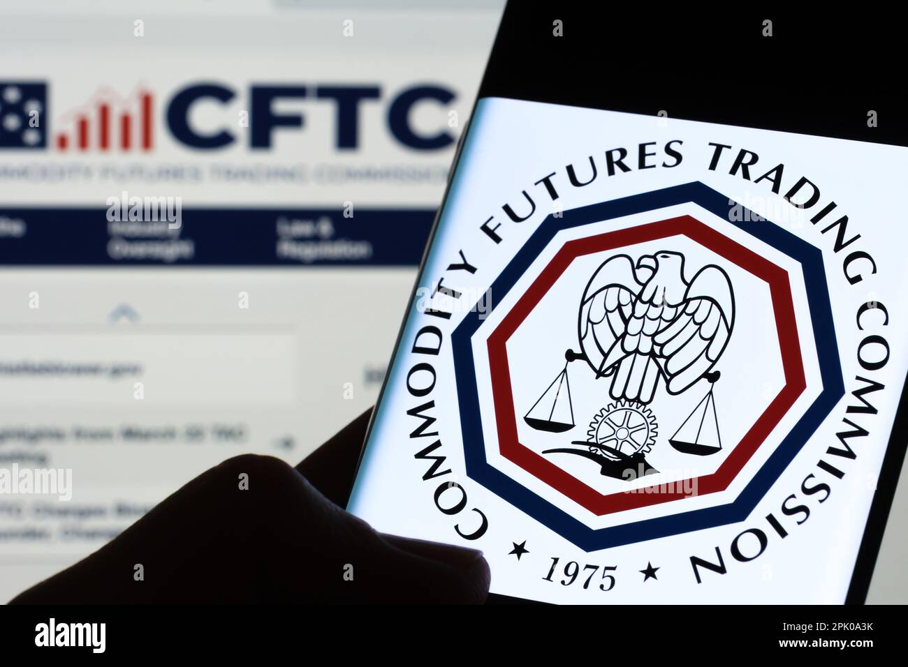

## Table of Contents

## What is the Commodity Futures Trading Commission (CFTC)?

The Commodity Futures Trading Commission (CFTC) is a government agency in the United States. It was created to make sure that the markets for trading futures and options are fair and honest. Futures and options are agreements to buy or sell things like corn, oil, or gold at a future date. The CFTC helps protect people who invest in these markets by making rules and watching over the people and companies that trade.

The CFTC started in 1974. Before that, another group called the Commodity Exchange Authority looked after these markets. The CFTC has the power to make sure that everyone follows the rules. If someone breaks the rules, the CFTC can take action against them. This helps keep the markets safe and trustworthy for everyone involved.

## What is the primary purpose of the CFTC?

The main job of the Commodity Futures Trading Commission (CFTC) is to make sure that the markets for trading futures and options are fair and honest. Futures and options are special agreements where people agree to buy or sell things like corn, oil, or gold at a future date. The CFTC helps protect people who invest in these markets by making rules that everyone has to follow.

The CFTC started in 1974 to take over from another group called the Commodity Exchange Authority. The CFTC watches over the people and companies that trade in these markets to make sure they are doing things the right way. If someone breaks the rules, the CFTC can take action against them. This helps keep the markets safe and trustworthy for everyone involved.

## How was the CFTC established and when did it start operating?

The Commodity Futures Trading Commission (CFTC) was set up by the U.S. government to keep the markets for futures and options fair and honest. Futures and options are agreements to buy or sell things like corn, oil, or gold at a future date. The CFTC was created because people needed a group to watch over these markets and make sure everyone followed the rules.

The CFTC started working in 1974. Before that, another group called the Commodity Exchange Authority was in charge. When the CFTC took over, it got the power to make new rules and take action against people or companies that broke them. This helped make the markets safer and more trustworthy for everyone who trades in them.

## What types of markets does the CFTC oversee?

The Commodity Futures Trading Commission (CFTC) looks after markets where people trade futures and options. Futures and options are agreements to buy or sell things like corn, oil, or gold at a future date. These markets are important because they help farmers, businesses, and investors plan for the future by locking in prices ahead of time.

The CFTC makes sure that everyone in these markets follows the rules. They watch over the people and companies that trade to make sure they are being fair and honest. If someone breaks the rules, the CFTC can take action against them. This helps keep the markets safe and trustworthy for everyone involved.

## What are the main responsibilities of the CFTC?

The Commodity Futures Trading Commission (CFTC) has the important job of making sure that the markets for trading futures and options are fair and honest. Futures and options are agreements to buy or sell things like corn, oil, or gold at a future date. The CFTC makes rules that everyone in these markets has to follow. They watch over the people and companies that trade to make sure they are doing things the right way. If someone breaks the rules, the CFTC can take action against them. This helps keep the markets safe and trustworthy for everyone involved.

Another big responsibility of the CFTC is to protect people who invest in these markets. They do this by making sure that the information given to investors is clear and honest. The CFTC also works to stop fraud and other bad behavior in the markets. By doing these things, the CFTC helps make sure that the markets work well and that people can trust them. This is important because these markets help farmers, businesses, and investors plan for the future by locking in prices ahead of time.

## How does the CFTC protect market participants and the public?

The Commodity Futures Trading Commission (CFTC) protects market participants and the public by making sure that the markets for trading futures and options are fair and honest. Futures and options are agreements to buy or sell things like corn, oil, or gold at a future date. The CFTC does this by creating rules that everyone in these markets must follow. They watch over the people and companies that trade to make sure they are doing things the right way. If someone breaks the rules, the CFTC can take action against them. This helps keep the markets safe and trustworthy for everyone involved.

Another way the CFTC protects people is by making sure that the information given to investors is clear and honest. They work hard to stop fraud and other bad behavior in the markets. By doing these things, the CFTC helps make sure that the markets work well and that people can trust them. This is important because these markets help farmers, businesses, and investors plan for the future by locking in prices ahead of time.

## What is the structure of the CFTC and who leads it?

The Commodity Futures Trading Commission (CFTC) is made up of five people called Commissioners. One of them is the Chairperson, who is in charge of leading the group. The President of the United States picks these Commissioners, and the Senate has to agree to their choices. The Commissioners work together to make rules and watch over the markets for trading futures and options. These markets are where people make agreements to buy or sell things like corn, oil, or gold at a future date.

The CFTC also has different groups inside it that help with its work. These groups include the Division of Enforcement, which looks for and stops people from breaking the rules, and the Division of Market Oversight, which makes sure the markets are working well. There are also other groups that focus on things like making new rules and helping people understand how the markets work. All these parts work together to make sure the markets are fair and honest, and that people who invest in them are protected.

## How does the CFTC enforce regulations and what powers does it have?

The Commodity Futures Trading Commission (CFTC) has the power to make sure that the rules for trading futures and options are followed. Futures and options are agreements to buy or sell things like corn, oil, or gold at a future date. The CFTC can look into any problems in the markets and take action if someone breaks the rules. They can do things like starting investigations, making people pay fines, and even sending people to court if needed. This helps keep the markets fair and honest for everyone who trades.

The CFTC also has the power to make new rules to keep the markets safe. They can change the rules if they see new problems or if the markets change. The CFTC works with other groups, like the police and other government agencies, to stop fraud and other bad behavior. By doing all these things, the CFTC helps protect the people who invest in these markets and makes sure the markets work well for everyone.

## What are some significant cases or actions taken by the CFTC?

One important case the CFTC handled was against a company called MF Global. This company went bankrupt in 2011, and the CFTC found out that it had mixed up customer money with its own money, which is against the rules. The CFTC took action and made the people in charge of MF Global pay big fines. This case showed how the CFTC works to protect people's money in the markets.

Another big action by the CFTC was against a group of traders called "The Crude Oil Traders." In 2011, the CFTC found out that these traders were working together to control the price of oil. This is called market manipulation, and it's not allowed. The CFTC made the traders pay fines and helped make sure that oil prices stayed fair for everyone. This case showed how the CFTC stops people from cheating in the markets.

The CFTC also took action against a company called BitMEX in 2020. BitMEX was a platform for trading things like Bitcoin, but it was not following the rules. The CFTC found out that BitMEX was letting people from the U.S. trade without checking if they were allowed to. The CFTC made BitMEX pay a big fine and helped make the rules clearer for trading new kinds of things like cryptocurrencies. This case showed how the CFTC keeps up with new markets to protect people.

## How does the CFTC coordinate with other regulatory bodies both domestically and internationally?

The Commodity Futures Trading Commission (CFTC) works with other groups in the U.S. to make sure the markets are safe and fair. One big group they work with is the Securities and Exchange Commission (SEC). The SEC looks after the stock market, while the CFTC looks after the markets for futures and options. Together, they share information and help each other stop fraud and other bad things in the markets. The CFTC also works with the Federal Reserve and the Department of Justice to make sure the rules are followed and to take action against people who break them. This teamwork helps keep the markets working well for everyone.

The CFTC also works with groups from other countries to make sure the markets are safe all over the world. They talk with groups like the Financial Conduct Authority in the UK and the European Securities and Markets Authority in Europe. They share information and work together to stop problems that can happen in markets that cross borders. This is important because many things traded in futures and options markets, like oil and gold, are bought and sold all over the world. By working together, the CFTC and other groups can help make the markets fair and honest for everyone, no matter where they are.

## What recent legislative changes have impacted the CFTC's operations?

One big change that affected the CFTC's work is the Dodd-Frank Wall Street Reform and Consumer Protection Act. This law was passed in 2010 after the big financial crisis. It gave the CFTC more power to watch over the markets for things like swaps, which are special kinds of agreements between businesses. The CFTC now has to make sure these swap markets are fair and honest, just like they do with futures and options markets. This means the CFTC has more work to do to keep the markets safe for everyone.

Another important change came with the Commodity Exchange Act amendments. These changes help the CFTC keep up with new kinds of trading, like cryptocurrencies. The CFTC now has clearer rules for how to handle these new markets. This helps the CFTC make sure that trading in things like Bitcoin is fair and that people who invest in them are protected. These changes show how the CFTC keeps working to make the markets safe, even as they change and grow.

## What are the current challenges and future directions for the CFTC?

One of the big challenges for the Commodity Futures Trading Commission (CFTC) right now is keeping up with new kinds of trading, like cryptocurrencies. These new markets can be hard to watch over because they are different from the old markets for things like corn and oil. The CFTC has to make new rules to make sure these markets are fair and honest. They also have to work with other countries because these new markets often cross borders. This can be tricky because each country has its own rules.

Another challenge is making sure the CFTC has enough money and people to do its job well. The markets keep growing and changing, and the CFTC needs to keep up. They need enough money to hire people who can watch over the markets and stop problems before they start. The CFTC also needs to keep working with other groups in the U.S., like the SEC, to make sure the markets are safe for everyone. This teamwork is important because it helps the CFTC do a better job of protecting people who invest in the markets.

In the future, the CFTC will keep working to make the markets fair and honest. They will focus on making new rules for new kinds of trading and working with other countries to stop problems in the markets. The CFTC will also try to get more money and people to help them do their job better. By doing these things, the CFTC can keep the markets safe and make sure people can trust them.

## References & Further Reading

[1]: Dodd-Frank Wall Street Reform and Consumer Protection Act. (2010). ["Full Text of the Dodd-Frank Act."](https://www.congress.gov/bill/111th-congress/house-bill/4173/text)

[2]: Commodity Futures Trading Commission (CFTC). ["What We Do."](https://www.cftc.gov/)

[3]: Anand, A. (2014). ["Spoofing as a Manipulative Device in Futures Markets."](https://www.bu.edu/rbfl/files/2014/03/RBFL-V.-33_1_Aktas.pdf) Journal of Financial Regulation.

[4]: CFTC Regulation AT. ["Notice of Proposed Rulemaking on Regulation Automated Trading."](https://www.cftc.gov/PressRoom/SpeechesTestimony/giancarlostatement110416)

[5]: Hasbrouck, J., & Saar, G. (2013). ["Low-Latency Trading."](https://www.sciencedirect.com/science/article/abs/pii/S1386418113000165) The Review of Financial Studies.

[6]: Wigglesworth, R. (2020). ["Algorithmic trading: How to visualize the black box."](https://link.springer.com/chapter/10.1007/978-3-030-69583-5_10) Financial Times.

[7]: LabCFTC. ["A CFTC Initiative to Promote Responsible Fintech Innovation."](https://www.cftc.gov/PressRoom/PressReleases/7558-17)