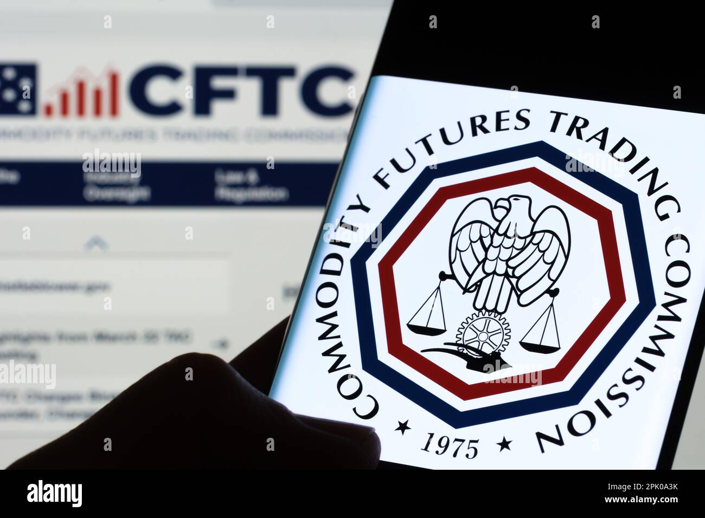

## Table of Contents

## What is the Commodity Futures Trading Commission (CFTC)?

The Commodity Futures Trading Commission (CFTC) is a U.S. government agency that oversees the trading of futures and options on commodities. Commodities are things like oil, gold, and wheat that people buy and sell. The CFTC makes sure that these markets are fair and that no one is cheating. It also helps protect people who invest in these markets by making sure they have the right information to make good choices.

The CFTC was created in 1974, after a big problem in the markets called the "soybean default." This showed that there needed to be a special agency to watch over these markets. The CFTC works to stop fraud, manipulation, and other bad practices. It also works with other agencies and countries to make sure that the rules for trading commodities are followed everywhere.

## When was the CFTC established and why?

The Commodity Futures Trading Commission (CFTC) was established in 1974. This happened because of a big problem in the markets known as the "soybean default." Before the CFTC, there was no special agency watching over the trading of commodities like oil, gold, and wheat. This event showed that there was a need for a group to make sure these markets were fair and safe for everyone.

The CFTC's main job is to stop people from cheating in these markets. They make sure that no one is doing things like fraud or manipulating prices. They also help people who invest in commodities by making sure they have the right information to make good choices. The CFTC works with other groups and countries to make sure that the rules for trading commodities are followed everywhere.

## What are the main responsibilities of the CFTC?

The Commodity Futures Trading Commission (CFTC) has the important job of making sure that the markets for trading things like oil, gold, and wheat are fair and safe. They watch over these markets to stop people from doing bad things like cheating or lying. This is important because it helps to keep the markets honest and trustworthy. The CFTC also makes rules that everyone in these markets has to follow, to make sure that no one is taking advantage of others.

Another big responsibility of the CFTC is to protect people who invest in commodities. They do this by making sure that these people have all the right information they need to make good choices. The CFTC also looks into any problems or complaints that come up in the markets. If they find someone breaking the rules, they can take action to stop it and punish the person who did wrong. This helps to keep the markets working well for everyone.

## How does the CFTC regulate the futures and options markets?

The Commodity Futures Trading Commission (CFTC) keeps an eye on the markets where people trade futures and options on things like oil, gold, and wheat. They do this by making rules that everyone in these markets has to follow. These rules are there to stop people from cheating or doing anything unfair. The CFTC checks to make sure that everyone is playing by the rules. If someone breaks the rules, the CFTC can step in and do something about it, like giving them a fine or stopping them from trading.

The CFTC also makes sure that people who want to invest in these markets have the right information. They do this by making companies give clear and honest information about what they are selling. This helps people make smart choices about their investments. The CFTC also works with other groups and countries to make sure that the rules for trading commodities are followed everywhere. This helps keep the markets fair and safe for everyone.

## What is the role of the CFTC in preventing market manipulation and fraud?

The Commodity Futures Trading Commission (CFTC) plays a big role in stopping people from cheating or manipulating the markets where things like oil, gold, and wheat are traded. They do this by making rules that everyone has to follow. These rules are there to make sure no one is doing anything unfair. If someone breaks these rules, the CFTC can take action. They might give the person a fine or stop them from trading. This helps keep the markets honest and fair for everyone.

The CFTC also watches over the markets all the time to catch any problems early. They look for signs of cheating or manipulation and investigate any complaints they get. By doing this, they can stop bad things from happening before they get worse. This helps protect people who invest in these markets by making sure they can trust the prices and information they see.

## How does the CFTC work with other regulatory bodies?

The Commodity Futures Trading Commission (CFTC) works with other groups to make sure the rules for trading things like oil, gold, and wheat are followed everywhere. They team up with other U.S. agencies like the Securities and Exchange Commission (SEC) to share information and help each other catch people who might be cheating. This helps keep the markets fair and safe because both agencies can use their different powers to stop bad things from happening.

The CFTC also works with groups in other countries. They do this because trading happens all over the world, and they need to make sure everyone is playing by the same rules. By working together, the CFTC and these other groups can share information and help each other stop fraud and manipulation no matter where it happens. This helps protect people who invest in these markets by making sure the rules are followed everywhere.

## What are some key regulations enforced by the CFTC?

The Commodity Futures Trading Commission (CFTC) has a bunch of rules that everyone in the futures and options markets has to follow. One big rule is the Dodd-Frank Act, which was made to stop the kind of risky behavior that caused the big financial crisis in 2008. This rule makes sure that big trades are done in a way that everyone can see, so no one can cheat or hide what they're doing. Another important rule is the Commodity Exchange Act, which says that people can't lie or trick others when they're trading commodities.

The CFTC also has rules about how much information people have to give when they're trading. They want to make sure that everyone knows the truth about what they're buying and selling. This helps people make smart choices and keeps the markets fair. The CFTC watches over these rules all the time and can punish people who break them. By doing this, they help keep the markets safe and honest for everyone.

## How does the CFTC impact individual traders and investors?

The Commodity Futures Trading Commission (CFTC) helps individual traders and investors by making sure the markets where they trade things like oil, gold, and wheat are fair and safe. The CFTC makes rules that everyone has to follow, so no one can cheat or do anything unfair. This means that when you're trading, you can trust that the prices you see are real and not being manipulated by someone else. If someone does break the rules, the CFTC can step in and stop them, which helps protect your investments.

The CFTC also makes sure that you have all the information you need to make good choices about your investments. They make companies give clear and honest information about what they're selling. This helps you understand what you're buying and selling, so you can make smart decisions. By working with other groups and countries, the CFTC helps keep the rules the same everywhere, so no matter where you're trading, you're protected.

## What is the process for registering with the CFTC as a futures professional?

To register with the Commodity Futures Trading Commission (CFTC) as a futures professional, you first need to decide what kind of professional you want to be. There are different types of futures professionals, like Futures Commission Merchants (FCMs), Commodity Pool Operators (CPOs), and Commodity Trading Advisors (CTAs). Once you know what type you want to be, you need to fill out an application form. You can find these forms on the National Futures Association (NFA) website, which is the group that helps the CFTC with registration.

After you fill out the form, you need to send it to the NFA along with any other documents they ask for, like your fingerprints for a background check. You also have to pay a fee. The NFA will then look over your application to make sure everything is okay. If they approve it, you'll get a notice that you're registered. But if there's a problem, they might ask for more information or even say no to your application. Once you're registered, you have to follow all the CFTC's rules to keep your registration.

## How does the CFTC handle enforcement actions and what are some notable cases?

The Commodity Futures Trading Commission (CFTC) takes action against people who break its rules by doing things like cheating or lying in the markets. If they find someone breaking the rules, they can make them pay a fine, stop them from trading, or even take them to court. They start by looking into any problems or complaints they get. If they find enough proof, they can take the case to court or settle it with the person who did wrong. This helps keep the markets fair and safe for everyone.

One big case the CFTC handled was against a company called Peregrine Financial Group in 2012. The owner, Russell Wasendorf Sr., was found to have stolen more than $200 million from customers over 20 years. He got caught after trying to kill himself and leaving a note about his crimes. The CFTC took action and got a lot of the money back for the customers. Another important case was against a group called BitMEX in 2020. The CFTC said BitMEX let people from the U.S. trade without following the rules, and they had to pay a big fine. These cases show how the CFTC works to stop bad behavior and protect people in the markets.

## What are the current challenges and future directions for the CFTC?

The Commodity Futures Trading Commission (CFTC) faces a lot of challenges today. One big challenge is keeping up with new technology, like cryptocurrencies and digital trading platforms. These new things can be hard to watch over because they change so fast and are used all over the world. Another challenge is making sure the rules are the same everywhere. Since trading happens all over the world, the CFTC has to work with other countries to make sure everyone is playing by the same rules. This can be tough because different countries have different laws.

Looking to the future, the CFTC wants to stay on top of new technology and keep the markets fair and safe. They are thinking about making new rules for things like cryptocurrencies to make sure they are watched over well. They also want to use more technology to help them catch people who are cheating or lying in the markets. By working with other groups and countries, the CFTC hopes to make the rules stronger and keep the markets working well for everyone.

## How does the CFTC influence global commodity markets?

The Commodity Futures Trading Commission (CFTC) has a big impact on global commodity markets by making sure they are fair and safe. They do this by making rules that everyone has to follow, no matter where they are trading. Since trading happens all over the world, the CFTC works with other countries to make sure the rules are the same everywhere. This helps stop people from cheating or lying in the markets, which keeps the prices honest and helps traders and investors trust what they see.

The CFTC also helps keep global commodity markets stable by watching over them all the time. They look for any signs of problems or bad behavior and step in if they find something wrong. By doing this, they can stop big issues before they hurt the markets. This is important because it helps keep the markets working well for everyone, no matter where they are. By working with other groups and countries, the CFTC helps make sure that the rules for trading commodities are followed everywhere, which keeps the markets fair and safe for everyone.

## References & Further Reading

[1]: ["The Commodity Futures Trading Commission: History, Issues, and Current Status"](https://www.cftc.gov/) by Rena S. Miller, Congressional Research Service.

[2]: Isakov, D., & Morard, B. (2001). ["The Labor Market for Commodity Traders"](https://papers.ssrn.com/sol3/papers.cfm?abstract_id=904605). Financial Analysts Journal, 57(2), 83-92.

[3]: Budish, E., Cramton, P., & Shim, J. (2015). ["The High-Frequency Trading Arms Race: Frequent Batch Auctions as a Market Design Response."](https://academic.oup.com/qje/article/130/4/1547/1916146) American Economic Review, 105(7), 1838-1872.

[4]: Slang, R., Hasan, I., & Lafond, B. (2019). ["Regulation and the Evolution of the Algorithmic Trading Race."](https://www.researchgate.net/publication/373644783_Title_Evolution_of_Internet_Slang_and_Its_Impact_on_English_Language_Communication) Business Perspectives and Research, 7(1), 19-32.

[5]: ["Commodity Futures Trading: Developments and Issues"](https://www.mckinsey.com/industries/electric-power-and-natural-gas/our-insights/the-future-of-commodity-trading) - OECD 

[6]: Giraldo, J. S., & Ikke, O. (2020). ["Regulation, Supervision and Market Discipline: The Role of the CFTC."](https://www.researchgate.net/publication/330260342_The_Role_of_Parental_Involvement_and_Social_Emotional_Skills_in_Academic_Achievement_Global_Perspectives) Econstor Conference Paper.