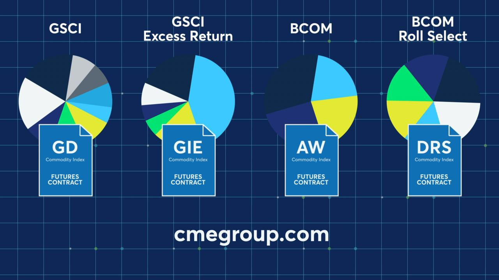

Investment strategies today are more complex and multifaceted than ever, as advancements in technology and analytics continue to reshape the financial landscape. A critical component of these strategies is the use of financial and commodity indices, which serve as benchmarks and barometers for market performance. These indices play a pivotal role in guiding investment decisions by providing investors with an aggregated view of market trends and fluctuations. For example, the performance of broad-market indices like the S&P 500 or the Bloomberg Commodity Index gives investors insight into the general health and trends of various economic sectors.

In tandem with these indices, algorithmic trading is increasingly being adopted to enhance investment management. This sophisticated approach utilizes computer algorithms to execute trading strategies at speeds and efficiencies unattainable by human traders alone. Algorithmic trading reduces errors caused by human emotion and bias and is capable of processing vast amounts of data to make informed decisions swiftly. The integration of algorithms in trading provides significant advantages, including cost reduction and improved precision in trade execution.



This article seeks to explore the intricate relationship between evolving investment strategies, the foundational role of financial and commodity indices, and the efficiency of algorithmic trading methods. Understanding this interconnectedness is crucial for investors aiming to harness these tools and technologies, ensuring they remain competitive in an ever-dynamic market environment.

## Table of Contents

## Understanding Investment Strategies

Investment strategies in modern finance exhibit considerable diversity, ranging from traditional methodologies to cutting-edge quantitative techniques. These strategies are designed to optimize portfolio performance by taking into account various market dynamics and investor goals.

### Traditional and Quantitative Approaches

Traditional investment strategies primarily focus on [fundamental analysis](/wiki/fundamental-analysis) and long-term market trends. They often involve buying undervalued stocks or bonds based on intrinsic valuation techniques. On the other hand, quantitative investment strategies rely heavily on statistical and mathematical models to make data-driven decisions. These methods incorporate complex algorithms that analyze historical data to identify trading opportunities and predict future market movements.

### Diversification, Risk Management, and Asset Allocation

A crucial component of effective investment strategies is diversification, which involves spreading investments across various asset classes to mitigate risk. The principle of diversification suggests that a well-diversified portfolio can achieve a higher risk-adjusted return. For instance, an investor might allocate assets among stocks, bonds, real estate, and commodities to ensure that a downturn in one market does not significantly impact the overall portfolio.

Risk management plays a pivotal role in safeguarding investments against unforeseen market events. Techniques such as value-at-risk (VaR), stress testing, and scenario analysis are frequently utilized to understand and manage potential risks. Additionally, proper asset allocation ensures that an investment portfolio is aligned with an investor's risk tolerance and expected return.

Mathematically, portfolio optimization techniques can be represented using the following equation in the context of the mean-variance optimization framework:

$$
\text{Maximize} \quad \mathbf{w}^T \mathbf{\mu} - \frac{\lambda}{2} \mathbf{w}^T \mathbf{\Sigma} \mathbf{w}
$$

where $\mathbf{w}$ is the vector of asset weights, $\mathbf{\mu}$ is the vector of expected returns, $\mathbf{\Sigma}$ is the covariance matrix of asset returns, and $\lambda$ represents the risk aversion coefficient of the investor.

### Impact of Financial Indices

Financial indices, such as the S&P 500 and MSCI World Index, provide significant insights into overall market performance, acting as benchmarks for evaluating portfolio returns. These indices typically track the performance of a group of representative securities, offering a snapshot of market sentiment and economic trends. For investors, financial indices serve as crucial tools for assessing how well their investments are performing relative to the broader market.

Financial indices also guide strategic decisions by providing data on market [volatility](/wiki/volatility-trading-strategies) and sector performance. This information helps investors adjust their asset allocation and diversification strategies according to the prevailing economic climate. Consequently, indices influence both short-term tactical trades and long-term investment planning.

In conclusion, understanding and implementing robust investment strategies involve balancing traditional approaches with innovative quantitative methods. The integration of diversification, risk management, asset allocation, and the use of financial indices significantly contributes to the construction of resilient investment portfolios capable of withstanding market fluctuations.

## Financial Indices and Their Importance

Financial indices are pivotal in shaping modern investment strategies, as they furnish actionable insights into market dynamics. Chief among these are the S&P 500 and the Dow Jones Industrial Average (DJIA), which are widely regarded as leading indicators of the U.S. stock market's overall health and direction.

The S&P 500 is a market-capitalization-weighted index comprising 500 of the most significant publicly traded companies in the U.S. It weighs the stock prices of these companies, offering a broad-based measure of the market's performance. The Dow Jones Industrial Average, on the other hand, includes 30 prominent corporations across various industries. Although it is price-weighted, the DJIA is still instrumental in providing a snapshot of the market's daily performance.

Investors use these indices to benchmark their portfolios, helping them evaluate performance against the broader market. A portfolio outperforming a major index like the S&P 500 may indicate effective investment strategies, while underperformance might signal the need for adjustments. Indices thus serve as reference points, enabling investors to assess the success of their investments and recalibrate their approaches if necessary.

Macroeconomic factors, such as interest rates, inflation, and GDP growth, exert considerable influence on financial indices. For instance, when interest rates rise, borrowing costs increase, potentially dampening business growth and reducing consumer spending. This can lead to a decrease in corporate profits, which might reflect in lower index levels. Conversely, a thriving economy characterized by robust GDP growth often correlates with ascending index values, signaling healthy corporate performance and investor confidence.

For practical applications, investors and financial analysts frequently use beta ($\beta$), a statistical measure that compares the volatility of an asset or portfolio to the market as a whole, often represented by an index like the S&P 500. In Python, calculating beta based on historical returns might look like this:

```python
import numpy as np
import pandas as pd

# Assume df is a DataFrame containing historical return data for an asset and the market
df = pd.DataFrame({'asset_return': [...], 'market_return': [...]})

# Calculating covariance between the asset and the market
cov_matrix = np.cov(df['asset_return'], df['market_return'])

# Variance of the market
market_variance = np.var(df['market_return'])

# Calculating beta
beta = cov_matrix[0, 1] / market_variance
print("Beta:", beta)
```

Understanding the relationship between indices and macroeconomic factors enables investors to make informed strategic decisions. By leveraging indices to monitor market performance and account for economic conditions, investors can create robust, adaptive investment strategies. These indices not only serve as benchmarks but also as navigational tools in the broader landscape of market movements and economic shifts.

## Commodity Indices: Overview and Examples

Commodity indices are financial instruments that track the price movements of a basket of raw materials, commonly referred to as commodities. These indices serve as benchmarks for commodity prices and offer insights into the broader trends within the commodities market. By aggregating the prices of varied raw materials, commodity indices provide a composite measure of performance, similar to how stock indices operate for equity markets.

One of the primary functions of commodity indices is to offer investors a means of gaining exposure to a diversified set of commodities without needing to manage the physical assets themselves. This diversification is crucial as it helps mitigate risks associated with price volatility of individual commodities.

### Popular Commodity Indices

Among the numerous commodity indices available, two of the most recognized are the Bloomberg Commodity Index and the S&P Goldman Sachs Commodity Index (S&P GSCI).

1. **Bloomberg Commodity Index (BCOM)**: This index offers broad exposure to commodities and is designed to be a liquid benchmark for commodity investments. The BCOM includes a diverse range of commodities, such as energy (crude oil, natural gas), agriculture (corn, wheat), precious metals (gold, silver), and industrial metals (copper, aluminum). The index's weighting methodology ensures diversified exposure across major commodity sectors.

2. **S&P Goldman Sachs Commodity Index (S&P GSCI)**: Known for its comprehensive coverage of the commodity market, the S&P GSCI is weighted by world production and aims to reflect the economic significance of each commodity. It includes a wide array of commodities from different sectors, providing a balanced representation of the global commodity market.

### Role as Investment Vehicles

Commodity indices function as effective investment vehicles by enabling investors to gain direct exposure to a broad spectrum of commodity markets through index funds or exchange-traded funds (ETFs). This exposure allows investors to hedge against inflation, as commodity prices often rise with inflationary pressures, and diversify their portfolios beyond traditional equity and bond holdings.

Moreover, these indices are essential tools for both passive and active investment strategies. Passive investors can track a commodity index through index funds, achieving market returns with low management costs. On the other hand, active traders might use these indices to develop specific commodity trading strategies, seeking alpha by exploiting market inefficiencies and trends.

In summary, commodity indices play a vital role in modern finance by offering structured and diversified access to commodity markets. They are indispensable for managing investment risk, understanding market trends, and fulfilling specific investment objectives related to raw material markets.

## The Rise of Algo Trading in Investment Management

Algorithmic trading, commonly known as algo trading, has become a pivotal component of modern investment management. It involves the use of computer algorithms to automate trading decisions, allowing for faster and more efficient execution of trades in financial markets. The significance of [algorithmic trading](/wiki/algorithmic-trading) lies in its ability to process complex data quickly and make decisions based on predefined criteria without human intervention.

One of the primary benefits of algorithmic trading is its efficiency. Algorithms can execute trades in milliseconds, drastically reducing the time lag between decision-making and trade execution. This speed advantage is crucial in markets where prices can change rapidly, providing traders with the opportunity to capitalize on fleeting market conditions that would be impossible to exploit manually.

Algo trading also substantially reduces costs. Traditional trading requires human traders who charge commissions and fees for their services. By automating the trading process, algorithmic strategies minimize these costs, allowing for more significant profit margins or reduced expenses for smaller trades. Additionally, reduced overhead associated with maintaining a large trading staff further contributes to cost savings.

Furthermore, algo trading minimizes human errors, which can be costly in the fast-paced financial markets. Emotional factors, fatigue, and oversight are common sources of error in manual trading. Algorithms, on the other hand, operate based on data-driven logic, strictly adhering to pre-established rules and strategies. This reduces the likelihood of mistakes that can occur from human judgment errors.

However, there are challenges and limitations associated with implementing algorithmic trading strategies. One significant challenge is the development and maintenance of sophisticated algorithms that can reliably navigate the complexities of financial markets. This requires substantial expertise in both finance and computer programming, along with robust data infrastructure to support real-time data processing and analysis.

Market dynamics can also present challenges. Algorithms depend on historical data to predict future market behavior. However, unforeseen market conditions or black swan events can lead to significant deviations from expected patterns, potentially resulting in substantial losses if the algorithms are not adaptable or responsive to such changes.

Furthermore, regulatory concerns pose limitations on algorithmic trading. Market regulators worldwide are concerned about the systemic risks posed by high-frequency and algorithmic trading. This includes the potential for market manipulation, loss of market integrity due to algorithmic errors, and the amplification of market volatility.

In conclusion, while algorithmic trading offers numerous advantages, its successful implementation necessitates careful consideration of its challenges and inherent limitations. Strategies must be continuously refined and adapted to changing market environments to harness the full potential of this cutting-edge investment tool.

## Integrating Commodity Indices with Algo Trading

Algorithmic trading, often referred to as algo trading, involves using computer algorithms to execute trades based on predefined criteria. When applied to commodity indices, these algorithms can be designed to monitor and respond to changes in index performance. Commodity indices, such as the Bloomberg Commodity Index or S&P GSCI, track the price movements of a diversified basket of raw materials, offering investors insight into market trends across various commodities.

### Algorithmic Design for Tracking Commodity Indices

To effectively track commodity index performance, algorithmic trading strategies can be constructed using quantitative models that incorporate various technical indicators and market data. For instance, an algorithm might use moving averages, Bollinger Bands, or Relative Strength Index (RSI) as signals to enter or [exit](/wiki/exit-strategy) trades based on the index's pricing movements. Python is particularly useful in this context due to its rich ecosystem of financial libraries like Pandas, NumPy, and Scikit-learn, which facilitate data analysis and model building.

Here is a simple Python example demonstrating how moving averages can be used in the context of an algorithmic trading strategy:

```python
import pandas as pd
import numpy as np

# Load commodity index data
data = pd.read_csv("commodity_index_data.csv")

# Calculate moving averages
data['Short_MA'] = data['Price'].rolling(window=20).mean()
data['Long_MA'] = data['Price'].rolling(window=50).mean()

# Generate trading signals
data['Signal'] = np.where(data['Short_MA'] > data['Long_MA'], 1, -1) 
```

This basic script calculates short-term and long-term moving averages and generates buy (1) or sell (-1) signals whenever the short-term average crosses above or below the long-term average.

### Successful Case Studies

Algo trading has been successfully applied in commodities for both speculative and hedging strategies. A notable example is the use of mean reversion strategies, where trading algorithms exploit pricing inefficiencies by assuming that the price of a commodity future will revert to its mean. Such strategies can be adapted to commodity indices by executing trades when an index deviates significantly from historical averages or benchmarks.

Additionally, trend-following strategies, which capitalize on establishing price trends, have also proven effective in commodities. These strategies continuously adjust positions as the underlying index exhibits consistent directional movement, enabling investors to ride on the [momentum](/wiki/momentum) for profitability.

### Machine Learning and Big Data

The integration of [machine learning](/wiki/machine-learning) and big data analysis significantly enhances the capacity of algorithmic strategies by adding predictive capabilities. Machine learning models can be trained on historical commodity index data and various economic indicators to predict future movements or identify patterns that are not immediately apparent through conventional statistical methods. Techniques such as regression analysis, neural networks, and support vector machines are commonly utilized.

Machine learning algorithms can process vast amounts of data to identify correlations between different market variables and the performance of commodity indices. As computational power continues to grow and data storage becomes more economical, the utilization of big data allows for more accurate and sophisticated model development, thereby improving strategy outcomes.

In summary, by integrating algorithmic trading with commodity indices, investors can execute trades with precision and leverage cutting-edge technology to stay ahead in competitive markets. This integration offers the dual advantage of automated decision-making and enhanced predictive analytics, marking a significant step forward in modern investment strategy implementation.

## Conclusion

The intricate relationship between investment strategies, financial and commodity indices, and algorithmic trading (algo trading) forms a cornerstone of modern finance. Investment strategies, whether traditionally rooted or quantitatively advanced, rely heavily on indices to benchmark performance and guide allocation decisions. Financial indices such as the S&P 500 and Dow Jones Industrial Average, alongside commodity indices like the Bloomberg Commodity Index and S&P GSCI, are instrumental in reflecting market sentiments and trends. They provide a framework for understanding economic conditions, thereby informing strategic decisions.

Algorithmic trading has transformed how these indices are used in practice. Through advanced algorithms, traders can efficiently execute strategies, adjust to market movements, and minimize costs and human errors. The capability of algorithmic systems to process vast amounts of data and execute trades at optimal prices is pivotal in capitalizing on the dynamics captured by financial and commodity indices.

Looking forward, the integration of emerging technologies like machine learning and big data analytics stands out as a significant trend. These technologies offer enhanced predictive capabilities and more refined risk assessment tools, allowing for more sophisticated investment strategies. Machine learning algorithms can uncover complex patterns in market data, leading to strategies that adapt dynamically to changing market conditions.

Investors are encouraged to remain vigilant and proactive in embracing these advancements. Staying informed about emerging tools and technologies is crucial as they offer novel ways to refine portfolio management. By adopting innovative techniques, investors can potentially achieve more robust portfolio performance and better risk management outcomes.

In summary, the convergence of sound investment strategies with the analytical power of financial and commodity indices and the precision of algorithmic trading defines the modern landscape of finance. This interconnectedness will continue to evolve, driven by technological advancements and an ever-changing market environment.

## References & Further Reading

[1]: ["Commodity Indexes and Index Dollars"](https://www.investopedia.com/terms/c/commodityindices.asp) by Guy C. M. Butler. CFA Institute Research Foundation

[2]: Bloomberg. ["Bloomberg Commodity Index (BCOM)."](https://www.bloomberg.com/quote/BCOM:IND) Official BCOM webpage.

[3]: Standard & Poor's Financial Services LLC. ["S&P Goldman Sachs Commodity Index (S&P GSCI)."](https://www.spglobal.com/spdji/en/indices/commodities/sp-gsci-gold/) Overview of the S&P GSCI.

[4]: ["Advances in Financial Machine Learning"](https://www.amazon.com/Advances-Financial-Machine-Learning-Marcos/dp/1119482089) by Marcos Lopez de Prado

[5]: [Moskowitz, T., Ooi, Y. H., & Pedersen, L. H. (2012). "Time Series Momentum."](https://www.sciencedirect.com/science/article/pii/S0304405X11002613) Journal of Financial Economics, 104(2), 228-250.

[6]: ["Algorithmic Trading and DMA: An Introduction to Direct Access Trading Strategies"](https://www.semanticscholar.org/paper/Algorithmic-trading-%26-DMA-%3A-an-introduction-to-Johnson/aa5de1ab883d5e23b6651faa7c1807586d688e4b) by Barry Johnson

[7]: ["Quantitative Trading: How to Build Your Own Algorithmic Trading Business"](https://github.com/LucindaYa/quant-resources/blob/master/Quantitative%20Trading%20How%20to%20Build%20Your%20Own%20Algorithmic%20Trading%20Business.pdf) by Ernest P. Chan

[8]: ["Machine Learning for Algorithmic Trading: Predictive Models to Extract Signals from Market and Alternative Data for Systematic Trading Strategies with Python"](https://github.com/stefan-jansen/machine-learning-for-trading) by Stefan Jansen