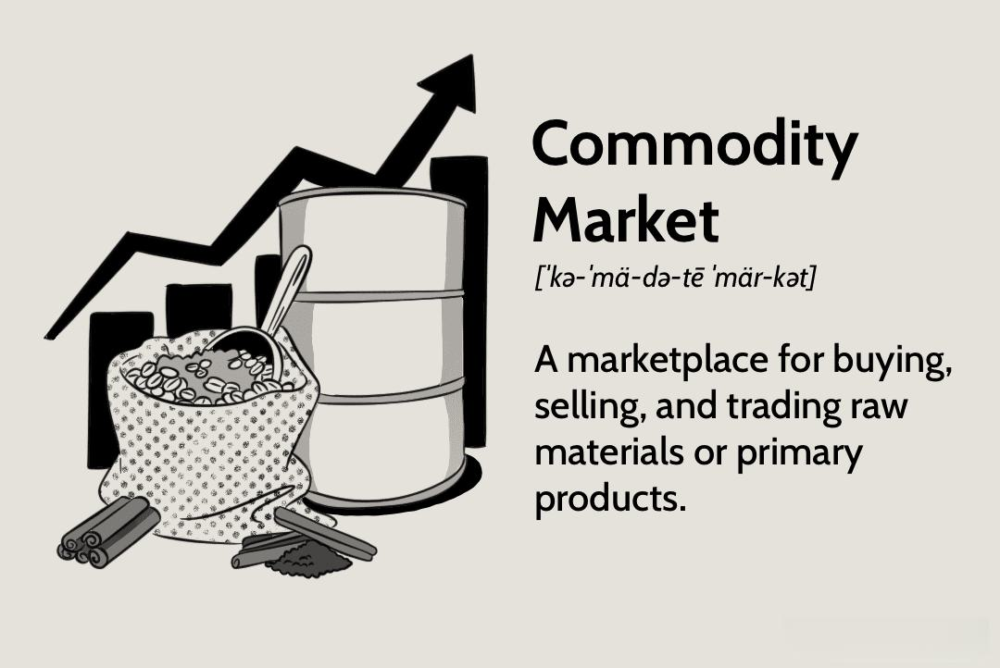

## Table of Contents

## What is a commodity market?

A commodity market is a place where people buy and sell things like oil, gold, and wheat. These items are called commodities, and they are usually raw materials or basic goods that can be traded. People trade commodities because they are important for making other products or for everyday use. For example, oil is used to make gasoline, and wheat is used to make bread.

In a commodity market, the prices can change a lot because they depend on how much of the commodity is available and how much people want it. If there is a lot of wheat but not many people want to buy it, the price will go down. But if there is not enough oil and many people need it, the price will go up. Traders in these markets try to predict these changes to make money. Commodity markets can be found all over the world, and they help keep the global economy running smoothly.

## What are the main types of commodities traded in the market?

Commodities traded in the market are generally divided into two main types: hard commodities and soft commodities. Hard commodities are natural resources that need to be mined or extracted from the earth. Examples of hard commodities include oil, natural gas, gold, and other metals like copper and silver. These commodities are often used in industries like construction, manufacturing, and energy production. The prices of hard commodities can be affected by many things, like how much it costs to get them out of the ground, how much is available, and what's happening in the world.

Soft commodities, on the other hand, are agricultural products or livestock that are grown or raised. Examples include wheat, corn, coffee, sugar, and cattle. These commodities are important for food and other products we use every day. The prices of soft commodities can change a lot because they depend on things like the weather, how much is grown, and how many people want to buy them. Both hard and soft commodities are traded in markets all over the world, and they play a big role in the global economy.

## Can you provide examples of agricultural commodities?

Agricultural commodities are things that farmers grow or raise. Some common examples are wheat, corn, and soybeans. These are used to make food like bread, tortillas, and animal feed. Other examples include rice, which is a big part of diets in many countries, and cotton, which is used to make clothes. These commodities are important because they help feed and clothe people around the world.

Another group of agricultural commodities includes fruits and vegetables. For example, apples, oranges, and tomatoes are grown in many places and can be eaten fresh or used in cooking. There are also commodities like sugar, which comes from sugarcane or sugar beets, and coffee, which is grown in countries near the equator. These products are used in drinks and sweets that many people enjoy every day.

Lastly, there are livestock commodities, which are animals raised for food or other products. Examples include cattle, which are used for beef and dairy products, and pigs, which are raised for pork. Chickens are another important commodity because they provide meat and eggs. These animals play a big role in our diets and are traded in markets just like crops.

## What are energy commodities and what are some examples?

Energy commodities are things that we use to make energy. They are important because they help run our homes, cars, and factories. The main energy commodities are oil, natural gas, and coal. Oil is used to make gasoline and diesel fuel, which we use to drive our cars and trucks. Natural gas is used to heat our homes and cook our food. Coal is used in power plants to make electricity.

These energy commodities are traded all over the world. The prices can change a lot because they depend on how much is available and how much people need. If there is a lot of oil but not many people want to buy it, the price will go down. But if there is not enough natural gas and many people need it, the price will go up. Traders try to guess these changes to make money. Energy commodities are a big part of the global economy and help keep everything running smoothly.

## What are metal commodities and what are some examples?

Metal commodities are things like gold, silver, and copper that are dug out of the ground. These metals are important because they are used to make things we use every day. For example, copper is used in wires that bring electricity to our homes. Gold and silver are used to make jewelry, but they are also used in electronics and other products.

The prices of metal commodities can change a lot. This happens because it depends on how much metal is available and how much people want to buy it. If there is a lot of copper but not many people want to buy it, the price will go down. But if there is not enough gold and many people want it, the price will go up. Traders in these markets try to guess these changes to make money. Metal commodities are traded all over the world and are a big part of the global economy.

## How do commodity markets function?

Commodity markets are places where people buy and sell things like oil, wheat, and gold. These markets help set prices for these goods based on how much is available and how much people want them. If there is a lot of something, like wheat, and not many people want to buy it, the price will go down. But if there is not enough of something, like oil, and many people need it, the price will go up. Traders in these markets try to guess these price changes to make money. They might buy a commodity when the price is low and sell it when the price goes up.

Commodity markets can be physical places where people meet to trade, like a grain exchange, or they can be electronic markets where trading happens online. In electronic markets, traders use computers to buy and sell commodities from anywhere in the world. These markets are important because they help keep the global economy running smoothly. They make sure that goods like food, energy, and metals are available where they are needed. By setting prices and allowing trading, commodity markets help balance supply and demand around the world.

## What is the role of futures contracts in commodity trading?

Futures contracts are important in commodity trading because they let people buy and sell commodities at a set price for a future date. This helps farmers, miners, and other producers know how much money they will get for their goods. For example, a wheat farmer can sell a futures contract to lock in a price for their wheat before it's even harvested. This way, they don't have to worry about the price going down later. On the other hand, a bakery can buy a futures contract to make sure they can get wheat at a known price, even if the market price goes up.

Traders also use futures contracts to make money by guessing how prices will change. If a trader thinks the price of oil will go up, they can buy a futures contract now and sell it later at a higher price. This is called speculation. Futures contracts help make commodity markets more stable because they let people plan ahead and manage risk. They are traded on special exchanges, like the Chicago Mercantile Exchange, where buyers and sellers come together to make deals. By using futures contracts, the commodity market can work smoothly and help keep the global economy running well.

## How do commodity exchanges facilitate trading?

Commodity exchanges are places where people can buy and sell things like oil, wheat, and gold. They make trading easier by bringing buyers and sellers together in one place. This can be a physical location, like a trading floor, or an electronic platform where people can trade online from anywhere in the world. The exchange sets rules for how trading happens, making sure everything is fair and clear. They also keep track of all the trades and make sure everyone follows the rules.

One important thing commodity exchanges do is offer futures contracts. These are agreements to buy or sell a commodity at a set price on a future date. This helps farmers, miners, and other producers know how much money they will get for their goods ahead of time. It also helps businesses that need these commodities plan their costs. Traders can use futures contracts to guess how prices will change and try to make money. By providing a place for these contracts to be traded, commodity exchanges help make the market more stable and help the global economy run smoothly.

## What are the differences between spot markets and futures markets in commodities?

Spot markets and futures markets are two different ways people can trade commodities. In a spot market, people buy and sell commodities right away. This means if you want to buy wheat, you pay for it and get it immediately. The price in a spot market changes based on how much of the commodity is available right now and how much people want it right now. This can make prices go up and down a lot, depending on what's happening in the world.

In a futures market, people make agreements to buy or sell commodities at a set price on a future date. This is called a futures contract. For example, a farmer might sell a futures contract for their wheat to know how much money they will get even before the wheat is harvested. A bakery might buy a futures contract to make sure they can get wheat at a known price later. Futures markets help people plan ahead and manage risk because they can lock in prices for the future. This makes the market more stable and helps the global economy run smoothly.

## How do global economic factors influence commodity prices?

Global economic factors can have a big impact on commodity prices. Things like how strong a country's money is, how fast its economy is growing, and what's happening with interest rates can all affect how much people are willing to pay for commodities. For example, if a country's economy is doing well, people might want more oil to drive their cars or more wheat to make bread. This can push up the prices of these commodities. On the other hand, if the economy is not doing well, people might buy less, and prices could go down.

Another important [factor](/wiki/factor-investing) is what's happening in the world. Things like wars, natural disasters, or changes in government policies can change how much of a commodity is available or how much people need it. For example, if there is a big storm that ruins a lot of wheat fields, there will be less wheat to sell, and the price might go up. Or if a country decides to produce more oil, there might be more oil available, and the price could go down. These global events can make commodity prices go up and down a lot, and traders have to keep an eye on them to make good guesses about what will happen next.

## What are the risks associated with trading in commodity markets?

Trading in commodity markets can be risky because prices can change a lot. If you buy a commodity and the price goes down, you might lose money. This can happen because of things like bad weather, changes in how much people want the commodity, or what's happening in the world. For example, if there is a big storm that ruins a lot of wheat fields, the price of wheat might go up. But if a country starts producing more oil, the price of oil might go down. Traders have to guess these changes, and if they guess wrong, they can lose money.

Another risk is using futures contracts. These are agreements to buy or sell a commodity at a set price in the future. If you use a futures contract and the price of the commodity changes a lot, you might lose money. For example, if you agree to buy wheat at a certain price and the price goes down a lot before you get the wheat, you will have to pay more than the market price. This can be a big problem if you are not careful. Also, trading in commodity markets can be hard to understand, and if you don't know what you are doing, you might make bad choices and lose money.

## How can one start investing in commodity markets and what strategies should be considered?

To start investing in commodity markets, you first need to learn about the different ways to invest. One way is to buy the actual commodity, like gold or oil, but this can be hard and expensive. Another way is to invest in futures contracts, which are agreements to buy or sell a commodity at a set price in the future. You can also buy shares in companies that produce commodities, like oil companies or mining companies, or invest in commodity-focused exchange-traded funds (ETFs), which are like baskets of different commodities. To start, you might want to open an account with a broker who can help you buy and sell these investments.

When thinking about strategies for investing in commodity markets, it's important to understand the risks and have a plan. One strategy is diversification, which means spreading your money across different commodities to reduce risk. Another strategy is to use futures contracts to lock in prices and protect against big price changes. You might also want to keep an eye on what's happening in the world, like the weather or political events, because these can affect commodity prices. It's a good idea to start small and learn as you go, maybe even talking to a financial advisor who can give you advice based on your goals and how much risk you are willing to take.

## What is the understanding of the Commodity Market?

The commodity market constitutes a critical segment of the financial markets, facilitating the trading of primary goods. Commodities are often categorized into two primary types: hard commodities and soft commodities. Hard commodities include natural resources that are mined or extracted, such as gold, oil, and copper, whereas soft commodities are typically agricultural products like wheat, coffee, and cotton.

An essential principle governing the commodity market is the law of supply and demand, which plays a pivotal role in price determination. When the supply of a commodity exceeds demand, prices tend to fall, whereas a higher demand relative to supply typically drives prices up. This dynamic balance ensures market equilibrium and can be expressed with the equation:

$$
P = \frac{D}{S}
$$

where $P$ is the price of the commodity, $D$ is demand, and $S$ is supply.

The commodity market ecosystem comprises several key players, including producers, consumers, traders, and speculators. Producers, such as mining companies and farmers, supply commodities to the market. Consumers, which include entities like manufacturing companies and governments, buy these commodities for consumption or production purposes. Traders facilitate the buying and selling of commodities and often play a role in price stabilization by providing [liquidity](/wiki/liquidity-risk-premium). Speculators, on the other hand, aim to profit from fluctuations in commodity prices by predicting future price movements.

Commodity exchanges play a vital role in global trade, providing a structured environment for trading commodity contracts. Major exchanges include the Chicago Mercantile Exchange (CME), the Intercontinental Exchange (ICE), and the London Metal Exchange (LME). These exchanges standardize contracts for different commodities, ensuring transparency, liquidity, and fairness in the market. By setting standardized contracts, they enable participants to hedge against price [volatility](/wiki/volatility-trading-strategies) and engage in speculative activities, all of which are crucial for efficient market functioning.

## References & Further Reading

[1]: ["The Economist Guide to Commodities: Producers, Players and Prices, Markets, Consumers and Trends"](http://media.economist.com/sites/default/files/pdfs/Guide%20to%20Commodities.pdf) by Caroline Bain

[2]: Geman, H. (2005). ["Commodity and Commodity Derivatives: Modeling and Pricing for Agriculturals, Metals and Energy."](https://www.wiley.com/en-us/Commodities+and+Commodity+Derivatives%3A+Modeling+and+Pricing+for+Agriculturals%2C+Metals+and+Energy-p-9780470012185) John Wiley & Sons.

[3]: Kaminski, V. (2016). ["Energy Markets,"](https://books.google.com/books/about/Energy_Markets.html?id=jQ5ckgEACAAJ) Risk Books, 1st edition.

[4]: Hull, J. C. (2017). ["Options, Futures, and Other Derivatives."](https://www.semanticscholar.org/paper/Options%2C-Futures%2C-and-Other-Derivatives-Hull/89bdee500c8623864fc9eb7a471546aa713acc44) Pearson, 10th edition.

[5]: Fabozzi, F. J., Füss, R., & Kaiser, D. G. (2008). ["The Handbook of Commodity Investing."](https://onlinelibrary.wiley.com/doi/pdf/10.1002/9781118267004.index) John Wiley & Sons.

[6]: Aldridge, I. (2013). ["High-Frequency Trading: A Practical Guide to Algorithmic Strategies and Trading Systems."](https://books.google.com/books/about/High_Frequency_Trading.html?id=8QpIsVUMhmEC) Wiley Finance.