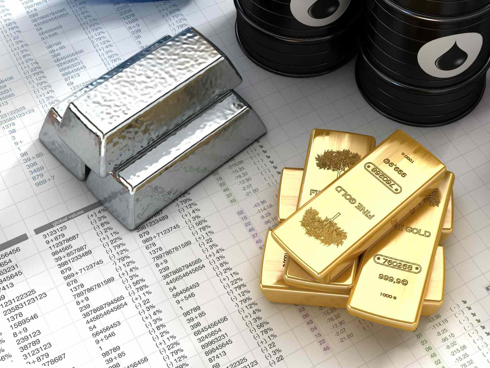

In today’s financial markets, mastering various financial instruments is crucial for both novice and seasoned investors. The financial landscape involves a complex network of instruments, assets, and tools that enable effective trading and investment strategies. This article explores the significance of financial instruments such as commodities and the role of algorithmic trading in shaping contemporary financial markets. Through a detailed examination of these elements, it becomes evident how they impact decision-making and strategic approaches within financial markets. Understanding the interplay between these elements is essential for managing risks and optimizing investment portfolios, fostering a more comprehensive grasp of the market's dynamics. As technology continues to evolve, the integration of these instruments and strategies will play an increasingly crucial role in both navigating and influencing market trends.

## Table of Contents



## Understanding Financial Instruments and Commodities

Financial instruments are essential in facilitating various trading and investment activities, serving as the very basis upon which modern financial systems operate. These instruments can be broadly categorized into equities, fixed-income securities, derivatives, and commodities. Each category presents unique characteristics and functions that cater to different investment strategies and risk profiles.

Equities, commonly referred to as stocks, represent ownership in a corporation. They provide investors with a claim on the company's assets and earnings. Bonds, on the other hand, are fixed-income securities that represent a loan made by an investor to a borrower, typically corporate or governmental. Bonds provide returns in the form of regular interest payments and the return of principal upon maturity, making them a relatively stable investment compared to equities.

Derivatives are complex financial instruments whose value is derived from an underlying asset or group of assets. Common examples include futures, options, and swaps. These instruments are often used for hedging risk or speculative purposes due to their inherent leverage and ability to lock in prices for future transactions.

Commodities are tangible raw materials or primary agricultural products that can be bought and sold. This category includes items like gold, oil, natural gas, wheat, cotton, and coffee. Commodities are often traded on exchanges using standardized contracts, which specify the quantity and quality of the commodity to be delivered at a future date. The prices of commodities are subject to supply and demand dynamics, geopolitical events, and macroeconomic factors, making them inherently volatile.

Commodity paper is a unique financial instrument where commodities serve as collateral for loans. This type of financing allows companies to raise capital by using their inventory of raw materials as security. It is a common practice in industries like agriculture and mining, where holding large quantities of raw material is necessary for operations.

Understanding these various financial instruments is crucial for effectively managing risk and optimizing investment portfolios. For instance, diversification across asset classes, including stocks, bonds, and commodities, can help mitigate individual asset risks and reduce the overall portfolio [volatility](/wiki/volatility-trading-strategies). Utilizing derivatives can allow investors to hedge against adverse market movements or achieve exposure to assets with minimal initial capital requirements.

In summary, a comprehensive understanding of financial instruments, especially commodities, enhances an investor's ability to construct well-diversified and resilient portfolios. By capitalizing on the unique properties and advantages each instrument offers, investors can achieve their financial goals while managing potential risks effectively.

## Investment in Commodities

Commodities, fundamental to the global economy, are traded predominantly through financial mechanisms such as futures contracts, options, and exchange-traded funds (ETFs). These instruments facilitate access to the commodity markets, offering varied strategies for investors seeking exposure to raw materials. 

Futures contracts are agreements to buy or sell a particular commodity at a predetermined price on a specified date in the future. These contracts are standardized and traded on exchanges, providing [liquidity](/wiki/liquidity-risk-premium) and an efficient means for price discovery and risk management. Options on futures give investors the right, but not the obligation, to buy or sell a futures contract at a predetermined price before or on a specified date, offering additional flexibility in managing exposure to commodities.

Exchange-traded funds (ETFs), on the other hand, are investment funds that trade on stock exchanges and hold assets such as stocks, commodities, or bonds. Commodity ETFs specifically track the price of a single commodity or a basket of commodities, thereby allowing investors to gain indirect exposure to the commodity markets without directly engaging in futures or physical trading.

Investing in commodities provides significant diversification benefits. Commodities historically have low to negative correlations with traditional asset classes such as stocks and bonds, meaning they can often move independently of these markets. This characteristic makes them an attractive addition to a diversified portfolio, potentially mitigating risk and enhancing returns over time. Additionally, commodities are considered a hedge against inflation. During periods of inflation, the prices of commodities tend to rise, which can protect the purchasing power of investments.

However, trading commodities does come with unique challenges. Price volatility in commodity markets can be pronounced due to factors like geopolitical disturbances, natural disasters, and fluctuations in demand and supply. Such volatility can introduce uncertainty and risk into investment portfolios, requiring careful consideration and strategy.

Moreover, commodity markets are prone to speculative behavior, which can further accentuate price swings. Speculators, while contributing to market liquidity, can also cause prices to deviate significantly from fundamental values, leading to potential losses for investors who do not manage their positions effectively.

Understanding the complexities of commodity trading and the specific risks involved is essential for anyone looking to enter this market. A well-thought-out strategy, possibly involving a combination of different trading instruments like futures, options, and ETFs, is crucial to effectively manage these risks while taking advantage of the potential benefits commodities offer.

## Algorithmic Trading: Enhancing Financial Markets

Algorithmic trading, or algo trading, is a revolutionary approach that leverages computer algorithms to automate trading processes in financial markets. By executing trades based on predefined criteria, this method offers numerous advantages, including enhanced precision and speed. It effectively minimizes human emotional biases, which are often detrimental to trading outcomes. In [algorithmic trading](/wiki/algorithmic-trading), decisions are governed by a set of explicit, logical instructions that allow for the rapid processing of large datasets and the prompt execution of trades when specific market conditions are met.

Algo trading finds application across diverse asset classes, such as equities, foreign exchange, and commodities. In the commodities sector, for instance, algorithmic systems can monitor a multitude of variables, including market prices, economic indicators, and supply-demand dynamics, to exploit price fluctuations. The speed of these automated systems is unparalleled; algorithms can evaluate market data and execute orders in fractions of a second, capitalizing on opportunities that might be inaccessible to human traders due to time constraints.

A typical example includes trend-following strategies, where the algorithm identifies and follows existing market trends. Another common strategy is statistical [arbitrage](/wiki/arbitrage), which involves taking advantage of price discrepancies between correlated markets or securities. Below is a Python code snippet illustrating a simple moving average crossover strategy, which is a basic form of trend-following strategy:

```python
import pandas as pd

# Sample data of commodity prices
data = {'price': [10, 11, 12, 14, 13, 15, 14, 16, 17, 18]}
df = pd.DataFrame(data)

# Calculate the short term and long term moving averages
df['short_mavg'] = df['price'].rolling(window=3, min_periods=1).mean()
df['long_mavg'] = df['price'].rolling(window=5, min_periods=1).mean()

# Generating buy and sell signals
df['signal'] = 0
df['signal'][df['short_mavg'] > df['long_mavg']] = 1
df['positions'] = df['signal'].diff()

print(df)
```

This code employs a basic strategy where buy and sell signals are generated based on the crossover of short-term and long-term moving averages. If the short-term average exceeds the long-term average, it signals a potential buy, whereas the opposite suggests a sell position.

The integration of algorithmic trading in financial markets is not only about optimizing trade execution but also about ensuring consistency and accuracy. As technological advancements continue to evolve, the influence of algo trading is likely to expand, providing both seasoned traders and institutional investors with tools that can significantly enhance trading efficiency and market access.

## Risks and Benefits of Algo Trading

Algorithmic trading, commonly referred to as algo trading, offers several benefits that have significantly reshaped financial markets. A primary advantage is the enhancement of market efficiency. By leveraging sophisticated algorithms, traders can analyze large volumes of market data with remarkable speed and accuracy, ensuring that trading opportunities are identified and seized in real time. This rapid processing capability reduces the time lag between market events and trade execution, helping to keep prices aligned with market fundamentals.

Another significant benefit of algorithmic trading is its ability to reduce transaction costs. This is achieved through automation, which minimizes human intervention and errors, allowing for trades to be executed at optimal prices. Furthermore, algorithms can be programmed to slice large orders into smaller ones, thereby reducing the market impact and helping to obtain more favorable price executions.

Despite these advantages, algo trading is not without its risks. A notable concern is the potential for technology failures. Given that algo trading relies heavily on complex systems and network infrastructures, any technical glitches or system malfunctions can lead to significant financial losses. These failures could be due to software bugs, hardware malfunctions, or network disruptions, all of which can prevent trades from being executed as intended.

In addition to technical risks, algorithmic trading can contribute to increased market volatility. Algorithms operate at speeds that far exceed human capabilities, and their rapid trading activity can exacerbate market movements, leading to abrupt price swings. This was notably observed during the 2010 Flash Crash, where an algorithm-driven trading strategy was partially blamed for a sudden and dramatic drop in market values before a rapid recovery.

To mitigate these risks, robust risk management strategies are essential. This includes implementing safeguards such as circuit breakers that temporarily halt trading during significant market disruptions. Additionally, rigorous testing and validation of algorithms before deployment can minimize the risk of unforeseen errors. Continuous monitoring and real-time analysis of market conditions also help in dynamically adjusting trading strategies to adapt to the evolving market landscape.

In summary, while algorithmic trading enhances market efficiency and reduces transaction costs, it is accompanied by risks related to technology failures and increased market volatility. Effective risk management is crucial to harness the benefits of algo trading while safeguarding against its potential drawbacks.

## The Future of Financial Trading

Technological advancements, particularly in [artificial intelligence](/wiki/ai-artificial-intelligence) (AI) and [machine learning](/wiki/machine-learning) (ML), continue to reshape the landscape of financial trading. These innovations are redefining the efficiency, accuracy, and speed at which trades are executed. By enabling algorithms to learn and adapt from real-time data, these technologies support the development of refined trading strategies that can swiftly respond to market conditions.

AI and ML algorithms analyze massive data sets, identifying patterns and trends that may not be observable to human traders. This analytical capability significantly enhances the decision-making process. For instance, machine learning models can be trained to predict asset price movements based on historical data, market sentiment, and other economic indicators. A basic example of such a model could involve using Python to build a predictive algorithm with libraries such as TensorFlow or PyTorch:

```python
import numpy as np
import pandas as pd
from sklearn.model_selection import train_test_split
from sklearn.ensemble import RandomForestRegressor
from sklearn.metrics import mean_squared_error

# Load financial data
data = pd.read_csv('financial_data.csv')

# Feature extraction
X = data[['feature1', 'feature2', 'feature3']]  # replace with relevant financial indicators
y = data['target']  # replace with the target variable, e.g., stock price

# Split data into training and testing sets
X_train, X_test, y_train, y_test = train_test_split(X, y, test_size=0.2, random_state=42)

# Train a random forest model
model = RandomForestRegressor(n_estimators=100, random_state=42)
model.fit(X_train, y_train)

# Make predictions and evaluate the model
predictions = model.predict(X_test)
mse = mean_squared_error(y_test, predictions)
print(f'Mean Squared Error: {mse}')
```

This script demonstrates how ML models can be trained to predict financial outcomes. Enhanced predictive accuracy allows investors to make informed decisions, potentially increasing returns while managing risk more effectively.

The future of trading also promises increased accessibility. Cloud computing and open-source platforms lower the barriers to entry, enabling both institutional and retail investors to leverage advanced trading technology. With the democratization of trading tools and information, even smaller investors can now access sophisticated algorithms once reserved for large financial institutions.

Moreover, AI's role in creating more sophisticated trading models introduces the possibility of strategies that adapt to unforeseen market events. The continuous improvement of natural language processing further empowers these models to interpret unstructured data, such as news articles and social media sentiment, which can influence market dynamics.

These advancements suggest a future where trading is not only more efficient and data-driven but also more equitable. Investors will continue to benefit from new technologies that improve access to information and trading methodologies, enhancing their potential for successful investment strategies. As technology progresses, ongoing adaptation and learning will be crucial for investors to maintain their competitive edge in evolving financial markets.

## Conclusion

Mastering financial instruments, including commodities, is crucial for investors seeking to navigate today's dynamic and interconnected financial markets. Commodities, with their intrinsic value and role in diversifying portfolios, present unique opportunities and challenges, especially in the face of economic fluctuations and geopolitical events. Understanding the mechanics of trading commodities, whether through futures contracts, options, or exchange-traded funds, equips investors with the tools to mitigate risks such as inflation and price volatility.

Algorithmic trading signifies a significant advancement in the financial industry, marking a paradigm shift with substantial implications for decision-making. By leveraging computer programs to execute trades based on predefined parameters, algorithmic trading enhances efficiency by offering speed, precision, and the elimination of emotional biases. As this technology evolves, it presents both opportunities, in the form of reduced transaction costs and enhanced market efficiencies, and challenges, such as the risk of technology failures and increased market volatility.

As the financial landscape continues to evolve, driven by rapid technological advancements and globalization, staying informed and adaptable becomes imperative. The integration of artificial intelligence and machine learning in trading strategies is revolutionizing how data is analyzed and decisions are executed, promising more sophisticated trading models. Therefore, successful trading and investment strategies will depend significantly on the ability to embrace these changes and continuously update one’s knowledge and skills to remain competitive in an ever-changing market environment.

## References & Further Reading

[1]: ["Commodity Derivatives: Markets and Applications"](https://www.amazon.com/Commodity-Derivatives-Markets-Applications-Finance/dp/1119349109) by Neil C. Schofield

[2]: Lopez de Prado, M. (2018). ["Advances in Financial Machine Learning."](https://www.amazon.com/Advances-Financial-Machine-Learning-Marcos/dp/1119482089) John Wiley & Sons.

[3]: Geman, H. (2005). ["Commodities and Commodity Derivatives: Modelling and Pricing for Agriculturals, Metals and Energy."](https://download.e-bookshelf.de/download/0000/5675/90/L-G-0000567590-0015270354.pdf) Wiley Finance.

[4]: Aldridge, I. (2013). ["High-Frequency Trading: A Practical Guide to Algorithmic Strategies and Trading Systems."](https://www.amazon.com/High-Frequency-Trading-Practical-Algorithmic-Strategies/dp/1118343506) Wiley.

[5]: Chan, E. P. (2009). ["Quantitative Trading: How to Build Your Own Algorithmic Trading Business."](https://github.com/ftvision/quant_trading_echan_book) John Wiley & Sons.

[6]: Treynor, J. L. (1961). ["Market Value, Time, and Risk"](https://www.academia.edu/15615379/Jack_Treynors_Market_Value_Time_and_Risk_). Journal of Finance. 

[7]: Anson, M. J. P. (1998). ["Handbook of Alternative Assets."](https://archive.org/details/handbookofaltern0000anso) John Wiley & Sons.