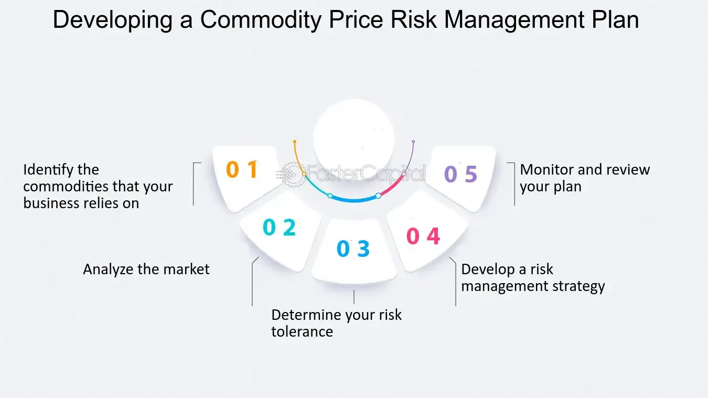

## Table of Contents

## What is commodity price risk?

Commodity price risk is the chance that the price of a commodity, like oil, gold, or wheat, might go up or down in a way that hurts a business or investor. Companies that use commodities to make their products, or investors who trade in commodities, can lose money if the price changes a lot. For example, if a bakery buys a lot of flour and the price of flour goes up, the bakery might have to pay more than they expected.

To manage this risk, businesses and investors often use different strategies. One common way is to use futures contracts, which let them agree on a price for a commodity to be bought or sold at a future date. This can help protect them if prices change unexpectedly. Another way is to diversify, which means not putting all their money into one commodity, so if one price goes down, they are not affected as much.

## Why is it important to manage commodity price risk?

Managing commodity price risk is important because it helps businesses and investors avoid big losses. If the price of a commodity like oil or wheat changes a lot, it can hurt a company that uses these materials. For example, if a car manufacturer buys a lot of steel and the price of steel goes up suddenly, the company might have to pay more than they planned. This can make their products more expensive or even cause them to lose money. By managing this risk, businesses can protect themselves and keep their costs more predictable.

Another reason to manage commodity price risk is to keep a business stable and able to plan for the future. When prices are unpredictable, it's hard for a company to know how much they will have to spend on materials. This can make it difficult to set prices for their products or to budget for other expenses. By using tools like futures contracts or diversifying their investments, businesses can reduce the impact of price changes. This helps them stay financially healthy and continue operating smoothly, even when commodity prices go up and down.

## What are the main types of commodities affected by price risk?

Commodity price risk affects many types of commodities, but some of the main ones are energy commodities, like oil and natural gas. These are used a lot in many industries, like transportation and manufacturing. If the price of oil goes up, it can make it more expensive for companies to move their products or to make things like plastics. This can lead to higher costs for businesses and higher prices for consumers.

Another type of commodity affected by price risk is agricultural commodities, like wheat, corn, and soybeans. Farmers and food companies use these a lot to grow and make food. If the price of wheat goes up, it can make bread and other products more expensive. This can be a big problem for food companies that need to keep their costs down to stay competitive.

Metals are also important commodities that can be affected by price risk. This includes both precious metals like gold and silver, and industrial metals like copper and steel. Companies that use these metals in their products, like electronics or construction, can be hurt if the prices change a lot. Investors who buy and sell these metals can also lose money if the prices go down unexpectedly.

## How can commodity price risk impact businesses and investors?

Commodity price risk can hurt businesses a lot. If a business uses things like oil, wheat, or steel to make their products, and the price of these things goes up, the business might have to pay more money than they planned. This can make their products more expensive to make, and they might have to raise prices or lose money. It can also make it hard for them to plan for the future because they don't know how much they will have to spend on materials. If prices go down, businesses might have bought things at a higher price and then have to sell their products for less, which can also hurt them.

Investors can also be affected by commodity price risk. If an investor buys commodities hoping to sell them later for more money, and the price goes down instead, they can lose money. This can happen with things like gold, oil, or corn. Investors might also use commodities to spread out their investments, but if the prices of the commodities they choose go down a lot, it can still hurt their overall investment plan. Managing this risk helps investors keep their money safer and plan better for the future.

## What are the basic methods for calculating commodity price risk?

To calculate commodity price risk, people often use something called the Value at Risk (VaR) method. This method helps figure out how much money someone might lose over a certain time, like a day or a week, with a certain chance, like 5% or 1%. To do this, they look at past prices of the commodity and use math to guess how much prices might change in the future. This helps businesses and investors know how much they could lose if the price of the commodity goes down a lot.

Another way to calculate commodity price risk is by using the standard deviation of price changes. This method looks at how much the price of a commodity has moved up and down in the past. By figuring out the standard deviation, people can see how much the price might change in the future. This helps them understand the risk of big price swings and plan how to protect themselves from losing too much money if the price changes a lot.

## What is the difference between spot price and futures price in commodity markets?

The spot price is the price you pay to buy a commodity right now. It's what you see when you want to buy something like oil or wheat today. The spot price can change a lot because it depends on what's happening right now, like if there's a lot of oil available or if there's a problem with wheat crops.

The futures price is different because it's the price you agree to pay for a commodity at a future date. When you buy a futures contract, you're making a deal to buy the commodity later, maybe in a few months or a year. The futures price can be different from the spot price because it's based on what people think will happen to the price in the future. If people think the price will go up, the futures price might be higher than the spot price.

## How do you calculate the Value at Risk (VaR) for commodity price risk?

To calculate the Value at Risk (VaR) for commodity price risk, you need to figure out how much money you might lose over a certain time, like a day or a week, with a certain chance, like 5% or 1%. To do this, you look at the past prices of the commodity and use math to guess how much the prices might change in the future. This helps you understand the risk of losing money if the price of the commodity goes down a lot. There are different ways to calculate VaR, but one common way is to use historical data to see how prices have changed in the past and then use that information to predict future changes.

Another way to calculate VaR is by using a method called the variance-covariance approach. This method looks at how much the price of the commodity has moved up and down in the past and uses a thing called standard deviation to figure out how much it might change in the future. By doing this, you can see how much you might lose if the price goes down a lot. This helps businesses and investors plan better and know how much risk they are taking when they buy or sell commodities.

## What role do commodity price indices play in risk assessment?

Commodity price indices are like scorecards that show how the prices of different commodities are changing over time. They help businesses and investors see the big picture of what's happening in the market. For example, if you're looking at an index for oil, it can tell you if oil prices are going up or down, which is important for companies that use oil in their products. By keeping an eye on these indices, businesses can spot trends and make better decisions about when to buy or sell commodities.

These indices are also really helpful for figuring out how much risk there is in the market. If an index shows that prices are moving a lot, it means there's more risk because prices could go up or down a lot. Businesses and investors use this information to plan how to protect themselves from big price changes. For example, if an index shows that wheat prices are very unstable, a bakery might decide to buy futures contracts to lock in a price and avoid surprises. This way, commodity price indices help everyone understand and manage risk better.

## How can options and futures be used to hedge against commodity price risk?

Options and futures are tools that businesses and investors use to protect themselves from big changes in commodity prices. Futures are like agreements to buy or sell a commodity at a set price on a future date. If a company knows it will need a lot of oil in six months, it can buy a futures contract now to lock in today's price. This way, if the price of oil goes up in the future, the company won't have to pay more than it planned. On the other hand, if the price goes down, the company might miss out on buying at a lower price, but at least it knows exactly what it will pay.

Options give people more choices. An option is like a ticket that lets you buy or sell a commodity at a set price, but you don't have to use it if you don't want to. There are two types: call options, which let you buy the commodity, and put options, which let you sell it. If a farmer thinks the price of wheat might go down before they sell their crop, they can buy a put option to sell at today's price. If the price does go down, they can use the option to sell at the higher price they locked in. If the price goes up, they can just sell at the higher market price and not use the option. This way, options help manage risk by giving people a safety net.

## What advanced statistical models are used for forecasting commodity prices?

Advanced statistical models help people guess what commodity prices might do in the future. One common model is called ARIMA, which stands for AutoRegressive Integrated Moving Average. ARIMA looks at past prices to find patterns and uses those patterns to predict what might happen next. It's good at dealing with data that changes over time, like commodity prices. Another model is GARCH, which stands for Generalized Autoregressive Conditional Heteroskedasticity. GARCH is great for understanding how much prices might go up and down, which is important for figuring out risk. Both of these models help businesses and investors make better plans by giving them a clearer picture of what might happen with commodity prices.

Another useful model is the Vector Autoregression (VAR) model. VAR looks at how different things, like the price of oil and the price of wheat, might affect each other. This can help people see how changes in one commodity might lead to changes in another. For example, if oil prices go up, it might make it more expensive to grow and transport wheat, which could push wheat prices up too. By using VAR, people can get a better understanding of the whole market and how different commodities are connected. These advanced models are powerful tools that help people make smarter decisions about buying and selling commodities.

## How does geopolitical risk factor into commodity price risk calculations?

Geopolitical risk can make commodity prices go up and down a lot. Things like wars, trade fights, or new laws in different countries can change how much of a commodity is available or how much it costs to get it from one place to another. For example, if there's a problem in a country that makes a lot of oil, like fighting or a new rule that makes it harder to sell oil, the price of oil can go up because there's less of it to go around. Businesses and investors need to think about these risks when they guess how much commodity prices might change.

To figure out how geopolitical risk might affect commodity prices, people look at news and reports about what's happening in different countries. They use this information to guess how much prices might go up or down. For example, if there's a chance of a big fight in a country that makes a lot of wheat, they might think wheat prices will go up because it could be harder to get wheat from that country. By keeping an eye on these risks, businesses and investors can plan better and try to protect themselves from big price changes.

## What are the latest trends in technology and data analysis for managing commodity price risk?

The latest trends in technology for managing commodity price risk involve using big data and machine learning. Big data means collecting a lot of information from different places, like satellite pictures of farms or real-time trading data. Machine learning helps computers find patterns in this data that people might not see. For example, machine learning can look at weather reports and past prices to guess what might happen to the price of wheat. This helps businesses and investors make better choices about when to buy or sell commodities.

Another trend is using more advanced computer programs to make models that predict prices. These models can look at many things at once, like how the price of oil might affect the price of wheat, or how new laws in different countries might change prices. They can also update their guesses very quickly as new information comes in. This helps people react faster to changes in the market and manage their risk better. By using these new technologies, businesses and investors can get a clearer picture of what might happen with commodity prices and plan more carefully.

## How do you calculate commodity price risk?

Calculating commodity price risk is a critical aspect of financial risk management. It involves evaluating potential future losses through quantitative methods such as Value at Risk (VaR) and Sensitivity Analysis. These techniques utilize historical data and mathematical models to provide insights into the potential impact of market changes on profitability.

Value at Risk (VaR) is a widely used metric that estimates the maximum loss a portfolio might face over a specified time frame, given normal market conditions. Mathematically, VaR is expressed as:

$$
\text{VaR}_{\alpha} = -\inf \{ l \in \mathbb{R} : P(L > l) \leq \alpha \}
$$

where $\alpha$ is the confidence level, $L$ is the loss, and $P$ represents the probability. By analyzing past commodity prices and returns, VaR provides a probabilistic assessment that helps traders and businesses anticipate possible adverse market movements.

Sensitivity Analysis, on the other hand, examines how different variables—such as commodity prices—affect key financial outcomes like profit margins or cost of goods sold. It involves varying one or more input parameters within a financial model to observe the resultant impact on output metrics. This analysis is crucial for identifying which variables most influence financial performance, allowing traders to understand risk exposure and make informed decisions.

To enhance the accuracy and speed of these assessments, automated tools play a significant role. Leveraging computational power, these tools perform complex calculations swiftly, enabling real-time risk assessment. For instance, Python libraries like NumPy and Pandas can process large datasets to compute VaR and conduct Sensitivity Analysis efficiently:

```python
import numpy as np
import pandas as pd

# Sample historical commodity price returns
returns = pd.Series([...])  # Replace with actual return data

# Calculate VaR at 95% confidence level
confidence_level = 0.95
var_value = np.percentile(returns, 100 * (1 - confidence_level))

# Perform simple Sensitivity Analysis
price_changes = np.array([...])  # Hypothetical price changes
profit_margins = initial_margin - (cost_increase_per_unit * price_changes)

print(f'VaR (95%): {var_value}')
print(f'Margins with price changes: {profit_margins}')
```

Utilizing such automated systems allows traders to execute precise and timely analysis, adapting risk management strategies in rapidly changing commodity markets. These methodologies collectively contribute to a comprehensive understanding of potential risks, enabling businesses to devise risk mitigation strategies effectively.

## How can algorithmic trading be utilized for risk management?

Algorithmic trading, commonly known as algo trading, employs sophisticated computer algorithms to automate trading decisions and manage risk. These algorithms rely on advanced mathematical models and data analytics to predict market trends, enabling rapid execution of trades with minimal human intervention. One key advantage of [algorithmic trading](/wiki/algorithmic-trading) is its ability to process large amounts of market data at extraordinary speeds, a capability that surpasses human traders. This rapid execution helps reduce latency and risks associated with delayed decision-making in volatile market conditions.

Algorithms in trading systems typically consist of several components, including data preprocessing, forecast modeling, and execution logic. Data preprocessing involves collecting and cleaning market data to ensure accuracy and reliability. Forecast modeling utilizes statistical techniques such as linear regression, time-series analysis, or [machine learning](/wiki/machine-learning) models like Support Vector Machines (SVM) and neural networks to generate market predictions. Execution logic then determines the specific trades to execute, based on the forecasts and current market conditions.

For instance, consider a simple moving average crossover strategy, where an algorithm might buy a commodity when its short-term moving average surpasses its long-term moving average, indicating a potential upward trend. This can be expressed mathematically as:

$$
\text{Buy Signal:} \quad SMA_{\text{short}}(t) > SMA_{\text{long}}(t)
$$

Here, $SMA_{\text{short}}$ and $SMA_{\text{long}}$ are the short-term and long-term simple moving averages respectively, and $t$ represents the time.

Incorporating risk management into these algorithms is crucial. Algo trading models often blend risk calculative methodologies like Value at Risk (VaR) and stress testing to quantify potential losses and adjust strategies accordingly. Hedging strategies can also be integrated; for example, creating automated protocols to enter futures contracts when market predictions suggest heightened risk exposure. This capability allows traders to preempt adverse price movements and mitigate potential losses.

Python, a preferred language for algorithmic trading, offers libraries such as NumPy and pandas for data manipulation, scikit-learn for machine learning, and [backtrader](/wiki/backtrader) for strategy testing. A Python script for a basic moving average crossover strategy might begin as follows:

```python
import numpy as np
import pandas as pd
from backtrader import Cerebro, Strategy

class MovingAverageCrossover(Strategy):
    def __init__(self):
        self.sma_short = bt.indicators.SimpleMovingAverage(self.data.close, period=50)
        self.sma_long = bt.indicators.SimpleMovingAverage(self.data.close, period=200)

    def next(self):
        if self.sma_short > self.sma_long:
            self.buy()
        elif self.position:
            self.sell()

cerebro = Cerebro()
data = bt.feeds.YahooFinanceData(dataname='GLD', fromdate=datetime(2020, 1, 1), todate=datetime(2021, 1, 1))
cerebro.adddata(data)
cerebro.addstrategy(MovingAverageCrossover)
cerebro.run()
```

Through algorithms, traders harness the potential to execute high-speed, high-frequency trades accurately and securely. By integrating comprehensive risk management techniques and predictive analytics, algorithmic trading offers powerful solutions for mitigating risks in commodities markets.

## What technological factors influence commodity prices?

Technological advancements have significantly shaped commodity price dynamics by enhancing market transparency and improving prediction accuracy. Blockchain technology, for instance, offers a decentralized ledger system that provides transactional transparency and security. This transparency reduces fraudulent activities and improves trust among market participants, potentially stabilizing price movements.

Big data analytics has transformed how commodities are traded by allowing traders to analyze vast amounts of market data to identify trends and predict future price movements. By incorporating data from various sources such as weather forecasts, geopolitical news, and historical price movements, these analytics platforms enable traders to make more informed decisions. For example, tools like Hadoop and Spark process and analyze large datasets in real-time, providing traders with timely insights into market conditions.

AI and machine learning algorithms further enhance trading strategies by continuously learning and adapting to changing market conditions. These technologies employ sophisticated models such as neural networks and decision trees to forecast price movements more accurately. A typical machine learning task might involve training a model on historical commodity prices using Python libraries like scikit-learn or TensorFlow to predict future price directions and volatilities.

For instance, machine learning models can use regression analysis to determine the relationship between various market factors and commodity prices. The equation for a simple linear regression model used in this context can be expressed as:

$$

y = \beta_0 + \beta_1 x_1 + \beta_2 x_2 + \cdots + \beta_n x_n + \epsilon 
$$

Where $y$ represents the commodity price, $x_1, x_2, \ldots, x_n$ are different price-influencing factors, $\beta_0$ is the intercept, $\beta_1, \beta_2, \ldots, \beta_n$ are coefficients for each [factor](/wiki/factor-investing), and $\epsilon$ is the error term.

Moreover, these algorithms enable real-time risk assessment and strategy optimization, crucial for swiftly responding to volatile market conditions. By simulating various market scenarios, traders can optimize their positions and hedging strategies to minimize risk exposure.

In conclusion, technological advancements have introduced sophisticated tools that significantly impact commodity markets by increasing transparency and enhancing predictive capabilities. These innovations help traders navigate complex market environments, make better-informed decisions, and manage risks more effectively.

## References & Further Reading

[1]: Bergstra, J., Bardenet, R., Bengio, Y., & Kégl, B. (2011). ["Algorithms for Hyper-Parameter Optimization."](https://papers.nips.cc/paper/4443-algorithms-for-hyper-parameter-optimization) Advances in Neural Information Processing Systems 24.

[2]: ["Advances in Financial Machine Learning"](https://www.amazon.com/Advances-Financial-Machine-Learning-Marcos/dp/1119482089) by Marcos Lopez de Prado

[3]: ["Evidence-Based Technical Analysis: Applying the Scientific Method and Statistical Inference to Trading Signals"](https://www.amazon.com/Evidence-Based-Technical-Analysis-Scientific-Statistical/dp/0470008741) by David Aronson

[4]: ["Machine Learning for Algorithmic Trading"](https://github.com/stefan-jansen/machine-learning-for-trading) by Stefan Jansen

[5]: ["Quantitative Trading: How to Build Your Own Algorithmic Trading Business"](https://www.amazon.com/Quantitative-Trading-Build-Algorithmic-Business/dp/1119800064) by Ernest P. Chan