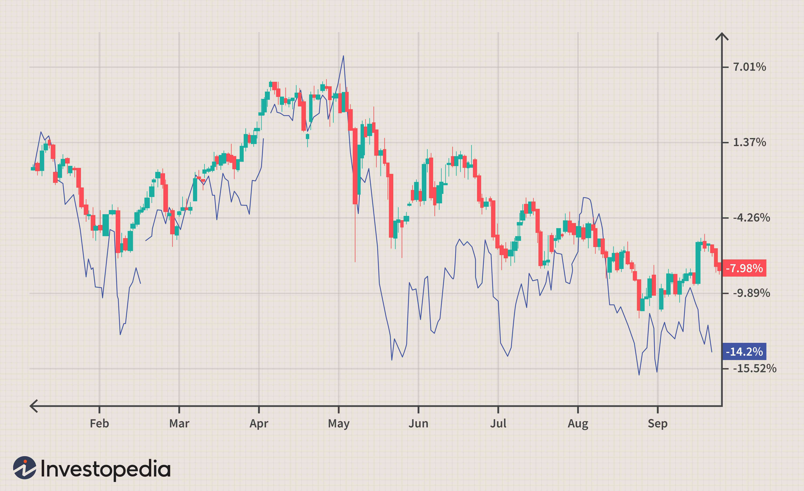

In today's global economy, understanding the interplay between economic factors, currency movements, commodity prices, and algorithmic trading is crucial for both traders and investors. These components are deeply interconnected, collectively shaping the landscape of financial markets, influencing investment decisions, and affecting economic stability globally.

Economic factors such as gross domestic product (GDP) growth, inflation rates, and employment statistics are fundamental in determining the value of national currencies. These indicators provide insights into a country's economic health, guiding central bank policies on interest rates and monetary supply. Such policies have a direct impact on currency fluctuations, which in turn affect international trade competitiveness and cross-border investments.



Commodity prices, meanwhile, hold significant sway over currency valuations, particularly in countries reliant on exporting or importing key resources like oil or gold. Changes in commodity prices can either bolster or undermine a nation's economic performance, thereby affecting its currency's relative strength. For instance, a rise in oil prices tends to strengthen currencies of oil-exporting nations while weakening those of oil-importing economies.

Algorithmic trading has emerged as a transformative force in this complex environment, utilizing computing power and mathematical models to enhance the speed, efficiency, and accuracy of trade executions. By analyzing large datasets and executing transactions without delay, algorithms help market participants optimize their trading strategies, minimize risks, and capitalize on emerging trends. The reduction of human error and emotional bias allows for more calculated decision-making, particularly in volatile markets influenced by sudden economic changes.

Together, these elements form a dynamic system where economic variables and technological innovations shape market behaviors. Algorithmic trading, especially, serves as an essential tool for navigating this intricate web, enabling participants to predict currency trends and optimize trade execution efficiently. By leveraging economic indicators and historical market data, algorithmic models enhance the ability to forecast movements and make informed trading decisions.

This continuous evolution in financial technology and economic understanding emphasizes the need for market players to remain informed and adaptable. As the global financial landscape moves forward, harnessing the synergy between economic insights and algorithmic trading will be key to achieving successful investment outcomes and maintaining market stability.

## Table of Contents

## The Impact of Economic Factors on Currency Movements

Economic factors play a pivotal role in determining the value of currencies on the global stage. Among these, key economic indicators such as Gross Domestic Product (GDP) growth, inflation, and employment rates are particularly influential. A country's GDP growth rate is a direct reflection of its economic health and potential for future prosperity. For instance, a higher GDP growth rate often signals a robust economy, making the domestic currency more attractive to investors, thus driving up its value. Conversely, weak GDP growth can lead to a depreciation of the currency as investors seek more lucrative opportunities elsewhere.

Inflation is another crucial [factor](/wiki/factor-investing), as it erodes purchasing power and can lead to currency depreciation. When inflation is high, central banks may increase interest rates to combat rising prices, which can attract foreign capital and boost the currency's value. Conversely, low inflation may prompt rate cuts, reducing the currency's attractiveness. Similarly, employment rates are indicative of economic stability. High employment often correlates with strong consumer spending and economic growth, strengthening the currency, while high unemployment can have the opposite effect.

Central banks exert considerable influence over currency values through [interest rate](/wiki/interest-rate-trading-strategies) decisions and broader monetary policy. By adjusting interest rates, central banks can control money flow, influencing currency demand. For example, a rate hike typically strengthens a currency as higher yields attract foreign capital. Conversely, a rate cut can weaken a currency as returns diminish. Central banks also employ tools such as open market operations and quantitative easing to manage economic conditions, impacting currency trends.

Geo-political events can swiftly alter currency dynamics, often with immediate and significant effects. Political instability, trade disputes, and conflicts can increase risk and prompt investors to flee to safe-haven currencies, such as the US dollar or Swiss franc. Market sentiment, driven by investor perceptions and speculative activities, can also influence currency values. For example, optimistic sentiment about a country's economic prospects can attract investment, boosting the currency, while a pessimistic outlook might trigger a sell-off.

Understanding the impact of these economic factors is critical for predicting currency movements and developing effective trading strategies. Traders and investors often rely on economic data releases to inform their positions. Specific instances, such as the release of non-farm payroll data in the United States, can lead to significant currency market reactions, as they provide insights into employment trends and the likely direction of interest rates. Similarly, unexpected announcements from central banks or geopolitical developments can cause abrupt currency shifts, underscoring the importance of monitoring economic indicators and events.

In summary, the interplay between economic factors and currency movements underscores the complexity and interconnectivity of global markets. By analyzing these variables, traders and investors can better anticipate market trends and make informed decisions, enhancing their potential for success in the competitive landscape of currency trading.

## Commodity Prices and Their Influence on Currencies

Commodities, including oil, gold, and agricultural products, are crucial determinants of currency strength, exerting significant influence on the economies of both exporting and importing nations. The prices of these raw materials can have an immediate impact on a country's trade balance, which in turn affects the value of its currency. 

For instance, a rise in oil prices tends to strengthen the currencies of oil-exporting countries, such as Canada and Saudi Arabia, as it leads to increased revenue from oil sales. Conversely, countries that heavily import oil may see their currencies weaken due to the increased cost of obtaining oil on the global market, potentially worsening their trade balances.

The Canadian dollar (CAD) is often referred to as a "commodity currency" due to Canada's status as a significant exporter of oil and other natural resources. Historically, there has been a positive correlation between the price of oil and the value of the CAD. Similarly, the Australian dollar (AUD) is closely linked to the prices of minerals and metals, notably gold and iron ore, which are vital exports for Australia. Changes in global demand and prices for these commodities can lead to corresponding movements in the AUD.

Analyzing historical trends reveals the strong interplay between commodity prices and currency movements. For example, during periods of booming commodity prices, nations exporting these resources typically experience an appreciation of their currencies, as increased foreign buyers purchase their currency to pay for their exports. This phenomenon can be illustrated by examining the concept of the "terms of trade," which represents the ratio of export prices to import prices. Improved terms of trade, driven by higher commodity prices, usually result in stronger national currencies.

Consider the following Python code to visualize the relationship between oil prices and the Canadian dollar:

```python
import matplotlib.pyplot as plt
import pandas as pd

# Sample data representing monthly average oil prices and CAD/USD exchange rates
data = {'Month': ['2023-01', '2023-02', '2023-03', '2023-04', '2023-05'],
        'Oil Price (USD/barrel)': [85, 87, 90, 88, 92],
        'CAD/USD Exchange Rate': [0.75, 0.76, 0.78, 0.77, 0.79]}

df = pd.DataFrame(data)
df['Month'] = pd.to_datetime(df['Month'])

# Plotting
fig, ax1 = plt.subplots()

color = 'tab:blue'
ax1.set_xlabel('Month')
ax1.set_ylabel('Oil Price (USD/barrel)', color=color)
ax1.plot(df['Month'], df['Oil Price (USD/barrel)'], color=color)
ax1.tick_params(axis='y', labelcolor=color)

ax2 = ax1.twinx()  
color = 'tab:red'
ax2.set_ylabel('CAD/USD Exchange Rate', color=color)
ax2.plot(df['Month'], df['CAD/USD Exchange Rate'], color=color)
ax2.tick_params(axis='y', labelcolor=color)

fig.tight_layout()
plt.title('Oil Prices vs. CAD/USD Exchange Rate')
plt.show()
```

This script provides a visual representation of the relationship between oil prices and the Canadian dollar exchange rate over a hypothetical period. Such analysis highlights the typical behavior of commodity-linked currencies in response to global market conditions.

Understanding the dynamics of how commodity prices influence currency markets is essential for businesses and policymakers involved in international trade and economic planning. Fluctuations in commodity prices can have far-reaching implications, not only for specific currencies but also for global economic stability and growth. By monitoring these trends, businesses can make informed decisions on hedging strategies, while policymakers can optimize monetary policies to mitigate potential adverse effects on the economy.

## Algorithmic Trading: Revolutionizing Market Interactions

Algorithmic trading has fundamentally altered the landscape of financial markets, enhancing the speed, efficiency, and precision of trade executions. Unlike traditional trading, which can be hindered by human emotion and slower decision-making processes, [algorithmic trading](/wiki/algorithmic-trading) systems leverage mathematical models and extensive data analysis to make swift, objective trading decisions. These systems are particularly advantageous in currency and commodity markets, where they rapidly process new information and execute trades in milliseconds, allowing for more agile market participation.

Algorithmic trading strategies vary widely to accommodate different market conditions and trading objectives. Trend following is one of the most common strategies, utilizing algorithms to identify and capitalize on market trends. These algorithms analyze historical price movements and utilize technical indicators like moving averages to generate buy or sell signals. For example, a simple moving average crossover system might be expressed in Python as:

```python
def moving_average_crossover(prices, short_window, long_window):
    short_mavg = prices.rolling(window=short_window, min_periods=1).mean()
    long_mavg = prices.rolling(window=long_window, min_periods=1).mean()
    return short_mavg > long_mavg
```

Market making is another popular strategy, where algorithms provide [liquidity](/wiki/liquidity-risk-premium) by simultaneously placing buy and sell orders to profit from the bid-ask spread. This approach involves maintaining a presence in the market by continuously offering to buy and sell, thereby facilitating smooth market functioning and taking advantage of small price changes.

Arbitrage strategies, on the other hand, seek to exploit price discrepancies across different markets or financial instruments. Algorithms designed for [arbitrage](/wiki/arbitrage) can quickly detect and capitalize on these inefficiencies, often requiring advanced technology and infrastructure to ensure minimal delay.

While the advantages of algorithmic trading are clear, including reduced transaction costs and minimized emotional decision-making, the approach is not without its challenges. Volatile economic and commodity markets present a significant hurdle, as rapid price movements can lead to slippage and increased trading costs. In high-frequency trading scenarios, where speed is paramount, even slight increases in latency can impact profitability.

Moreover, the reliance on technology and complex algorithms introduces the risk of technical failures and requires substantial investment in infrastructure. Additionally, the lack of human oversight can result in unintended trading behavior, especially when market conditions deviate from historical norms.

Despite these challenges, algorithmic trading continues to be a driving force in modern finance, providing traders and investors with powerful tools to navigate the complexities of today's markets. The ability to process vast amounts of data and react swiftly to changing market conditions gives algorithmic traders a distinct edge, particularly as financial markets become increasingly data-driven.

## The Synergy Between Economic Factors and Algo Trading

Algorithmic trading systems, often referred to as 'algos', have fundamentally transformed financial markets through their ability to react swiftly to economic data releases. This capability is particularly valuable for currency and commodity traders who operate in volatile and fast-moving markets. The primary advantage of algorithmic trading lies in its capacity to process and analyze vast amounts of data at speeds unattainable by human traders. This is made possible by the integration of sophisticated algorithms that utilize mathematical models and statistical analysis, enabling traders to execute strategies that capitalize on market inefficiencies.

### The Role of Economic Data in Algo Trading

Economic indicators such as GDP growth, inflation rates, and employment [statistics](/wiki/bayesian-statistics) are critical inputs for algorithmic trading models. These indicators provide insights into the economic health of nations, directly impacting currency and commodity prices. Algorithms are designed to interpret such data releases in real-time, allowing traders to make informed decisions almost instantaneously. For example, a surprise interest rate cut by a central bank might trigger an algo to buy certain assets, anticipating a currency devaluation.

### Developing and Testing Algorithmic Models

The development of algorithmic trading models involves a rigorous process of [backtesting](/wiki/backtesting) using historical economic and market data. This process ensures that the model can perform effectively under various market conditions and is resilient to adverse scenarios. Backtesting involves simulating the model with past data to evaluate its performance and optimize parameters.

In Python, one might employ libraries such as `pandas` for data manipulation and analysis, and `numpy` for quantitative computations. A simple example of backtesting a moving average crossover strategy might involve the following code:

```python
import pandas as pd
import numpy as np

# Load historical market data
data = pd.read_csv('market_data.csv', parse_dates=['Date'], index_col='Date')

# Calculate moving averages
data['Short_MA'] = data['Close'].rolling(window=5).mean()
data['Long_MA'] = data['Close'].rolling(window=20).mean()

# Generate trading signals
data['Signal'] = 0
data.loc[data['Short_MA'] > data['Long_MA'], 'Signal'] = 1
data.loc[data['Short_MA'] < data['Long_MA'], 'Signal'] = -1

# Evaluate strategy performance
data['Strategy_Returns'] = data['Signal'].shift(1) * data['Close'].pct_change()
cumulative_returns = (1 + data['Strategy_Returns']).cumprod()

print(cumulative_returns[-1])
```

### Integration of Economic Indicators

Incorporating economic indicators into algorithmic trading models increases their sophistication and predictive power. By embedding these indicators, algorithms can anticipate market movements based on the expected impact of economic releases. This integration can be further enhanced by utilizing [machine learning](/wiki/machine-learning) techniques, which allow algorithms to adapt to new patterns detected in the data over time.

### Enhancements Through Machine Learning and AI

Machine learning (ML) and [artificial intelligence](/wiki/ai-artificial-intelligence) (AI) are playing an increasingly prominent role in refining algorithmic trading strategies. These technologies offer advanced methods for data analysis, pattern recognition, and predictive modeling. Techniques such as [reinforcement learning](/wiki/reinforcement-learning) enable models to optimize trading strategies by learning from market data, improving their ability to forecast currency and commodity price movements.

In summary, the synergy between economic factors and algorithmic trading not only enhances the efficiency and effectiveness of trading strategies but also enriches the understanding of market dynamics. As markets grow more complex, the role of algorithms in interpreting economic data and executing trades will continue to expand, driven by ongoing advancements in computing and data science.

## Conclusion

The dynamic interplay between economic factors, currency movements, commodity prices, and algorithmic trading forms the backbone of the global financial landscape. Understanding each element's nuances and interconnections is crucial for developing effective investment and trading strategies. As financial markets continue to evolve, the role of algorithmic trading and data analysis is anticipated to grow, given their capacity to enhance decision-making processes and optimize executions.

To navigate future market challenges, staying informed about economic trends and technological advancements is paramount. Economic indicators can change rapidly, affecting currency and commodity markets, and algorithmic trading systems are increasingly harnessed to interpret these shifts with greater precision and speed. The reliance on algorithms harnessing historical data, machine learning, and artificial intelligence is set to expand, offering traders and investors tools to dissect complex market data and react in a timely manner.

By leveraging the insights and strategies outlined in this article, traders and investors can enhance their market positioning. This involves not only recognizing the impact of economic indicators but also integrating cutting-edge technology that empowers them to swiftly adapt to market [volatility](/wiki/volatility-trading-strategies). Continual learning and adaptation will be essential as markets transform, ensuring that participants remain competitive and well-prepared for future opportunities and challenges.

## References & Further Reading

[1]: Bergstra, J., Bardenet, R., Bengio, Y., & Kégl, B. (2011). ["Algorithms for Hyper-Parameter Optimization."](https://papers.nips.cc/paper/4443-algorithms-for-hyper-parameter-optimization) Advances in Neural Information Processing Systems 24.

[2]: ["Advances in Financial Machine Learning"](https://www.amazon.com/Advances-Financial-Machine-Learning-Marcos/dp/1119482089) by Marcos Lopez de Prado

[3]: ["Evidence-Based Technical Analysis: Applying the Scientific Method and Statistical Inference to Trading Signals"](https://www.amazon.com/Evidence-Based-Technical-Analysis-Scientific-Statistical/dp/0470008741) by David Aronson

[4]: ["Machine Learning for Algorithmic Trading"](https://github.com/stefan-jansen/machine-learning-for-trading) by Stefan Jansen

[5]: ["Quantitative Trading: How to Build Your Own Algorithmic Trading Business"](https://www.amazon.com/Quantitative-Trading-Build-Algorithmic-Business/dp/1119800064) by Ernest P. Chan