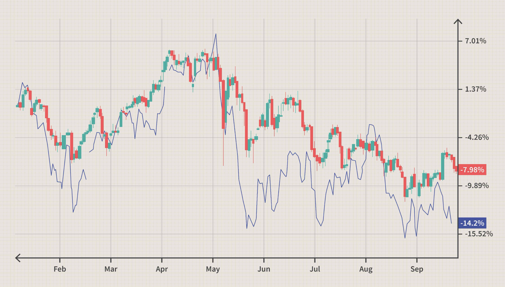

## Table of Contents

## What are commodities and why are they important in the global economy?

Commodities are basic goods that are the same no matter who produces them. These include things like oil, gold, wheat, and coffee. They are important because they are used to make many other products. For example, oil is used to make gasoline, plastics, and many other things. Wheat is used to make bread and other foods. Because commodities are so essential, their prices can affect the cost of many other products.

In the global economy, commodities are important because they are traded all over the world. Countries that have a lot of a certain commodity, like oil or wheat, can sell it to other countries that need it. This trade helps countries make money and grow their economies. When the prices of commodities go up or down, it can affect the economies of many countries. For example, if the price of oil goes up, it can make transportation and manufacturing more expensive, which can affect the prices of many goods and services.

## How do commodity prices affect the economy of countries that export them?

When a country exports a lot of a certain commodity, like oil or wheat, the price of that commodity can have a big effect on its economy. If the price goes up, the country can make more money from selling the commodity. This can help the country's economy grow because it has more money to spend on things like building roads, schools, and hospitals. It can also help the people in the country because they might have more money to spend on things they need.

But if the price of the commodity goes down, it can hurt the country's economy. The country will make less money from selling the commodity, which can make it harder to pay for important things. This can slow down the country's economy and make life harder for the people who live there. So, countries that rely a lot on exporting commodities can have economies that go up and down a lot, depending on the prices of those commodities.

## What is the relationship between commodity prices and inflation?

Commodity prices can affect inflation, which is when the prices of things we buy go up over time. When the prices of commodities like oil, wheat, or metals go up, it can make the cost of many other things go up too. For example, if oil prices rise, it can make gasoline and transportation more expensive. This can lead to higher prices for food and other goods because it costs more to move them around. When the cost of many things goes up, it can cause inflation.

On the other hand, if commodity prices go down, it can help keep inflation low. When commodities are cheaper, it can make the cost of many other things go down too. For example, if wheat prices fall, it can make bread and other food items cheaper. This can help keep the overall level of prices from going up too fast. So, commodity prices are an important [factor](/wiki/factor-investing) in whether inflation goes up or stays low.

## How do currency fluctuations impact the price of commodities?

Currency fluctuations can change the price of commodities because commodities are often traded in U.S. dollars. If the value of a country's currency goes down compared to the U.S. dollar, it can make commodities more expensive for people in that country. For example, if you live in a country where the currency is weaker, you will need more of your money to buy the same amount of oil or wheat, which is priced in dollars.

On the other hand, if the value of a country's currency goes up compared to the U.S. dollar, commodities can become cheaper for people in that country. They will need less of their money to buy the same amount of commodities. This can affect how much people in different countries pay for things like gas, food, and other products made from commodities. So, changes in currency values can have a big impact on the prices people pay for commodities around the world.

## Can you explain how the strength of a country's currency affects its commodity exports?

When a country's currency is strong, it means that the currency is worth more compared to other currencies. This can make it harder for the country to sell its commodities to other countries. If the country sells its commodities in U.S. dollars, like many countries do, a strong currency means that the country will get less of its own money when it changes the dollars back to its own currency. So, the country might decide to sell fewer commodities or charge more for them, which can make it harder to compete with other countries that have weaker currencies.

On the other hand, when a country's currency is weak, it means that the currency is worth less compared to other currencies. This can make it easier for the country to sell its commodities. A weak currency means that the country will get more of its own money when it changes the U.S. dollars back to its own currency. This can make the country's commodities cheaper for other countries to buy, which can help the country sell more and make more money from its exports. So, the strength of a country's currency can have a big impact on how well it can sell its commodities to other countries.

## What role do commodity futures markets play in currency fluctuations?

Commodity futures markets are places where people can buy and sell agreements to buy or sell commodities at a future date. These markets can affect currency fluctuations because many commodities are priced in U.S. dollars. When people trade futures, they are often trying to guess what the price of a commodity will be in the future. If a lot of people think the price of a commodity like oil will go up, they might buy more futures, which can make the demand for U.S. dollars go up too. This can make the U.S. dollar stronger compared to other currencies.

On the other hand, if people think the price of a commodity will go down, they might sell more futures, which can make the demand for U.S. dollars go down. This can make the U.S. dollar weaker compared to other currencies. So, the trading in commodity futures markets can cause the value of the U.S. dollar to go up and down, which can affect the exchange rates between the U.S. dollar and other currencies. This is why commodity futures markets can play a big role in currency fluctuations.

## How do global events influence both commodity prices and currency values?

Global events like wars, natural disasters, or big changes in politics can shake up both commodity prices and currency values. When something big happens, it can change how much people want certain commodities. For example, if there's a war in a country that makes a lot of oil, people might worry that less oil will be available. This can make the price of oil go up. At the same time, if the country's money is used a lot in oil trades, the value of that country's currency might go down because people are worried about the war.

These events can also make currencies go up and down. If a country is having a big problem, like a natural disaster, people might not want to hold onto that country's money. They might think the country's economy will get worse, so they sell the currency, making it weaker. On the other hand, if a country is doing well and seems safe, more people might want to buy its currency, making it stronger. So, global events can cause big changes in both commodity prices and currency values, which can affect the whole world's economy.

## What are some strategies countries use to mitigate the effects of currency fluctuations on commodity prices?

Countries use different strategies to lessen the impact of currency changes on commodity prices. One common way is to use hedging. Hedging means buying or selling financial products that can protect against price changes. For example, if a country exports a lot of oil and worries that its currency might get weaker, it can use hedging to lock in a good price for its oil in the future. This can help the country make more money even if its currency loses value.

Another strategy is to keep some money in different currencies. If a country knows its own currency might go up and down a lot, it can keep some of its money in stronger currencies like the U.S. dollar or the euro. This way, if its own currency gets weaker, it can still use the stronger currencies to buy commodities at a good price. This can help the country keep the cost of important goods steady, even when its currency changes a lot.

Some countries also try to control their currency's value. They might buy or sell their own currency to keep its value from changing too much. This can help keep commodity prices stable because the cost of commodities in the country's money won't go up and down as much. But this can be hard to do and might not always work, especially if global events cause big changes in the world's economy.

## How can investors use commodity prices as an indicator of currency movements?

Investors can look at commodity prices to get clues about how currencies might move. Since many commodities are sold in U.S. dollars, changes in commodity prices can affect the demand for the dollar. If commodity prices go up, it might mean more people want to buy dollars to pay for those commodities. This can make the U.S. dollar stronger compared to other currencies. On the other hand, if commodity prices go down, fewer people might want to buy dollars, which can make the dollar weaker. So, by watching commodity prices, investors can guess if the U.S. dollar will get stronger or weaker.

This relationship works the other way too. If a country's currency gets stronger, it might make its commodities more expensive for other countries to buy. This can cause the demand for those commodities to go down, which can push their prices lower. On the flip side, if a country's currency gets weaker, its commodities might become cheaper for other countries, which can make demand go up and push prices higher. By understanding these patterns, investors can use commodity prices as a tool to predict and react to currency movements, helping them make better investment decisions.

## What advanced economic models are used to predict the impact of commodity prices on currency values?

Economists use advanced models like the Vector Autoregression (VAR) model to predict how commodity prices can affect currency values. A VAR model looks at many different things at once, like commodity prices, interest rates, and inflation. It uses past data to find patterns and guess what might happen next. For example, if oil prices have gone up in the past and the U.S. dollar got stronger, the model might predict that if oil prices go up again, the U.S. dollar will get stronger too. These models help economists see how different parts of the economy are connected and how changes in one part, like commodity prices, can affect another part, like currency values.

Another model that economists use is the Error Correction Model (ECM). This model is good at showing how things move back to normal after they change. For example, if the price of gold goes up a lot and the Australian dollar gets stronger, the ECM can help predict when and how the Australian dollar might go back to its usual value. It does this by looking at the difference between where things are now and where they usually are, then guessing how fast they will go back to normal. Both VAR and ECM models help investors and policymakers make better guesses about the future, which can help them make smarter choices.

## How do central bank policies affect the interplay between commodity prices and currency fluctuations?

Central banks can affect commodity prices and currency values through their policies. When a central bank raises interest rates, it can make the country's currency stronger. This is because higher interest rates can attract more foreign money, as investors want to earn more on their investments. A stronger currency can make commodities cheaper for other countries to buy, which can lower commodity prices. On the other hand, if a central bank lowers interest rates, it can make the country's currency weaker. This can make commodities more expensive for other countries, which can push commodity prices up.

Central banks also use other tools like buying or selling their own currency to control its value. If a central bank thinks its currency is too weak, it might buy its own currency to make it stronger. This can affect commodity prices because a stronger currency can make commodities cheaper for other countries. If the central bank thinks its currency is too strong, it might sell its own currency to make it weaker. This can make commodities more expensive for other countries. So, central bank policies can have a big impact on how commodity prices and currency values move together.

## What are the long-term trends in commodity prices and currency values, and how do they correlate?

Over the long term, commodity prices and currency values often move together in certain ways. For example, if a country has a lot of a commodity like oil or gold, and the price of that commodity goes up over many years, the country's currency might also get stronger. This is because more people want to buy the country's currency to pay for the commodity. On the other hand, if the price of a commodity goes down over a long time, the currency of the country that exports it might get weaker. This can happen because fewer people want to buy the country's currency if they don't need as much of the commodity.

These long-term trends can be seen in the history of commodity prices and currency values. For instance, when oil prices were very high in the 2000s, countries like Canada and Norway, which export a lot of oil, saw their currencies get stronger. But when oil prices fell in the 2010s, these countries' currencies got weaker. This shows how closely linked commodity prices and currency values can be over time. People who study the economy use this information to make guesses about what might happen in the future and to help them make better decisions about money and investments.

## References & Further Reading

[1]: Bergstra, J., Bardenet, R., Bengio, Y., & Kégl, B. (2011). ["Algorithms for Hyper-Parameter Optimization."](https://papers.nips.cc/paper/4443-algorithms-for-hyper-parameter-optimization) Advances in Neural Information Processing Systems 24.

[2]: ["Advances in Financial Machine Learning"](https://www.amazon.com/Advances-Financial-Machine-Learning-Marcos/dp/1119482089) by Marcos Lopez de Prado

[3]: ["Evidence-Based Technical Analysis: Applying the Scientific Method and Statistical Inference to Trading Signals"](https://www.amazon.com/Evidence-Based-Technical-Analysis-Scientific-Statistical/dp/0470008741) by David Aronson

[4]: ["Machine Learning for Algorithmic Trading"](https://github.com/stefan-jansen/machine-learning-for-trading) by Stefan Jansen

[5]: ["Quantitative Trading: How to Build Your Own Algorithmic Trading Business"](https://www.amazon.com/Quantitative-Trading-Build-Algorithmic-Business/dp/1119800064) by Ernest P. Chan