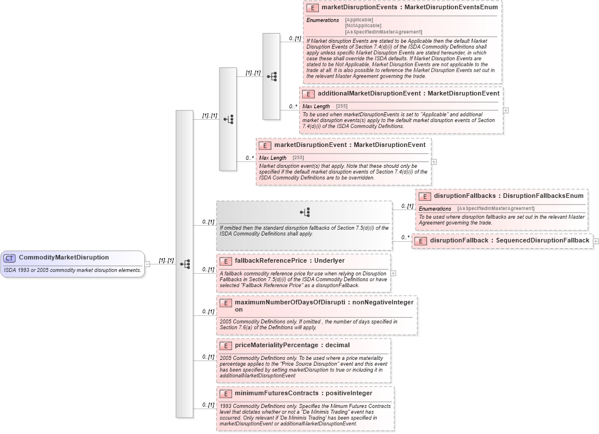

## Table of Contents

## What is Commodity Product Markup Language (C-PML)?

Commodity Product Markup Language (C-PML) is a type of computer language used to describe and share information about products, especially commodities. It helps businesses and organizations to easily exchange data about products like grains, metals, or energy resources. By using C-PML, companies can ensure that everyone understands the same information about a product, which makes buying and selling easier and more efficient.

C-PML works by organizing product information into a structured format that computers can read and process. This format includes details like the product's name, type, quality, and quantity. When businesses use C-PML, they can send and receive product data quickly and accurately, reducing mistakes and saving time. This is especially useful in industries where large amounts of data need to be handled every day.

## What are the main components of C-PML?

The main components of C-PML include elements that describe the product, its attributes, and how it is measured. These elements are organized in a way that computers can easily understand and process. For example, C-PML includes tags for the product's name, type, and quality. It also has tags for measurements like weight, volume, or quantity. These tags help to clearly define what the product is and how much of it there is.

Another important part of C-PML is the way it handles different units of measurement and standards. This is crucial because different countries or industries might use different ways to measure the same thing. C-PML allows users to specify which units or standards they are using, so everyone understands the data correctly. This makes it easier for businesses to work together, even if they are from different places or sectors.

Lastly, C-PML includes components for describing the product's origin and any certifications it might have. This can include where the product comes from, who produced it, and any quality or safety certifications it has received. These details are important for buyers who need to know more about the product's background before making a purchase. By including this information, C-PML helps to build trust and transparency in business transactions.

## How does C-PML differ from other markup languages?

C-PML is different from other markup languages because it focuses on describing commodities and products. While languages like HTML are used for creating web pages and XML is used for general data exchange, C-PML is made specifically for the trading and management of commodities. This means it has special tags and structures that are designed to handle information about products like grains, metals, or energy resources.

Another way C-PML differs is in its emphasis on standardization and accuracy. In the world of commodities, it's important that everyone understands the same thing about a product, like its weight, quality, and origin. C-PML helps make sure this happens by providing a clear and consistent way to describe these details. Other markup languages might not have the same focus on these specific needs of the commodity market.

Overall, C-PML is tailored to meet the needs of businesses that deal with commodities. It provides a structured way to share detailed product information, making buying and selling easier and more reliable. This specialized focus sets it apart from more general-purpose markup languages.

## What are the benefits of using C-PML for commodity trading?

Using C-PML for commodity trading makes things easier and more accurate. It helps businesses share information about products like grains or metals in a clear way. This means everyone understands the same details about a product, like how much there is and how good it is. This can reduce mistakes and make trading faster because there's less confusion.

Another benefit is that C-PML helps with trust and transparency. It lets businesses share where a product comes from and any certifications it has. This is important for buyers who want to know more about what they're buying. By using C-PML, companies can show that they are honest and open about their products, which can make trading smoother and build better relationships.

## How can C-PML be implemented in a trading system?

To implement C-PML in a trading system, you start by setting up the system to understand and use C-PML. This means making sure the computers and software in the trading system can read and process C-PML files. You'll need to add special parts to the system that can take the information from C-PML and use it correctly. This might involve working with a team of computer experts to make sure everything is set up right.

Once the system is ready, businesses can start using C-PML to share product information. They can create C-PML files with details about their commodities, like how much they have and how good it is. When they send these files to other businesses, the trading system can read them and understand the information. This helps make trading easier and more accurate because everyone uses the same way to describe products.

## What are the common use cases for C-PML in the commodity market?

In the commodity market, C-PML is often used when businesses want to share details about their products. For example, a farmer might use C-PML to tell a buyer how much wheat they have and how good it is. This helps the buyer know exactly what they are getting before they make a deal. By using C-PML, both the farmer and the buyer can be sure they understand each other, which makes trading smoother and faster.

Another common use case is when companies need to keep track of where their commodities come from and any certifications they have. For instance, a company selling oil might use C-PML to show that their oil meets certain quality standards and comes from a specific place. This information is important for buyers who need to know the background of the product. Using C-PML helps build trust and makes sure everyone has the same information about the commodity.

## How does C-PML handle data standardization across different commodity types?

C-PML helps make sure that everyone in the commodity market uses the same way to talk about different types of products. It does this by having special tags for things like the product's name, how much there is, and how good it is. No matter if you're dealing with grains, metals, or energy resources, C-PML uses the same set of rules to describe them. This means that a farmer selling wheat and a company selling oil can both use C-PML to share their product information in a way that everyone understands.

This standardization is important because it helps avoid confusion and mistakes. For example, if one company measures wheat in kilograms and another in pounds, C-PML can handle these different units and make sure everyone knows what they mean. By using C-PML, businesses can easily share information about different commodities and be sure that everyone is on the same page. This makes trading easier and more reliable across the whole commodity market.

## What are the challenges faced when adopting C-PML in existing systems?

When businesses want to start using C-PML in their existing systems, they might run into some problems. One big challenge is making sure their computers and software can understand and work with C-PML. This might mean spending time and money to update their systems or hire experts to help. It can be hard for businesses to change their old ways of doing things and learn how to use C-PML correctly.

Another challenge is getting everyone in the commodity market to use C-PML. If only a few businesses use it, it won't be very helpful. Everyone needs to agree to use the same language to make trading easier and more accurate. It can take a lot of work to convince others to switch to C-PML and make sure they all use it the right way. This can slow down the process of adopting C-PML and make it harder for businesses to see the benefits right away.

## Can you explain the structure of a typical C-PML document?

A typical C-PML document is like a detailed list that describes a product. It starts with a main tag that says it's a C-PML document. Inside this, there are smaller tags that tell you things like the product's name, what type it is, and how good it is. For example, if you're selling wheat, the document might say "Wheat" as the name and "Grade A" as the quality. There are also tags for how much of the product there is, like weight or [volume](/wiki/volume-trading-strategy), and where it comes from.

The document also has parts for other important details. It can include tags for any certifications the product has, which show that it meets certain standards. There are also tags for the units of measurement, so everyone knows if you're talking about kilograms or pounds. All these tags are organized in a way that computers can easily read and understand. This helps make sure that when you share the document with someone else, they get all the right information about the product.

## How does C-PML support interoperability between different trading platforms?

C-PML helps different trading platforms work together by using the same way to describe products. When everyone uses C-PML, it's like they're all speaking the same language. This means that a trading platform in one country can easily understand product information from a platform in another country. They can share details about things like how much of a product there is, how good it is, and where it comes from. This makes it easier for businesses to buy and sell across different platforms without getting confused.

Another way C-PML supports interoperability is by handling different units of measurement and standards. For example, if one platform uses kilograms and another uses pounds, C-PML can make sure everyone knows what these units mean. It also helps with certifications and other important details that businesses need to know. By using C-PML, trading platforms can make sure they're sharing accurate and complete information, which helps them work together smoothly and build trust with each other.

## What advanced features does C-PML offer for data analytics and reporting?

C-PML helps with data analytics and reporting by making it easy to gather and organize information about products. It uses special tags to describe things like how much of a product there is, its quality, and where it comes from. This makes it simple for computers to collect all this data and put it into reports. Businesses can then look at these reports to see trends, like which products are selling well or which ones need to be improved.

Another way C-PML helps is by letting businesses compare data from different times or places. Because C-PML uses the same way to describe products everywhere, companies can easily see how their products are doing in different markets. This helps them make better decisions, like where to sell more or how to change their products to meet customer needs. By using C-PML, businesses can get a clear picture of their data and use it to grow and improve.

## What future developments are expected in the evolution of C-PML?

In the future, C-PML is expected to become even better at handling data. It might include new ways to describe products, like adding more details about how they're made or their environmental impact. This would help businesses share more information and make smarter choices. C-PML could also work better with other computer languages and systems, making it easier to use across different industries and countries.

Another big change might be how C-PML helps with new technology like [artificial intelligence](/wiki/ai-artificial-intelligence) (AI) and big data. It could be used to feed data into AI systems that can predict market trends or suggest the best ways to trade. This would make C-PML even more useful for businesses looking to stay ahead in the commodity market. As more companies use C-PML, it will keep getting updated to meet their needs and make trading easier and more accurate.

## References & Further Reading

[1]: Giles, M., & Yang, J. (2013). ["Efficient Data Structures for Financial Simulation."](https://people.maths.ox.ac.uk/gilesm/mlmc.html) In Proceedings of the ACM SIGMOD International Conference on Management of Data.

[2]: Stoll, H. R. (2006). ["Electronic Trading in Stock Markets."](https://pubs.aeaweb.org/doi/pdfplus/10.1257/089533006776526067) Journal of Economic Perspectives, 20(1), 153-174.

[3]: Lopez de Prado, M. (2018). ["Advances in Financial Machine Learning."](https://www.amazon.com/Advances-Financial-Machine-Learning-Marcos/dp/1119482089) Wiley.

[4]: EFET. (2014). ["EFET CPML Working Group Presentation."](https://efet.org/files/documents/EFET_CpML_for_ESM_3.2_with_tracked_changes.pdf) European Federation of Energy Traders.

[5]: Harris, L. (2003). ["Trading and Exchanges: Market Microstructure for Practitioners."](https://academic.oup.com/book/52292) Oxford University Press.