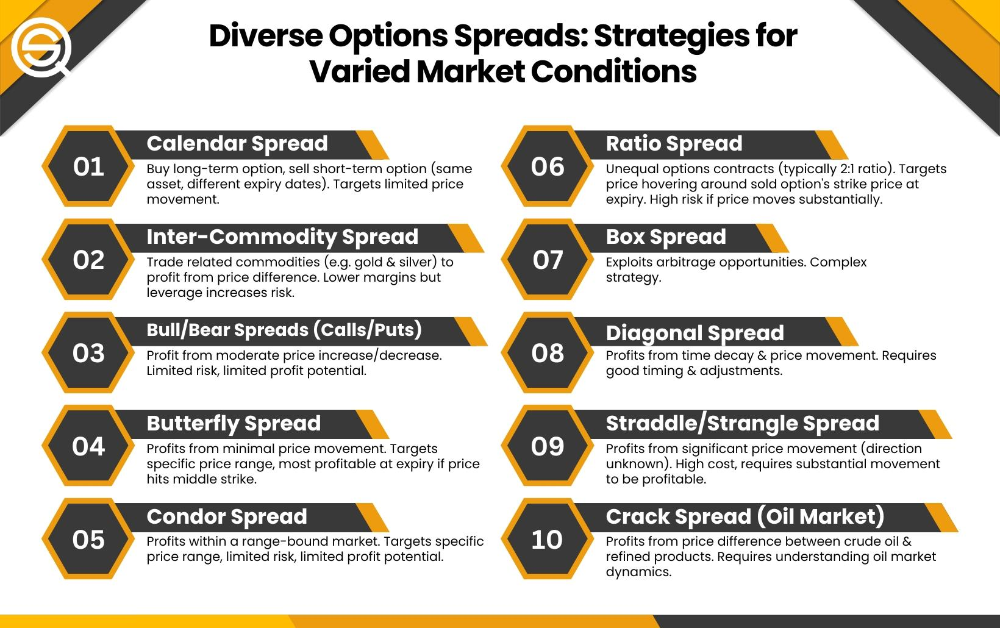

## Table of Contents

## What is a commodity-product spread?

A commodity-product spread is a trading strategy used in the financial markets. It involves taking positions in both a raw commodity and a product made from that commodity. The goal is to profit from the difference in price changes between the two. For example, a trader might buy crude oil and sell gasoline futures. This strategy helps manage the risk of price movements in the raw material and the finished product.

This type of spread is common in industries like energy, agriculture, and metals. In the energy sector, traders often use the crack spread, which involves crude oil and its refined products like gasoline and heating oil. In agriculture, a common spread is the crush spread, which involves soybeans and soybean products like oil and meal. By using these spreads, traders can hedge against price fluctuations and potentially earn profits from the relative price changes between the commodity and the product.

## How does a commodity-product spread work?

A commodity-product spread is a way for traders to make money by buying and selling both a raw material and a product made from it. For example, a trader might buy crude oil and at the same time sell gasoline. The idea is to make a profit from the difference in how the prices of these two things change. If the price of crude oil goes up but the price of gasoline goes up even more, the trader can make money from the difference.

This strategy is used a lot in industries like energy, farming, and metals. In the energy world, people often use something called a crack spread, which involves crude oil and things like gasoline and heating oil. In farming, there's a spread called a crush spread, which involves soybeans and products like soybean oil and meal. By using these spreads, traders can protect themselves from big price swings and might make money from the way the prices of the raw material and the finished product move compared to each other.

## What are the basic components involved in a commodity-product spread?

A commodity-product spread involves two main parts: a raw commodity and a product made from that commodity. For example, if you're looking at the energy market, the raw commodity could be crude oil, and the product could be gasoline or heating oil. In agriculture, the raw commodity might be soybeans, and the products could be soybean oil and soybean meal. The idea is to take a position in both the raw material and the finished product to make money from the difference in their price changes.

Traders use commodity-product spreads to manage the risk of price changes in both the raw material and the finished product. For instance, if a trader buys crude oil and sells gasoline at the same time, they are betting that the price of gasoline will not go up as much as the price of crude oil, or maybe even go down. This way, even if the price of crude oil goes up, the trader can still make money if the price of gasoline goes up less or stays the same. It's a way to protect against big price swings and possibly earn profits from the relative price movements between the commodity and the product.

## What are the most common types of commodity-product spreads?

The most common types of commodity-product spreads are the crack spread and the crush spread. The crack spread is used in the energy industry. It involves buying crude oil and selling products like gasoline or heating oil. Traders use this spread to make money from the difference in price changes between crude oil and its refined products. If the price of crude oil goes up but the price of gasoline goes up even more, the trader can make a profit.

The crush spread is used in the agriculture industry. It involves buying soybeans and selling soybean products like soybean oil and soybean meal. Traders use this spread to protect themselves from big price swings in soybeans and to make money from the difference in price changes between soybeans and their products. If the price of soybeans goes up but the price of soybean oil goes up even more, the trader can make a profit from the difference.

## Can you explain the crack spread and its significance?

The crack spread is a way for people in the energy business to make money or protect themselves from price changes. It involves buying crude oil and selling products like gasoline or heating oil at the same time. Traders use the crack spread to make money from the difference in how the prices of crude oil and its refined products change. If the price of crude oil goes up but the price of gasoline goes up even more, the trader can make a profit from the difference.

The crack spread is important because it helps traders manage the risk of big price swings in the energy market. By taking positions in both crude oil and its products, traders can protect themselves if the price of one goes up or down a lot. This way, they can still make money even if the price of crude oil changes a lot, as long as the price of gasoline or heating oil changes differently. It's a common strategy in the energy industry because it helps traders deal with the ups and downs of oil prices.

## What is the spark spread and how is it used in the energy sector?

The spark spread is a way for people in the energy business to make money or protect themselves from price changes. It involves buying natural gas and selling electricity at the same time. Traders use the spark spread to make money from the difference in how the prices of natural gas and electricity change. If the price of natural gas goes up but the price of electricity goes up even more, the trader can make a profit from the difference.

The spark spread is important because it helps traders manage the risk of big price swings in the energy market. By taking positions in both natural gas and electricity, traders can protect themselves if the price of one goes up or down a lot. This way, they can still make money even if the price of natural gas changes a lot, as long as the price of electricity changes differently. It's a common strategy in the energy industry because it helps traders deal with the ups and downs of energy prices.

## How do market participants use commodity-product spreads for hedging?

Market participants use commodity-product spreads for hedging to protect themselves from big price changes in the market. For example, if someone owns a refinery that turns crude oil into gasoline, they might be worried about the price of crude oil going up a lot. To protect themselves, they can use a crack spread by buying crude oil and selling gasoline at the same time. If the price of crude oil goes up, the refinery might have to pay more for the oil, but they can make money from the difference if the price of gasoline goes up even more.

This strategy helps them manage the risk of price changes in both the raw material and the finished product. By using a commodity-product spread, market participants can make sure they don't lose too much money if prices move in a way they didn't expect. For instance, a farmer might use a crush spread to protect themselves from big changes in soybean prices. They can buy soybeans and sell soybean oil and meal at the same time. This way, if the price of soybeans goes down, they can still make money from the difference if the price of soybean oil or meal goes down less or even goes up.

## What are the key factors that influence the pricing of commodity-product spreads?

The pricing of commodity-product spreads is influenced by several key factors. One big [factor](/wiki/factor-investing) is the cost of turning the raw material into the finished product. For example, if it costs more to turn crude oil into gasoline, the crack spread between crude oil and gasoline will change. Another factor is how much people want the finished product. If more people want gasoline, its price might go up more than the price of crude oil, which can make the crack spread bigger.

Other factors that can influence the pricing of commodity-product spreads include changes in the overall economy, like inflation or interest rates, and unexpected events like natural disasters or political issues. For instance, if a hurricane hits an area with a lot of oil refineries, it might make it harder to turn crude oil into gasoline, which can change the crack spread. Also, government rules and regulations can affect the cost of making the finished product, which in turn affects the spread between the raw material and the product.

## How do commodity-product spreads differ across various industries?

Commodity-product spreads can be different in various industries because each industry uses different raw materials and makes different products. In the energy industry, people often use the crack spread, which involves buying crude oil and selling gasoline or heating oil. The price difference between crude oil and its refined products can change a lot because of things like the cost of refining oil, how much people want gasoline, and unexpected events like natural disasters. On the other hand, in the agriculture industry, people use the crush spread, which involves buying soybeans and selling soybean oil and meal. The price difference here can be affected by things like the cost of processing soybeans, how much people want soybean oil, and changes in the weather that can affect soybean crops.

In the metals industry, people might use a spread like the gold-silver spread, where they buy gold and sell silver. The price difference between gold and silver can change because of things like how much people want jewelry or how much industries need silver for things like electronics. Each of these spreads helps people in different industries manage the risk of big price changes and make money from the difference in how the prices of the raw material and the finished product change. Even though the basic idea of a commodity-product spread is the same across industries, the specific details and factors that affect the spread can be very different depending on the industry.

## What advanced strategies can traders employ using commodity-product spreads?

Traders can use more advanced strategies with commodity-product spreads to make more money or protect themselves better from price changes. One strategy is called calendar spread, where traders buy and sell the same commodity-product spread but for different times in the future. For example, a trader might buy a crack spread for next month and sell a crack spread for three months from now. This can help them make money from the difference in how the spread changes over time. Another strategy is called inter-commodity spread, where traders use spreads from different but related commodities. For instance, a trader might use both the crack spread and the spark spread to make money from the differences in how oil, gasoline, and electricity prices change.

Another advanced strategy is called ratio spread, where traders change the amount of the raw material and the product they buy and sell. For example, instead of buying one barrel of crude oil and selling one barrel of gasoline, a trader might buy one barrel of crude oil and sell two barrels of gasoline. This can help them make more money if the price difference between the two changes in a certain way. Traders can also use options with commodity-product spreads. They can buy options on the spread itself, which gives them the right but not the obligation to buy or sell the spread at a certain price. This can help them protect themselves from big price changes while still being able to make money if the spread moves in their favor.

## How do geopolitical events impact commodity-product spreads?

Geopolitical events can have a big impact on commodity-product spreads. For example, if there is a war or a political problem in a country that makes a lot of oil, it can make the price of oil go up. This can change the crack spread between crude oil and gasoline. If people start to worry that there won't be enough oil, they might want to buy more gasoline, which can make the price of gasoline go up even more than the price of oil. This means the crack spread can get bigger, and traders who use the crack spread can make more money or lose more money depending on how they bet on the spread.

Also, geopolitical events can affect other industries too. For instance, if there is a trade war between two countries, it might make it harder or more expensive to get soybeans from one country to another. This can change the crush spread between soybeans and soybean oil and meal. If it costs more to get soybeans, the price of soybeans might go up, but the price of soybean oil and meal might not go up as much. This can make the crush spread smaller, and traders who use the crush spread need to think about these changes when they make their trading plans.

## What are the future trends and potential developments in commodity-product spread trading?

In the future, commodity-product spread trading might see more use of technology like [artificial intelligence](/wiki/ai-artificial-intelligence) and [machine learning](/wiki/machine-learning). These tools can help traders look at a lot of data quickly and find patterns that they might not see otherwise. This can make it easier for them to decide when to buy and sell and how to make more money from the spreads. Also, more people might start trading commodity-product spreads because of new trading platforms that are easier to use. These platforms can help people who are not experts in trading to get involved and make money from the differences in prices between raw materials and finished products.

Another trend could be more focus on green energy and sustainable products. As more people care about the environment, the demand for things like biofuels and electric cars might go up. This can change the spreads between traditional commodities like oil and new products like biofuel. Traders might need to learn about these new markets and how to use spreads to make money from them. Also, rules from governments about the environment can change how much it costs to make products, which can affect the spreads. Traders will need to keep an eye on these changes and adjust their strategies to make the most of the new opportunities.

## What is Understanding Commodity Spread Trading?

Commodity spread trading involves taking opposing positions in related futures contracts to capitalize on the price discrepancies that exist between them. The primary objective is to exploit the price spread between a raw commodity and its finished product, offering traders a diverse set of opportunities to make profitable trades.

One of the fundamental aspects of this trading strategy is understanding the different types of commodity-product spreads, each presenting its own set of opportunities and challenges. Key types include the crack spread, crush spread, and spark spread.

### Crack Spread

The crack spread is a popular type of spread trading involving oil products. It refers to the difference between the price of [crude oil](/wiki/crude-oil) and its derivative products like gasoline and heating oil. Traders consider this spread to estimate refinery margins. For example, a 3-2-1 crack spread involves three barrels of crude oil being converted into two barrels of gasoline and one barrel of heating oil. The formula for calculating a basic crack spread is:

$$
\text{Crack Spread} = 2 \times \text{Gasoline Price} + \text{Heating Oil Price} - \text{Crude Oil Price}
$$

Changes in crack spreads can indicate shifts in supply and demand dynamics or refinery inefficiencies.

### Crush Spread

The crush spread is primarily used in the soybean market, representing the difference between the combined value of soybean oil and soybean meal produced from soybeans and the price of raw soybeans. This spread provides insights into the profitability of processing soybeans into its derivative products. A typical crush spread is calculated as follows:

$$
\text{Crush Spread} = \text{(Soybean Meal Price} \times 44/2000) + \text{(Soybean Oil Price} \times 11) - \text{Soybean Price}
$$

Here, the factors 44 and 11 reflect the standard conversion rates from soybeans to soybean meal and soybean oil respectively.

### Spark Spread

The spark spread refers to the difference between the price of electricity and its cost of production using natural gas. It's an essential metric for power producers to assess profitability in the electricity markets. The basic formula for the spark spread involves subtracting the cost of producing electricity (calculated based on natural gas prices and power plant efficiency) from the electricity market price. It's calculated as:

$$
\text{Spark Spread} = \text{Electricity Price} - \left(\frac{\text{Natural Gas Price} \times \text{Heat Rate}}{1000}\right)
$$

Here, the heat rate (usually measured in MMBtu/MWh) reflects the efficiency of a power plant in converting natural gas into electricity.

Each type of spread trading strategy can be influenced by various market factors, such as supply chain disruptions, regulatory changes, and seasonal variations. Consequently, traders must continuously monitor these factors and adjust their strategies accordingly. This approach allows traders to mitigate risks and capitalize on profitable trading opportunities that arise from shifts in the price relationships between raw commodities and their derivative products.

## References & Further Reading

#