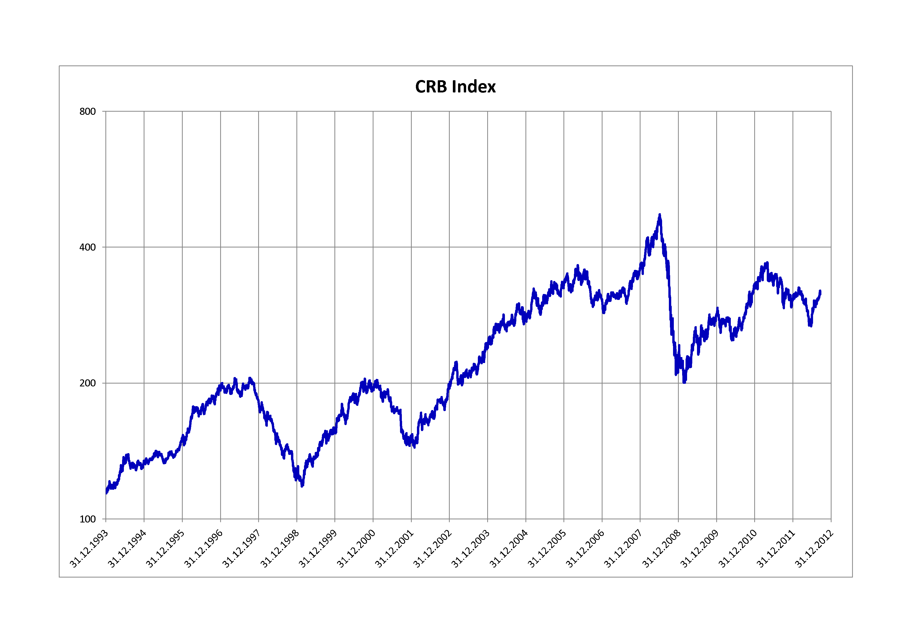

## Table of Contents

## What is the Commodity Research Bureau Index (CRB Index)?

The Commodity Research Bureau Index, often called the CRB Index, is a way to measure the overall performance of a group of important commodities. Commodities are things like oil, gold, and wheat that people buy and sell. The CRB Index helps people understand how the prices of these items are changing over time. It includes many different commodities, so it gives a broad picture of what's happening in the commodity markets.

The CRB Index is useful for investors and businesses because it helps them see trends and make decisions. For example, if the CRB Index is going up, it might mean that commodity prices are rising, which could affect costs for companies that use these commodities. The index is updated regularly, so people can keep track of changes and plan accordingly. It's like a thermometer for the commodity market, showing whether things are heating up or cooling down.

## How was the CRB Index originally developed?

The CRB Index was first created in 1957 by the Commodity Research Bureau, a company that collects and shares information about commodities. The idea was to make a single number that could show how the prices of many different commodities were doing all at once. They started with 28 commodities, like grains, metals, and other raw materials. By combining these, they could give people a quick way to see if commodity prices were going up or down overall.

Over time, the CRB Index has changed a bit. In 1986, it was updated to include a different mix of commodities, and it was called the CRB Futures Price Index. This new version used futures contracts, which are agreements to buy or sell commodities at a set price in the future. This change helped make the index more useful for people who trade commodities. Even though it has been tweaked, the main goal of the CRB Index has stayed the same: to give a clear snapshot of the commodity market's health.

## What are the main components of the CRB Index?

The CRB Index is made up of a mix of different commodities. These commodities are split into groups like energy, agriculture, metals, and more. Some of the main things you'll find in the index are oil, natural gas, corn, wheat, soybeans, gold, silver, and copper. Each of these commodities has a certain weight in the index, which means they affect the overall number in different ways. For example, oil might have a bigger impact on the index than corn because it's used more widely and can change a lot in price.

The way the CRB Index works is by looking at the prices of futures contracts for these commodities. Futures contracts are agreements to buy or sell something at a set price in the future. By using these, the index can show what people expect commodity prices to do. The index is updated often, so it can quickly show if prices are going up or down. This helps people who invest in commodities or use them in their businesses to make better decisions based on what's happening in the market.

## How are the commodities in the CRB Index weighted?

The commodities in the CRB Index are weighted based on how important they are in the market and how much they are traded. Some commodities, like oil and natural gas, have a bigger weight because they are used a lot and their prices can change a lot. This means they have a bigger effect on the overall index number. Other commodities, like corn or wheat, might have a smaller weight because they are not as widely used or their prices don't change as much.

The weights are decided by looking at things like how much of the commodity is produced and used around the world, and how much it is traded on futures markets. The idea is to make the index reflect what's really happening in the commodity market. By giving more weight to commodities that are more important, the CRB Index can show a clearer picture of whether commodity prices are going up or down overall.

## What is the significance of the weighting in the CRB Index?

The weighting in the CRB Index is really important because it helps show what's really happening in the commodity market. Some commodities, like oil and natural gas, are used a lot and their prices can change a lot. So, they get a bigger weight in the index. This means they have a bigger say in whether the overall index number goes up or down. If oil prices go up a lot, the whole index might go up too, because oil has a big weight.

On the other hand, commodities like corn or wheat might not have as big a weight. They are important, but they don't affect the market as much as oil or natural gas. By giving different weights to different commodities, the CRB Index can give a clearer picture of the overall health of the commodity market. It helps people see which commodities are driving changes in the market and make better decisions based on that information.

## How has the composition of the CRB Index changed over time?

The CRB Index has changed a lot since it started in 1957. At first, it had 28 different commodities like grains, metals, and other raw materials. This mix was meant to show a broad picture of the commodity market. But in 1986, the index was updated and became the CRB Futures Price Index. This new version used futures contracts, which are agreements to buy or sell commodities at a set price in the future. The change helped make the index more useful for people who trade commodities.

Over time, the CRB Index has kept changing to stay relevant. The weights of the commodities in the index have been adjusted to reflect what's happening in the market. For example, energy commodities like oil and natural gas have become more important, so they now have a bigger weight in the index. The number of commodities in the index has also changed. The current version, known as the Thomson Reuters/CoreCommodity CRB Index, includes 19 commodities, which is less than the original 28 but still covers a wide range of important commodities. These changes help the CRB Index give a clear and up-to-date picture of the commodity market.

## Can you explain the methodology used to calculate the CRB Index?

The CRB Index is calculated using a method that looks at the prices of futures contracts for different commodities. Futures contracts are agreements to buy or sell a commodity at a set price in the future. The index includes 19 commodities, and each one has a certain weight that shows how important it is in the market. The weights are decided by looking at things like how much of the commodity is produced and used around the world, and how much it is traded on futures markets. By using these weights, the index can show a clear picture of what's happening in the commodity market.

To calculate the CRB Index, the prices of the futures contracts for each commodity are collected every day. These prices are then adjusted using the weights to figure out the overall index value. If a commodity like oil, which has a big weight, goes up in price, it will have a bigger effect on the index than if a commodity with a smaller weight, like corn, goes up. This way, the CRB Index can show whether commodity prices are going up or down overall, helping people who invest in commodities or use them in their businesses to make better decisions.

## How does the CRB Index compare to other commodity indices?

The CRB Index is one of several commodity indices, but it stands out because it includes a wide range of commodities and uses a specific weighting system. Other popular commodity indices include the S&P GSCI and the Bloomberg Commodity Index. The S&P GSCI, for example, focuses more on energy commodities like oil and natural gas, which means it can be more affected by changes in energy prices. The Bloomberg Commodity Index, on the other hand, tries to balance different types of commodities more evenly, so it might not be as swayed by big changes in one area like energy.

The CRB Index is unique because it uses futures contracts to track commodity prices, and it adjusts the weights of the commodities to reflect what's happening in the market. This means it can give a good overall picture of the commodity market's health. Other indices might use different methods or focus on different commodities, which can make them more useful for certain types of investors or businesses. For example, someone who is mostly interested in energy might prefer the S&P GSCI, while someone looking for a broad view might choose the CRB Index or the Bloomberg Commodity Index.

## What are the applications of the CRB Index in financial markets?

The CRB Index is used a lot in financial markets to help people understand how commodity prices are doing. Investors and traders use it to see if commodity prices are going up or down overall. This helps them decide when to buy or sell commodities or commodity-related investments. For example, if the CRB Index is going up, it might be a good time to invest in commodities because prices are rising. On the other hand, if the index is going down, it might be a good time to sell or avoid investing in commodities.

Businesses also use the CRB Index to plan their costs and prices. Companies that use commodities like oil, wheat, or metals in their products need to know how the prices of these items are changing. By looking at the CRB Index, they can see trends and make better decisions about when to buy these commodities and how much to charge for their products. This can help them manage their costs and stay competitive in the market.

## How can investors use the CRB Index to gauge commodity market trends?

Investors can use the CRB Index to get a quick look at how commodity prices are doing overall. The index includes a mix of different commodities like oil, wheat, and gold, and it shows whether these prices are going up or down. By watching the CRB Index, investors can see if it's a good time to buy or sell commodities. If the index is going up, it might mean that commodity prices are rising, so it could be a good time to invest. On the other hand, if the index is going down, it might be a sign to sell or avoid investing in commodities.

The CRB Index also helps investors understand which parts of the commodity market are doing well and which are not. For example, if the index is going up but the price of oil is staying the same, it might mean that other commodities like metals or grains are driving the increase. This can help investors decide where to put their money. By looking at the CRB Index and its components, investors can make smarter choices about their commodity investments and stay ahead of market trends.

## What are the limitations and criticisms of the CRB Index?

One big criticism of the CRB Index is that it might not show the whole picture of the commodity market. The index uses a certain mix of commodities and gives them different weights. Some people think this mix doesn't always match what's really happening in the market. For example, if the index has a lot of oil but not much of other important commodities, it might focus too much on energy prices and miss changes in other areas. This can make it hard for investors to get a complete view of the market.

Another limitation is that the CRB Index uses futures contracts to measure commodity prices. Futures contracts are agreements to buy or sell commodities at a set price in the future, but they can be affected by things like speculation and market sentiment. This means the index might not always show the actual prices people pay for commodities right now. Some people also think that the way the index is calculated can be too complicated, making it hard for regular investors to understand and use. Despite these criticisms, the CRB Index is still a helpful tool for many people to get a quick look at commodity market trends.

## How does the CRB Index influence commodity trading strategies?

The CRB Index helps people who trade commodities figure out what to do. When the index goes up, it might mean that commodity prices are rising, so traders might want to buy commodities or invest in them. If the index goes down, it could be a sign to sell or avoid investing in commodities. By watching the CRB Index, traders can see the big picture of the commodity market and make smarter choices about when to buy or sell.

The CRB Index also helps traders see which parts of the commodity market are doing well and which are not. For example, if the index is going up but oil prices are staying the same, it might mean that other commodities like metals or grains are driving the increase. Traders can use this information to focus on the commodities that are doing better. By understanding the trends shown by the CRB Index, traders can adjust their strategies to take advantage of the market and make better trading decisions.

## References & Further Reading

[1]: McGraw-Hill (1985). ["CRB Commodity Yearbook."](https://archive.org/details/crbcommodityyear0000unse_u6t3) Commodity Research Bureau.

[2]: Geman, H. (Ed.). (2008). ["Risk Management in Commodity Markets: From Shipping to Agriculturals and Energy."](https://onlinelibrary.wiley.com/doi/pdf/10.1002/9781118467381.fmatter) Wiley.

[3]: Kaufman, P. J. (2013). ["Trading Systems and Methods."](https://onlinelibrary.wiley.com/doi/book/10.1002/9781119202561) Wiley.

[4]: Hull, J. C. (2015). ["Options, Futures, and Other Derivatives."](https://www.semanticscholar.org/paper/Options%2C-Futures%2C-and-Other-Derivatives-Hull/89bdee500c8623864fc9eb7a471546aa713acc44) Pearson.

[5]: Hull, J. C. (2020). ["Risk Management and Financial Institutions."](https://books.google.com/books/about/Risk_Management_and_Financial_Institutio.html?id=1J1QDwAAQBAJ) Wiley.

[6]: Taleb, N. N. (2007). ["The Black Swan: The Impact of the Highly Improbable."](https://www.stat.berkeley.edu/~aldous/157/Books/Black_Swan-sub.pdf) Random House.

[7]: Murphy, J. J. (1999). ["Technical Analysis of the Financial Markets: A Comprehensive Guide to Trading Methods and Applications."](https://archive.org/details/technicalanalysi0000murp) New York Institute of Finance.

[8]: Lyons, R. K. (2001). ["The Microstructure Approach to Exchange Rates."](https://direct.mit.edu/books/monograph/2004/The-Microstructure-Approach-to-Exchange-Rates) MIT Press.