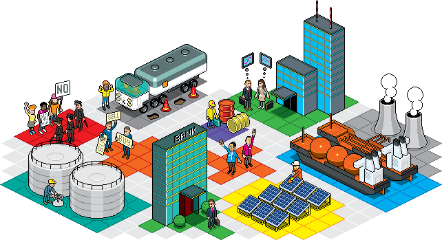

## Table of Contents

## What is a commodity trader?

A commodity trader is someone who buys and sells raw materials like oil, gold, or wheat. These traders work in markets where prices can change a lot because of things like weather, politics, or how much people want the product. Their job is to guess what prices will do next and make trades to make money from these changes.

Commodity traders can work for big companies, banks, or on their own. They use special tools and information to help them decide when to buy or sell. This job can be exciting but also risky because if they guess wrong, they could lose a lot of money.

## What types of commodities do traders typically deal with?

Commodity traders usually deal with two main types of commodities: hard commodities and soft commodities. Hard commodities are things that come from the ground, like oil, natural gas, gold, and copper. These are often used in making things or as energy sources. The prices of hard commodities can change a lot because of things like mining problems, new discoveries, or changes in how much people need them.

Soft commodities are things that are grown, like wheat, corn, coffee, and sugar. These are usually used for food or drinks. The prices of soft commodities can go up and down because of weather, how much farmers grow, or changes in what people want to eat or drink. Both hard and soft commodities are important in the world's economy, and traders watch them closely to make their trading decisions.

## What are the primary roles and responsibilities of a commodity trader?

A commodity trader's main job is to buy and sell raw materials like oil, gold, or wheat to make a profit. They do this by watching the markets closely and trying to guess if prices will go up or down. They use special tools and information to help them make smart choices about when to buy or sell. This job can be exciting but also risky because if they guess wrong, they could lose money instead of making it.

Besides trading, commodity traders also need to keep up with news and events that might change commodity prices. This can include things like weather reports, political changes, or new laws about trading. They also have to manage their money well, making sure they don't spend too much on one trade and keeping track of how much they are making or losing. Talking to other traders and experts can help them make better decisions, too.

## How does one become a commodity trader?

To become a commodity trader, you usually need to start with a good education. Many traders have a degree in finance, economics, or a related field. This helps them understand how markets work and how to analyze data. After getting a degree, it's important to get some experience. This can be through internships or entry-level jobs at trading firms, banks, or commodity companies. These positions help you learn the ropes and understand the specific commodities you might want to trade.

Once you have some experience, you can start working as a junior trader. At this stage, you'll be doing a lot of learning and watching how more experienced traders work. You'll need to keep learning about the markets, the commodities you're trading, and the tools used for trading. Over time, as you gain more experience and prove yourself, you might move up to become a senior trader or even a trading manager. It's a career that requires constant learning and adapting to changes in the market.

## What skills are essential for success in commodity trading?

To do well in commodity trading, you need to be good at understanding numbers and analyzing data. This means you should be able to look at charts and numbers to figure out what might happen next with commodity prices. Being good with math helps you calculate risks and decide when to buy or sell. It's also important to stay calm and make quick decisions, even when the market is changing fast. Commodity trading can be stressful, so being able to handle pressure is key.

Another important skill is being able to learn and adapt quickly. The market can change because of things like the weather, politics, or new laws, so you need to keep up with the news and be ready to change your plans. Good communication skills help, too, because you'll need to talk to other traders, experts, and sometimes clients. Building relationships and working well with others can give you an edge in this competitive field.

## What are the different trading strategies used by commodity traders?

Commodity traders use different strategies to make money. One common strategy is called [trend following](/wiki/trend-following). This means traders watch the market to see if prices are going up or down over time. If they see a trend, they buy or sell to follow it, hoping the trend will keep going and they can make a profit. Another strategy is called mean reversion. This is when traders believe that if a commodity's price goes too high or too low, it will eventually come back to a more normal price. They buy when the price is low and sell when it's high, betting on this return to normal.

Another strategy is called [arbitrage](/wiki/arbitrage). This happens when traders find a price difference for the same commodity in different markets. They buy the commodity where it's cheaper and sell it where it's more expensive, making money from the difference. Some traders also use hedging to protect themselves from big losses. They might buy or sell futures contracts to lock in prices for commodities they need or plan to sell later. This way, even if the market moves against them, they won't lose as much money.

Each strategy has its own risks and rewards. Trend following can be profitable if the trend keeps going, but if it suddenly changes, traders can lose money. Mean reversion works well if prices do come back to normal, but if they keep going in one direction, it can lead to losses. Arbitrage can be safe if the price difference stays the same, but it requires quick action and good information. Hedging can protect against big losses, but it can also limit big gains. Choosing the right strategy depends on the trader's goals, how much risk they're willing to take, and the specific commodities they're trading.

## How do commodity traders manage risk?

Commodity traders manage risk by using different strategies. One common way is through hedging. This means they buy or sell futures contracts to lock in prices for the commodities they need or plan to sell later. By doing this, they protect themselves from big price changes in the market. For example, if a trader thinks the price of oil might go down, they can sell oil futures at today's price. If the price does go down, they still get the higher price they locked in earlier. Hedging helps traders avoid big losses, but it can also limit big gains.

Another way traders manage risk is by setting stop-loss orders. A stop-loss order is like a safety net that tells the computer to sell a commodity if its price drops to a certain level. This helps traders limit how much money they could lose on a single trade. Traders also manage risk by diversifying their investments. Instead of putting all their money into one commodity, they spread it out across different ones. This way, if one commodity's price goes down a lot, they won't lose all their money. Managing risk is a big part of being a commodity trader, and it helps them stay in the game even when the market is unpredictable.

## What are the major global trading locations for commodities?

The biggest places for trading commodities are in big cities around the world. In the United States, the main spot is the Chicago Mercantile Exchange (CME), where people trade things like corn, wheat, and soybeans. Another important place in the U.S. is the New York Mercantile Exchange (NYMEX), which is big for trading oil, gas, and metals like gold and silver. These places are important because they help set prices that people all over the world use.

In Europe, the London Metal Exchange (LME) is a key spot for trading metals like copper, aluminum, and zinc. Another important place in Europe is the Intercontinental Exchange (ICE) in London, where people trade things like oil, natural gas, and coffee. These European exchanges help connect traders from different countries and make it easier to buy and sell commodities across the world.

In Asia, the Shanghai Futures Exchange (SHFE) in China is a big deal for trading metals and other commodities. Singapore also has the Singapore Exchange (SGX), which is important for trading energy and agricultural products. These Asian markets are growing fast and play a big role in setting prices for commodities in that part of the world. Together, these global trading locations help keep the commodity markets running smoothly and make sure people can buy and sell what they need.

## How do geopolitical events influence commodity trading?

Geopolitical events can really shake up commodity trading. Things like wars, trade fights, or new laws in different countries can change how much people want certain commodities and how much they cost. For example, if there's a war in a country that makes a lot of oil, the fighting might stop the oil from getting to other places. This can make the price of oil go up because there's less of it to go around. Traders have to watch these events closely because they can change the market fast.

Another way geopolitical events affect commodity trading is through trade rules and sanctions. If a big country puts new rules on trading with another country, it can mess up the supply of commodities. For instance, if the U.S. puts sanctions on a country that grows a lot of wheat, it might be harder for other countries to buy that wheat. This can make the price of wheat go up because there's less of it available. Traders need to keep an eye on these changes and adjust their plans to make the best trades possible.

## What technological tools are used in modern commodity trading?

In modern commodity trading, traders use a lot of technology to help them make smart choices. One important tool is trading software, which lets traders buy and sell commodities quickly and easily. This software often has charts and graphs that show how prices are changing, so traders can see trends and patterns. Another tool is [algorithmic trading](/wiki/algorithmic-trading), where computers use math formulas to decide when to buy or sell. This can help traders make trades faster than they could on their own and sometimes find good deals that they might miss.

Traders also use data analysis tools to look at a lot of information at once. These tools can help them understand things like how the weather might affect crop prices or how new laws could change the cost of oil. They also use news feeds and social media to stay up-to-date on events that could change the market. All these tools help traders make better decisions and manage their risks, making commodity trading more efficient and effective.

## How do commodity traders impact the global economy?

Commodity traders play a big role in the global economy because they help move raw materials from where they are made to where they are needed. When traders buy and sell things like oil, gold, or wheat, they help set the prices that everyone uses. These prices affect how much it costs to make things and how much people pay for food and energy. If traders think there will be less oil in the future, they might buy a lot now, making the price go up. This can make gas more expensive for everyone. On the other hand, if they think there will be more wheat, they might sell a lot, making the price go down and making bread cheaper.

Traders also help keep the economy stable by managing risks. They use tools like futures contracts to lock in prices, which can protect companies from big price swings. For example, an airline might buy oil futures to make sure they don't pay too much for fuel, even if the price goes up later. This helps businesses plan better and avoid big losses. When traders do their job well, it helps the whole economy run smoothly because companies can count on having the raw materials they need at a price they can afford.

## What are the future trends and challenges in commodity trading?

In the future, commodity trading is going to see big changes because of new technology. More traders will use computers and algorithms to make trades faster and smarter. This means they can look at a lot of data quickly and find good deals that they might miss otherwise. Also, there will be more focus on green energy and sustainable commodities. As people worry more about the environment, traders will need to trade things like solar power or eco-friendly materials. This can open up new markets but also means traders need to learn about new kinds of commodities.

There are also some challenges coming up in commodity trading. One big challenge is dealing with more rules and laws about trading. Governments around the world might make new rules to make sure trading is fair and doesn't hurt the environment. Traders will need to keep up with these changes and make sure they follow all the new rules. Another challenge is dealing with more unpredictable markets. Things like climate change and political fights can make commodity prices go up and down a lot. Traders will need to be good at managing risks and staying calm, even when the market is changing fast.

## References & Further Reading

[1]: Hull, J. C. (2017). ["Options, Futures, and Other Derivatives"](https://www.pearson.com/en-us/subject-catalog/p/options-futures-and-other-derivatives/P200000005938/9780136939917) (10th ed.). Pearson.

[2]: Geman, H. (2005). ["Commodities and Commodity Derivatives: Modelling and Pricing for Agriculturals, Metals and Energy"](https://download.e-bookshelf.de/download/0000/5675/90/L-G-0000567590-0015270354.pdf). Wiley.

[3]: Aldridge, I. (2013). ["High-Frequency Trading: A Practical Guide to Algorithmic Strategies and Trading Systems"](https://onlinelibrary.wiley.com/doi/pdf/10.1002/9781119203803.fmatter). Wiley.

[4]: Narang, R. K. (2013). ["Inside the Black Box: The Simple Truth About Quantitative Trading"](https://www.amazon.com/Inside-Black-Box-Quantitative-Trading/dp/0470432063). Wiley.

[5]: De Prado, M. L. (2018). ["Advances in Financial Machine Learning"](https://www.amazon.com/Advances-Financial-Machine-Learning-Marcos/dp/1119482089). Wiley.