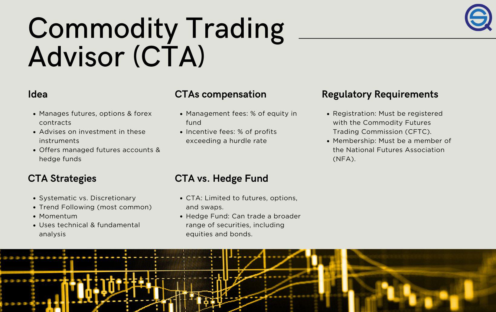

Commodity trading involves the buying and selling of raw materials and primary products, ranging from agricultural goods, such as wheat and corn, to energy products like oil and natural gas, and metals such as gold and silver. These commodities are essential components of the global economy, serving as inputs for other goods and thus are critically important in the financial markets for hedging, speculating, and diversification purposes. Their prices are affected by a myriad of factors, including supply and demand dynamics, geopolitical events, weather conditions, and market speculation, adding layers of complexity and opportunity for investors.

Commodity Trading Advisors (CTAs) play a pivotal role in this market by managing and advising on investments in futures contracts and options on commodities. As professionals registered with regulatory bodies, such as the U.S. Commodity Futures Trading Commission (CFTC), CTAs bring expertise and structured strategies to the volatile and unpredictable world of commodities. They utilize various techniques, including trend following and mean reversion, to capitalize on market movements, offering investors the potential for high returns, albeit with associated risks.



The advent of algorithmic trading has revolutionized investment strategies in commodities. With its ability to process vast amounts of data with speed and precision, algorithmic trading enhances decision-making through automated, pre-programmed trading instructions. This technology enables traders and CTAs to employ complex strategies, often involving statistical arbitrage, portfolio optimization, and risk management, hence improving efficiency and potential profitability.

The interplay between financial advisors, commodity trading, and algorithmic methods creates a comprehensive approach to investing. Financial advisors bring critical insights into portfolio diversification and risk management, aligning commodity investments with broader client-specific goals. By integrating the specialized skills of CTAs and the computational prowess of algorithmic trading, financial advisors craft strategies that can adapt to market environments and client needs.

This article aims to explore the strategies that integrate these elements, offering a nuanced understanding of how CTAs, financial advisors, and algorithmic trading converge to form sophisticated investment strategies in the commodity markets. Through this multidisciplinary lens, we seek to uncover the potential for improved returns and risk mitigation in this dynamic segment of the financial market.

## Table of Contents

## Understanding Commodity Trading Advisors (CTAs)

Commodity Trading Advisors (CTAs) are professional entities or individuals that provide advice on trading futures contracts and options. They play a crucial role in the commodities market by guiding investors on how to efficiently navigate the complexities involved in trading commodity derivatives. CTAs are responsible for devising trading strategies that help manage risk and enhance returns for their clients.

In terms of legal requirements, CTAs must be registered with the Commodity Futures Trading Commission (CFTC) and are subject to regulatory oversight by the National Futures Association (NFA). The registration process involves submitting a Form 7-R application, meeting disclosure requirements, and adhering to ethical and operational standards set by these regulatory bodies. However, certain exemptions exist: for instance, CTAs who advise fewer than 15 clients in the past 12 months and do not market themselves to the public can qualify for exemption under certain conditions.

Regulations surrounding CTAs have evolved significantly, particularly following the Dodd-Frank Wall Street Reform and Consumer Protection Act. This legislative framework was introduced to increase transparency and reduce the risk of systemic failures in the financial markets. Post-Dodd-Frank, CTAs have seen an enhancement in reporting obligations and an emphasis on promoting transparency in their operations.

CTAs employ various market analysis techniques to fulfill their advisory roles. These include trend analysis, technical indicators, [fundamental analysis](/wiki/fundamental-analysis), and quantitative models. They are adept at interpreting market signals and leveraging data analytics to forecast price movements in commodity markets. By employing systematic analysis and leveraging historical data, CTAs craft strategies that seek to capture price trends while managing downside risks.

Overall, CTAs are instrumental in creating structured, rules-based trading approaches that assist clients in executing their investment objectives. Their expertise lies in balancing the risk-reward dynamics of futures and options trading, making them integral to the commodity trading ecosystem.

## Investment Strategies in Commodity Trading

Commodity trading involves a range of investment strategies, essential for navigating the complex landscape of global commodity markets. Among these strategies, [trend following](/wiki/trend-following) and systematic trading are widely adopted due to their adaptability and potential for generating returns.

**Trend Following Strategy**

Trend following is a popular strategy focusing on capturing gains through the analysis of a commodity's [momentum](/wiki/momentum) in its price direction. Traders employing this strategy rely on technical indicators to determine the continuation of a market trend. By betting on sustained movements in commodity prices, they aim to profit from both upward and downward trends. This method is particularly effective in volatile markets, where price swings are pronounced.

**Systematic Trading Strategy**

Systematic trading is an approach that leverages algorithmic systems to make trading decisions based on established rules. These systems, often computer-assisted, use predefined parameters to execute trades, thereby minimizing emotional decision-making and human error. This strategy provides consistency and allows traders to backtest models against historical data, optimizing their techniques before applying them to live markets.

**Momentum Strategy in Multi-Asset Context**

Momentum strategy, a facet of systematic trading, entails taking positions in commodities based on their short-term performance relative to others. This approach is predicated on the assumption that assets which have performed well recently will continue to do so in the near future. Momentum strategies are versatile, applicable in a multi-asset context where commodities, equities, and bonds are evaluated concurrently to diversify risk and enhance returns. By balancing exposure across different asset classes, traders can mitigate the impact of commodity-specific risks.

**Diversification to Minimize Risk**

Commodity Trading Advisors (CTAs) often employ diversified strategies to offset potential losses through their investment portfolios. By incorporating a variety of assets and trading methodologies, CTAs reduce the dependency on any single commodity or market condition. Diversification not only lowers risk but also capitalizes on disparate market movements, providing a buffer against [volatility](/wiki/volatility-trading-strategies). For instance, a [CTA](/wiki/cta-strategy) may balance investments in agricultural commodities with positions in metals and energy products, each reacting differently to geopolitical events and climatic changes.

**Examples of Successful CTA Strategies and Funds**

Several CTA-managed funds have demonstrated success through the implementation of these diversified strategies. The AQR Managed Futures Strategy Fund, for example, has been notable for its robust trend-following methodology, leveraging a wide range of commodity futures to achieve consistent returns. Another example includes the Winton Fund, which utilizes a systematic, data-driven approach to explore historical market patterns and apply statistical rigor to trade executions. These funds exemplify the pragmatic use of sophisticated trading strategies to capitalize on market inefficiencies and maximize returns.

In summary, commodity trading benefits significantly from a variety of strategic approaches that include trend following, systematic, and momentum strategies. CTAs play a crucial role in orchestrating these methods to not only seek profit but also manage risk effectively. Through the employment of such strategies, coupled with diversification, these advisors help navigate and exploit vast opportunities within the commodity markets.

## The Role of Financial Advisors in Commodity Trading

Financial advisors play a crucial role in managing investments within managed futures accounts, acting as intermediaries between individual investors and the intricacies of the commodities market. They are responsible for providing tailored advice to help clients achieve their specific financial goals, thereby ensuring that their portfolios are both diversified and aligned with their risk tolerance. In managed futures accounts, financial advisors facilitate the integration of futures and options contracts, assessing the unique needs of their clients and aligning them with suitable Commodity Trading Advisors (CTAs) or investment strategies.

The collaboration between financial advisors and CTAs is vital for effective portfolio diversification. By evaluating the strategies employed by CTAs, financial advisors can guide the selection of a diversified mix of assets to mitigate risk and enhance returns. This synergy enables advisors to draw on the expertise of CTAs, who specialize in futures and options trading, while also providing personalized financial planning. In this way, financial advisors ensure that clients' portfolios are not overly exposed to any single market or commodity, creating a balanced approach that leverages multiple asset classes.

Risk management is another critical area where financial advisors add significant value. By understanding the client's risk appetite, financial advisors formulate strategies that align with their long-term financial objectives. They provide insights into market dynamics and regulatory changes that could impact futures trading, helping clients navigate potential pitfalls. Furthermore, financial advisors can assist in setting stop-loss orders and implementing hedging strategies to protect against adverse market movements.

In summary, financial advisors are integral to commodity trading as they bridge the gap between the complex futures market and individual investors. By working closely with CTAs, they facilitate diversified and robust investment strategies that are tailored to client-specific goals, encompassing both return potential and risk management.

## Algorithmic Trading in Commodity Markets

Algorithmic trading refers to the use of computer algorithms to execute trading orders rapidly and efficiently, often without human intervention. This process relies on predefined sets of instructions for variables such as timing, price, and [volume](/wiki/volume-trading-strategy) to make trading decisions, which contrasts with traditional manual trading methods. In the context of commodity markets, [algorithmic trading](/wiki/algorithmic-trading) has become an indispensable tool for traders seeking to capitalize on the high volatility and potentially large price fluctuations characteristic of these markets.

The primary benefits of algorithmic trading within commodity markets include speed and enhanced data processing capabilities. Algorithms can react to market conditions in milliseconds, much faster than a human trader could. This speed advantage allows traders to execute a higher number of trades more efficiently, capturing opportunities as they arise. Additionally, algorithms can process vast amounts of data simultaneously, incorporating a variety of market indicators, historical data, and even real-time news into trading strategies. This processing capability enables a more comprehensive analysis of market trends and statistical [arbitrage](/wiki/arbitrage) opportunities.

Commodity Trading Advisors (CTAs) are increasingly leveraging algorithmic trading to automate various strategies. Automated systems can implement complex strategies such as trend following, mean reversion, and [statistical arbitrage](/wiki/statistical-arbitrage) with precision and consistency. For CTAs, automation ensures that trading strategies are executed exactly as designed, removing the possibility of human error and emotional decision-making. Furthermore, automated systems enable CTAs to manage multiple assets across different markets, enhancing portfolio diversification and risk management.

The integration of [machine learning](/wiki/machine-learning) and other advanced technologies into trading algorithms is transforming how strategies are developed and deployed in commodity markets. Machine learning algorithms can identify patterns and correlations in data that may not be apparent to human analysts. They can adapt to changing market conditions by continuously learning from incoming data, refining their strategies over time. For example, [reinforcement learning](/wiki/reinforcement-learning)—a type of machine learning—can be applied to optimize trading strategies based on the outcome of previous trades. This iterative process helps in developing more robust and adaptive algorithms suited to the dynamic nature of commodity markets.

Python is widely used for developing algorithmic trading strategies due to its extensive libraries and frameworks for data analysis and machine learning. A basic example of a simple moving average crossover strategy can be implemented in Python as follows:

```python
import pandas as pd

def moving_average_strategy(prices, short_window=40, long_window=100):
    signals = pd.DataFrame(index=prices.index)
    signals['price'] = prices
    signals['short_mavg'] = prices.rolling(window=short_window, min_periods=1, center=False).mean()
    signals['long_mavg'] = prices.rolling(window=long_window, min_periods=1, center=False).mean()

    # Create signals
    signals['signal'] = 0
    signals['signal'][short_window:] = np.where(signals['short_mavg'][short_window:] 
                                                > signals['long_mavg'][short_window:], 1, 0)

    signals['positions'] = signals['signal'].diff()
    return signals

# Example usage
prices = pd.Series([100, 102, 104, 103, 100, 98, 97, 95, 96, 98])
signals = moving_average_strategy(prices)
print(signals)
```

This code snippet demonstrates how a simple moving average crossover strategy can be structured using Python, providing a foundational example of how algorithms can be designed to automatically generate trading signals based on market data. Through these technologies, algorithmic trading continues to evolve, offering CTAs and traders sophisticated tools to navigate the complexities of the commodity markets.

## Case Studies and Backtesting Strategies

One notable example of an algorithmic trading strategy in the commodity markets focuses on the use of trend-following systems integrated with algorithmic processes for trading futures contracts. These systems leverage quantitative models that identify and capitalize on directional trends in commodity prices over time. 

**Case Study: Winton Group Ltd.**

Winton Group Ltd., a global investment management firm, provides a compelling case study of successful implementation of algorithmic strategies in commodity trading. The firm employs a systematic approach that utilizes mathematical models to analyze historical price data, detecting patterns indicative of future price movements. Winton's algorithmic trading strategy in the commodities space primarily depends on trend-following models which are finely tuned using statistical techniques to determine the optimal entry and [exit](/wiki/exit-strategy) points for trades.

Over the years, Winton has developed proprietary software to execute trades across global commodity markets automatically. This software is designed to adapt to changing market conditions, minimizing human intervention and execution risk. The integration of algorithmic trading allows Winton to react swiftly to market signals, thereby maintaining a competitive edge.

**Importance of Backtesting Strategies**

Backtesting is a critical step in validating trading models, ensuring their robustness before they are deployed in live markets. It involves simulating a trading strategy using historical data to assess how it would have performed in the past. This process provides valuable insights into the strategy's profitability, risk metrics, and overall effectiveness. A well-conducted backtest can reveal potential flaws in the strategy and assist in fine-tuning parameters to enhance performance.

Backtesting is instrumental in determining key performance indicators such as Sharpe ratio, win rate, maximum drawdown, and the annualized return of a strategy. It also helps in stress testing, evaluating how the strategy would perform under various market conditions.

**Utilizing Historical Data for Simulation**

The use of historical data is central to the simulation of trading strategies during [backtesting](/wiki/backtesting). Historical price data enables traders to recreate past market scenarios and appraise how a strategy responds to different patterns and events. Utilizing datasets that span various market cycles enhances the reliability of the backtest.

In Python, the process can be executed using libraries such as pandas for data manipulation and NumPy for numerical computations. Here's a streamlined Python code snippet to illustrate a simple backtesting framework:

```python
import pandas as pd
import numpy as np

def backtest_strategy(data, strategy_function, initial_capital=10000):
    # Initialize portfolio
    portfolio = pd.DataFrame(index=data.index)
    portfolio['holdings'] = 0
    portfolio['cash'] = initial_capital
    portfolio['total'] = initial_capital

    # Apply the strategy function
    signals = strategy_function(data)

    # Execute trades based on signals
    for index, signal in signals.iterrows():
        if signal['buy_signal']:
            portfolio.loc[index, 'holdings'] += 1
            portfolio.loc[index, 'cash'] -= data.loc[index, 'close_price']
        elif signal['sell_signal']:
            portfolio.loc[index, 'holdings'] -= 1
            portfolio.loc[index, 'cash'] += data.loc[index, 'close_price']

        # Update total portfolio value
        portfolio.loc[index, 'total'] = portfolio.loc[index, 'cash'] + portfolio.loc[index, 'holdings'] * data.loc[index, 'close_price']

    return portfolio

# Example usage with a simple strategy function
historical_data = pd.read_csv('historical_prices.csv')  # Example data file
portfolio_results = backtest_strategy(historical_data, simple_strategy_function)

```

In this example, the function `backtest_strategy` simulates buying and selling actions based on a predefined strategy function (`simple_strategy_function`). This framework can be enhanced with complex strategies and performance evaluations tailored to specific commodities. The insights drawn from backtesting and simulations guide traders in optimizing their strategies before committing real capital.

## Challenges and Risks in Commodity Trading

Commodity trading involves several inherent risks, primarily due to the volatile nature of commodity markets and the complex regulatory environment. Understanding these risks and implementing strategies to mitigate them is essential for Commodity Trading Advisors (CTAs) and financial advisors working with investors.

### Market Volatility and Regulatory Changes

One of the primary risks in commodity trading is market volatility. Commodities are subject to fluctuations due to a variety of factors, including geopolitical events, supply and demand imbalances, and environmental conditions. For instance, an unexpected drought can lead to significant shifts in agricultural commodity prices, while geopolitical tension in oil-producing regions can impact [crude oil](/wiki/crude-oil) prices. These fluctuations can lead to substantial profit or loss within a short duration, making real-time analysis and response critical for traders.

Additionally, the regulatory environment for commodity trading is continually evolving. Regulations such as the Dodd-Frank Act have introduced significant changes to derivatives markets, affecting how trades are executed and reported. CTAs need to navigate a complex landscape of compliance requirements, which can differ across jurisdictions and are subject to periodic revisions. The introduction or modification of regulations can impact market behavior, potentially leading to unforeseen [liquidity](/wiki/liquidity-risk-premium) issues or changes in trading volume.

### Limitations of Algorithmic Trading

Algorithmic trading, while beneficial for its speed and ability to process large data volumes, has its limitations. Algorithms may struggle in volatile markets or during unexpected events where historical data cannot predict market responses accurately. For example, events like the COVID-19 pandemic have shown that reliance solely on historical patterns can be insufficient when markets react to unprecedented news.

Moreover, algorithms are prone to errors in coding or logic, leading to erroneous trades. Even well-tested algorithms can react unpredictably to rare occurrences, sometimes causing "flash crashes" due to rapid sell-offs triggered by programmed responses. Another limitation is the dependence on high-quality data; inaccurate or delayed data can lead to poor trading decisions.

### Mitigating Risks Through Collaborative Efforts

Collaboration between CTAs and financial advisors is crucial in addressing these challenges. CTAs bring expertise in market analysis and trading strategy development, while financial advisors offer insights into client-specific goals and risk tolerance. Together, they can build diversified portfolios that reduce exposure to any single commodity or market event. By employing a mix of quantitative strategies, such as trend following, with discretionary insights, they can adapt to changing circumstances more effectively.

Risk management is another area where this collaboration proves beneficial. Financial advisors play a vital role in setting risk parameters aligned with investors' profiles, while CTAs can implement stop-loss orders and other techniques to protect investments against adverse market movements. Furthermore, they can explore dynamic hedging strategies that adjust positions based on predicted market volatility, using financial instruments such as options and futures.

Continual monitoring and adjustment of trading strategies also help in mitigating potential risks associated with algorithmic errors or market shocks. Regular backtesting and stress testing scenarios allow CTAs to refine algorithms, ensuring robustness against unexpected market changes.

In conclusion, while commodity trading involves significant risks, understanding and strategically addressing these risks through a combination of expert collaboration and advanced risk management techniques can lead to more successful investment outcomes.

## Conclusion

Commodity trading is a cornerstone of the global financial market, offering significant opportunities for diversification and return-generation. This article has explored how Commodity Trading Advisors (CTAs), financial advisors, and algorithmic trading form a multi-disciplinary approach to optimize commodity trading strategies. 

CTAs are crucial in guiding futures contracts and options trading, employing various analysis techniques to navigate market complexities. Their collaboration with financial advisors helps tailor investment strategies to client-specific goals, ensuring effective risk management and portfolio diversification. Algorithmic trading has transformed commodity trading by enhancing speed and data processing capabilities, allowing for the automation of sophisticated trading strategies that leverage machine learning and other cutting-edge technologies.

The integration of these elements results in a robust, adaptive framework capable of responding to the challenges of today's dynamic markets. As markets continue to evolve, so must the strategies employed by CTAs, financial advisors, and algorithmic systems. Ongoing innovation and adaptation are essential to harness the full potential of commodity trading, ensuring it remains a vital component of the financial landscape for years to come.

## FAQs

What is the role of a Commodity Trading Advisor?

A Commodity Trading Advisor (CTA) is a financial professional who provides advice and manages assets in futures contracts and options on futures. CTAs employ quantitative and qualitative analysis to develop trading strategies that seek to capitalize on price movements in various commodity markets. They are often registered with regulatory bodies, such as the Commodity Futures Trading Commission (CFTC) in the United States, ensuring compliance with established rules and enhancing client trust. CTAs play a vital role in offering diversified investment strategies, helping investors achieve desired returns while managing associated risks.

How do financial advisors contribute to commodity trading?

Financial advisors assist clients in navigating the complexities of commodity trading by providing expert guidance on investment decisions. They analyze the client's financial goals, risk tolerance, and market conditions to construct a tailored portfolio that may include direct commodities investments, managed futures accounts, or funds that allocate assets across various commodity markets. Financial advisors collaborate with CTAs to ensure proper diversification and risk management, aligning investment strategies with client-specific objectives. Their insights help investors make informed decisions, optimize asset allocation, and achieve financial goals.

What are the benefits and risks of using algorithmic trading in commodities?

Algorithmic trading in commodities involves using computer algorithms to execute trades based on predefined criteria, enabling high-speed and efficient processing of market data. Benefits of algorithmic trading include increased liquidity, reduced transaction costs, and the ability to capitalize on market inefficiencies through rapid decision-making. However, risks also exist, such as potential software malfunctions, market volatility, and the amplification of systemic risks due to large-scale automated trading. Algorithmic trading requires robust risk management and constant monitoring to mitigate these challenges, ensuring that strategies remain effective in dynamic market conditions.

How can investors benefit from managed futures accounts?

Investors can benefit from managed futures accounts as these vehicles provide access to professional management by CTAs, who utilize a range of strategies to navigate different market environments. Managed futures offer diversification benefits, allowing investors to spread risk across various asset classes and potentially stabilize returns in volatile markets. Additionally, these accounts provide flexibility, enabling investors to adjust their exposure to commodities based on changing market conditions and personal investment goals. By leveraging the expertise of CTAs, investors can effectively incorporate commodity strategies into their broader investment portfolio.

## References & Further Reading

[1]: ["Advances in Financial Machine Learning"](https://www.amazon.com/Advances-Financial-Machine-Learning-Marcos/dp/1119482089) by Marcos Lopez de Prado

[2]: ["Evidence-Based Technical Analysis: Applying the Scientific Method and Statistical Inference to Trading Signals"](https://www.amazon.com/Evidence-Based-Technical-Analysis-Scientific-Statistical/dp/0470008741) by David Aronson

[3]: ["Machine Learning for Algorithmic Trading"](https://github.com/stefan-jansen/machine-learning-for-trading) by Stefan Jansen

[4]: ["Quantitative Trading: How to Build Your Own Algorithmic Trading Business"](https://github.com/LucindaYa/quant-resources/blob/master/Quantitative%20Trading%20How%20to%20Build%20Your%20Own%20Algorithmic%20Trading%20Business.pdf) by Ernest P. Chan

[5]: Herbst, Anthony F. (1997). ["The Handbook of Commodity Investing"](https://archive.org/details/handbookofcommod0000fabo) Wiley Finance Series

[6]: Covel, Michael W. (2009). ["Trend Following: Learn to Make Millions in Up or Down Markets"](https://www.amazon.com/Trend-Following-Updated-Millions-Markets/dp/013702018X) Financial Times Press

[7]: ["Technical Analysis of the Financial Markets: A Comprehensive Guide to Trading Methods and Applications"](https://drive.google.com/file/d/1OcDrGakDhaejT7J7xGEE3HHKy7xmrafy/preview) by John J. Murphy