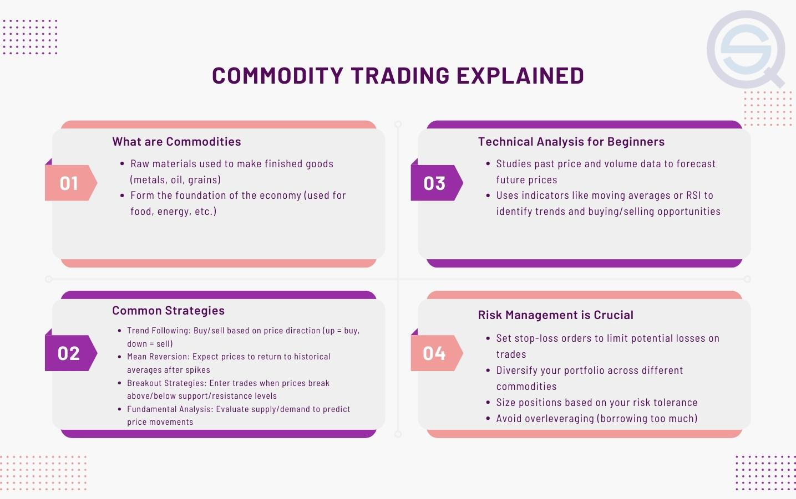

Commodity trading using algorithmic strategies has seen a substantial increase in popularity over recent years. This surge is attributable to the sophisticated capabilities of algorithmic trading, which empower traders to execute pre-defined strategies with precision and optimize results for enhanced profitability. By employing algorithms, traders can rapidly analyze large datasets to identify profitable opportunities that might be missed by manual trading methods. This technological advancement provides a significant competitive edge, allowing for objective decision-making and heightened efficiency in executing trades.

Algorithmic strategies in commodity trading cover a wide spectrum of methodologies, making them adaptable to varying market conditions and trading objectives. This article will discuss several such strategies that can be seamlessly integrated within an algorithmic trading framework. The potential benefits of algorithmic trading extend to traders across the experience spectrum. Novice traders can leverage well-defined strategies to establish a solid foundation for their trading activities, while experienced professionals can refine their approaches to achieve optimal market outcomes.



Integrating algorithmic strategies into your trading plan can play a pivotal role in maximizing profits while simultaneously minimizing risks. By systematically following these strategies, one can navigate the complexities of commodity markets more effectively. As you progress through this article, you will gain insights into the core principles and strategies of commodity algorithmic trading, setting the stage for improved trading performance and strategic market engagement.

## Table of Contents

## Understanding Commodity Algorithmic Trading

Commodity algorithmic trading leverages advanced technology to execute trades based on pre-defined mathematical algorithms. Distinct from traditional manual methods, algorithmic trading automates the decision-making process, allowing for precise and fast execution of trades without human intervention. This automation provides notable advantages, including increased speed and efficiency in trade execution and enhanced objectivity in decision-making, eliminating emotional biases inherent in human trading behavior.

### Key Differences Between Algorithmic and Manual Trading

The primary distinction between algorithmic and manual trading lies in the trading execution process. In manual trading, traders analyze market data, discern patterns, and make decisions based on a combination of analysis and intuition. This approach is often time-consuming and susceptible to human error.

In contrast, commodity [algorithmic trading](/wiki/algorithmic-trading) uses algorithms to identify trading signals based on predefined criteria, such as price movements, technical indicators, or other market conditions. Once a signal is detected, the algorithm executes trades instantaneously, significantly reducing the time lag associated with manual trading. This instantaneous execution can be crucial in volatile markets, where prices can change rapidly.

### Benefits of Algorithmic Trading

The advantages of algorithmic trading are manifold:

1. **Speed and Efficiency**: Algorithms can process vast amounts of data in seconds, performing tasks that would take humans much longer. This capability allows traders to exploit short-lived market opportunities that manual trading might miss.

2. **Objectivity**: By eliminating emotional influences, algorithmic trading fosters a more disciplined trading process. Decisions are based on objective data analysis without human emotions like fear or greed impacting the trading outcome.

3. **Consistency**: Algorithms can execute trades consistently, following the same strategy without deviation. This consistency can be particularly beneficial in systematically implementing complex trading strategies.

### Data Analysis and Machine Learning

The role of data analysis, alongside [artificial intelligence](/wiki/ai-artificial-intelligence) (AI) and [machine learning](/wiki/machine-learning) (ML), is pivotal in commodity algorithmic trading. AI and ML technologies help in the aggregation and analysis of large datasets to identify patterns and predict future market movements.

**Python Example:**
```python
# Sample Python code for a basic machine learning model
import numpy as np
from sklearn.ensemble import RandomForestClassifier

# Simulated data: features (X) and binary outcomes (y)
X = np.random.rand(100, 5)
y = np.random.choice([0, 1], size=100)

# Random forest classifier
model = RandomForestClassifier(n_estimators=100, random_state=42)
model.fit(X, y)

# Predicting outcomes
predictions = model.predict(X)
print(predictions)
```

Machine learning models, such as random forests or neural networks, can analyze historical data to predict future price changes. This predictive capability allows traders to identify potential trading opportunities by spotting patterns that may not be immediately evident through traditional analysis.

In conclusion, commodity algorithmic trading marks a significant evolution from conventional trading methods, offering traders a robust tool to harness the potential of the markets efficiently. The fusion of technological advancement, data-driven insights, and strategic execution ensures that algorithmic trading remains at the forefront of modern commodity trading strategies.

## Key Components of a Commodity Trading Algorithm

Developing a successful commodity trading algorithm involves several critical components that provide traders with a comprehensive understanding of market dynamics. Two primary types of analysis form the backbone of these algorithms: [fundamental analysis](/wiki/fundamental-analysis) and technical analysis. By integrating insights from both approaches, traders can develop more robust trading strategies.

### Fundamental Analysis

Fundamental analysis in commodity trading involves evaluating economic, political, and environmental factors that affect the supply and demand dynamics of commodities. Key factors include:

1. **Economic Indicators**: Metrics such as gross domestic product (GDP) growth rates, inflation rates, and employment figures can influence commodity prices. For instance, a booming economy might increase demand for energy commodities like oil and natural gas.

2. **Political Events**: Geopolitical tensions, trade agreements, and government policies can significantly impact commodity markets. For example, sanctions on a major oil-producing country can lead to supply disruptions and price volatility.

3. **Environmental Factors**: Weather events and climate changes can affect agricultural commodities. For instance, a drought in a major grain-producing region can reduce supply and drive up prices.

Traders need to gather and process this information to predict how these factors may influence future commodity prices.

### Technical Analysis

Technical analysis examines historical price patterns and market trends to forecast future price movements. Key tools and techniques include:

1. **Chart Patterns**: Identifying formations such as head and shoulders, double tops, or triangles can offer insights into potential price reversals or continuations.

2. **Moving Averages**: These help smooth out price data and identify trends. A common approach is to use the crossover of short-term and long-term moving averages as buy or sell signals.

3. **Oscillators**: Tools like the Relative Strength Index (RSI) or the Moving Average Convergence Divergence (MACD) help assess market momentum and identify overbought or oversold conditions.

Example Python code to compute a simple moving average might look like this:

```python
def moving_average(prices, window_size):
    return [sum(prices[i:i+window_size]) / window_size for i in range(len(prices) - window_size + 1)]

# Example usage:
prices = [1, 2, 3, 4, 5, 6, 7, 8, 9, 10]
window_size = 3
print(moving_average(prices, window_size))
```

### Integration of Analyses

Successful trading algorithms do not rely on a single type of analysis. Instead, they integrate data from both fundamental and technical analyses to provide comprehensive insights into market conditions. This integrated approach allows algorithms to adapt to evolving market environments and optimize trading decisions.

By considering both fundamental drivers and technical signals, traders can enhance their understanding of potential price movements, identify trading opportunities, and better manage risk. Combining these analyses helps create a more nuanced picture of market dynamics, providing a strong foundation for developing effective trading strategies within algorithmic frameworks.

## Seven Proven Commodity Trading Strategies

In commodity trading, various strategies have proven effective in leveraging market opportunities. These strategies, when implemented within an algorithmic framework, can enhance trading efficacy and profitability.

1. **Fundamental Analysis**: This strategy involves evaluating the intrinsic value of commodities by analyzing supply and demand dynamics, economic indicators, and industry news. Traders scrutinize factors such as weather conditions impacting agricultural products, geopolitical events affecting oil supplies, and macroeconomic indicators like GDP growth rates and interest rates. Fundamental analysis aims to anticipate market movements based on shifts in these variables.

2. **Technical Analysis**: By studying historical price data and market trends, traders use technical analysis to forecast price movements. Techniques include chart patterns, moving averages, and oscillators like the Relative Strength Index (RSI) and Moving Average Convergence Divergence (MACD). For instance, moving averages can be used to identify support and resistance levels, assisting traders in timing entry and exit points.

3. **Trend Following**: This strategy focuses on capitalizing on sustained market movements. Traders identify trends by looking for higher highs in an uptrend or lower lows in a downtrend. Tools like the Average Directional Index (ADX) help confirm trend strength. Here is a simple Python code snippet for calculating a moving average crossover, a common trend following technique:

    ```python
    import pandas as pd

    def moving_average_crossover(data, short_window, long_window):
        data['short_mavg'] = data['Close'].rolling(window=short_window, min_periods=1).mean()
        data['long_mavg'] = data['Close'].rolling(window=long_window, min_periods=1).mean()
        data['signal'] = 0
        data['signal'][short_window:] = np.where(data['short_mavg'][short_window:] > data['long_mavg'][short_window:], 1, -1)
        return data
    ```

4. **Mean Reversion**: This strategy is based on the idea that commodity prices will revert to their historical mean. Traders calculate the average price of a commodity over a period and bet on the price moving back towards this average when it diverges significantly. Bollinger Bands are a useful tool, as they help identify overbought or oversold conditions.

5. **Spread Trading**: Traders exploit price discrepancies between related commodities or contracts by executing simultaneous buy and sell orders. This strategy relies on strong correlations between chosen commodities to profit from their price relationship rather than their absolute price movements. Inter-commodity spreads between crude oil and natural gas or intra-commodity spreads like futures contract calendar spreads are common examples.

6. **Options Strategies**: Options provide strategic risk management opportunities. Strategies such as covered calls, straddles, and spreads can protect against volatility. A covered call involves owning the underlying commodity and selling call options to generate income, while a straddle involves buying call and put options to capitalize on significant price movements, irrespective of direction.

7. **Algorithmic Trading Implementation**: Successful algorithmic trading requires clearly defined rules within a trading system. Traders must choose suitable platforms and regularly monitor performance. Algorithmic implementation typically involves backtesting strategies with historical data to validate their effectiveness before deployment in live markets. The integration of machine learning algorithms can also enhance decision-making by identifying complex patterns beyond human comprehension.

These strategies, when carefully integrated, can optimize commodity trading outcomes by systematically exploiting market inefficiencies.

## Integrating Algorithmic Strategies

Integrating algorithmic strategies into your commodity trading plan involves aligning these strategies with your overall trading objectives. The process begins with selecting strategies that complement both the current market environment and your specific trading style. Understanding market conditions is crucial, as certain strategies, such as [trend following](/wiki/trend-following), may perform better during trending markets, while mean reversion strategies may be more effective in ranging markets. Personal trading style, including risk tolerance and preferred trading frequency, should also guide strategy selection.

Once the appropriate strategies are identified, the next step is developing the technological infrastructure required for robust algorithm development and maintenance. This involves selecting suitable platforms and programming languages, with Python being a popular choice due to its vast array of libraries for data analysis and machine learning, such as Pandas, NumPy, and Scikit-learn. The following basic Python example demonstrates how one might set up a simple moving average crossover strategy:

```python
import pandas as pd

# Load commodity data
data = pd.read_csv('commodity_data.csv')

# Calculate moving averages
data['SMA50'] = data['Close'].rolling(window=50).mean()
data['SMA200'] = data['Close'].rolling(window=200).mean()

# Generate trading signals
data['Signal'] = 0
data['Signal'][50:] = np.where(data['SMA50'][50:] > data['SMA200'][50:], 1, -1)
```

In addition to programming skills, developing effective algorithms requires a strong analytical mindset to create and test hypotheses based on market behavior.

Continuous monitoring and adjustment play critical roles in maintaining algorithmic effectiveness. The dynamic nature of commodity markets means that algorithms must be regularly re-evaluated and refined. This involves not only adjusting algorithm parameters but also integrating new data sources and market indicators. Techniques such as [backtesting](/wiki/backtesting), forward testing, and walk-forward analysis are essential for assessing an algorithm’s performance over time and under different market conditions.

Moreover, robust algorithms should be equipped with mechanisms for risk management, including stop-loss orders and position-sizing rules, to ensure resilience against market [volatility](/wiki/volatility-trading-strategies). It is vital that traders remain adaptable and willing to iterate on their strategies as market conditions evolve and new technologies or insights become available.

Finally, integrating algorithmic strategies requires a commitment to continual learning. As markets evolve, staying informed on advancements in trading technology and constantly upgrading your skills will help maintain a competitive edge in the ever-changing landscape of commodity trading.

## Risk Management in Commodity Algorithmic Trading

Effective risk management is a cornerstone for achieving success in commodity algorithmic trading. Proper risk management strategies help traders navigate market volatility and protect their investments, ensuring sustainable profitability over time.

### Implementing Stop-Loss Orders

Stop-loss orders are essential tools for limiting potential losses on trades. They automatically execute a trade at a predetermined price, effectively stopping further losses if the market moves unfavorably. For instance, if a trader buys a commodity at $100 and sets a stop-loss order at $95, the position will be sold automatically if the price falls to $95, limiting the loss to 5%. 

### Proper Position Sizing

Proper position sizing involves determining the amount of capital to allocate to a single trade. This strategy helps manage risk by ensuring that no single trade can significantly impact overall portfolio performance. Traders should calculate position sizes based on their risk tolerance and the volatility of the asset. A common method is the fixed percentage risk model, which involves risking a fixed percentage of the account balance (e.g., 1-2%) on any trade.

### Diversification

Diversification is a risk management strategy that involves spreading investments across various commodities and asset classes. By diversifying, traders can reduce the impact of adverse price movements in a single commodity on the overall portfolio. This strategy enhances the stability of returns, especially in volatile markets.

### Historical Performance Analysis

Analyzing historical performance data is crucial for setting realistic thresholds for maximum loss and profit-taking. By examining past trades, traders can identify performance patterns, volatility levels, and risk factors, allowing them to refine trading strategies. Statistical techniques and metrics such as the Sharpe ratio, [value at risk](/wiki/var-value-at-risk) (VaR), and drawdown analysis can be used to assess performance and set appropriate risk parameters.

### Using Options as a Hedging Tool

Options can provide additional protection against market volatility, serving as an effective hedging tool. Traders can utilize various options strategies, such as covered calls, protective puts, or straddles, to cushion against adverse price movements while preserving potential profits. For instance, buying a put option can protect a long position by granting the right to sell the commodity at a predetermined price, limiting downside risk.

In conclusion, effective risk management in commodity algorithmic trading requires a combination of well-structured strategies including stop-loss orders, proper position sizing, diversification, performance analysis, and the strategic use of options. Such comprehensive risk management practices enable traders to safeguard their portfolios, adapt to changing market conditions, and sustain long-term profitability.

## Future Trends in Commodity Algorithmic Trading

Commodity algorithmic trading continues to evolve due to rapid technological advancements, which are poised to significantly impact trading strategies. These advancements create possibilities for improving efficiency, precision, and market exploitation capabilities.

One of the cutting-edge technologies with the potential to revolutionize trading strategies is quantum computing. Quantum computers can process vast amounts of data at unprecedented speeds, possibly solving complex optimization problems associated with trading strategies far more efficiently than classical computers. Quantum computing could enable traders to simultaneously evaluate multiple market scenarios, leading to more informed decision-making.

Deep learning, a subset of artificial intelligence, also plays a crucial role in advancing trading strategies. Unlike traditional machine learning, which requires significant feature engineering, [deep learning](/wiki/deep-learning) algorithms can automatically identify patterns in massive datasets. This capability is especially useful in analyzing historical market data to predict future trends. Neural networks, particularly recurrent and convolutional neural networks, can be employed to model sequential data and extract features pertinent to commodity price movements.

Python code using deep learning libraries such as TensorFlow or PyTorch can be implemented to create predictive models:

```python
import tensorflow as tf
from tensorflow.keras.models import Sequential
from tensorflow.keras.layers import Dense, LSTM

# Sample architecture for a basic LSTM model
def build_model(input_shape):
    model = Sequential()
    model.add(LSTM(units=50, activation='relu', input_shape=input_shape))
    model.add(Dense(units=1))
    model.compile(optimizer='adam', loss='mean_squared_error')
    return model
```

Furthermore, emerging markets and commodities present significant opportunities for exploitation via algorithmic methods. As economies develop and resource demands fluctuate, new commodities gain prominence. For example, the surge in renewable energy has increased the significance of trading commodities like lithium, cobalt, and rare earth elements, which are essential for battery production. Algorithmic strategies can be formulated to capitalize on these shifting market dynamics by using models trained on relevant economic indicators and market data.

In addition, the integration of [alternative data](/wiki/best-alternative-data) sources, such as satellite imagery and social media analytics, is becoming an integral part of modern trading strategies. These data sources offer real-time insights into factors affecting commodity prices, such as weather patterns affecting agricultural output or geopolitical events impacting oil flows.

Overall, the future of commodity algorithmic trading is characterized by greater reliance on technological innovations and data-driven strategies, with emerging markets offering new frontiers for profit maximization. Traders who can harness these trends by integrating advanced technologies and novel datasets into their strategies are likely to excel in this increasingly competitive landscape.

## Conclusion

Commodity algorithmic trading represents a powerful approach for maximizing profitability in complex markets. By automating the trading process and leveraging sophisticated strategies, traders are able to execute decisions with precision and speed unattainable by manual methods. This automation not only optimizes the entry and [exit](/wiki/exit-strategy) points of trades but also facilitates the management of multiple trades simultaneously, offering a competitive advantage.

Mastering these strategies and effectively integrating them into algorithmic platforms requires a comprehensive understanding of both the markets and the technology. Successful traders continuously refine their algorithms by incorporating real-time data and leveraging advancements in artificial intelligence and machine learning. This dynamic approach enables the creation of adaptive models that respond promptly to market signals, enhancing trade accuracy and efficiency.

Continual learning and adaptation are essential to thrive in the rapidly evolving landscape of commodity trading. The integration of novel technological developments and the vigilant monitoring of market trends ensure that traders are equipped to respond to new challenges and opportunities. By remaining flexible and open to innovation, traders can maintain the relevance and effectiveness of their trading strategies.

Embarking on your algorithmic trading journey with a solid foundation in these strategies can unlock new heights of trading success. Whether through the application of fundamental or technical analyses, trend following, or employing hedging through options, each strategy offers unique advantages that can be tailored to individual trading goals. Ultimately, the key to success lies in understanding these methodologies and continually striving to enhance their implementation within algorithmic frameworks.

## References & Further Reading

[1]: Bergstra, J., Bardenet, R., Bengio, Y., & Kégl, B. (2011). ["Algorithms for Hyper-Parameter Optimization."](https://dl.acm.org/doi/10.5555/2986459.2986743) Advances in Neural Information Processing Systems 24.

[2]: ["Advances in Financial Machine Learning"](https://www.amazon.com/Advances-Financial-Machine-Learning-Marcos/dp/1119482089) by Marcos Lopez de Prado

[3]: ["Evidence-Based Technical Analysis: Applying the Scientific Method and Statistical Inference to Trading Signals"](https://www.amazon.com/Evidence-Based-Technical-Analysis-Scientific-Statistical/dp/0470008741) by David Aronson

[4]: ["Machine Learning for Algorithmic Trading"](https://github.com/stefan-jansen/machine-learning-for-trading) by Stefan Jansen

[5]: ["Quantitative Trading: How to Build Your Own Algorithmic Trading Business"](https://books.google.com/books/about/Quantitative_Trading.html?id=j70yEAAAQBAJ) by Ernest P. Chan