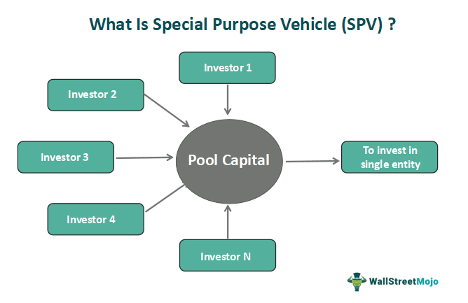

Special purpose vehicles (SPVs) have become a cornerstone of contemporary financial structuring, especially in asset holding and algorithmic trading. Originating as distinct legal entities designed to manage and isolate financial risks, SPVs have evolved to play a significant role in the financial ecosystem. This article aims to elucidate the processes through which SPVs are meticulously crafted to isolate risks, manage assets, and facilitate seamless financial operations.  

Financial professionals must develop a nuanced understanding of SPVs to optimize investment returns while minimizing risk exposure. In particular, SPVs are integral to the strategy of isolating specific financial risks from a parent company, allowing businesses to manage assets effectively without directly impacting their core financial statements. This isolation mechanism aids in safeguarding the parent company from potential liabilities, making SPVs indispensable in complex financial transactions.  

Furthermore, the rapid advancement of technology has cemented the role of SPVs in algorithmic trading. Through SPVs, investors can explore automated trading strategies that consistently yield optimized outcomes. By providing a controlled framework that adheres to regulatory guidelines, SPVs enable financial institutions to develop sophisticated trading models. The integration of SPVs into algorithmic trading thus represents a novel frontier for investors interested in harnessing technology for improved trading efficiency and risk management.  

In this introduction, we lay the groundwork for a comprehensive exploration of SPVs, emphasizing their strategic significance in financial structuring and asset management. Understanding how SPVs function within the broader financial framework is critical for professionals who aim to leverage their potential effectively. As we progress through this analysis, we will highlight the multifaceted roles SPVs play in modern finance, underscoring the enduring importance of these vehicles in achieving financial stability and growth.

## Table of Contents

## Understanding Special Purpose Vehicles (SPVs)

A Special Purpose Vehicle (SPV) is a distinct legal entity crafted to manage and isolate financial risks from its parent company. These entities are often established as subsidiaries and are legally separate, meaning they operate independently in terms of financial and legal responsibilities. SPVs have traditionally been instrumental in securitization processes and real estate transactions, acting as vehicles for holding assets and managing specific financial operations without affecting the parent company's balance sheet.

The primary function of an SPV is to help companies offload assets, a process that aids in isolating financial and operational risks. By segregating certain assets and liabilities within an SPV, companies can shield the parent entity from potential financial distress. This separation ensures that the financial risk associated with specific projects or investments is contained within the SPV and does not adversely impact the parent company.

The establishment and operational framework of SPVs involve a comprehensive understanding of various legal and financial instruments. Legally, SPVs must be structured to comply with regulatory requirements, which can vary significantly between jurisdictions. Financially, SPVs enable companies to undertake complex financial transactions such as securitization, which involves transforming illiquid assets into liquid securities, often enhancing the company's credit standing. 

In essence, the effective utilization of SPVs requires a strategic understanding of how these entities can be leveraged to optimize financial operations. Financial professionals must be well-versed in the legal ramifications and potential advantages associated with SPVs, ensuring they are used to their full potential while remaining compliant with applicable financial and regulatory standards.

## Financial Structuring with SPVs

Special Purpose Vehicles (SPVs) are strategic tools used by companies to manage financial assets effectively without impacting the balance sheet of the parent company. This separation is particularly advantageous for isolating financial risks, enabling credit enhancement, and facilitating investment diversification.

SPVs create an off-balance-sheet vehicle that allows a parent company to:

1. **Isolate Risk**: By transferring specific assets or projects to an SPV, a company can shield its core operations from financial risk. This is especially beneficial in high-risk ventures or large-scale infrastructure projects where potential liabilities are significant. The assets held by the SPV remain isolated from the parent company’s financial instability, creating a buffer against insolvency.

2. **Enhance Credit**: SPVs can improve a project's credit rating by isolating assets and cash flows dedicated to the repayment of financial instruments. By securing asset-backed securities, SPVs provide assurance to lenders and investors that repayments are prioritized, thus lowering borrowing costs for the parent company.

3. **Diversify Investments**: Companies can utilize SPVs for diversification by pooling varied assets or investment projects. This strategy spreads risk and maximizes returns on investment. For example, in the real estate sector, an SPV might hold multiple properties, thus mitigating the risk associated with a single entity’s market volatility.

### Case Studies

**Real Estate Sector**: In real estate, SPVs are often used to manage large property portfolios. For example, a real estate development company might create an SPV to finance and hold a specific property development. This allows the parent company to separate the project's financial obligations and risks from its other operations. Additionally, the SPV can access different financing options, such as issuing mortgage-backed securities.

**Infrastructure Projects**: In large infrastructure projects, like highway construction or power plants, SPVs serve as a central entity to finance and manage the project. This not only isolates the project’s risk but also enables better management of cash flows and regulatory compliance. The SPV structure is appealing to investors interested in infrastructure due to clearly defined liability and returns.

These examples highlight the strategic advantages of using SPVs in financial structuring. By isolating risk, enhancing credit, and providing diversification opportunities, SPVs help companies achieve financial objectives efficiently. As financial environments grow increasingly complex, the use of SPVs in various sectors, from real estate to infrastructure, becomes an essential component of modern financial strategies.

## Asset Holding in SPVs

An integral function of Special Purpose Vehicles (SPVs) is their role in holding assets on behalf of parent companies. This capability provides several benefits, including tax advantages and the mitigation of liability risks. By transferring specific assets to an SPV, a parent company can shield itself from potential financial liabilities associated with these assets, as the SPV operates as a separate legal entity. This separation is particularly useful in isolating the risks of high-value or volatile assets, thereby protecting the parent company’s balance sheet.

Asset holding through SPVs can yield substantial operational and financial efficiencies. For instance, in the real estate sector, property assets can be housed in an SPV, allowing for more favorable tax treatments and streamlined management of these physical assets. This can be particularly advantageous when managing a diverse property portfolio, where each asset can be placed into different SPVs, tailored with specific financing structures and risk management strategies suitable for each property type.

The transfer of assets to SPVs requires a thorough understanding of the legal and regulatory frameworks that govern such transactions. Assets must be clearly defined and evaluated, ensuring they meet all necessary criteria for transfer, without infringing on legal constraints or incurring unforeseen tax obligations. This process involves detailed due diligence and precise execution of contracts to effectively incorporate these assets within the SPV.

From an investment portfolio perspective, the dynamics of transferring assets to and from SPVs necessitate strategic planning. This includes analyzing the potential tax implications, assessing market conditions for optimal timing of asset transfers, and evaluating the potential impact on cash flows. By carefully managing these dynamics, financial professionals can optimize the use of SPVs, enhancing [liquidity](/wiki/liquidity-risk-premium) and offering greater flexibility in managing investment strategies.

In summary, the strategic holding of assets in SPVs offers parent companies a versatile tool to achieve operational efficiencies and financial advantages. These entities serve as crucial mechanisms for asset protection, tax optimization, and liability management, forming a vital component in the financial structuring toolkit of modern corporations.

## Algorithmic Trading and SPVs

The emergence of [algorithmic trading](/wiki/algorithmic-trading) has significantly impacted the financial industry, offering a robust framework for executing trading strategies with speed and precision. Special purpose vehicles (SPVs) have become an instrumental component in this arena, paving the way for automated and high-frequency trading ([HFT](/wiki/high-frequency-trading-strategies)) strategies that manage and mitigate risks effectively.

One of the primary advantages of integrating SPVs into algorithmic trading lies in their ability to isolate and contain financial risk. By housing specific assets or trading operations within an SPV, financial institutions can shield their core businesses from potential [volatility](/wiki/volatility-trading-strategies) or financial distress associated with trading activities. This segregation is crucial, especially in high-frequency trading environments, where rapid transactions are susceptible to market fluctuations and other uncertainties.

Moreover, SPVs offer a structured environment for developing sophisticated trading models that comply with regulatory requirements. Regulatory frameworks, such as the Markets in Financial Instruments Directive II (MiFID II) in Europe, impose strict guidelines on trading practices to enhance market transparency and investor protection. SPVs can be tailored to fit these regulatory constraints, allowing firms to pursue advanced trading strategies while ensuring compliance. This adaptability not only facilitates adherence to legal standards but also fosters innovation in developing algorithmic models.

The integration of SPVs in algorithmic trading brings about several benefits, including enhanced trading capabilities and risk management. Through SPVs, traders can leverage cutting-edge algorithms that capitalize on minute market inefficiencies, thus optimizing trade execution and profitability. These vehicles can also provide a buffer against operational risks by sequestering certain trading functions, which reduces the likelihood of systemic risks affecting the entire financial institution.

However, the use of SPVs in algorithmic trading is not without limitations. One major concern is the complexity involved in setting up and managing SPVs, which can incur additional costs and necessitate specialized expertise. Additionally, the opacity associated with some SPV structures can pose challenges for regulators aiming to monitor trading activities comprehensively. This lack of transparency may lead to increased scrutiny and potential reputational risks for firms employing SPVs in their trading operations.

In conclusion, while SPVs offer a valuable mechanism for enhancing algorithmic trading strategies, careful consideration must be given to their inherent challenges. By balancing the benefits of risk isolation and advanced trading capabilities with the demands of regulation and operational complexity, financial institutions can harness the full potential of SPVs in the evolving landscape of algorithmic trading.

## Risks and Challenges of Using SPVs

Special purpose vehicles (SPVs) offer significant benefits in financial structuring, but they are not without their challenges and risks. One of the primary concerns is regulatory scrutiny, as SPVs often operate in complex legal landscapes. Regulatory bodies may intensively scrutinize SPVs to ensure compliance with financial laws and to prevent activities such as tax evasion or financial obfuscation. Regulatory changes can also impact the legal efficacy and operation of SPVs, creating uncertainty and potential legal risks for financial managers. 

Transparency issues are particularly critical when dealing with SPVs. Due to their off-balance-sheet nature, SPVs can obscure the true financial status of the parent company. This opaqueness becomes a challenge as it can lead to difficulties in assessing the true risk exposure of the company. Financial mismanagement is a potential consequence if SPVs are used to hide liabilities or inflate asset valuation. This mismanagement risk underscores the necessity for rigorous financial oversight and accurate reporting mechanisms to ensure that SPV activities are transparent and reflect genuine economic activity.

Operational complexities add another layer of challenge when managing SPVs. Setting up and maintaining an SPV requires substantial administrative resources, as well as meticulous attention to detail. The intricacies involved in structuring and accounting for SPVs necessitate a deep understanding of both financial principles and legal requirements. Additionally, any missteps in operational processes could lead to financial misstatements or regulatory breaches, resulting in penalties or loss of investor trust.

To effectively and responsibly leverage SPVs, financial managers and investors must be proactive in addressing these risks. This involves maintaining high levels of transparency and ensuring that all SPV-related transactions are conducted in accordance with up-to-date regulatory standards. By implementing robust risk management strategies and staying informed about regulatory developments, stakeholders can mitigate the potential downsides associated with SPVs, thereby maximizing their strategic advantages without compromising financial integrity.

## Future Trends in SPV Utilization

As financial markets continue to evolve, Special Purpose Vehicles (SPVs) are adapting to harness new technologies and trends that enhance their operational efficiency and transparency. One of the most promising advancements is the integration of blockchain technology into SPVs. Blockchain's decentralized ledger system offers increased transparency, security, and efficiency in financial transactions, making it an ideal fit for SPV frameworks. By using blockchain, SPVs can reduce the costs and complexities associated with traditional financial operations, streamline asset transfers, and improve regulatory compliance through immutable and auditable records.

The integration of Environmental, Social, and Governance ([ESG](/wiki/esg-investing)) factors is another significant trend impacting SPV utilization. With growing emphasis on sustainability and ethical investment, SPVs are increasingly being designed to meet ESG criteria. This shift not only attracts a broader range of investors but also aligns with global financial shifts towards responsible investing.

Emerging markets present untapped opportunities for SPVs. With higher growth potential and a burgeoning middle class, these markets are attracting international investments. SPVs provide an effective mechanism to navigate the regulatory and economic landscapes of emerging economies, mitigating risks while capitalizing on growth opportunities. They offer a structured approach to engage with these markets by isolating risks unique to these regions and enabling foreign investors to participate with greater confidence.

Financial professionals who stay informed about these trends can better anticipate and navigate the future landscape of SPV utilization. By effectively leveraging new technologies and adapting to evolving market demands, they can ensure that SPVs remain a cornerstone of efficient financial structuring, risk management, and sustainable investment.

## Conclusion

Special Purpose Vehicles (SPVs) serve as a cornerstone in modern financial structuring, providing a flexible mechanism for asset management and risk mitigation. They are increasingly utilized across various sectors due to their ability to isolate financial risks and manage assets efficiently. As the financial landscape evolves, the strategic use of SPVs will be vital for achieving stability and growth in a complex market environment.

SPVs offer distinct advantages by enabling organizations to segregate financial risks and hold assets without impacting the balance sheets of the parent companies. This separation is particularly beneficial for risk management, as it minimizes the potential for financial distress to affect the larger entity. Additionally, SPVs facilitate access to capital markets, offering opportunities for investment diversification and credit enhancement.

The evolving financial ecosystem requires professionals to understand the detailed workings of SPVs. It's essential to recognize how they function in varying sectors, from real estate to emerging markets, and how they can be optimized for specific financial strategies. With the rise of technologies such as blockchain, SPVs are likely to become even more transparent and efficient, further expanding their utility.

In conclusion, SPVs are integral to modern finance. Their capacity to provide tailored solutions for risk and asset management positions them as indispensable tools for financial professionals aiming for optimal portfolio management and risk-adjusted returns. As markets continue to change, businesses and investors must keep pace with SPV developments to leverage their full potential and navigate the future financial landscape effectively.

## References & Further Reading

[1]: Gorton, G. B., & Souleles, N. S. (2005). ["Special Purpose Vehicles and Securitization."](https://www.nber.org/papers/w11190) NBER Working Paper Series.

[2]: Tuckman, B., & Serrat, A. (2011). ["Fixed Income Securities: Tools for Today's Markets."](https://www.amazon.com/Fixed-Income-Securities-Todays-Markets/dp/0470891696) John Wiley & Sons.

[3]: Fabozzi, F. J., & Kothari, V. (2007). ["Securitization: The Tool of Financial Transformation."](http://depot.som.yale.edu/icf/papers/fileuploads/2495/original/07-07.pdf) CFA Institute Research Foundation.

[4]: Brigo, D., & Mercurio, F. (2006). ["Interest Rate Models - Theory and Practice: With Smile, Inflation and Credit."](https://link.springer.com/book/10.1007/978-3-540-34604-3) Springer Finance.

[5]: Black, F., & Scholes, M. (1973). ["The Pricing of Options and Corporate Liabilities."](https://www.cs.princeton.edu/courses/archive/fall09/cos323/papers/black_scholes73.pdf) Journal of Political Economy, 81(3), 637-654.