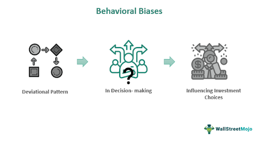

The evolution of trading methods over the years has dramatically reshaped the financial landscape, enhancing operational efficiency, increasing trade volumes, and reducing transaction costs. However, this evolution has also highlighted inherent human tendencies, notably through the persistence of behavioral biases mirrored in algorithmic systems. Behavioral biases are psychological tendencies that skew traders' judgment, often leading to irrational decisions detrimental to financial outcomes. These biases, deeply ingrained in human cognition, manifest when traders overreact to market stimuli, misinterpret risk, or exhibit undue optimism or pessimism about their investments. 

Algorithmic trading, a revolutionary development within financial markets, leverages advanced computational models to execute trades at unparalleled speeds and frequencies, typically beyond human capability. Nevertheless, these algorithms, designed and programmed by humans, are not immune to biases. Algorithmic systems can be tainted by the behavioral predispositions of their creators, as these biases may be inadvertently embedded into the decision-making logic of the algorithms. This intersection of human psychology and technological advancement poses significant challenges, necessitating a deeper understanding of how these biases influence decision-making in trading.



As traders and developers strive to refine trading strategies and enhance decision-making accuracy, it is crucial to recognize and address these inherent biases. Understanding and mitigating biases could lead to more robust financial strategies, ultimately reducing errors and potentially improving the consistency of returns. This article explores the intricate dynamics of behavioral and cognitive biases and their impact on trading, especially within the context of algorithmic systems. It aims to shed light on strategies to counteract these biases, leveraging technological advancements to foster more rational and effective financial decision-making.

## Table of Contents

## What Are Behavioral and Cognitive Biases?

Behavioral biases are systematic patterns of deviation from norm or rationality in judgment, emerging from psychological and emotional influences. These biases can lead individuals to make decisions that do not align with logical and optimal strategies, particularly in contexts requiring critical decision-making, such as trading. Cognitive biases, a subset of behavioral biases, are specific thought processes that distort perception, judgment, and decision-making. These can cause traders to misinterpret financial data or market signals, resulting in non-optimal trading activities.

One prevalent cognitive bias is overconfidence, where traders exhibit excessive belief in their ability to predict market movements. Overconfidence can lead to increased trading frequency and risk exposure, as traders might underestimate the uncertainty and potential losses associated with their decisions. For instance, overconfident traders might ignore warning signs of market downturns, leading to substantial financial losses.

Another critical bias impacting trading decisions is loss aversion, rooted in the principle that individuals experience the pain of loss more intensely than the pleasure of equivalent gains. This leads to a tendency to hold onto losing investments longer than rational strategy would dictate, hoping for a rebound that may never occur, rather than cutting losses and reallocating capital to more promising opportunities.

The disposition effect, closely related to loss aversion, refers to the propensity of traders to sell winning investments prematurely while holding onto losing ones. This behavior often results in missed opportunities for larger gains while capital remains tied up in underperforming assets.

Both behavioral and cognitive biases influence the decision-making processes of traders, steering them away from rational strategies and toward suboptimal outcomes. Recognizing these biases is essential for traders seeking to align their actions with logical evaluations and for reducing errors that compromise financial objectives in the markets. Understanding and mitigating these biases using structured decision frameworks and continual learning can greatly enhance decision-making quality in financial environments.

## Behavioral Biases in Algorithmic Trading

Algorithmic trading employs sophisticated computer algorithms to conduct trades at speeds and volumes unattainable by human traders. These advanced systems are designed to analyze vast quantities of data rapidly and execute trades based on predefined criteria. However, despite their technological advantages, [algorithmic trading](/wiki/algorithmic-trading) systems are not immune to the biases of their human creators. These biases can be subtly and unwittingly embedded in the trading algorithms, leading to suboptimal trading strategies and outcomes.

A key bias that can infiltrate algorithmic trading systems is overconfidence. Overconfidence bias refers to the tendency of individuals to overestimate their knowledge or predictive capabilities. When this bias infiltrates algorithmic trading, it often manifests as excessive risk-taking or frequent trading prompted by overreliance on certain predictive models. For instance, developers might program trading algorithms with overly optimistic assumptions about future market movements, resulting in frequent trades that escalate transaction costs without yielding proportional returns. This can lead to a suboptimal Sharpe ratio, which measures the risk-adjusted return of an investment.

Another prevalent bias that can affect algorithmic trading is loss aversion. This cognitive bias describes the propensity to prefer avoiding losses over acquiring equivalent gains. In algorithmic trading, loss aversion may result in overly conservative trading strategies which avoid potential profitable trades due to fear of losses. Algorithms designed with this bias might include excessive stop-loss safeguards or [exit](/wiki/exit-strategy) strategies that prevent systems from recovering potential gains after minor downturns.

Recognizing these embedded biases requires a comprehensive understanding of both the psychological underpinnings of biases and the technical frameworks of algorithmic trading systems. Developers need to adopt a more objective approach, ensuring that their models are grounded in empirical data rather than subjective forecasts.

To mitigate these biases, emphasis should be placed on robust algorithm development procedures. This includes rigorous testing and validation of algorithms using diverse data sets to identify potential biases before deployment. Incorporating [machine learning](/wiki/machine-learning) techniques can also help in dynamically adjusting and refining trading strategies based on real-time data feedback, thus enhancing the algorithms' capacity to adapt to market conditions without the cloud of human biases.

In summary, while algorithmic trading offers numerous technological benefits, the influence of human behavioral biases remains a substantial challenge. Addressing these biases through careful algorithm design and validation processes is critical in upholding the efficiency and effectiveness of trading systems. By acknowledging and mitigating these biases, algorithmic systems can achieve more reliable and unbiased execution of trades, aligning closer with optimal market strategies.

## Impact of Behavioral Biases on Trading Decisions

Behavioral biases significantly influence trading decisions by distorting traders' perception of market behaviors, often leading to misguided strategies and suboptimal financial outcomes.

Overconfidence bias manifests when traders, buoyed by past successes or perceived expertise, engage in excessive trading. This behavior often results in an increased risk exposure without a proportional rise in returns, as traders overestimate their ability to predict market movements. Overconfident traders might ignore warning signals or market [volatility](/wiki/volatility-trading-strategies), leading to substantial losses. For example, a trader might invest heavily in a stock based on its past performance without adequately considering current market trends or new information, resulting in a misjudgment of risk.

Loss aversion, another prevalent bias, refers to a trader's propensity to weigh potential losses more heavily than equivalent gains. This psychological tendency can cause traders to shy away from necessary risks that might lead to significant profits. A common manifestation of loss aversion is the reluctance to sell a losing position, hoping it will recover, rather than cutting losses and reallocating resources to more promising opportunities. This bias can keep capital tied up in underperforming assets, thereby limiting potential gains elsewhere.

Understanding and identifying these biases are crucial for traders aiming to create strategies that align with actual market conditions. By acknowledging the influence of these biases, traders can adopt more balanced approaches, incorporating systematic risk assessments and objective decision-making frameworks. For instance, implementing a disciplined rules-based approach can help traders avoid emotional reactions and maintain focus on long-term goals rather than short-term fears or overestimations.

Mathematical models and quantitative analysis can also aid in recognizing these biases. By analyzing historical data and simulating various scenarios, traders can better understand potential outcomes and the risks associated with different strategies. For instance, a simple model evaluating risk-return profiles for a set of potential trades could help highlight when a trader's decisions are being influenced by overconfidence or loss aversion.

In Python, traders might employ the following pseudocode to assess a portfolio's performance against market benchmarks, aiming to quantify bias influences:

```python
import pandas as pd
import numpy as np

# Load historical data for assets and market benchmark
portfolio_returns = pd.read_csv('portfolio_returns.csv')
benchmark_returns = pd.read_csv('benchmark_returns.csv')

# Calculate excess returns
excess_returns = portfolio_returns - benchmark_returns

# Evaluate performance metrics
avg_excess_return = np.mean(excess_returns)
std_dev_excess_return = np.std(excess_returns)

# Calculate Sharpe Ratio to assess risk-adjusted returns
risk_free_rate = 0.01
sharpe_ratio = (avg_excess_return - risk_free_rate) / std_dev_excess_return

print("Average Excess Return:", avg_excess_return)
print("Sharpe Ratio:", sharpe_ratio)
```

This type of analysis helps traders objectively evaluate whether their trading decisions are yielding returns justified by the associated risks, thus helping in identifying and mitigating the influence of behavioral biases.

## Strategies to Mitigate Behavioral Biases in Trading

Traders and developers can employ various strategies to mitigate the influence of behavioral biases on trading decisions, enhancing the overall effectiveness and objectivity of algorithmic trading systems. A structured approach can help minimize the irrational decision-making often driven by psychological factors.

A rules-based decision framework forms a foundational strategy to curb emotional influence in trading decisions. By establishing predefined guidelines for trade execution, traders are less likely to make impulsive choices based on market volatility or personal bias. For instance, a systematic approach might include criteria for entry and exit points based on quantitative metrics rather than subjective assessments. This framework ensures consistency and reduces the impact of overconfidence and other biases.

Utilizing diverse data sets and performing extensive [backtesting](/wiki/backtesting) is another critical strategy. By examining a wide range of market scenarios, traders can avoid overfitting their models to past market conditions, which might not accurately predict future trends. Backtesting involves simulating a trading strategy using historical data to evaluate its performance. Python offers powerful libraries such as `[backtrader](/wiki/backtrader)` and `pandas` for conducting robust backtesting:

```python
import backtrader as bt
import pandas as pd

# Sample strategy for backtesting
class MyStrategy(bt.Strategy):
    def __init__(self):
        self.dataclose = self.datas[0].close

    def next(self):
        if self.dataclose[0] > self.dataclose[-1]:
            self.buy()
        elif self.dataclose[0] < self.dataclose[-1]:
            self.sell()

# Load data and run backtest
data = bt.feeds.PandasData(dataname=pd.read_csv('historical_data.csv'))
cerebro = bt.Cerebro()
cerebro.addstrategy(MyStrategy)
cerebro.adddata(data)
cerebro.run()
```

Regular auditing of algorithmic strategies is imperative for identifying and correcting biases. This process involves scrutinizing the algorithms to ensure they remain aligned with strategic objectives and market dynamics. Regular audits can detect changes in performance that may signify biased decision-making processes, allowing traders to adjust the algorithms promptly.

Through these strategic interventions, traders and developers can enhance the reliability of algorithmic trading systems, ensuring they are robust against human-imposed biases. Such practices not only improve trading outcomes but also maintain competitiveness in rapidly evolving financial markets.

## The Role of Machine Learning in Overcoming Biases

Machine learning provides powerful tools to mitigate the biases entrenched in algorithmic trading systems. These systems, while computational and ostensibly objective, often reflect the biases of their human creators. However, machine learning can help identify and minimize these biases by analyzing vast amounts of data to uncover patterns that human traders might not see.

Machine learning algorithms, such as supervised and unsupervised learning models, process historical financial data to identify trends and correlations. This analysis transcends the capability of conventional statistical techniques, offering a more nuanced understanding of market behaviors that can potentially reduce bias-induced errors. By detecting patterns and anomalies that are not immediately apparent, these models can inform trading strategies that are less susceptible to the pitfalls of human cognitive biases.

Reinforcement learning adds another layer of sophistication by enabling trading algorithms to iteratively improve their performance based on market feedback. This approach mimics the trial-and-error learning process of human decision-making but at an accelerated pace and with greater rigor. For example, a [reinforcement learning](/wiki/reinforcement-learning) model can dynamically adjust asset allocations in response to shifting market conditions, thus providing more robust decision-making frameworks. The feedback loop inherent in reinforcement learning facilitates the development of strategies that are adaptive and self-correcting, minimizing the risk of repeated bias-driven errors.

A critical aspect of mitigating biases through machine learning is the continual training and evaluation of models in diverse market environments. Regular updates to datasets and algorithms can help address the fluid nature of financial markets, ensuring that models remain relevant and accurate. For instance, by conducting periodic backtests and cross-validation across different market scenarios, one can assess the performance and bias-resistance of an algorithm under varied conditions. This process involves feeding historical data through the models and comparing predicted outcomes to actual market movements, enabling refinements that bolster the model's resilience against biases.

Python has become a popular language for implementing machine learning models in algorithmic trading due to its extensive libraries, such as TensorFlow and scikit-learn, that facilitate rapid prototyping and deployment. Here’s a simple example in Python using reinforcement learning to optimize a trading strategy:

```python
import numpy as np

class TradingEnv:
    def __init__(self, data):
        self.data = data
        self.current_step = 0
        self.done = False

    def step(self, action):
        reward = self.data[self.current_step] * action  # Simplified reward calculation
        self.current_step += 1
        if self.current_step >= len(self.data):
            self.done = True
        return reward, self.done

def reinforcement_learning(env, episodes=1000):
    for episode in range(episodes):
        state = env.data[0]
        total_reward = 0
        while not env.done:
            action = np.random.choice([-1, 0, 1]) # buy, hold, sell
            reward, done = env.step(action)
            total_reward += reward
        print(f'Episode {episode+1}: Total Reward: {total_reward}')
        env.current_step = 0
        env.done = False

# Example usage
price_data = np.random.normal(size=100)  # Random price data for illustration
env = TradingEnv(price_data)
reinforcement_learning(env)
```

This code snippet demonstrates the basic structure of a reinforcement learning agent interacting with a simplified environment. The agent receives feedback in form of rewards for its actions (buy, hold, sell), and it uses this information to enhance its trading strategy over numerous episodes. While this is a rudimentary example, it highlights how reinforcement algorithms can be used to refine trading decisions and mitigate human biases.

## Conclusion

Behavioral biases continue to pose significant challenges in the realm of algorithmic trading, fundamentally tied to the human origins of algorithm design. These biases, intrinsic to human nature, often inadvertently seep into the algorithms, skewing decision-making and potentially impacting financial outcomes unfavorably. The recognition of these biases is crucial for developing strategies to mitigate their effects.

Through increased awareness, traders and developers can employ strategic interventions to reduce the influence of these biases. By integrating objective protocols and thorough backtesting in algorithmic systems, biases can be minimized, thereby enhancing trading efficacy. Furthermore, adopting disciplined approaches, such as a rules-based decision framework, helps in curbing emotional biases and promotes rational financial decisions.

Technological advancements, particularly in machine learning, are proving instrumental in addressing these challenges. Machine learning models, equipped to process large datasets, can detect subtle patterns and trends that might elude human traders. Such capabilities enable the formulation of more robust trading strategies that are less prone to bias. Additionally, reinforcement learning facilitates continuous adaptation and improvement of strategies in response to changing market conditions by iterating on feedback mechanisms.

Continuous education and the application of advanced analytical techniques are essential for minimizing biases. Educating traders and developers about cognitive and behavioral biases not only raises awareness but also fosters an environment conducive to critical thinking. This education, coupled with the deployment of sophisticated machine learning models and analytical tools, is critical for promoting rational decision-making within financial markets. As the field progresses, sustained efforts in these domains will significantly contribute to diminishing the influence of biases in algorithmic trading systems.

## References & Further Reading

Bergstra, J., Bardenet, R., Bengio, Y., & Kégl, B. discuss the efficiency of 'Algorithms for Hyper-Parameter Optimization' in Advances in Neural Information Processing Systems 24, highlighting methods to optimize algorithmic trading strategies through hyperparameter tuning.

Marcos Lopez de Prado’s 'Advances in Financial Machine Learning' provides insights into utilizing machine learning techniques in finance, focusing on how these can be used to enhance algorithmic trading systems and mitigate biases.

David Aronson's 'Evidence-Based Technical Analysis: Applying the Scientific Method and Statistical Inference to Trading Signals' emphasizes the importance of adopting scientific and statistical approaches in analyzing trading signals, thereby reducing subjective biases that might affect trading outcomes.

Stefan Jansen’s 'Machine Learning for Algorithmic Trading' explores the application of machine learning techniques to develop robust algorithmic trading strategies. It covers how these approaches can identify and correct potential biases embedded in trading models.

Ernest P. Chan's 'Quantitative Trading: How to Build Your Own Algorithmic Trading Business' guides readers through creating their algorithmic trading systems, specifically addressing common pitfalls and biases introduced during system development.

Kahneman, D., & Tversky, A., in 'Prospect Theory: An Analysis of Decision under Risk,' provide a foundational understanding of behavioral economics. Their work explains how intrinsic human biases like loss aversion influence financial decision-making and can inadvertently be programmed into trading algorithms.

Menkhoff, L., in 'The Use of Technical Analysis by Fund Managers: International Evidence,' Journal of Banking & Finance, examines the prevalence and effectiveness of technical analysis among fund managers, providing empirical evidence on the impact of biases within professional trading environments.

