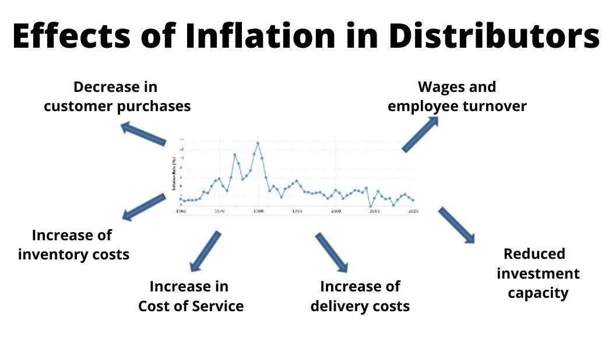

## Table of Contents

## What is inflation and how is it measured?

Inflation is when the prices of things we buy, like food and clothes, go up over time. It means that the money we have can buy less than before. Imagine if a candy bar that cost $1 last year now costs $1.10. That's inflation. It happens because the demand for goods and services can be higher than what's available, or because the cost to make things goes up.

To measure inflation, economists use something called the Consumer Price Index (CPI). The CPI looks at the prices of a big group of things that people usually buy, like groceries, gas, and rent. They check these prices regularly and see how much they've changed over time. If the CPI goes up, it means inflation is happening. Another way to measure inflation is the Producer Price Index (PPI), which looks at the prices that businesses pay for things they need to make their products. Both of these help us understand how fast prices are rising and how inflation is affecting the economy.

## How does inflation affect the purchasing power of money?

Inflation makes the money you have worth less over time. Imagine you have $100. If inflation is high, the things you can buy with that $100 today will cost more next year. So, your $100 won't go as far. It's like your money is shrinking, even though the number of dollars you have stays the same.

This happens because inflation means prices are going up. If a toy costs $10 today and inflation is 5%, next year that same toy might cost $10.50. So, if you saved your $100 to buy toys, you could buy 10 toys this year but only about 9.5 toys next year. That's why people say inflation eats away at the value of money.

## What are the differences between inflation, hyperinflation, and deflation?

Inflation, hyperinflation, and deflation are all about how the prices of things change over time, but they are different in how fast and in which direction those changes happen. Inflation is when prices go up a little bit over time. It's normal and expected in a healthy economy. If you see prices going up slowly each year, that's inflation. It means your money can buy a bit less than before, but it's not too bad.

Hyperinflation is when prices go up really, really fast. It's like inflation on steroids. Instead of prices going up a little each year, they can double or triple in just a few months. This can make money almost worthless because it loses value so quickly. Hyperinflation is rare and can cause big problems for a country's economy. On the other hand, deflation is when prices start to go down. This might sound good because things get cheaper, but it can be bad for the economy. When prices fall, people might wait to buy things, hoping they'll get even cheaper, which can slow down business and lead to less money being spent overall.

## How does inflation impact interest rates and borrowing?

Inflation can change how much it costs to borrow money. When inflation goes up, banks and lenders often raise interest rates. They do this to make sure they're still making money even though the value of money is going down. If you want to borrow money, like for a car or a house, you might have to pay more in interest. This means your monthly payments could go up, and it might be harder to get a loan.

On the other hand, if you already have money saved up, higher interest rates can be good for you. Banks might offer you more interest on your savings to attract more customers. But if inflation is really high, the interest you earn might still not keep up with how fast prices are going up. So, even with higher interest rates, your money might not buy as much as it used to.

## What is the effect of inflation on savings and investments?

Inflation can make your savings worth less over time. If you keep your money in a savings account and inflation is high, the prices of things you want to buy will go up faster than the interest you earn on your savings. This means your money won't buy as much in the future as it does now. For example, if you save $1,000 and inflation is 5%, next year you might need $1,050 to buy the same things. If your savings account only gives you 1% interest, you'll have $1,010, which is less than you need.

Investments can be a way to protect your money from inflation. When you invest in things like stocks or real estate, the value of your investment might grow faster than inflation. This means your money can keep up with or even outpace rising prices. For instance, if you buy a stock that grows by 7% a year and inflation is 5%, your investment is actually growing in real terms. However, investments can be risky, and there's no guarantee they will beat inflation. It's important to think carefully and maybe talk to a financial advisor before making investment decisions.

## How does inflation influence wage growth and employment?

Inflation can push wages to grow. When prices go up, workers want more money so they can still buy the things they need. If a worker used to buy groceries with their weekly pay, but now those groceries cost more, they'll ask for a raise. Sometimes, businesses can give raises to keep up with inflation. But if inflation is too high, businesses might not be able to give big raises, and workers might feel like they're not keeping up with the rising costs.

Inflation can also affect jobs. If prices are going up fast, businesses might have to charge more for their products. If people can't afford to buy as much, businesses might sell less and might need fewer workers. This can lead to higher unemployment. On the other hand, if inflation is moderate and the economy is growing, businesses might need more workers to keep up with demand, which can lead to more jobs and lower unemployment. It's a balance that can be tricky to manage.

## What role does inflation play in economic policy and central bank decisions?

Inflation is really important when governments and central banks make economic plans. They watch inflation closely because it shows how fast prices are going up. If inflation is too high, it can make life hard for people because their money buys less. So, central banks try to keep inflation at a level that's just right, often around 2%. They do this by changing interest rates. If inflation is too high, they might raise interest rates to slow down spending and cool down the economy. If inflation is too low, they might lower interest rates to encourage people to spend more and get the economy moving.

Central banks also use other tools to manage inflation. For example, they might buy or sell government bonds to control how much money is in the economy. If there's too much money, prices can go up faster, so they might take some money out of circulation. If there's not enough money, the economy might slow down too much, so they might add more money. All these actions help keep inflation in check, which is important for keeping the economy stable and helping people plan for the future.

## How does inflation affect different sectors of the economy?

Inflation impacts different parts of the economy in different ways. For businesses that make things, like factories, higher inflation can mean higher costs for materials and labor. If they can't raise their prices enough to cover these costs, their profits might go down. On the other hand, businesses that sell things, like stores, might be able to raise their prices to keep up with inflation, but they need to be careful not to lose customers who can't afford to pay more. Some sectors, like energy and food, are more sensitive to inflation because people always need these things, so prices in these areas can go up faster.

For people, inflation can make life harder if their wages don't keep up with rising prices. This can be especially tough for those on fixed incomes, like retirees, because their money buys less over time. Sectors like healthcare and education often see prices go up faster than general inflation, which can make it harder for families to afford these services. On the flip side, people who own assets like real estate or stocks might see the value of their investments go up with inflation, which can help them keep up with rising costs.

## What are the global economic effects of inflation?

Inflation can have big effects all over the world. When a big country like the United States has high inflation, it can affect other countries too. If the US dollar loses value because of inflation, it can make things like oil and other goods that are priced in dollars more expensive for other countries. This can lead to higher inflation in those countries as well. Also, if a country has a lot of debt in a foreign currency, like dollars, and the value of their own money goes down because of inflation, it can make it harder for them to pay back that debt.

Inflation can also change how countries trade with each other. If one country's money loses value because of inflation, its goods become cheaper for other countries to buy. This can help that country sell more stuff abroad, but it can also make it more expensive for them to buy things from other countries. This can lead to changes in trade patterns and can affect jobs and businesses around the world. Sometimes, countries might try to keep their money from losing too much value by raising interest rates or using other economic tools, but this can lead to other problems like slower growth or higher unemployment.

## How do expectations of inflation influence economic behavior?

When people think prices will go up a lot in the future, it can change how they act right now. If everyone expects inflation to be high, workers might ask for bigger raises to keep up with the rising costs. Businesses might also raise their prices faster because they think their costs will go up soon. This can make inflation even worse because everyone is trying to get ahead of the price increases. It's like a self-fulfilling prophecy where expecting high inflation can actually cause it to happen.

On the other hand, if people expect inflation to stay low, they might not be in such a hurry to spend or ask for raises. This can help keep the economy stable because prices don't go up as fast. Central banks pay close attention to what people expect about inflation. They try to manage these expectations by setting clear goals for inflation and using tools like interest rates to keep inflation in check. If people trust that the central bank will keep inflation low, it can help the whole economy run more smoothly.

## What are the long-term versus short-term effects of inflation on an economy?

In the short term, inflation can make things more expensive right away. People might feel like they have to spend their money quickly before prices go up even more. This can make the economy grow faster because more people are buying things. But if inflation is too high, it can cause problems. Businesses might have to raise prices a lot, and if people can't afford to buy as much, companies might sell less and could even lay off workers. This can lead to higher unemployment and make it harder for people to get by.

In the long term, inflation can change how people save and invest. If prices keep going up, the money people have saved might not be worth as much in the future. This can make people look for ways to protect their money, like investing in things that might grow faster than inflation, like stocks or real estate. But if inflation is really high for a long time, it can hurt the whole economy. It can make it hard for businesses to plan because they don't know what prices will be like in the future. It can also make it harder for people to borrow money because interest rates might go up, which can slow down the economy. Keeping inflation at a steady, moderate level is important for long-term economic health.

## How can governments and financial institutions mitigate the negative effects of inflation?

Governments and financial institutions can help control inflation by using different tools. One big way is by changing interest rates. If inflation is too high, central banks might raise interest rates to make borrowing more expensive. This can slow down spending and help keep prices from going up too fast. Governments can also use their budgets to help. If they think inflation is too high, they might spend less money or raise taxes to take some money out of the economy. This can help cool things down and keep prices in check.

Another way to fight inflation is by managing expectations. If people think inflation will stay low, they might not rush to spend money or ask for big raises, which can help keep prices from going up too fast. Central banks can help with this by setting clear goals for inflation and using their tools to meet those goals. They can also talk to the public about what they're doing to keep inflation under control. This can make people feel more confident that prices won't go up too much, which can help the whole economy stay stable.

## What is the financial impact of inflation?

Inflation significantly influences financial markets, impacting asset classes such as stocks, bonds, and foreign exchange ([forex](/wiki/forex-system)) markets. Each of these markets responds differently to inflationary pressures, largely due to changes in purchasing power, interest rates, and investor sentiment.

### Stocks

Inflation affects stocks primarily through its impact on corporate earnings and consumer purchasing power. As inflation rises, the costs of raw materials and labor may increase, potentially squeezing corporate profit margins if companies cannot pass these costs onto consumers through higher prices. This situation can lead to lower earnings and, ultimately, reduced stock valuations. Conversely, if firms successfully raise prices, their revenues may increase, offsetting some inflationary pressures. However, persistent inflation may erode consumer purchasing power, reducing demand for goods and services and negatively affecting company performance and stock prices. 

### Bonds

Inflation poses a significant threat to bond investors, as it erodes the real value of fixed interest payments. When inflation rises, the purchasing power of future coupon payments decreases, leading to a drop in bond prices as yields adjust upwards. This is because bond investors require higher yields to compensate for the decreased purchasing power of future cash flows. The relationship between bond prices and yields is inverse, as described by the basic bond pricing formula:

$$
P = \frac{C}{(1 + r)^1} + \frac{C}{(1 + r)^2} + \cdots + \frac{C+F}{(1 + r)^n}
$$

where $P$ is the bond price, $C$ is the coupon payment, $r$ is the yield, $F$ is the face value, and $n$ is the number of periods.

### Forex Market

In the forex market, inflation affects currency values, often leading to currency depreciation. Higher inflation in a country relative to its trading partners can reduce its currency's value because purchasing power parity (PPP) suggests that higher inflation will lead to a depreciating currency. Currency depreciation may be reflected in exchange rates adjusting to account for differences in price levels between countries. Additionally, expectations of higher inflation can lead to anticipatory actions by traders and investors, affecting currency demand and supply dynamics.

### Inflation and Interest Rates

Understanding the interplay between inflation and interest rates is crucial for investors and traders. Central banks often respond to inflationary pressures by adjusting interest rates to stabilize prices. An increase in interest rates can limit inflation but also slow economic growth by making borrowing more expensive. Conversely, keeping rates too low can stimulate economic activity but may exacerbate inflation. Interest rate adjustments impact financial markets broadly, influencing borrowing costs, investment flows, and overall market [liquidity](/wiki/liquidity-risk-premium).

By comprehensively understanding how inflation influences these financial markets, investors and policymakers can make informed decisions to navigate the complexities of economic fluctuations.

## References & Further Reading

[1]: ["Inflation in America: A Guide to the Short- and Long-Term Impact"](https://crsreports.congress.gov/product/pdf/R/R47273/2) - The Economist

[2]: ["Macroeconomics"] by N. Gregory Mankiw, 10th Edition - Provides foundational insights into macroeconomic principles, including inflation.

[3]: ["The Intelligent Investor: The Definitive Book on Value Investing"](https://www.amazon.com/Intelligent-Investor-Third-Definitive-Investing/dp/0063423537) by Benjamin Graham - Discusses investment strategies with historical context on inflation.

[4]: ["Algorithmic Trading: Winning Strategies and Their Rationale"](https://play.google.com/store/books/details/Algorithmic_Trading_Winning_Strategies_and_Their_R?id=CIwCTVqEj4oC&hl=en-US) by Ernest P. Chan

[5]: ["Handbook of Economic Forecasting"](https://www.sciencedirect.com/handbook/handbook-of-economic-forecasting) by Graham Elliott, Clive Granger, and Allan Timmermann