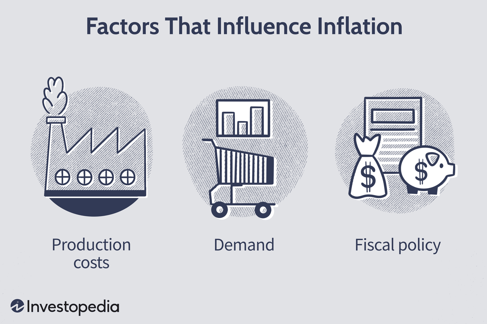

Inflation serves as a fundamental economic indicator, signifying the general rise in prices of goods and services over a specific period. This phenomenon diminishes purchasing power, making it an essential parameter for gauging economic health. As inflation impacts the cost of living, investment values, and the overall economic environment, its influence extends to various facets of the economy, including consumer behavior, business operations, and financial markets.

Consumers might alter their spending habits due to inflation, leading to shifts in demand for certain products and services. Businesses, in turn, adjust their pricing strategies and expenditure to maintain profitability under changing cost structures. In financial markets, inflation can affect everything from interest rates to the valuation of stocks and bonds, ultimately playing a significant role in shaping market dynamics.



This article aims to analyze the financial implications of inflation, its broader economic consequences, and the role algorithmic trading plays in managing these changes. With the increasing complexity of global financial systems, understanding these dynamics is crucial for investors, traders, and policymakers. We will consider how inflation influences different asset classes, necessitating adaptive strategies.

Algorithmic trading systems, which rely on quantitative models to automate trading decisions, must take into account inflationary trends. These systems are integral to managing risk and optimizing returns in inflationary periods. The incorporation of data on inflation into these algorithms helps in forecasting market movements and mitigating potential adverse effects.

In summary, inflation is not just a measure of economic activity; it's a dynamic factor that shapes financial strategies and decisions. By examining its varied impacts and the adaptive strategies employed in algorithmic trading, this article provides insights crucial for effectively navigating the financial complexities associated with inflation.

## Table of Contents

## Understanding Inflation in Economics

Inflation represents the rate at which the general level of prices for goods and services rises, subsequently eroding purchasing power. This phenomenon is quantified using economic indicators such as the Consumer Price Index (CPI) and the Producer Price Index (PPI), which track the average change over time in the prices paid by urban consumers for a market basket of consumer goods and services, and the prices domestic producers receive for their output, respectively.

Several factors contribute to inflation, each with a distinct mechanism and impact on the economy:

1. **Demand-Pull Inflation**: Occurs when the demand for goods and services exceeds their supply. This imbalance drives up prices as consumers are willing to pay more to secure the scarce commodities. A classic example might be a booming economy where employment is high, leading to increased consumer spending.

2. **Cost-Push Inflation**: Happens when the costs to produce goods and services increase, causing producers to raise prices to maintain profit margins. This can result from rising labor costs, increased prices for raw materials, or supply chain disruptions. An example is the oil price shocks that can lead to higher transportation and production costs, thereby raising prices across various sectors.

3. **Built-In Inflation**: Also known as wage-price inflation, this occurs when businesses increase wages to keep up with rising living costs. In turn, companies raise prices to offset the higher wage expenses, creating a cycle of ongoing inflation.

Central banks play a crucial role in managing inflation through monetary policy tools, predominantly [interest rate](/wiki/interest-rate-trading-strategies) adjustments. By increasing interest rates, central banks can cool down an overheated economy by making borrowing more expensive, thereby reducing spending and investment. Conversely, lowering interest rates can stimulate borrowing and spending, potentially spurring higher inflation if the economy is sluggish.

Historical instances underscore the profound impacts of inflation on economies. A notable example is the 1970s oil crisis, which led to severe cost-push inflation. The Organization of Petroleum Exporting Countries (OPEC) significantly cut oil production, causing global oil prices to triple, which triggered widespread inflationary pressure across industrialized nations. This period was marked by stagflation—a combination of high inflation, slow economic growth, and high unemployment—which challenged traditional economic policies and prompted changes in monetary policy frameworks.

In summary, inflation is a complex phenomenon influenced by various economic forces and policy decisions. Understanding these dynamics is vital for navigating the challenges and opportunities presented by inflation in economic planning and financial markets.

## The Financial Impact of Inflation

Inflation significantly influences financial markets, impacting asset classes such as stocks, bonds, and foreign exchange ([forex](/wiki/forex-system)) markets. Each of these markets responds differently to inflationary pressures, largely due to changes in purchasing power, interest rates, and investor sentiment.

### Stocks

Inflation affects stocks primarily through its impact on corporate earnings and consumer purchasing power. As inflation rises, the costs of raw materials and labor may increase, potentially squeezing corporate profit margins if companies cannot pass these costs onto consumers through higher prices. This situation can lead to lower earnings and, ultimately, reduced stock valuations. Conversely, if firms successfully raise prices, their revenues may increase, offsetting some inflationary pressures. However, persistent inflation may erode consumer purchasing power, reducing demand for goods and services and negatively affecting company performance and stock prices. 

### Bonds

Inflation poses a significant threat to bond investors, as it erodes the real value of fixed interest payments. When inflation rises, the purchasing power of future coupon payments decreases, leading to a drop in bond prices as yields adjust upwards. This is because bond investors require higher yields to compensate for the decreased purchasing power of future cash flows. The relationship between bond prices and yields is inverse, as described by the basic bond pricing formula:

$$
P = \frac{C}{(1 + r)^1} + \frac{C}{(1 + r)^2} + \cdots + \frac{C+F}{(1 + r)^n}
$$

where $P$ is the bond price, $C$ is the coupon payment, $r$ is the yield, $F$ is the face value, and $n$ is the number of periods.

### Forex Market

In the forex market, inflation affects currency values, often leading to currency depreciation. Higher inflation in a country relative to its trading partners can reduce its currency's value because purchasing power parity (PPP) suggests that higher inflation will lead to a depreciating currency. Currency depreciation may be reflected in exchange rates adjusting to account for differences in price levels between countries. Additionally, expectations of higher inflation can lead to anticipatory actions by traders and investors, affecting currency demand and supply dynamics.

### Inflation and Interest Rates

Understanding the interplay between inflation and interest rates is crucial for investors and traders. Central banks often respond to inflationary pressures by adjusting interest rates to stabilize prices. An increase in interest rates can limit inflation but also slow economic growth by making borrowing more expensive. Conversely, keeping rates too low can stimulate economic activity but may exacerbate inflation. Interest rate adjustments impact financial markets broadly, influencing borrowing costs, investment flows, and overall market [liquidity](/wiki/liquidity-risk-premium).

By comprehensively understanding how inflation influences these financial markets, investors and policymakers can make informed decisions to navigate the complexities of economic fluctuations.

## Algorithmic Trading and Inflation

Algorithmic trading utilizes advanced computational models and automated systems to execute trades with minimal human intervention, enhancing efficiency and speed in the financial markets. As inflation becomes a pivotal economic variable, incorporating its data into these trading algorithms is essential for optimizing trading strategies and managing potential risks. Inflation affects various economic factors including interest rates, currency values, and market [volatility](/wiki/volatility-trading-strategies), necessitating a comprehensive integration of this data into algorithmic models.

One of the critical components of integrating inflation data into trading systems is dynamic model recalibration. This involves continuously updating the parameters of trading algorithms to reflect current and predicted inflationary conditions. Machine learning, particularly, plays a vital role in this recalibration process. By leveraging large datasets and sophisticated learning algorithms, [machine learning](/wiki/machine-learning) can identify patterns and predict market movements based on inflation trends. For example, regression models can establish relationships between inflation indicators and asset prices, allowing traders to make data-informed decisions.

The Consumer Price Index (CPI) stands as a primary metric for measuring inflation, as it reflects the average change over time in the prices paid by consumers for goods and services. Incorporating CPI data into algorithms allows traders to anticipate shifts in interest rates or sector-specific inflation rates. Such integrations enhance the predictive power of trading systems, enabling them to adjust positions in anticipation of inflation-driven market shifts.

Python, with its extensive library ecosystem, provides powerful tools for implementing machine learning techniques in trading. Libraries like scikit-learn offer a range of algorithms and utilities for data preprocessing, model training, and evaluation. A simple example of using scikit-learn in Python to predict asset price movements based on CPI data might involve the following steps:

```python
from sklearn.model_selection import train_test_split
from sklearn.linear_model import LinearRegression
import pandas as pd

# Load and prepare data
data = pd.read_csv('cpi_data.csv')
X = data[['CPI', 'Interest_Rate']]  # Features
y = data['Asset_Price']             # Target variable

# Split data into training and testing sets
X_train, X_test, y_train, y_test = train_test_split(X, y, test_size=0.2, random_state=42)

# Train a linear regression model
model = LinearRegression()
model.fit(X_train, y_train)

# Evaluate the model
score = model.score(X_test, y_test)
print(f'Model R^2 Score: {score:.2f}')
```

In this code snippet, CPI and interest rates are used as features to predict asset prices. The model's accuracy can be measured using the R² score, which indicates how well the features explain the variability of the target variable.

In summary, [algorithmic trading](/wiki/algorithmic-trading) necessitates the integration of inflation data, such as the CPI, to maintain a competitive edge. Dynamic model recalibration and the application of machine learning are essential methodologies for adapting to inflation's impact, thereby enhancing both the predictive and operational capabilities of trading algorithms.

## Adapting Trading Algorithms for Inflation

Integrating macroeconomic data and inflation forecasts into trading algorithms necessitates the application of advanced statistical techniques. Central to this integration is [backtesting](/wiki/backtesting), which is vital for evaluating the performance of trading algorithms against historical inflation trends. By simulating a trading algorithm's past performance, investors can identify its strengths and weaknesses relative to different economic environments characterized by varying inflation rates.

Machine learning models play a crucial role in refining algorithmic predictions under inflationary conditions. Techniques such as regression trees and neural networks are particularly effective in processing large datasets and uncovering complex relationships between macroeconomic indicators and asset prices. These models facilitate a deeper understanding of how inflationary pressures might affect asset values, thus enabling more precise predictions.

A specific application of machine learning in this context is the use of Random Forest regression models. This ensemble learning method constructs multiple decision trees during training and outputs the mean prediction of the individual trees, enhancing the model's predictive accuracy. Random Forest models are adept at capturing the nonlinear interactions between macroeconomic variables and asset price movements, making them suitable for analyzing the effects of inflation on different asset classes.

```python
from sklearn.ensemble import RandomForestRegressor
import numpy as np

# Example of creating a random forest regressor model
X = np.array([[1, 2], [3, 4], [5, 6], [7, 8]])  # Macro indicators
y = np.array([0.5, 1.5, 3.0, 4.5])  # Asset prices

model = RandomForestRegressor(n_estimators=100, random_state=42)
model.fit(X, y)

# Example of predicting asset prices
prediction = model.predict(np.array([[4, 5]]))
```

Adapting trading strategies to account for inflation is fundamental to ensuring that algorithmic models remain robust amid economic fluctuations. By incorporating inflation forecasts and other relevant macroeconomic data, traders can recalibrate their strategies to hedge against inflation risks effectively. This adaptability not only enhances the resilience of trading algorithms but also aids in optimizing returns in unpredictable economic climates. Continuous innovation and the integration of sophisticated machine learning techniques are essential for maintaining competitive advantage in evolving financial markets.

## Case Studies and Practical Applications

Renaissance Technologies and Bridgewater Associates stand out as innovators in the use of macroeconomic data within trading strategies, demonstrating a keen understanding of the necessity for dynamic approaches to maintain a competitive advantage, especially in inflationary times. Renaissance Technologies, known for its Medallion Fund, employs quantitative models that incorporate vast amounts of data, allowing for a nuanced understanding of market conditions, including inflationary trends. This ability to integrate comprehensive datasets enables the firm to adapt to varying economic conditions, thereby bolstering its resilience through diversification and adaptive hedging techniques.

Adaptive hedging is particularly significant as it allows investors to mitigate risks associated with unpredictable inflationary changes. This involves using financial derivatives to offset potential losses in an investment by taking an opposite position in a correlated asset. Such strategies are supplemented by diversification across asset allocations to cushion the portfolio against market volatility induced by inflation.

Bridgewater Associates, founded by Ray Dalio, emphasizes the importance of continuous model recalibration and backtesting. These practices are crucial in refining trading algorithms to ensure that they remain robust in the face of shifting economic landscapes. Backtesting involves evaluating an algorithm's performance against historical data to identify potential weaknesses and improve predictive accuracy.

A major takeaway from the practices of these firms is the significance of data integration and flexible models. Flexible models are essential for processing complex economic indicators, such as inflation, allowing for more precise forecasting. With the incorporation of machine learning, trading models can enhance their predictive capabilities by learning from historical patterns and adapting to new data inputs. For instance, using Python's scikit-learn library, traders can employ machine learning models such as Random Forest regressors to analyze macroeconomic indicators and forecast asset price movements effectively.

```python
from sklearn.ensemble import RandomForestRegressor

# Example Python code snippet for implementing a Random Forest Regressor

# Sample data
X = [[1.5, 2.3, 3.2], [4.1, 2.9, 3.7]]  # Feature set
y = [0.5, 1.1]  # Target variable

# Create the Random Forest Regressor model
model = RandomForestRegressor(n_estimators=100, random_state=42)

# Fitting the model
model.fit(X, y)

# Predicting
predictions = model.predict([[2.0, 3.0, 1.5]])
```

This combination of sophisticated data integration, robust statistical models, and machine learning enables firms like Renaissance Technologies and Bridgewater Associates to maintain cutting-edge trading strategies. These strategies are not just about predicting inflationary trends but also about finding the best response strategies to maintain or enhance portfolio returns. As inflation dynamics continue to evolve, the ability to leverage advanced data analytics and optimization techniques is paramount in sustaining a competitive edge in global financial markets.

## Conclusion

Inflation plays a significant role in shaping the dynamics of economic and financial markets. Its influence extends across various investment strategies, necessitating a comprehensive understanding of its effects. For investors and traders, especially those utilizing algorithmic trading systems, incorporating inflation data is vital for managing risks and optimizing returns. By integrating inflation into trading models, these systems can adjust to economic fluctuations and enhance performance outcomes.

The application of machine learning in conjunction with macroeconomic data introduces a new dimension to forecasting and trading operations. Through sophisticated algorithms, it is possible to analyze vast datasets, extract meaningful patterns, and predict market movements with improved accuracy. This fusion of technology not only increases the resilience of trading strategies but also provides a competitive advantage in volatile markets.

Remaining informed and adaptable is crucial for effectively navigating the complexity of today's financial environment. As inflationary trends shift and economic conditions evolve, maintaining a proactive approach to information and strategy is necessary. This adaptability ensures that traders can respond to changes swiftly and efficiently, thereby safeguarding their investments and optimizing their outcomes.

Continuous innovation and the seamless integration of advanced technologies are imperative for sustaining a competitive edge in trading strategies. As algorithmic trading continues to evolve, the ongoing development of tools and models is essential for keeping pace with market demands and technological advancements. Leveraging these innovations can significantly enhance strategic execution, fostering sustained success in the competitive landscape of trading.

## References & Further Reading

[1]: ["Inflation in America: A Guide to the Short- and Long-Term Impact"](https://crsreports.congress.gov/product/pdf/R/R47273/2) - The Economist

[2]: ["Macroeconomics"] by N. Gregory Mankiw, 10th Edition - Provides foundational insights into macroeconomic principles, including inflation.

[3]: ["The Intelligent Investor: The Definitive Book on Value Investing"](https://www.amazon.com/Intelligent-Investor-Third-Definitive-Investing/dp/0063423537) by Benjamin Graham - Discusses investment strategies with historical context on inflation.

[4]: ["Algorithmic Trading: Winning Strategies and Their Rationale"](https://play.google.com/store/books/details/Algorithmic_Trading_Winning_Strategies_and_Their_R?id=CIwCTVqEj4oC&hl=en-US) by Ernest P. Chan

[5]: ["Handbook of Economic Forecasting"](https://www.sciencedirect.com/handbook/handbook-of-economic-forecasting) by Graham Elliott, Clive Granger, and Allan Timmermann