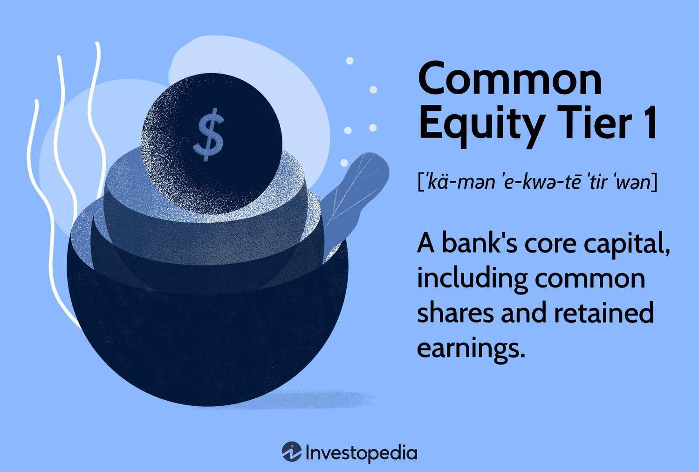

In the global financial landscape, bank capital and financial regulation are foundational elements that ensure stability and trust within the system. At the heart of these discussions are concepts like Common Equity Tier 1 (CET1) and algorithmic trading (algo trading), which serve as vital components in modern banking and finance operations.

Bank capital refers to the financial resources that banks must hold to absorb losses and continue functioning during economic fluctuations. It acts as a safety net, supporting operational endurance and reducing the risk of insolvency. A primary focus within bank capital is Tier 1 capital, which includes CET1. CET1 consists mainly of common stock and retained earnings, representing a bank's core financial strength. Post the financial crisis, CET1 standards have become more stringent, reflecting a regulatory push toward greater financial resilience across institutions.

Financial regulations, including minimum capital requirements as prescribed by frameworks like the Basel Accords, are pivotal in managing systemic risks. These regulations aim to ensure that banks maintain adequate capital buffers to protect both the bank itself and the broader economy from financial disturbances. By regulating capital adequacy, these frameworks create a more stable economic environment.

Complementing this regulatory framework is the rapid evolution of algorithmic trading, which uses advanced mathematical models and automated systems to execute trades with precision and speed. While algo trading has brought enhanced liquidity and efficiency to financial markets, it also introduces challenges such as potential market manipulation risks. Thus, regulatory bodies continuously adapt their policies to address these concerns.

This article explores the interconnectedness between bank capital, financial regulation, and algorithmic trading. It examines why maintaining robust bank capital is essential and how CET1 standards shape banking operations. Additionally, it considers algorithmic trading's role within this regulatory framework and its implications for the modern finance sector. Understanding these dynamics is crucial for stakeholders navigating the complexities of the contemporary financial environment.

## Table of Contents

## Understanding Bank Capital

Bank capital constitutes a crucial protective layer for financial institutions, acting as a hedge against potential losses. Its importance is multifaceted: it not only enables banks to support operational activities but also provides a crucial safety net during times of financial instability or crisis. This protective role of bank capital becomes particularly significant when considering its dual function: maintaining business continuity and safeguarding stakeholder interests, including those of depositors and investors.

There are distinct categories of bank capital, each serving specific purposes within the financial structure. Tier 1 capital is the core capital of a bank, comprising equity and disclosed reserves. It primarily includes Common Equity Tier 1 (CET1), which covers common stock and retained earnings. These components are seen as the most reliable form of capital because they absorb losses while the bank remains a going concern.

Tier 2 capital, on the other hand, includes subordinated debt, hybrid instruments, and other instruments that fall short of the stringent requirements that classify Tier 1 capital. While Tier 1 capital serves as the first line of defense, Tier 2 capital acts as supplementary support, enhancing the bank's ability to absorb losses during wind-down scenarios.

The robustness of a bank's capital base is fundamental to instilling confidence among both depositors and investors. A well-capitalized bank is perceived as more capable of weathering economic downturns, which, in turn, helps stabilize the financial system by reducing the risk of bank runs and preserving market trust.

Bank capital is also intricately connected to regulatory frameworks, particularly in terms of Common Equity Tier 1 (CET1) requirements. Regulatory mandates, such as those stemming from the Basel Accords, dictate minimum capital thresholds that banks must adhere to, specifically emphasizing CET1 ratios. These regulations ensure that banks retain a sufficient capital buffer relative to their risk-weighted assets, thus promoting financial resilience and institutional stability. 

In summary, the composition and management of bank capital are fundamental to fulfilling regulatory expectations, enhancing operational security, and maintaining a trustworthy standing with stakeholders. While different forms of capital serve various purposes, CET1 remains a pivotal component in safeguarding a bank's solvency and compliance with overarching financial regulations.

## The Role of Financial Regulation

Financial regulation is a cornerstone in maintaining systemic stability within the global banking sector. It serves as a safeguard ensuring banks adhere to standards that protect both the institutions and the broader economic environment. These regulations are primarily designed to mitigate risks and prevent financial crises, which can have widespread repercussions on economies worldwide.

Regulatory frameworks are instrumental in establishing the foundation for these protective measures. Notably, the Basel Accords provide a comprehensive set of reforms aimed at strengthening regulation, supervision, and risk management within the banking sector. Initiated by the Basel Committee on Banking Supervision, these Accords lay out stringent guidelines that banks must follow to maintain adequate capital reserves. 

The Basel III framework, for example, outlines minimum capital requirements that banks are required to hold, promoting resilience against financial shocks. This includes maintaining a common equity tier 1 (CET1) ratio above a certain threshold, calculated by the formula:

$$
\text{CET1 Ratio} = \frac{\text{Common Equity Tier 1 Capital}}{\text{Risk-Weighted Assets}}
$$

where common equity tier 1 capital includes common shares, retained earnings, and other reserves, and risk-weighted assets comprise the sum of assets owned by the bank, weighted based on the riskiness of each type of asset.

The principal goal of these frameworks is risk reduction within the banking sector. By mandating minimum capital reserves, these rules ensure that banks have the necessary financial buffer to absorb losses and remain solvent during periods of economic distress. Additionally, these capital requirements enhance investor and depositor confidence, reducing the likelihood of bank runs and fostering a stable banking environment.

Moreover, financial regulation plays a critical role in dictating how banks utilize and maintain their capital. By imposing these guidelines, regulatory bodies instill a balance between risk-taking and cautious financial management. This is crucial as banks strive to optimize their capital efficiency while ensuring compliance with the established norms.

Overall, effective financial regulation is key to a robust banking system, protecting the interests of all stakeholders and ensuring the sector's ongoing stability and integrity.

## Exploring Common Equity Tier 1 (CET1)

Common Equity Tier 1 (CET1) forms a crucial portion of Tier 1 capital, essential for assessing a bank's core financial strength. Comprising predominantly of common stock and retained earnings, CET1 is indispensable from a regulatory perspective. It acts as a buffer, absorbing losses and safeguarding individual banks during adverse financial conditions, thereby contributing to the broader stability of the financial system.

Following the financial crisis of 2007-2008, global regulatory bodies have emphasized the importance of CET1 by strengthening requirements. The Basel III accords, established by the Basel Committee on Banking Supervision, introduced more stringent minimum CET1 ratios. Under Basel III, banks are required to maintain a CET1 capital ratio of at least 4.5% of their risk-weighted assets, a precautionary measure aimed at bolstering the resilience of banks during economic downturns.

The formula used to calculate the CET1 ratio is:

$$
\text{CET1 Ratio} = \left( \frac{\text{Common Equity Tier 1 Capital}}{\text{Risk-Weighted Assets}} \right) \times 100
$$

This calculation ensures that banks have a sufficient capital buffer relative to the risk profile of their assets. By maintaining a robust CET1 ratio, financial institutions are better equipped to withstand economic shocks, protect depositors, and promote confidence among stakeholders.

Enhancements in CET1 standards post-crisis are complemented by additional buffers like the Capital Conservation Buffer (CCB), which requires banks to hold an extra layer of capital in addition to the minimum ratio. Banks failing to meet these buffers face constraints on capital distribution, such as dividend payments, share repurchases, and bonuses, thereby encouraging capital preservation to absorb possible future losses.

In summary, CET1 plays a pivotal role in the regulatory landscape, offering a reliable indicator of a bank's financial health and its ability to endure economic stress. This focus on maintaining substantial CET1 ratios is fundamental to achieving a stable and resilient banking sector, ultimately contributing to the reduction of systemic risks within the global economy.

## Advancements in Algorithmic Trading

Algorithmic trading, commonly referred to as algo trading, has become a cornerstone of modern financial markets, revolutionizing the way trades are executed. By leveraging advanced mathematical models and automated systems, algo trading enhances both the speed and efficiency of transactions. This transformation enables market participants to process vast amounts of data and trades in fractions of a second, providing a competitive edge in rapidly fluctuating markets.

One of the primary benefits of algo trading is its role in [liquidity](/wiki/liquidity-risk-premium) provision. Through the use of sophisticated algorithms, such systems can continuously make prices for buying and selling securities, thereby enhancing overall market liquidity. This continuous buying and selling facilitate smoother price discovery, which is crucial for reflecting the true value of securities based on supply and demand dynamics.

Despite its benefits, the rise of [algorithmic trading](/wiki/algorithmic-trading) has introduced significant challenges. One major concern is market manipulation risks, such as those arising from high-frequency trading strategies that could potentially distort market prices. For instance, practices like spoofing—where false orders are placed to manipulate prices—raise ethical and regulatory questions.

To effectively manage the risks associated with algorithmic trading, regulatory bodies have been actively evolving their guidelines. These measures aim to prevent market abuse and ensure a fair trading environment. Regulatory frameworks, such as the Markets in Financial Instruments Directive (MiFID II) in Europe, set stringent requirements for trading transparency and algorithmic system testing. Regulatory bodies enforce robust risk management protocols, mandating financial institutions to implement pre-trade and post-trade risk controls.

The balance between utilizing the full potential of algo trading and mitigating its risks underscores the adaptive nature of financial regulations in response to technological advancements. Future developments in algorithmic trading will likely continue to reshape financial markets, necessitating ongoing collaboration between market participants and regulators to foster innovation while safeguarding market integrity.

## Interconnections Between CET1 and Algo Trading

The interplay between Common Equity Tier 1 (CET1) capital requirements and algorithmic trading (algo trading) represents a significant evolution in the banking sector's operational dynamics. This synergy allows banks to effectively manage their capital and maintain regulatory compliance while optimizing trading strategies for enhanced profitability.

Banks employ algorithmic trading to enhance the efficiency of their capital utilization, including vital components such as CET1. These algorithms can swiftly analyze and execute large volumes of trades, optimizing the management of CET1 by aligning risk-weighted asset allocations with strategic goals. Through this process, banks can adjust their CET1 ratios to remain within regulatory limits, using data-driven insights to minimize the necessity for excessive capital cushions. This enables banks to deploy capital more dynamically, ensuring adequate coverage for potential financial disturbances while pursuing profitable opportunities.

The complexity of integrating bank capital requirements with trading strategies cannot be overstated. This integration involves sophisticated risk management and decision-making processes, which algorithms are exceptionally well-suited to handle. For instance, banks may develop models to forecast market movements and adjust their CET1 holdings accordingly, allowing for improved capital management that is responsive to both market conditions and regulatory mandates.

However, this integration also underscores the inherent tensions between existing regulatory frameworks and the rapid pace of technological advancement. While algo trading can enhance capital management, it also raises questions about systemic risks and market stability, necessitating vigilant regulation to mitigate potential market manipulation or excessive risk-taking. Regulators, therefore, face the challenge of continuously evolving their frameworks to address the complexities introduced by these advanced trading technologies.

To effectively navigate these dynamics, financial institutions must develop a nuanced understanding of both CET1 requirements and the capabilities of algo trading. This includes recognizing how algorithmic strategies can align with regulatory standards while maximizing capital efficiency. Such comprehension is critical in striking a balance between leveraging technological advancements and adhering to stringent capital adequacy norms.

In conclusion, the relationship between CET1 capital management and algo trading exemplifies the broader transformation within the financial sector, driven by technology and stringent regulatory demands. It is a testament to the evolving landscape where understanding and adaptation to these complex interconnections are crucial for maintaining financial stability and achieving competitive advantage.

## Conclusion

The integration of robust bank capital management with stringent financial regulation remains a central pillar in the stability and resilience of the banking industry. A clear understanding of Common Equity Tier 1 (CET1) ratios, a vital component of regulatory measures, is crucial for banks in safeguarding their operations against financial uncertainties. The CET1 ratio is calculated as the bank's CET1 capital divided by its risk-weighted assets. Maintaining an adequate CET1 ratio ensures that banks have a sufficient capital buffer to withstand economic shocks, thereby enhancing their operational resilience and providing confidence to investors and depositors.

Algorithmic trading, while offering avenues for increased efficiency and speed in market activities, presents both opportunities and challenges within the regulatory framework. It aids in liquidity provision and price discovery but concurrently poses risks related to market manipulation and systemic fragility. As such, regulatory bodies are tasked with periodically updating their frameworks to address potential pitfalls associated with algo trading.

As technology continues to permeate the financial sector, its intertwining with financial regulation necessitates a nuanced understanding of its implications on banking operations. The intersection of tech-driven trading mechanisms and regulatory compliance underscores the importance of technological literacy among financial institutions.

In this ever-evolving financial landscape, continuous learning and adaptation become vital strategies for banks to thrive. Institutions must stay abreast of technological advancements and regulatory changes to navigate effectively. This proactive approach ensures that banks remain ahead in managing risks and capitalizing on opportunities, thereby securing their place in a complex and dynamic economic environment.

## References & Further Reading

[1]: Basel Committee on Banking Supervision. (2011). ["Basel III: A global regulatory framework for more resilient banks and banking systems."](https://www.bis.org/publ/bcbs189.htm) Bank for International Settlements.

[2]: Aldridge, I. (2013). ["High-Frequency Trading: A Practical Guide to Algorithmic Strategies and Trading Systems."](https://www.wiley.com/en-us/High-Frequency+Trading%3A+A+Practical+Guide+to+Algorithmic+Strategies+and+Trading+Systems%2C+2nd+Edition-p-9781118343500) Wiley.

[3]: Hull, J. C. (2018). ["Risk Management and Financial Institutions."](https://books.google.com/books/about/Risk_Management_and_Financial_Institutio.html?id=1J1QDwAAQBAJ) Wiley.

[4]: Haldane, A. G. (2011). ["The Race to Zero."](https://www.bankofengland.co.uk/speech/2011/the-race-to-zero-speech-by-andy-haldane) Bank of England, speech.

[5]: Merton, R. C., & Bodie, Z. (1995). ["A Conceptual Framework for Analyzing the Financial Environment."](https://robertcmerton.com/publication/a-conceptual-framework-for-analyzing-the-financial-environment-2/) National Bureau of Economic Research.