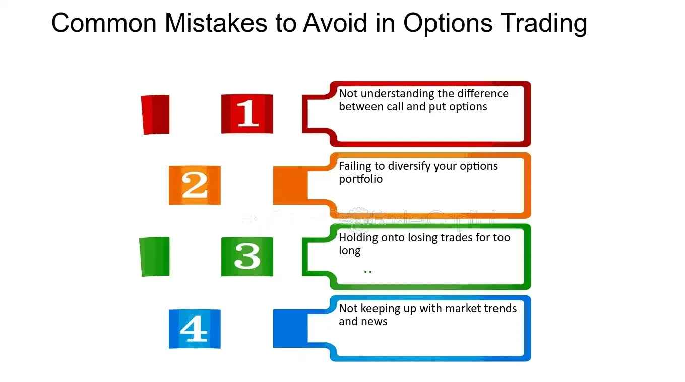

## Table of Contents

## What are low-cost options and why are they attractive to traders?

Low-cost options are financial instruments that have a relatively low price to buy. These options can be appealing to traders because they don't require a lot of money to start trading. This makes them accessible to people who might not have a lot of cash to invest. Since the cost to enter the market is low, traders can try different strategies without risking too much money.

Traders find low-cost options attractive because they can potentially make a good return on their investment. Even though each option might not be worth a lot, if the price of the option goes up, the percentage gain can be high. This means that traders can make a significant profit compared to the small amount they spent to buy the option. However, it's important to remember that with the chance for big gains comes the risk of big losses, so traders need to be careful and understand the market well.

## What are the most common mistakes beginners make when trading low-cost options?

One of the biggest mistakes beginners make when trading low-cost options is not doing enough research. They might see that the options are cheap and think it's a good deal, but they don't take the time to learn about the company or the market. This can lead to them buying options that are not likely to go up in value. It's important to understand the reasons why an option is cheap before deciding to buy it.

Another common mistake is not having a clear plan. Beginners often jump into trading without knowing when they will sell their options. They might hold onto losing options for too long, hoping the price will go back up, or they might sell winning options too early and miss out on more gains. Having a plan for when to buy and sell can help beginners make better decisions and manage their risks.

Lastly, beginners often trade with emotions instead of logic. They might get excited when they see their options going up in value and make quick decisions without thinking. Or they might get scared when the market goes down and sell their options at a loss. It's important to stay calm and stick to a trading plan, even when the market is moving a lot.

## How does liquidity affect the trading of low-cost options?

Liquidity is very important when trading low-cost options. It means how easy it is to buy or sell an option without the price changing a lot. If an option is very liquid, you can trade it quickly and at a good price. But if an option is not liquid, it can be hard to find someone to trade with. This can make the price go up or down a lot when you try to buy or sell, which can be bad for beginners who are trading low-cost options.

When you trade low-cost options with low [liquidity](/wiki/liquidity-risk-premium), you might have to pay more to buy them or get less money when you sell them. This can eat into your profits or make your losses bigger. So, it's a good idea to look at how liquid an option is before you decide to trade it. If you stick to options that are more liquid, you can have a better chance of making money and not losing too much.

## What is the impact of high volatility on low-cost options trading?

High [volatility](/wiki/volatility-trading-strategies) means that the price of an option can change a lot in a short time. For low-cost options, this can be both good and bad. When the price goes up because of high volatility, you might make a lot of money quickly. This is because even a small change in the price of the underlying asset can make a big difference in the value of a low-cost option. But it's risky too. If the price goes down, you could lose money just as fast. So, high volatility can make low-cost options more exciting to trade, but it also makes them more dangerous.

Because of high volatility, it's really important to have a good plan when you're trading low-cost options. You need to know when you're going to buy and sell, and you should be ready for big changes in the price. If you don't have a plan, you might make decisions based on your feelings instead of thinking things through. High volatility can make you feel excited or scared, and that can lead to mistakes. So, always think carefully and stick to your plan, even when the market is moving a lot.

## How can traders effectively manage the risk associated with low-cost options?

To manage the risk when trading low-cost options, traders should start by doing a lot of research. They need to learn about the company they are trading and understand why the options are cheap. This helps them make better choices and avoid buying options that might not go up in value. It's also important to look at how easy it is to trade the options, which is called liquidity. If options are not liquid, it can be hard to sell them when you want to, and you might lose money.

Another way to manage risk is by having a clear plan. Traders should decide when they will buy and sell their options before they start trading. This plan should include setting limits on how much money they are willing to lose. If the options start to lose value, traders should stick to their plan and sell them before they lose too much money. It's also good to not use all their money on one trade. By spreading their money across different options, traders can lower their risk.

Lastly, traders need to control their emotions. High volatility can make the price of low-cost options change a lot, and this can make traders feel excited or scared. But making decisions based on feelings can lead to mistakes. Traders should stay calm and follow their plan, even when the market is moving a lot. By doing these things, traders can better manage the risks of trading low-cost options and have a better chance of making money.

## What role does time decay play in the pricing of low-cost options?

Time decay is really important when it comes to the price of low-cost options. It means that as time goes on, the value of an option goes down. This happens because options have an expiration date, and the closer you get to that date, the less time there is for the option to go up in value. For low-cost options, this can be a big deal because they usually don't cost a lot to begin with. So, if you're holding onto a low-cost option and time is running out, the price can drop quickly, which might mean you lose money.

Because of time decay, it's smart to think about how long you want to hold onto your low-cost options. If you think the price of the option will go up soon, it might be a good idea to buy options that expire in a shorter time. This way, you won't lose as much money from time decay. But if you think it will take longer for the price to go up, you might want to buy options that expire later. Just remember, the longer you hold onto an option, the more time decay can affect its price. So, always keep an eye on the clock when you're trading low-cost options.

## How should traders adjust their strategies based on different market conditions when trading low-cost options?

When the market is going up, traders should think about buying low-cost call options. These options give you the right to buy a stock at a certain price, which can be good if you think the stock's price will keep going up. It's a good idea to buy options that expire soon because they are cheaper and you can make money faster if the market keeps going up. But you need to be quick because if the market stops going up, the value of your options can drop fast because of time decay.

When the market is going down, traders might want to buy low-cost put options. These options give you the right to sell a stock at a certain price, which can be good if you think the stock's price will keep going down. It's a good idea to buy options that expire later because you might need more time for the market to go down enough for you to make money. But be careful because if the market starts going up again, the value of your options can drop because of time decay. In a sideways market, where the price doesn't move much, it's better to stay out of the market or use strategies like selling options to make money from the time decay.

In a volatile market, where the price moves a lot, traders can use low-cost options to make money from big price swings. You can buy options when the market goes down and sell them when it goes up, or the other way around. It's important to have a plan and stick to it because the market can change quickly. Also, make sure you only trade options that are easy to buy and sell, so you don't lose money because of low liquidity.

## What are the psychological pitfalls that traders often encounter with low-cost options?

One big psychological pitfall that traders face with low-cost options is getting too excited or greedy. Because low-cost options don't cost a lot of money, it's easy to buy a lot of them. When the price goes up, traders might feel really good and want to buy even more options, hoping to make even more money. But this can lead to big losses if the market turns around. It's important to stay calm and stick to a plan, instead of letting excitement make you take too many risks.

Another pitfall is fear. When the market starts to go down, traders might get scared and sell their options too early, even if they could have made more money if they waited. Low-cost options can lose value quickly because of time decay, so fear can make traders sell at a loss instead of holding on a bit longer. It's important to have a clear plan for when to sell and not let fear make you panic and sell too soon.

Lastly, overconfidence can be a big problem. When traders make money with low-cost options a few times, they might start to think they can't lose. This can make them take bigger risks and trade without doing enough research. Overconfidence can lead to big losses because the market can change in ways that traders don't expect. It's important to always do your homework and not let past wins make you think you can't lose.

## How can advanced technical analysis tools be used to improve decision-making in low-cost options trading?

Advanced technical analysis tools can help traders make better decisions when trading low-cost options by showing them important patterns and trends in the market. Tools like moving averages can help traders see the general direction of a stock's price over time. If the price is above the moving average, it might be a good time to buy a call option because the price could keep going up. If the price is below the moving average, it might be a good time to buy a put option because the price could keep going down. Other tools like the Relative Strength Index (RSI) can show if a stock is overbought or oversold, which can help traders decide when to buy or sell their options. By using these tools, traders can make more informed decisions and increase their chances of making money.

Another way advanced technical analysis tools can help is by showing traders the right time to enter and [exit](/wiki/exit-strategy) trades. For example, tools like Bollinger Bands can show when a stock's price is moving a lot and might be about to change direction. If the price is near the upper Bollinger Band, it might be a good time to sell a call option or buy a put option because the price could go down soon. If the price is near the lower Bollinger Band, it might be a good time to sell a put option or buy a call option because the price could go up soon. By using these tools, traders can time their trades better and manage the risk of time decay, which is really important when trading low-cost options.

## What are the tax implications of trading low-cost options and how should they be managed?

Trading low-cost options can have tax implications that traders need to think about. When you make money from trading options, you have to pay taxes on your profits. If you hold an option for less than a year before selling it, any profit you make is considered a short-term capital gain. Short-term gains are taxed at your regular income tax rate, which can be pretty high. But if you hold an option for more than a year, any profit you make is considered a long-term capital gain, which is usually taxed at a lower rate. So, it's a good idea to think about how long you hold your options because it can affect how much tax you have to pay.

To manage the tax implications of trading low-cost options, traders should keep good records of all their trades. This means writing down when they bought and sold each option, how much they paid, and how much they made. Having good records can help when it's time to file your taxes because you'll need to report all your gains and losses. Another way to manage taxes is by using tax-loss harvesting. This means selling options that have lost value to offset the taxes you owe on your gains. By doing this, you can lower your overall tax bill. It's also a good idea to talk to a tax professional who can give you advice on how to handle your taxes based on your specific situation.

## How does the use of leverage in low-cost options trading amplify potential errors?

Using leverage in low-cost options trading means you can control a lot of options with a little bit of money. This can make your profits bigger if things go well, but it can also make your losses bigger if things go badly. When you use leverage, even small mistakes can turn into big problems. For example, if you guess wrong about which way the market will go, you could lose a lot more money than you would have without leverage. Also, if you don't pay attention to how much the options are worth as time goes on, you might lose money quickly because of time decay.

Another way leverage can make errors worse is by making traders feel too confident. When you see your money growing fast because of leverage, you might think you're really good at trading and start taking bigger risks. But the market can change in ways you don't expect, and if you're not careful, you could lose everything you put in. It's important to always think carefully and not let the excitement of leverage make you forget about the risks. Keeping a clear head and sticking to a plan can help you avoid big mistakes when using leverage in low-cost options trading.

## What advanced strategies can expert traders employ to mitigate common errors in low-cost options trading?

Expert traders can use a strategy called "hedging" to protect themselves from big losses when trading low-cost options. Hedging means buying options that will go up in value if the options you already own go down in value. For example, if you own a lot of call options, you can buy some put options too. This way, if the market goes down and your call options lose value, your put options might go up in value and help cover your losses. Hedging can help traders avoid big mistakes by making sure they don't lose all their money if the market moves against them.

Another strategy experts use is called "spreading." This means buying and selling different options at the same time to make a "spread." For example, you might buy a call option with a low strike price and sell a call option with a higher strike price. This can help you make money if the stock's price goes up, but it also limits how much you can lose if the price goes down. Spreading can help traders manage the risk of time decay and make their trades less risky. By using these advanced strategies, expert traders can make better decisions and avoid common errors in low-cost options trading.

## How can we integrate strategies for success?

Combining [algorithmic trading](/wiki/algorithmic-trading) with traditional trading strategies can significantly enhance trading results by leveraging the strengths of both approaches. Algorithmic trading, with its ability to process vast amounts of data quickly and execute trades without human intervention, can optimize the timing of trades and reduce the impact of emotional biases. Traditional strategies, however, often incorporate years of market understanding and intuition, adding a layer of human insight that algorithms might not detect.

One effective strategy for success in options trading is developing a diversified portfolio. Diversification involves spreading investments across various assets to minimize risk exposure from any single investment. By strategically balancing different assets, traders can absorb market volatility and increase potential returns. Diversification can be quantified using the formula:

$$
\sigma_p = \sqrt{\sum_{i=1}^{n} (w_i^2 \cdot \sigma_i^2) + \sum_{i=1}^{n}\sum_{j \neq i}^{n} (w_i \cdot w_j \cdot \sigma_i \cdot \sigma_j \cdot \rho_{i,j})}
$$

where $\sigma_p$ represents the portfolio's total risk, $w_i$ and $w_j$ are the weights of different assets in the portfolio, $\sigma_i$ and $\sigma_j$ are the standard deviations, and $\rho_{i,j}$ is the correlation coefficient between asset returns.

Staying informed about market trends is crucial in options trading. Market conditions are dynamic and can change rapidly due to economic events, policy changes, or geopolitical tensions. By continuously educating oneself about these developments, traders can make more informed decisions. Access to real-time data, news platforms, and financial analysis tools provide traders with essential insights into current market sentiments.

Furthermore, traders should regularly evaluate and adapt their strategies to accommodate changing market conditions. Algorithmic models, for instance, may need tweaking to reflect new data patterns or shifts in market volatility. Python, a powerful programming language, can assist in this process with its robust libraries designed for data analysis and trading such as pandas, NumPy, and scikit-learn. A basic framework for [backtesting](/wiki/backtesting) a trading strategy in Python might look like:

```python
import pandas as pd
import numpy as np

def backtest_strategy(data):
    data['Signal'] = np.where(data['Moving_Average_Short'] > data['Moving_Average_Long'], 1, -1)
    data['Returns'] = data['Price'].pct_change()
    data['Strategy_Returns'] = data['Returns'] * data['Signal'].shift(1)
    cumulative_returns = (1 + data['Strategy_Returns']).cumprod() - 1
    return cumulative_returns

# Example DataFrame with Price and moving averages
data = pd.DataFrame({
    'Price': [100, 102, 101, 103, 102, 105],
    'Moving_Average_Short': [101, 103, 102, 104, 103, 106],
    'Moving_Average_Long': [102, 102, 103, 103, 104, 104]
})

cumulative_returns = backtest_strategy(data)
print(cumulative_returns)
```

The combination of algorithmic efficiency and traditional strategies, when properly balanced and regularly updated, enhances a trader's ability to generate consistent returns. Success in options trading thus hinges on the ability to seamlessly integrate these methods while maintaining a broad perspective on market activities.

## References & Further Reading

[1]: Bergstra, J., Bardenet, R., Bengio, Y., & Kégl, B. (2011). ["Algorithms for Hyper-Parameter Optimization."](https://papers.nips.cc/paper/4443-algorithms-for-hyper-parameter-optimization) Advances in Neural Information Processing Systems 24.

[2]: ["Advances in Financial Machine Learning"](https://www.amazon.com/Advances-Financial-Machine-Learning-Marcos/dp/1119482089) by Marcos Lopez de Prado

[3]: ["Evidence-Based Technical Analysis: Applying the Scientific Method and Statistical Inference to Trading Signals"](https://www.amazon.com/Evidence-Based-Technical-Analysis-Scientific-Statistical/dp/0470008741) by David Aronson

[4]: ["Machine Learning for Algorithmic Trading"](https://github.com/stefan-jansen/machine-learning-for-trading) by Stefan Jansen

[5]: ["Quantitative Trading: How to Build Your Own Algorithmic Trading Business"](https://www.amazon.com/Quantitative-Trading-Build-Algorithmic-Business/dp/1119800064) by Ernest P. Chan