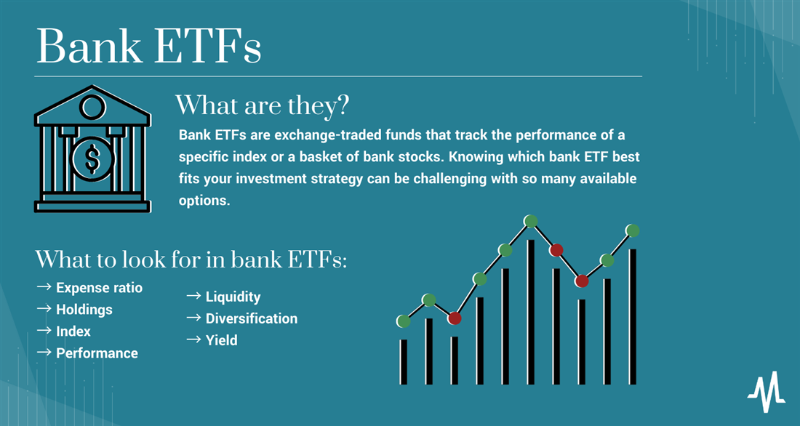

## Table of Contents

## What is an ETF?

An ETF, or Exchange-Traded Fund, is a type of investment that lets you buy a bunch of different stocks or other assets all at once. It's like a basket where you can put many different things, but instead of fruits or vegetables, you're putting stocks, bonds, or commodities. ETFs are traded on stock exchanges, just like individual stocks, so you can buy and sell them throughout the day.

ETFs are popular because they offer a way to diversify your investments without having to pick and choose individual stocks. This can help spread out the risk because if one stock in the ETF goes down, the others might help balance it out. Plus, ETFs often have lower fees than mutual funds, making them a cost-effective choice for many investors.

## What are sector-specific ETFs?

Sector-specific ETFs are a type of ETF that focuses on a particular part of the economy, like technology, healthcare, or energy. Instead of buying a little bit of everything, these ETFs only include companies from one specific industry. This can be helpful if you think a certain sector will do well in the future and you want to invest more in that area.

For example, if you believe that technology companies will grow a lot, you might buy a tech sector ETF. This ETF would include stocks from many different tech companies, so you don't have to pick just one. But remember, while sector-specific ETFs can help you focus your investments, they can also be riskier because they depend a lot on how well that one sector does. If the sector doesn't do well, your investment might not do well either.

## Why might someone invest in banking sector ETFs?

Someone might invest in banking sector ETFs because they believe the banking industry will do well in the future. Banks can make more money when interest rates go up, or when the economy is growing and more people are borrowing money. If someone thinks these things will happen, they might want to put their money into a banking sector ETF to try to make more money from their investment.

Another reason is that banking sector ETFs can help spread out the risk. Instead of picking just one bank to invest in, an ETF includes many different banks. This way, if one bank doesn't do well, the others might help balance it out. It's like not putting all your eggs in one basket. But, it's important to remember that banking sector ETFs can still be risky because they depend a lot on how well the whole banking industry does.

## What are some of the most popular ETFs that track the banking sector?

Some of the most popular ETFs that track the banking sector are the Financial Select Sector SPDR Fund (XLF) and the SPDR S&P Bank ETF (KBE). The XLF is a broad financial sector ETF, but it has a big part of its money in banks. This makes it a good choice for someone who wants to invest in banks but also get a little bit of other financial companies. The KBE, on the other hand, focuses only on banks, so it's more specific to the banking industry.

Another popular ETF is the Invesco KBW Bank ETF (KBWB). This ETF tracks the performance of large national banks and regional banks in the U.S. It's a good choice for someone who believes that big banks will do well in the future. All these ETFs let you invest in many banks at once, which can help spread out your risk compared to picking just one bank to invest in.

## How do banking sector ETFs typically perform compared to the broader market?

Banking sector ETFs can do better or worse than the broader market, depending on what's happening in the economy. When the economy is doing well, people and businesses borrow more money, and banks make more money from loans. This can make banking sector ETFs go up more than the broader market. Also, when interest rates go up, banks can make more money, which can help banking ETFs do better than the overall market.

But, banking sector ETFs can also go down more than the broader market when things are not going well. If the economy is doing badly, people might not borrow as much, and banks might not make as much money. This can make banking ETFs go down more than the broader market. Also, if there's a big problem in the banking industry, like a financial crisis, banking ETFs can lose a lot more money than the overall market. So, they can be riskier but also have the chance to do better if things go well.

## What are the key factors that influence the performance of banking sector ETFs?

The performance of banking sector ETFs is influenced a lot by what's happening in the economy. When the economy is growing, people and businesses borrow more money from banks. This means banks can make more money from the interest on loans, which can make banking ETFs do well. Also, when interest rates go up, banks can charge more for loans, which can help their profits and make banking ETFs go up. If people think the economy will keep growing, they might buy more banking ETFs, hoping to make money.

But, banking sector ETFs can also be affected by bad things happening in the economy or the banking industry. If the economy is doing badly, people might not borrow as much, and banks might not make as much money. This can make banking ETFs go down. Also, if there's a big problem in the banking industry, like a financial crisis, banking ETFs can lose a lot of money. So, while banking ETFs can do well when things are good, they can also be riskier than the broader market when things go wrong.

## What are the risks associated with investing in banking sector ETFs?

Investing in banking sector ETFs can be risky because they depend a lot on how well the banking industry is doing. If the economy is not doing well, people might not borrow as much money from banks. This means banks won't make as much money, and the ETFs that invest in banks can go down in value. Also, if there's a big problem in the banking industry, like a financial crisis, banking ETFs can lose a lot of money very quickly.

Another risk is that banking sector ETFs might not do as well as the broader market when things are not going well. If the whole economy is struggling, banking ETFs can go down more than other parts of the market. This is because banks are really sensitive to economic changes. So, while banking ETFs can be a good way to invest in banks, they can also be more risky than investing in the whole market.

## How do fees and expenses impact the returns of banking sector ETFs?

Fees and expenses can make a big difference in how much money you make from banking sector ETFs. Every ETF has fees that you have to pay, like the expense ratio, which is a small percentage of your investment that the ETF company takes each year to manage the fund. If the expense ratio is high, it means you're giving more of your money to the company instead of keeping it for yourself. Over time, these fees can add up and eat into your returns, making your investment grow slower than it could have.

For example, if you invest $10,000 in a banking sector ETF with a 0.5% expense ratio, you'll pay $50 in fees each year. That might not sound like a lot, but over many years, those fees can add up to a big amount. If another ETF has a lower expense ratio, like 0.1%, you'd only pay $10 in fees each year on the same $10,000. That extra money you save on fees can stay in your investment, helping it grow more over time. So, it's important to look at the fees when you're choosing a banking sector ETF.

## What is the difference between ETFs that focus on domestic versus international banking sectors?

ETFs that focus on domestic banking sectors invest in banks from just one country, like the United States. These ETFs can be a good choice if you believe that the banks in your own country will do well. For example, if you think the U.S. economy will grow and U.S. banks will make more money, you might want to invest in a U.S. banking sector ETF. But, these ETFs can also be riskier because they depend a lot on how well the banks in that one country do. If something bad happens to the banks in that country, like a financial crisis, your investment could lose a lot of money.

On the other hand, ETFs that focus on international banking sectors invest in banks from many different countries around the world. These ETFs can help you spread out your risk because they are not just focused on one country. If the banks in one country are not doing well, the banks in other countries might help balance it out. But, investing in international banking ETFs can also be more complicated because you have to think about things like different currencies and what's happening in different parts of the world. So, while international banking ETFs can help you diversify your investments, they can also be more challenging to understand and manage.

## How can one evaluate the diversification of a banking sector ETF?

To evaluate the diversification of a banking sector ETF, you need to look at how many different banks the ETF includes. A good banking sector ETF should have a lot of different banks from different parts of the banking industry, like big national banks, smaller regional banks, and maybe even some banks that focus on specific things like mortgages or credit cards. The more different kinds of banks the ETF has, the more diversified it is. This can help spread out the risk because if one type of bank doesn't do well, the others might help balance it out.

You can also look at the ETF's fact sheet or website to see how much of the ETF's money is in each bank. If one bank makes up a big part of the ETF, it might not be as diversified as you want. A well-diversified ETF will have its money spread out pretty evenly among many different banks. This way, the ETF is less likely to lose a lot of money if one bank has problems. So, when you're choosing a banking sector ETF, make sure to check how many different banks it includes and how the money is spread out among them.

## What are some advanced strategies for trading banking sector ETFs?

One advanced strategy for trading banking sector ETFs is to use sector rotation. This means you try to guess which parts of the economy will do well at different times and move your money into ETFs that focus on those parts. For example, if you think the economy is about to grow a lot, you might move your money into banking sector ETFs because banks usually do well when the economy is growing. But, if you think the economy might have problems, you might move your money out of banking ETFs and into other kinds of ETFs, like ones that focus on more stable parts of the economy.

Another strategy is to use technical analysis. This means you look at charts and patterns to try to guess where the price of the ETF might go next. For example, if you see that the price of a banking sector ETF has been going up and up, you might think it will keep going up and decide to buy it. But, if you see the price has been going down and down, you might think it will keep going down and decide to sell it. This can be tricky because it's hard to guess the future from charts, but some people use it to try to make more money from their investments.

A third strategy is to use options. Options are like bets on whether the price of the ETF will go up or down. If you think a banking sector ETF will go up, you can buy a "call option," which lets you buy the ETF at a certain price in the future. If the ETF goes up more than you thought, you can make a lot of money. But, if it doesn't go up as much as you thought, you might lose money. Using options can be risky, but some people use them to try to make more money from their investments in banking sector ETFs.

## How do macroeconomic policies affect the performance of banking sector ETFs?

Macroeconomic policies, like changes in interest rates and government spending, can really affect how well banking sector ETFs do. When a country's central bank raises interest rates, banks can make more money from the interest they charge on loans. This means more profit for banks, which can make banking sector ETFs go up in value. On the other hand, if the central bank lowers interest rates, banks might make less money from loans, which can make banking ETFs go down. Also, if the government spends a lot of money on things like building roads or helping people, it can help the economy grow. When the economy is growing, people and businesses borrow more from banks, which can help banking ETFs do well.

But, macroeconomic policies can also hurt banking sector ETFs if they're not good for the economy. For example, if the government raises taxes a lot, it can slow down the economy because people and businesses have less money to spend. When the economy slows down, people might not borrow as much from banks, which can make banking ETFs go down. Also, if the government has to borrow a lot of money and the country's debt gets too high, it can make people worried about the economy. This can make banking ETFs go down because people might think banks will have problems if the economy does badly. So, macroeconomic policies can have a big impact on banking sector ETFs, making them go up or down depending on what's happening in the economy.

## How is Algorithmic Trading Revolutionizing Investment Strategies?

Algorithmic trading, often referred to as automated trading, involves using computer programs and algorithms to execute trades at high speeds and volumes that a human investor would be unable to manage. Leveraging pre-defined sets of instructions including timing, price, quantity, or any mathematical model, [algorithmic trading](/wiki/algorithmic-trading) is designed to optimize the trading process by increasing efficiency and minimizing human intervention.

Advantages of algorithmic trading for both individual and institutional investors include improved trading speed and accuracy, reduced transaction costs, and the ability to backtest algorithms on historical data. These advantages are especially beneficial in today's fast-paced markets where the ability to execute trades in milliseconds can be a critical factor in achieving profitability. Algorithmic strategies enable traders to exploit market inefficiencies swiftly, capitalize on price discrepancies, and manage large portfolios with precision.

Technological advancements have significantly enhanced the efficiency of algorithmic trading. Data analysis tools, machine learning, and artificial intelligence allow traders to analyze vast amounts of market data in real time, enabling better decision-making. Trading platforms equipped with robust APIs (Application Programming Interfaces) facilitate seamless integration of complex algorithms. Moreover, cloud computing provides the necessary computational power to handle high-frequency trading operations efficiently.

Some commonly used algorithms in trading include:

1. **Trend-following algorithms**: These strategies aim to capitalize on market trends by making buy/sell decisions based on technical indicators like moving averages.

   Example: 
$$
   \text{Simple Moving Average (SMA)} = \frac{1}{N} \sum_{i=0}^{N-1} P_i

$$
   where $P_i$ is the price at time $i$ and $N$ is the number of time periods.

2. **Arbitrage algorithms**: These detect and exploit price inefficiencies across different markets or assets that are otherwise highly correlated.

3. **Mean reversion algorithms**: Based on the assumption that asset prices and historical returns will revert to their long-term mean, these algorithms place trades on the expectation of future reversion.

Despite its advantages, algorithmic trading faces several challenges and criticisms. Market [volatility](/wiki/volatility-trading-strategies) can lead to unintended consequences where algorithms amplify price movements, potentially contributing to market instability. High-frequency trading ([HFT](/wiki/high-frequency-trading-strategies)), a subset of algorithmic trading, has been criticized for providing unfair advantages to traders using these technologies, thereby widening the gap between well-capitalized and retail investors. Moreover, reliance on algorithms necessitates robust risk management practices to mitigate potential system failures or errors in algorithm design that could result in significant financial losses.

Overall, while algorithmic trading is a powerful tool that has revolutionized investment strategies, it requires sophisticated technology, ongoing monitoring, and a comprehensive understanding of algorithmic processes to manage inherent risks effectively.

## References & Further Reading

[1]: [Bogle, J. C. (2017). "The Little Book of Common Sense Investing: The Only Way to Guarantee Your Fair Share of Stock Market Returns."](https://www.amazon.com/Little-Book-Common-Sense-Investing/dp/1119404509) Wiley.

[2]: ["Exchange-Traded Funds (ETFs) Research Reports."](https://www.morningstar.com/funds/what-is-an-etf-morningstars-etf-guide) ResearchGate.

[3]: de Prado, M. L. (2018). ["Advances in Financial Machine Learning."](https://www.amazon.com/Advances-Financial-Machine-Learning-Marcos/dp/1119482089) John Wiley & Sons.

[4]: Chan, E. P. (2009). ["Quantitative Trading: How to Build Your Own Algorithmic Trading Business."](https://github.com/ftvision/quant_trading_echan_book) Wiley.

[5]: Jansen, S. (2020). ["Machine Learning for Algorithmic Trading: Predictive Models to Extract Signals from Market and Alternative Data."](https://www.amazon.com/Machine-Learning-Algorithmic-Trading-alternative/dp/1839217715) Packt Publishing.

[6]: ["ETFs: What You Need to Know"](https://www.etf.com/sections/etf-basics/what-etf-everything-you-need-know) by Investopedia. 

[7]: Hasbrouck, J., & Saar, G. (2013). ["Low-Latency Trading."](https://pages.stern.nyu.edu/~jhasbrou/Research/lowLatencyTrading/lowLatencyTradingHasbrouckSaarJFM.pdf) The Review of Financial Studies, 26(9), 2345-2373.