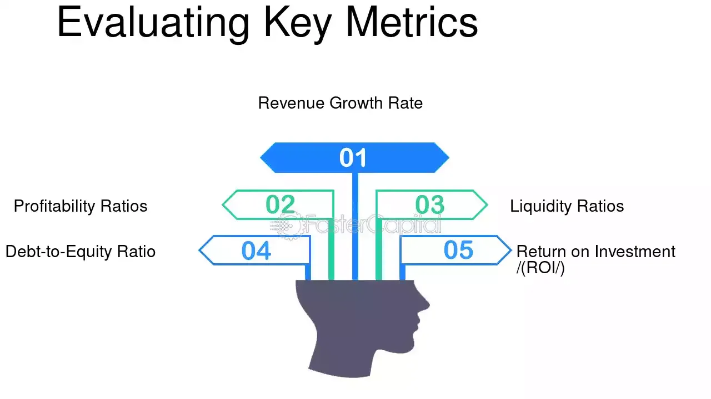

## Table of Contents

## What is a financial growth rate?

A financial growth rate is a way to measure how much a company's money or earnings are increasing over time. It's like looking at how much taller a child gets each year, but instead of height, we're looking at money. People use this number to see if a company is doing well or not. If the growth rate is high, it means the company is making more money than before, which is good. If it's low or negative, it might mean the company is not doing as well.

To find the growth rate, you usually take the difference between the new amount of money and the old amount, then divide that by the old amount. After that, you multiply by 100 to get a percentage. For example, if a company made $100 last year and $110 this year, the growth rate would be (($110 - $100) / $100) * 100 = 10%. This simple calculation helps people understand how fast a company is growing financially.

## Why are growth rates important for evaluating company prospects?

Growth rates are important for evaluating company prospects because they show how well a company is doing over time. If a company's growth rate is high, it means the company is making more money than before. This can be a good sign that the company is successful and might keep doing well in the future. Investors and business people look at growth rates to decide if they want to put their money into a company or not. A high growth rate can make a company look like a good choice for investment.

On the other hand, if a company's growth rate is low or negative, it might mean the company is not doing as well. This could be a warning sign that the company might have problems or might not do well in the future. By looking at growth rates, people can get an idea of whether a company is likely to be successful or if it might struggle. This helps them make smarter decisions about where to put their money or how to plan for the future.

## What is the difference between revenue growth and profit growth?

Revenue growth is about how much more money a company makes from selling its products or services compared to before. It's like counting all the money that comes in the door without worrying about the costs. If a company's revenue grows, it means more people are buying what the company sells, which is good. But just because revenue is growing doesn't mean the company is making more profit.

Profit growth, on the other hand, looks at how much more money a company keeps after paying for all its costs. This is what's left over after paying for things like making the product, paying employees, and other expenses. Profit growth is important because it shows if a company is actually making more money overall, not just bringing in more revenue. A company can have growing revenue but shrinking profits if its costs are going up faster than its sales.

## How do you calculate the year-over-year growth rate?

To calculate the year-over-year growth rate, you need to compare the value from this year to the value from last year. First, subtract the value from last year from the value this year. Then, divide that difference by the value from last year. Finally, multiply the result by 100 to turn it into a percentage. For example, if a company made $100 last year and $110 this year, you would do (($110 - $100) / $100) * 100 = 10%. This tells you the company grew by 10% from last year to this year.

The year-over-year growth rate is useful because it shows how much something has changed in just one year. It's a quick way to see if a company is doing better or worse than it was before. If the growth rate is positive, it means the company is growing. If it's negative, it means the company is shrinking. This simple calculation helps people understand how well a company is doing over time.

## What is the compound annual growth rate (CAGR) and how is it used?

The compound annual growth rate (CAGR) is a way to find out how much something grows each year over a few years. It's like looking at the average growth rate over time. To find the CAGR, you need to know the starting value, the ending value, and how many years it took to go from the start to the end. You use a special math formula that takes these numbers and gives you a single percentage that shows the average growth each year.

CAGR is used by people who want to understand how well a company or investment is doing over time. It's helpful because it smooths out the ups and downs that can happen from year to year. For example, if a company's value goes up and down a lot, the CAGR will show you the average growth, which can be easier to understand. Investors use CAGR to compare different investments or to see if a company is growing at a good pace over several years.

## Can you explain the significance of the earnings growth rate?

The earnings growth rate tells us how much a company's profits are growing over time. It's like checking how much more money a company is making now compared to before. This rate is important because it shows if a company is getting better at making money. If the earnings growth rate is high, it means the company is doing well and making more profit than it used to. This can make the company look like a good place for people to invest their money.

On the other hand, if the earnings growth rate is low or negative, it might mean the company is not doing as well. It could be a sign that the company is having trouble making money or that its costs are going up too fast. People who want to invest or do business with the company look at the earnings growth rate to decide if it's a good choice. A company with a strong earnings growth rate is often seen as a safer and more promising investment.

## How does the growth rate of a company compare to industry standards?

When we look at how fast a company is growing, it's helpful to compare its growth rate to the average growth rate of other companies in the same industry. This helps us see if the company is doing better or worse than its competitors. For example, if a company's growth rate is 10% and the industry average is 5%, the company is doing better than most other companies in its field. But if the company's growth rate is only 2% while the industry average is 8%, it might be falling behind.

Comparing a company's growth rate to industry standards can tell us a lot about its future. If a company is growing faster than the industry average, it might mean the company is doing something special or has a good strategy. This can make it a more attractive choice for investors. On the other hand, if a company's growth rate is lower than the industry average, it might be a sign that the company is struggling or not keeping up with changes in the market. This information helps people make better decisions about where to put their money or how to plan for the future.

## What role does the growth rate play in stock valuation models?

The growth rate is really important when people try to figure out how much a company's stock is worth. They use special math models to guess what the stock will be worth in the future. One popular model is called the Discounted Cash Flow (DCF) model. In this model, the growth rate helps people predict how much money the company will make in the future. If a company is growing fast, people might think its stock will be worth more money later. But if the growth rate is slow or going down, they might think the stock won't be worth as much.

Another model that uses growth rate is the Dividend Discount Model (DDM). This model looks at how much money a company pays to its shareholders as dividends. The growth rate helps people guess how much those dividends will grow over time. If the growth rate is high, people might think the dividends will get bigger, making the stock more valuable. But if the growth rate is low, they might think the dividends won't grow much, which could make the stock less valuable. Both models show how important the growth rate is when deciding how much a stock is worth.

## How can growth rates be misleading, and what are the common pitfalls?

Growth rates can be misleading because they only show part of the story. They tell you how much something has grown, but they don't explain why it grew or if it's a good thing. For example, a company might have a high growth rate because it started from a very small base. If a company went from making $1 to $2, that's a 100% growth rate, but it's still not a lot of money. Also, growth rates can hide problems like rising costs or debts that might make the company less healthy even though it's growing.

Another common pitfall is that growth rates can be affected by short-term events that don't last. For instance, a company might have a high growth rate one year because it got a big one-time order, but that doesn't mean it will keep growing at that rate. People can also manipulate growth rates by changing how they report their numbers, making the company look better than it really is. It's important to look at other information, like profit margins and debt levels, to get a full picture of how well a company is doing.

## What advanced metrics combine growth rates with other financial indicators?

One advanced metric that combines growth rates with other financial indicators is the PEG ratio, or Price/Earnings to Growth ratio. This metric takes the company's price-to-earnings (P/E) ratio and divides it by its expected earnings growth rate. The P/E ratio shows how much investors are willing to pay for each dollar of earnings, and the growth rate shows how fast those earnings are growing. By putting these two together, the PEG ratio helps investors see if a stock is a good value compared to its growth. A lower PEG ratio might mean the stock is undervalued, while a higher PEG ratio might mean it's overvalued.

Another useful metric is the Return on Invested Capital (ROIC) combined with growth rates. ROIC measures how well a company is using the money it has to make more money. It looks at the profit a company makes compared to the total capital it has invested. When you look at ROIC along with the company's growth rate, you get a better idea of how efficiently the company is growing. A high ROIC with a strong growth rate can show that a company is not only expanding but doing so in a smart and profitable way. This can be a sign of a healthy and promising company.

## How do macroeconomic factors influence a company's growth rates?

Macroeconomic factors are big things that affect the whole economy, and they can really change how fast a company grows. Things like interest rates, inflation, and how much people are spending can make a big difference. For example, if interest rates go up, it can be harder for a company to borrow money to grow. If inflation is high, the cost of making things can go up, which might slow down a company's growth. And if people are not spending as much money, a company might sell less and grow slower.

But it's not just about the bad stuff. Good macroeconomic conditions can help a company grow faster. If the economy is doing well and people are spending more money, a company can sell more and grow quicker. Lower interest rates can make it easier for a company to borrow money and invest in new projects. And if the government makes rules that help businesses, like tax cuts or subsidies, it can also boost a company's growth rate. So, understanding the big picture of the economy is important for figuring out how a company might grow.

## What are the best practices for forecasting future growth rates based on historical data?

To forecast future growth rates using historical data, it's important to look at a long period of time. This helps you see trends and patterns that can guide your predictions. Start by collecting data on the company's past growth rates, like revenue growth or earnings growth, over several years. Then, use this data to calculate the average growth rate over time. This average can give you a good starting point for your forecast. But remember, just using the average isn't enough. You should also think about any big changes that happened during those years, like new products or big events in the economy, because these can affect how the company grows.

After you have a basic forecast based on the average growth rate, you need to adjust it for things that might change in the future. Look at what's happening in the economy, like interest rates or inflation, and how these might affect the company. Also, consider any new plans the company has, like expanding into new markets or launching new products. These can make the company grow faster or slower than it did in the past. By combining the historical data with your understanding of future conditions, you can make a more accurate forecast of the company's growth rate.

## What are the key aspects of understanding financial growth metrics?

Financial growth metrics are vital tools for evaluating a company's current performance and forecasting its future prospects. These metrics provide insights into how effectively a company is managing its resources to generate profits and expand its market presence.

### Revenue Growth
Revenue growth is a primary indicator of a company's success in increasing sales over a specific period. This metric shows the percentage increase in sales from one period to the next and can reflect the company's ability to capture a larger market share or introduce successful new products. The formula for calculating revenue growth rate is:

$$
\text{Revenue Growth Rate} = \left( \frac{\text{Current Period Revenue} - \text{Previous Period Revenue}}{\text{Previous Period Revenue}} \right) \times 100
$$

### Earnings Growth
Earnings growth focuses on a company's profitability by measuring the increase in net income over a given timeframe. Consistent earnings growth often signals a healthy company capable of maintaining profitability even in fluctuating market conditions. The calculation for earnings growth is similar to revenue growth, substituting net income in place of revenue.

### Price-to-Earnings (P/E) Ratio
The P/E ratio is a valuation metric that compares a company's current share price to its per-share earnings. It helps investors understand how much they are paying for each dollar of earnings. A high P/E ratio may suggest that investors expect high growth in the future, while a low P/E could indicate an undervalued stock. The formula for the P/E ratio is:

$$
\text{P/E Ratio} = \frac{\text{Market Value per Share}}{\text{Earnings per Share (EPS)}}
$$

### Price-to-Earnings-to-Growth (PEG) Ratio
The PEG ratio extends the P/E ratio by incorporating the company's expected earnings growth, providing a more comprehensive view of its valuation. A PEG ratio of 1 suggests that the company's market value is in line with its earnings growth rate, while a ratio below 1 could imply undervaluation. The PEG is calculated as:

$$
\text{PEG Ratio} = \frac{\text{P/E Ratio}}{\text{Annual EPS Growth}}
$$

### Return on Equity (ROE)
ROE measures a company's ability to generate profits from its shareholders' equity. It is an indicator of financial efficiency and is calculated by dividing net income by shareholders' equity. A higher ROE indicates that a company is using its equity base efficiently to produce profits:

$$
\text{ROE} = \frac{\text{Net Income}}{\text{Shareholders' Equity}}
$$

Understanding these financial growth metrics can significantly aid investors in determining whether a company is undervalued or has the potential for growth, facilitating informed and strategic investment decisions. By analyzing these indicators, investors can identify potential opportunities and assess the overall health and future prospects of a company.

## What is the Role of Growth Rates in Investment Strategy?

Growth rates serve as fundamental indicators for assessing a company's potential for expansion and profitability. Investors keen on maximizing returns often scrutinize historical growth rates to forecast future performance, leveraging these insights to make calculated investment decisions. 

A high growth rate is often a hallmark of a strong, competitive, and innovative business model. For instance, companies with a track record of robust revenue and earnings growth may be gaining market share, pioneering new products, or efficiently scaling operations. These characteristics suggest resilience and the potential for continued success, making such companies attractive to growth-oriented investors.

Investment strategies that prioritize growth rates often focus on identifying undervalued stocks that are poised for growth. This involves a detailed analysis of a company's growth trajectory compared to its valuation metrics. For example, if a company's earnings growth rate significantly exceeds its price-to-earnings ratio (a scenario often scrutinized using the PEG ratio), the company may be considered undervalued with strong growth prospects.

To illustrate, consider the PEG ratio, which provides a more nuanced view than the P/E ratio alone:

$$
\text{PEG} = \frac{\text{P/E}}{\text{Earnings Growth Rate}}
$$

A PEG ratio less than 1 may indicate that the stock is undervalued, given its earnings growth potential. By integrating growth rates with other financial indicators such as the P/E ratio, investors can discern more about a company's real value and prospects for future growth.

Balancing growth metrics with other financial indicators is crucial for optimizing an investment portfolio. While growth rates provide insights into potential future performance, they should be considered alongside other financial health indicators, such as debt levels, cash flows, and return on equity. By taking a holistic view, investors can construct a portfolio that mitigates risks and maximizes potential returns.

This equilibrium between growth rates and other financial metrics aids in constructing a diversified portfolio that aligns with an investor’s risk tolerance and return expectations. As markets continue to evolve, maintaining this balance becomes integral in adapting to changes and seizing opportunities in the dynamic investment landscape.

## References & Further Reading

[1]: Bergstra, J., Bardenet, R., Bengio, Y., & Kégl, B. (2011). ["Algorithms for Hyper-Parameter Optimization."](https://dl.acm.org/doi/10.5555/2986459.2986743) Advances in Neural Information Processing Systems 24.

[2]: ["Advances in Financial Machine Learning"](https://www.amazon.com/Advances-Financial-Machine-Learning-Marcos/dp/1119482089) by Marcos Lopez de Prado

[3]: ["Evidence-Based Technical Analysis: Applying the Scientific Method and Statistical Inference to Trading Signals"](https://www.amazon.com/Evidence-Based-Technical-Analysis-Scientific-Statistical/dp/0470008741) by David Aronson

[4]: ["Machine Learning for Algorithmic Trading"](https://github.com/stefan-jansen/machine-learning-for-trading) by Stefan Jansen

[5]: ["Quantitative Trading: How to Build Your Own Algorithmic Trading Business"](https://www.amazon.com/Quantitative-Trading-Build-Algorithmic-Business/dp/1119800064) by Ernest P. Chan