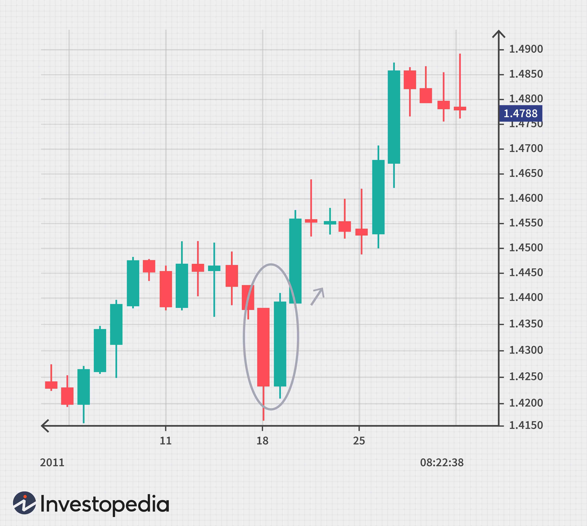

## Table of Contents

## What are Forex chart patterns and why are they important for traders?

Forex chart patterns are shapes or formations that appear on price charts of currency pairs. These patterns help traders predict where the price might go next. They are like clues that tell traders when to buy or sell. Some common patterns include triangles, heads and shoulders, and double tops or bottoms. Traders look at these patterns to understand what other traders are thinking and doing.

These patterns are important because they help traders make better decisions. By recognizing these patterns, traders can guess if the price will go up or down. This can help them make money or avoid losing money. For example, if a trader sees a pattern that usually means the price will go up, they might decide to buy the currency. Using chart patterns can give traders an edge in the busy and fast-moving forex market.

## How can beginners identify basic Forex chart patterns?

To start identifying basic Forex chart patterns, beginners should first learn to recognize the most common ones. Some of the simplest patterns to spot are the head and shoulders, double tops and bottoms, and triangles. The head and shoulders pattern looks like three peaks, with the middle peak (the head) being the highest and the two side peaks (the shoulders) being lower. Double tops and bottoms are patterns where the price reaches a high point twice (double top) or a low point twice (double bottom) before reversing direction. Triangles form when the price moves between two converging trendlines and can be ascending, descending, or symmetrical.

Once you know what these patterns look like, practice spotting them on a price chart. Many trading platforms offer tools that let you draw lines on the chart to help identify these patterns. For example, to find a head and shoulders pattern, draw a line connecting the lows of the two shoulders. This line is called the neckline. If the price breaks below this neckline after forming the second shoulder, it might be a good time to sell. For triangles, draw lines along the highs and lows of the price action. If the price breaks out of the triangle, it could signal a strong move in that direction. The more you practice, the better you'll get at recognizing these patterns and using them to make trading decisions.

## What is a Head and Shoulders pattern and how does it predict market trends?

The Head and Shoulders pattern is a chart pattern that looks like a head with two shoulders. It shows up on a price chart when the price goes up to a high point, drops down, goes up again to an even higher point (the head), drops down again, and then goes up one last time to a high point that's not as high as the head (the second shoulder). After the second shoulder, the price usually drops below a line called the neckline, which is drawn by connecting the lowest points after the first and second shoulders. When the price breaks this neckline, it's a signal that the price might keep going down.

This pattern helps traders predict that the market trend might be changing from going up to going down. When traders see a Head and Shoulders pattern, they think that the price has been trying to go higher but couldn't keep it up. The failure to reach a new high after the head shows that buyers are losing strength, and sellers are starting to take over. So, when the price breaks the neckline, traders often decide to sell, expecting the price to fall more. This pattern is useful because it gives traders a clear sign of when to get out of a trade before the price drops too much.

## Can you explain the Double Top and Double Bottom patterns and their significance?

A Double Top pattern looks like the letter 'M' on a price chart. It happens when the price goes up to a high point, drops down, then goes up again to about the same high point before falling again. The two high points are the 'tops'. When the price falls below the low point between the two tops, called the neckline, it's a signal that the price might keep going down. Traders use this pattern to guess that the price might stop going up and start going down instead. Seeing a Double Top can tell traders that it's time to sell their currency because the price might drop soon.

A Double Bottom pattern looks like the letter 'W' on a price chart. It happens when the price goes down to a low point, goes up, then goes down again to about the same low point before going up again. The two low points are the 'bottoms'. When the price goes above the high point between the two bottoms, which is also called the neckline, it's a signal that the price might keep going up. Traders use this pattern to guess that the price might stop going down and start going up instead. Seeing a Double Bottom can tell traders that it's a good time to buy the currency because the price might rise soon.

Both patterns are important because they help traders see when the market might be changing direction. They give traders a clear sign of when to buy or sell, helping them make better decisions and possibly make more money or lose less money. By recognizing these patterns, traders can get ready for the next move in the market.

## What are the key characteristics of a Rising Wedge and a Falling Wedge pattern?

A Rising Wedge pattern looks like two lines that are getting closer together as they go up. The top line is the resistance, and the bottom line is the support. Both lines slope up, but the price is making higher highs and higher lows that are getting closer and closer. This pattern usually means that the price might start going down soon. Traders see a Rising Wedge as a sign that even though the price is going up, it's getting harder and harder to keep going up, and sellers might start taking over.

A Falling Wedge pattern looks like two lines that are getting closer together as they go down. The top line is the resistance, and the bottom line is the support. Both lines slope down, but the price is making lower highs and lower lows that are getting closer and closer. This pattern usually means that the price might start going up soon. Traders see a Falling Wedge as a sign that even though the price is going down, it's getting harder and harder to keep going down, and buyers might start taking over.

## How does the Triangle pattern (Symmetrical, Ascending, Descending) indicate potential breakouts?

A Symmetrical Triangle pattern looks like two lines that are getting closer together as they go sideways on the chart. One line goes up a bit and the other line goes down a bit. This pattern means the price is getting squeezed and might break out soon. Traders watch to see if the price breaks out above the top line or below the bottom line. If it breaks above, they might buy, thinking the price will keep going up. If it breaks below, they might sell, thinking the price will keep going down.

An Ascending Triangle has a flat top line and a bottom line that goes up a bit. This pattern shows that buyers are getting stronger because the price keeps making higher lows. Traders expect the price to break out above the top line soon. When it does, they might buy, hoping the price will go up more. A Descending Triangle is the opposite, with a flat bottom line and a top line that goes down a bit. This pattern shows that sellers are getting stronger because the price keeps making lower highs. Traders expect the price to break out below the bottom line soon. When it does, they might sell, hoping the price will go down more.

## What is a Flag and Pennant pattern and how are they used in short-term trading strategies?

A Flag pattern looks like a small rectangle on a chart, and a Pennant pattern looks like a small triangle. Both patterns happen after the price goes up or down a lot quickly, which is called the flagpole. The Flag pattern forms when the price moves in a tight range after the flagpole, making the rectangle shape. The Pennant pattern forms when the price moves in a way that makes the lines of the triangle come together, after the flagpole. These patterns show that the price might keep going in the same direction as the flagpole after the pattern is done.

Traders use these patterns in short-term trading to guess when the price will move a lot. When they see a Flag or Pennant pattern, they wait for the price to break out of the pattern in the same direction as the flagpole. If the flagpole went up, they might buy when the price breaks above the Flag or Pennant, expecting it to go up more. If the flagpole went down, they might sell when the price breaks below the Flag or Pennant, expecting it to go down more. This helps traders make quick decisions and possibly make money from short-term price moves.

## How do advanced traders use the Cup and Handle pattern to forecast price movements?

Advanced traders use the Cup and Handle pattern to forecast when a price might go up a lot. This pattern looks like a cup with a handle on the side. The cup part happens when the price goes down and then comes back up to about the same place it started. The handle part is a small dip after the cup. Traders watch for the price to break above the top of the handle. When it does, they think the price will keep going up, so they might buy the currency.

Traders also use the Cup and Handle pattern to guess how much the price might go up. They measure the distance from the bottom of the cup to the top of the cup. Then, they add that distance to the point where the price breaks above the handle. This gives them a target price. By using this pattern, advanced traders can make smart guesses about when to buy and how much the price might go up, helping them plan their trades better.

## What is the importance of the Rounding Bottom pattern in long-term investment strategies?

The Rounding Bottom pattern is important for long-term investment strategies because it shows that the price of a currency is slowly changing from going down to going up. This pattern looks like a big, smooth 'U' shape on a chart. It takes a long time to form, sometimes months or even years. When traders see this pattern, they think that the price has been going down for a while but is now starting to go up. This can be a good sign for long-term investors because it means the currency might keep going up for a long time.

Traders use the Rounding Bottom pattern to decide when to buy a currency for the long term. They wait for the price to break above the top of the 'U' shape. When it does, they think it's a good time to buy because the price is likely to keep going up. By recognizing this pattern, long-term investors can make better decisions about when to get into a trade and hold onto it for a while, hoping to make money as the price rises over time.

## Can you describe the use of the Three Drives pattern in technical analysis?

The Three Drives pattern is a chart pattern that traders use to guess where the price might go next. It looks like three big moves, called drives, that go in the same direction. Each drive is followed by a smaller move, called a correction, that goes the other way. The pattern can happen when the price is going up or down. When traders see this pattern, they think the third drive might be the last big move before the price changes direction. They use the end of the third drive to guess where the price might stop going that way and start going the other way.

Traders use the Three Drives pattern to make decisions about when to buy or sell. If the pattern is going up, traders might wait for the price to finish the third drive and then start going down. When they see the price start to go down, they might sell, hoping to make money as the price falls. If the pattern is going down, traders might wait for the price to finish the third drive and then start going up. When they see the price start to go up, they might buy, hoping to make money as the price rises. By understanding this pattern, traders can better predict when the price might change direction and plan their trades accordingly.

## How can expert traders combine multiple chart patterns for more accurate predictions?

Expert traders often combine multiple chart patterns to make more accurate predictions about where the price might go next. They look at different patterns on the same chart to see if they all point to the same thing. For example, if they see a Head and Shoulders pattern and a Double Top at the same time, it might mean that the price is really going to go down soon. By using more than one pattern, traders can feel more sure about their guesses. It's like getting more clues to solve a puzzle, which can help them make better trading decisions.

Sometimes, traders also use different time frames to spot patterns. They might look at a daily chart and see a Rounding Bottom, which takes a long time to form, and then check a shorter time frame, like an hourly chart, to see if a smaller pattern like a Flag or Pennant is forming. If both patterns suggest the price will go up, it can give traders a stronger signal to buy. Combining patterns from different time frames helps traders see the big picture and the smaller details, making their predictions more accurate and helping them plan their trades better.

## What are some common pitfalls and mistakes to avoid when using Forex chart patterns?

One common mistake traders make when using Forex chart patterns is relying too much on just one pattern. They might see a Head and Shoulders and think the price will go down for sure, but they forget to look at other things like the overall trend or other patterns that might be happening at the same time. It's important to use more than one pattern and check other signs on the chart to make a better guess about where the price might go.

Another pitfall is not waiting for the right time to act. Some traders jump into a trade too soon, before the pattern is fully formed or before the price breaks out of the pattern. For example, they might see a Double Top and start selling right away, but if the price doesn't break the neckline, they could lose money. It's better to wait for the pattern to finish and for the price to confirm the [breakout](/wiki/breakout-trading) before making a trade. This helps traders avoid making quick decisions that might not be right.

## References & Further Reading

[1]: Bergstra, J., Bardenet, R., Bengio, Y., & Kégl, B. (2011). ["Algorithms for Hyper-Parameter Optimization."](https://papers.nips.cc/paper/4443-algorithms-for-hyper-parameter-optimization) Advances in Neural Information Processing Systems 24.

[2]: ["Advances in Financial Machine Learning"](https://www.amazon.com/Advances-Financial-Machine-Learning-Marcos/dp/1119482089) by Marcos Lopez de Prado

[3]: ["Evidence-Based Technical Analysis: Applying the Scientific Method and Statistical Inference to Trading Signals"](https://www.amazon.com/Evidence-Based-Technical-Analysis-Scientific-Statistical/dp/0470008741) by David Aronson

[4]: ["Machine Learning for Algorithmic Trading"](https://github.com/stefan-jansen/machine-learning-for-trading) by Stefan Jansen

[5]: ["Quantitative Trading: How to Build Your Own Algorithmic Trading Business"](https://books.google.com/books/about/Quantitative_Trading.html?id=j70yEAAAQBAJ) by Ernest P. Chan