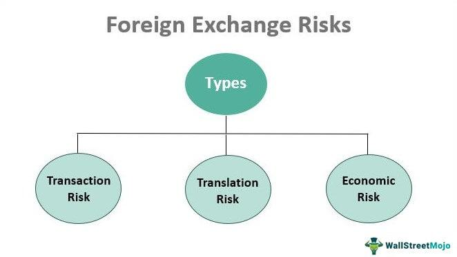

The foreign exchange (forex) market stands as the largest and most liquid financial arena globally, catering to a myriad of traders ranging from individual retail investors to large financial institutions. With daily trading volumes surpassing $6 trillion, it surpasses all other financial markets in terms of size and scope. The forex market operates around the clock across various time zones, driven by factors such as economic indicators, international trade flows, and geopolitical events. 

The proliferation of technology has given rise to algorithmic trading (algo trading), a transformative force in the financial markets, including forex. By employing sophisticated computer algorithms to execute trades based on predetermined criteria, algo trading introduces both opportunities and challenges for market participants. It enhances the efficiency and speed of trade execution while minimizing human error, allowing traders to process large volumes of data and identify trends that may elude human perception. 



However, the forex market's inherent volatility and the complexity of developing robust algorithms present significant risks. Understanding these trading risks is vital for anyone considering entering this market. Key risks include market fluctuations, leverage effects, and potential technical failures in algorithmic systems. 

This article aims to dissect these risks, providing traders with the knowledge needed to navigate the complexities of forex and algo trading. Whether a novice or seasoned investor, recognizing and managing these risks are fundamental to achieving success. As trading environments evolve, the ability to adapt and implement effective risk management strategies becomes a decisive factor in safeguarding investments and capitalizing on market opportunities.

## Table of Contents

## Understanding the Forex Market

The foreign exchange market, commonly known as the forex market, operates continuously, five days a week, from Monday to Friday. This uninterrupted trading schedule is made possible by the global network of financial institutions, brokers, and individual traders located across different time zones. The decentralized nature of the forex market allows it to function without a central exchange, enabling it to remain open 24 hours a day.

The primary activity within the forex market involves the trading of currency pairs. Each pair denotes the exchange rate between two currencies, such as the EUR/USD (Euro/US Dollar) or GBP/JPY (British Pound/Japanese Yen). These pairs are categorized into major, minor, and exotic pairs, depending on their trading [volume](/wiki/volume-trading-strategy) and the stability of the involved currencies. Major pairs, for instance, include currencies from highly developed economies and are traded more frequently.

Forex trading is inherently volatile, primarily due to the numerous factors influencing currency valuations. Economic indicators such as GDP growth rates, employment figures, and inflation reports are critical factors that investors scrutinize to make informed decisions. Geopolitical events, including elections, political instability, and international conflicts, also play a significant role in shaping market sentiment and, consequently, currency fluctuations.

Leverage is a prominent feature in [forex](/wiki/forex-system) trading, functioning as a double-edged sword. It allows traders to control substantial positions with a relatively small amount of capital. The leverage ratio can vary, enabling amplification of both potential profits and potential losses. For example, a 100:1 leverage ratio means that for every dollar of capital, a trader can control $100 in the market. While this can significantly increase returns on successful trades, it also heightens the risk of substantial losses in adverse market conditions.

With these complexities in play, understanding market dynamics is vital for traders. This involves analyzing the interplay of macroeconomic indicators, geopolitical events, and market sentiment. Technical analysis, which uses historical price charts and patterns, is often employed to predict future movements. Traders must also be aware of news releases and economic announcements, as these can cause rapid changes in market conditions.

To succeed in forex trading, one must develop a keen understanding of these dynamics and equip themselves with the tools and knowledge necessary to navigate the market effectively. Being well-informed allows traders to identify trends, adjust strategies accordingly, and capitalize on the opportunities while minimizing potential risks associated with currency trading.

 to Algo Trading

Algorithmic trading, commonly known as algo trading, refers to the use of computer programs to execute trades at speeds and frequencies that are impossible for human traders to achieve. This method involves creating algorithms, which are essentially a set of rules and conditions to conduct trades, allowing for automated decision-making in trading activities.

One of the key advantages of algo trading is its ability to enhance trading efficiency and execution speed. Algorithms can process vast amounts of data and execute orders at high speeds, significantly reducing the time it takes to react to market changes. This enables traders to capitalize on short-term opportunities in the forex market, where currency values can fluctuate rapidly.

Moreover, algo trading minimizes human error, which is often inevitable in manual trading. By automating trade execution based on pre-defined criteria, [algorithmic trading](/wiki/algorithmic-trading) removes the emotional aspect of trading decisions that can lead to mistakes.

Algo trading also allows for processing large volumes of data and identifying patterns not easily discernible to human traders. Advanced algorithms can analyze various types of data, including historical prices, economic indicators, and technical analysis metrics, to generate trading signals. Machine learning techniques and [artificial intelligence](/wiki/ai-artificial-intelligence) can further enhance these algorithms by enabling them to learn and adapt from past data.

Despite its advantages, developing effective trading algorithms poses significant challenges. The complexity involved in creating, testing, and optimizing algorithms can be a barrier, particularly for individual traders with limited resources. Successful deployment of algo trading strategies requires a deep understanding of both market dynamics and programming skills.

To effectively leverage algo trading in the forex market, traders must understand how algorithms function. This involves comprehending the logic behind trading rules, as well as being able to evaluate algorithm performance using metrics such as Sharpe ratio, drawdown, and profitability. By doing so, traders can not only optimize their strategies but also anticipate and manage the risks associated with automated trading.

## Common Trading Risks in the Forex Market

The forex market, known for its high [liquidity](/wiki/liquidity-risk-premium) and accessibility, presents a range of risks that traders must recognize and manage effectively. These risks, inherent to the nature of currency trading, can significantly impact investment outcomes.

**Market Risk** involves the potential for losses due to adverse movements in currency exchange rates. Since the forex market is influenced by multiple factors, such as economic indicators, political events, and market sentiment, abrupt changes in exchange rates are frequent. Traders need to anticipate how these variables can shift and impact investment positions.

**Leverage Risk** is particularly pronounced in the forex market, where traders can control large positions with relatively small amounts of money, known as margin. While leverage can amplify returns, it also magnifies potential losses. For instance, with a leverage ratio of 100:1, a 1% adverse move in the currency pair can result in a 100% loss of the invested capital. Thus, understanding and using leverage judiciously is crucial.

**Interest Rate Risk** arises from fluctuations in interest rates that can significantly affect currency values. Central banks' monetary policies, such as changes in interest rates, can lead to large movements in currency pairs. A higher interest rate in a country typically strengthens its currency due to increased foreign investment seeking higher returns, while a decrease may weaken it. Consequently, traders must monitor interest rate trends and central bank announcements closely.

**Counterparty Risk** pertains to the possibility of the other party in a forex transaction defaulting on its obligations. This risk is inherent in financial transactions and can be more pronounced in forex due to the lack of a centralized exchange. Traders usually rely on brokers to facilitate trades, making it vital to choose reputable brokers who can fulfill their commitments.

**Country Risk** encompasses the economic and political instability in a country that can affect the strength of its currency. Situations such as political upheaval, changes in government, or economic crises can lead to significant currency depreciation. For instance, traders holding positions in a currency affected by sudden political instability may experience sharp declines in value.

Overall, traders in the forex market should employ a disciplined approach to risk management, utilizing tools such as stop-loss orders and hedging strategies to minimize potential losses. Moreover, continuously staying informed about global economic indicators and geopolitical events can aid in anticipating market movements, thus mitigating risks associated with forex trading.

## Risks Associated with Algo Trading in Forex

Algorithmic trading, or algo trading, introduces several unique risks in the forex market that traders must be aware of and manage adeptly. These risks arise primarily from the reliance on technology, market conditions, data, and the underlying algorithms themselves.

**Technical Failures**: Algo trading relies heavily on technology infrastructure, including hardware and software. Any failure in these components can cause significant disruptions in trading. For instance, glitches or system crashes can lead to unexecuted trades or executing orders incorrectly. Ensuring redundancy and robust IT solutions is crucial to mitigating this risk. Regular maintenance and updates of technological infrastructure can help prevent such failures.

**Market Liquidity Risk**: Algo strategies are particularly sensitive to market liquidity, as they often rely on executing large volumes of trades precisely and quickly. In environments with low liquidity, executing large trades may not be possible without significantly impacting the price, leading to increased slippage and potential losses. This risk can be somewhat mitigated by designing algorithms that adapt to varying liquidity conditions and incorporating liquidity constraints in trading strategies.

**Execution Risk**: Execution risk occurs when there are errors in the trade execution process. These errors can result from incorrect programming, unforeseen market conditions, or latency issues. For instance, an algorithm might incorrectly interpret market signals or react too slowly, leading to unfavorable trading outcomes. To manage execution risk, rigorous testing and validation of algorithms before deployment are essential. Using high-quality, low-latency data feeds and minimizing network latency further reduces this risk.

```python
# Example of a simple execution strategy check
def execute_trade(price, signal):
    try:
        if signal == "buy" and price <= max_buy_price:
            place_order("buy", price)
        elif signal == "sell" and price >= min_sell_price:
            place_order("sell", price)
    except Exception as e:
        log_error("Execution error: "+str(e))

max_buy_price = 1.3000
min_sell_price = 1.3000

execute_trade(current_price, trading_signal)
```

**Data Accuracy**: Algo trading's success heavily depends on the accuracy of the input data. Inaccurate or corrupted data can lead to erroneous trading decisions. Ensuring data quality through thorough validation processes and using reputable data providers can limit the impact of data inaccuracies. Additionally, incorporating redundancy and cross-verifying data sources can enhance data reliability.

**Model Risk**: Model risk involves the possibility that a trading model is either inherently flawed or becomes ineffective due to evolving market conditions. Models based on historical data may not predict future market movements accurately, particularly in changing environments. Regularly backtesting and adjusting models to reflect current market conditions can mitigate this risk. Incorporating machine learning approaches that dynamically update model parameters might offer more robust solutions. 

Understanding and managing the risks associated with algo trading in forex requires a mix of technological acumen and strategic foresight. By addressing these challenges effectively, traders can capitalize on the efficiency and potential profitability offered by algorithmic trading.

## Mitigating Trading Risks

Mitigating trading risks is essential for success in the forex market, particularly when utilizing algorithmic trading strategies. Effective risk management strategies such as implementing stop-loss orders and proper position sizing can significantly reduce potential losses. A stop-loss order automatically triggers a sale when a currency pair falls to a specified price, thereby limiting losses. Similarly, properly sizing trading positions ensures that traders do not overextend themselves, accounting for factors such as account balance and risk tolerance.

Diversification can further mitigate risks by spreading investments across different currency pairs and employing various trading strategies. This approach reduces the impact of adverse price movements in any single currency or strategy, enhancing the stability of traders' portfolios.

Continuous learning and adaptation are crucial for navigating the rapidly changing forex market. Keeping abreast of market developments through analysis of economic indicators, geopolitical events, and technological innovations enables traders to refine their strategies and respond proactively to changes.

Backtesting trading strategies in simulated environments is another prudent practice. By testing how a strategy performs using historical data, traders can identify potential pitfalls and optimize their algorithms before deploying them in live markets. This process often involves writing Python scripts to parse historical data, execute trades according to the algorithm, and evaluate performance metrics.

```python
import pandas as pd

# Load historical data
data = pd.read_csv('historical_forex_data.csv')

# Simulate trade execution
def backtest_strategy(data, strategy):
    balance = 10000  # initial balance in USD
    for index, row in data.iterrows():
        signal = strategy(row)
        # Execute trade based on the signal
        if signal == 'buy':
            balance += row['price_change']  # hypothetical gain
        elif signal == 'sell':
            balance -= row['price_change']  # hypothetical loss
    return balance

# Define a simple trading strategy
def example_strategy(row):
    return 'buy' if row['indicator'] > threshold else 'sell'

# Run backtest
final_balance = backtest_strategy(data, example_strategy)
print(f"Final Balance: {final_balance}")
```

Utilizing robust trading platforms that offer comprehensive risk management tools is also vital. Reliable platforms provide traders with the capability to execute trades quickly and integrate various risk management features, including automated stop-loss and take-profit orders, ensuring that they can manage risks effectively and efficiently.

By adopting these practices, traders can enhance their ability to manage risks, safeguard investments, and ultimately achieve more consistent returns in the competitive world of forex and algorithmic trading.

## Conclusion

The forex market and algorithmic trading present significant opportunities for traders, but they come with inherent risks that must be thoughtfully managed. Successful forex traders recognize that a comprehensive understanding of these risks is essential for protecting their investments. This understanding encompasses the [volatility](/wiki/volatility-trading-strategies) of currency exchange rates, the leverage that can magnify potential losses, and the technical complexities associated with algorithmic trading systems.

Algorithmic trading offers undeniable technological benefits, such as improved trading efficiency and the ability to process vast datasets to identify trading opportunities. However, it also introduces unique challenges, such as the risk of technical failures and the need for continuous algorithm adjustment to remain effective in changing market conditions.

Traders can more safely navigate the complexities of forex trading by implementing effective risk management strategies. Techniques such as stop-loss orders, proper position sizing, and diversification reduce exposure to potential losses. Additionally, continuously updating and refining trading strategies based on current market information is crucial.

Ultimately, the key to success in forex trading lies in making informed decisions and adapting to the ever-evolving market landscape. By understanding and managing the risks associated with the forex market and algorithmic trading, traders can maximize opportunities while minimizing potential setbacks.

## References & Further Reading

[1]: ["Algorithms for Hyper-Parameter Optimization"](https://dl.acm.org/doi/10.5555/2986459.2986743) by Bergstra, J., Bardenet, R., Bengio, Y., & Kégl, B. Advances in Neural Information Processing Systems 24, 2011.

[2]: ["Advances in Financial Machine Learning"](https://www.amazon.com/Advances-Financial-Machine-Learning-Marcos/dp/1119482089) by Marcos Lopez de Prado, Wiley, 2018.

[3]: ["Evidence-Based Technical Analysis: Applying the Scientific Method and Statistical Inference to Trading Signals"](https://www.amazon.com/Evidence-Based-Technical-Analysis-Scientific-Statistical/dp/0470008741) by David Aronson, Wiley, 2006.

[4]: ["Machine Learning for Algorithmic Trading"](https://github.com/stefan-jansen/machine-learning-for-trading) by Stefan Jansen, Packt Publishing, 2020.

[5]: ["Quantitative Trading: How to Build Your Own Algorithmic Trading Business"](https://www.amazon.com/Quantitative-Trading-Build-Algorithmic-Business/dp/1119800064) by Ernest P. Chan, Wiley, 2008.