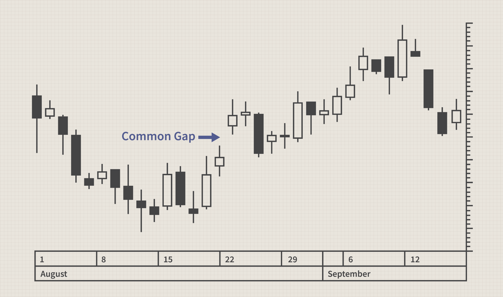

Algorithmic trading refers to the use of computer algorithms to automate and optimize trading decisions in financial markets. By employing mathematical models and leveraging computing power, algorithmic trading enables traders and institutions to execute orders at speeds and frequencies that are impossible to achieve manually. This form of trading has gained significant prominence in modern financial markets due to its ability to increase efficiency, reduce transaction costs, and minimize human errors. With the advent of high-frequency trading (HFT), algorithmic trading now constitutes a large percentage of total market transactions.

A significant aspect of some algorithmic trading strategies is the exploitation of "common gaps." Common gaps occur when there is a clear discontinuity or gap in the price chart of an asset, often driven by non-market hours trading, news events, or shifts in supply and demand. Unlike other gaps that may indicate strong market sentiments or breakout opportunities, common gaps typically fill within a short period as normal trading activity resumes. This characteristic makes them a target for specific algorithmic strategies aiming to capitalize on the short-term inefficiencies they present.



Function definition is crucial when developing robust trading algorithms, particularly those designed to exploit phenomena such as common gaps. Precise and well-structured functions allow for clear logic, making algorithms more adaptable and easier to test and refine. A well-defined function in development serves as a blueprint that dictates how an algorithm identifies a gap, decides on a trading entry, manages risks, and executes an exit strategy. These functions are essential in implementing systematic and replicable approaches to trading.

The exploration of function definition in the creation of trading algorithms harnessing the potential of common gaps is vital. By understanding how functions govern algorithm behavior, developers can create more effective and sophisticated trading systems that not only identify but also act on these pricing anomalies. This discussion sets the foundation for examining how precise function definitions shape successful algorithmic trading strategies, ultimately leading to improved financial performance and strategic advantages in dynamic and competitive financial markets.

## Table of Contents

## Understanding Algorithmic Trading

Algorithmic trading, also known as algo trading, involves using computer algorithms to automate the process of buying and selling financial instruments. This type of trading leverages mathematical models and pre-defined rules to execute trades at speeds and frequencies impossible for human traders. A significant aspect of algorithmic trading is its ability to process vast amounts of data quickly, identify patterns, and execute trading strategies with precision and efficiency.

Technology and automation play a crucial role in enhancing trading efficiency through algorithmic trading. High-frequency trading (HFT), a subset of algorithmic trading, relies heavily on state-of-the-art technology to place thousands of orders at lightning speeds, often executing trades within milliseconds. The technological infrastructure encompasses sophisticated hardware, high-speed internet connections, and powerful algorithms capable of analyzing market data in real-time. Automation eliminates human errors and emotional biases, thus ensuring consistency in trading strategies.

Algorithmic trading strategies are diverse, ranging from trend-following strategies to statistical [arbitrage](/wiki/arbitrage). Trend-following strategies attempt to exploit market [momentum](/wiki/momentum) by identifying and following the prevailing market trend. Mean reversion strategies, on the other hand, operate on the assumption that the price of a security will revert to its average price over time. Pair trading, a form of [statistical arbitrage](/wiki/statistical-arbitrage), seeks to exploit pricing inefficiencies between correlated stocks by taking a long position in the undervalued security and a short position in the overvalued one.

The use of algorithms extends to identifying market patterns, such as common gaps in price charts. Common gaps occur when there is a noticeable difference between the closing price of a security in one session and its opening price in the next session. These gaps can occur due to various factors, including earnings announcements or macroeconomic news. Algorithms can be developed to detect these gaps by analyzing historical price data and employing indicators such as moving averages or Bollinger Bands. By identifying common gaps, traders can devise strategies tailored to exploit the potential [volatility](/wiki/volatility-trading-strategies) and price action associated with these gaps.

In summary, [algorithmic trading](/wiki/algorithmic-trading) revolutionizes the way trades are executed by automating processes, reducing latency, and enhancing precision. Leveraging advanced technology, it optimizes trading strategies and responds dynamically to market conditions, making it an indispensable tool in modern financial markets.

## What Are Common Gaps?

Common gaps are price gaps that occur in the trading of financial instruments, often characterized by a discontinuity between the closing price of one trading session and the opening price of the next session. These gaps are typically not associated with any significant news or events that could directly impact the price of the asset. Unlike breakaway or runaway gaps, which are driven by new information or changing market dynamics, common gaps usually fill rather quickly and do not indicate a change in the underlying trend.

### Causes and Characteristics

Common gaps arise primarily due to normal market fluctuations and differences in supply and demand during less active trading periods. They can occur in any financial market, including equities, commodities, and [forex](/wiki/forex-system). Factors that may lead to common gaps include routine economic data releases, minor shifts in market sentiment, and adjustments in trading volumes. These gaps usually manifest in relatively stable market environments without external shocks.

Some key characteristics of common gaps include:
- **Size**: Common gaps are generally small and less significant relative to other types of gaps.
- **Frequency**: These gaps appear more regularly and are often part of day-to-day market price movements.
- **Temporality**: Common gaps are usually short-lived, filling quickly as trading resumes under normal conditions.

### Effects on Market Behavior and Trader Psychology

The transient nature of common gaps can influence both market behavior and trader psychology. Since these gaps frequently close, traders may use them as opportunities for short-term profits by anticipating the subsequent filling of the gap. The expectation of gap filling can lead to increased speculative activity, adding to market [liquidity](/wiki/liquidity-risk-premium) and potentially affecting price movements temporarily. For traders, recognizing these patterns can help in developing intraday strategies aimed at leveraging predictable price retracements.

### Indicators and Metrics

To effectively identify and analyze common gaps, traders and algorithm developers employ several technical indicators and metrics:

1. **Gap Size Measurement**: By measuring the price difference between the close of one session and the open of the next, traders can classify the gap. Smaller gap sizes typically indicate a common gap.

2. **Volume Analysis**: Common gaps are often accompanied by average or below-average trading volumes. Analyzing volume levels can help distinguish these gaps from those that are news-driven, which usually come with higher volumes.

3. **Candlestick Patterns**: Candlestick chart patterns can be used to spot gaps visually and assess the formation of common gaps relative to typical trading ranges.

4. **Historical Data Backtesting**: Employing historical data, traders backtest gap occurrences to validate their strategies, confirming whether gaps in similar market conditions have historically closed.

Understanding common gaps is crucial for developing efficient trading strategies, especially in algorithmic trading. By capitalizing on these predictable patterns, traders have the potential to enhance returns through systematic, data-driven approaches.

## The Role of Function Definition in Algo Trading

Function definition plays a pivotal role in algorithm development, serving as the blueprint for how algorithms process input data to generate output. In algorithmic trading, functions are the building blocks that translate trading strategies into executable code. They encapsulate specific tasks within the trading process, enabling modular and systematic construction of trading algorithms.

Clear function definitions are essential for effective algorithm design. They promote an organized and structured approach, breaking down complex trading strategies into manageable components. Well-defined functions simplify the debugging process, enhance code readability, and facilitate collaboration among developers. For instance, a function designed to calculate moving averages can be reused across different algorithms, promoting code efficiency and reducing redundancy. A function typically includes:

```python
def calculate_moving_average(prices, window_size):
    """
    Calculate the moving average of financial prices.

    Args:
    prices (list): A list of price data.
    window_size (int): The number of periods to calculate the moving average.

    Returns:
    list: A list containing the moving averages.
    """
    moving_averages = []
    for i in range(len(prices) - window_size + 1):
        window = prices[i:i + window_size]
        moving_averages.append(sum(window) / window_size)
    return moving_averages
```

Precise function definitions are particularly beneficial for [backtesting](/wiki/backtesting) and real-time trading. In backtesting, functions must process historical data consistently to simulate past trades accurately. This consistency allows traders to evaluate the potential profitability and risk of a strategy before deploying it in real markets. In real-time trading, functions must execute efficiently, as delays can result in missed opportunities or increased market risk. The combination of precise logic and efficient execution helps minimize slippage and transaction costs.

Despite their advantages, defining functions presents challenges. One common issue is balancing complexity and efficiency. Functions need to be comprehensive enough to capture intricate market behaviors but streamlined to maintain operational speed. Error handling is another challenge, as functions must be robust against unexpected data anomalies or edge cases. Overcoming these challenges involves iterative testing and refinement. Adopting best practices such as unit testing, where individual functions are tested in isolation, aids in identifying errors early in the development process.

Moreover, the dynamic nature of financial markets demands functions that can adapt to changing conditions. This flexibility requires a deep understanding of both the underlying algorithms and the market environment. By aligning function definitions with clearly defined trading objectives and continually updating them based on market feedback, developers can enhance the robustness and adaptability of their trading algorithms.

## Developing Algorithms for Common Gap Trading

Developing algorithms for common gap trading involves a systematic approach centered around data analysis, historical performance review, and precise function definitions to enhance accuracy and efficiency. Here's a detailed exploration of this process:

### Importance of Data Analysis and Historical Performance

The first step in developing a trading algorithm is to conduct a comprehensive data analysis. This involves collecting and reviewing historical price data to identify patterns and occurrences of common gaps. Data analysis helps in understanding the frequency, magnitude, and conditions under which gaps occur. Historical performance evaluation serves as the foundation for algorithm development, highlighting which strategies have been historically profitable and under what market conditions. By examining past data, traders can ascertain the statistical significance of common gaps and tailor their algorithms to exploit these patterns effectively.

### Key Components of an Algorithm

1. **Entry Strategy**: The entry strategy dictates when a trade should be initiated based on the identification of a common gap. This could be determined through predefined parameters such as gap size or timing. For instance, an algorithm might enter a trade if a stock opens with a gap larger than a certain percentage of its closing price the previous day. An example in Python might involve setting a threshold for entry:

    ```python
    def entry_signal(opening_price, prior_close, threshold=0.02):
        return (opening_price / prior_close - 1) > threshold
    ```

2. **Exit Strategy**: Equally important is deciding when to exit a trade, which can be based on the gap filling, profit target, or stop loss. The exit strategy can be dynamically adjusted depending on market conditions or pre-set criteria.

    ```python
    def exit_signal(current_price, entry_price, profit_target=0.03, stop_loss=0.01):
        return (current_price / entry_price - 1) >= profit_target or (current_price / entry_price - 1) <= -stop_loss
    ```

3. **Risk Management**: Effective risk management is crucial in minimizing losses and preserving capital. This includes setting stop-loss orders and determining position sizes relative to the account balance, often using formulas like the Kelly Criterion for sizing trades.

    ```python
    def position_size(account_balance, risk_per_trade):
        return account_balance * risk_per_trade
    ```

### Integration of Function Definitions

Function definitions play a pivotal role in ensuring the accuracy and efficiency of algorithm implementation. Defining clear and precise functions allows for modular code that is easier to debug, test, and optimize. Each function, whether it handles data input, signal generation, or trade execution, should have distinct inputs and outputs that map directly to trading signals.

Employing functions helps in maintaining clean code architecture, which is essential for both backtesting and real-time trading environments. Furthermore, these definitions enable the reusability of code blocks and facilitate the integration of external data feeds or APIs into the trading system.

### Example of Algorithm Setup

An algorithm designed for common gap trading may follow these steps, coded in a structured manner:

```python
def common_gap_trading_strategy(opening_price, prior_close, account_balance, risk_per_trade):
    if entry_signal(opening_price, prior_close):
        size = position_size(account_balance, risk_per_trade)
        # hypothetical logic to execute a trade
        executed = execute_trade(size)
        while trade_open(executed):
            current_price = get_market_price()
            if exit_signal(current_price, opening_price):
                close_trade()
                break
```

By adopting a structured approach to algorithmic development, traders can craft robust systems capable of profiting from common gaps while systematically managing risk. This ensures that the algorithms are not only historically grounded but also adaptable to real-world trading scenarios.

## Case Studies and Practical Applications

Algorithmic trading strategies focusing on common gaps have gained traction due to their potential to capitalize on predictable market behaviors. Several case studies illustrate how these algorithms can be optimized to exploit gaps and the subsequent reactions in asset prices.

One notable example is the application of a common gap trading algorithm to U.S. equities. The algorithm scanned for stocks that exhibited a price gap from the previous day's close to the current day's open. The basic premise was that these gaps often resulted from overnight news or market sentiment changes, which could lead to corrective price movements shortly after market open. The algorithm would thus place trades in the direction opposite to the gap, predicting potential retracement.

An analysis of algorithm performance across different market conditions revealed noteworthy adaptability. During periods of heightened volatility, such as earnings seasons or major geopolitical events, the success rate of predicting gap closures substantially increased. The algorithm was especially successful with gaps that exceeded average historical measures, as these were more likely to revert due to overreaction.

One lesson learned from this analysis was the importance of dynamic risk management. While some gaps corrected swiftly, others required the algorithm to adjust stop-loss limits based on real-time volatility measures. For instance, using the Average True Range (ATR) as a volatility gauge, the algorithm dynamically adjusted the stop-loss to avoid premature exits in volatile markets:

```python
# Example of ATR-based stop-loss adjustment
def calculate_atr(data, period=14):
    data['High-Low'] = data['High'] - data['Low']
    data['High-PrevClose'] = abs(data['High'] - data['Close'].shift(1))
    data['Low-PrevClose'] = abs(data['Low'] - data['Close'].shift(1))
    ranges = data[['High-Low', 'High-PrevClose', 'Low-PrevClose']]
    true_range = ranges.max(axis=1)
    atr = true_range.rolling(window=period).mean()
    return atr

stop_loss = current_price - (2.0 * calculate_atr(data).iloc[-1])
```

Another case study highlighted the application of such algorithms in the foreign exchange market, where overnight gaps due to geopolitical developments were common. These strategies often relied on historical data to establish a statistical edge, using [machine learning](/wiki/machine-learning) models to identify patterns associated with successful gap trades. 

In conclusion, successful implementation and adaptation of common gap strategies reveal the critical need for continuous testing against diverse datasets and agile adjustments to evolving market paradigms. Future applications could expand into other asset classes such as commodities or cryptos, where gap occurrences might be driven by distinct influences, offering new opportunities for returns.

Overall, these studies underscore that while these strategies hold significant promise, they must be rigorously tested and fine-tuned to navigate the complexities of real market dynamics effectively.

## Challenges and Future Trends

Algorithmic trading continues to evolve, yet it faces challenges that require strategic solutions. One significant challenge is the limitations of technology. While technological advances have enhanced trading efficiency, they also come with constraints. High-frequency trading ([HFT](/wiki/high-frequency-trading-strategies)) requires low-latency systems with robust network infrastructure, which can be costly and complex to maintain. Additionally, algorithms can be susceptible to system failures or cyberattacks, which can lead to substantial financial losses. 

Data accuracy is another pivotal issue. Algorithms rely on vast amounts of data for decision-making, and any inaccuracies can lead to suboptimal trades. Data quality issues can arise from inconsistent data sources or delays in data feeds, which affect the reliability of historical and real-time data analysis. Ensuring data integrity is crucial for accurate market assessments, making comprehensive data-validation processes imperative.

Emerging trends in algorithm development signify a shift towards more sophisticated techniques. Machine learning and [artificial intelligence](/wiki/ai-artificial-intelligence) (AI) are increasingly being incorporated to enhance pattern recognition and prediction accuracy. These technologies allow algorithms to adapt to changing market conditions by learning from vast datasets. Innovations such as quantum computing, though still in nascent stages, promise to exponentially increase processing capabilities, a development that could revolutionize algorithmic efficiency.

Evolving market conditions and regulations also impact algorithmic trading, particularly common gap trading. Markets are increasingly driven by geopolitical factors, economic policies, and black-swan events, which can introduce volatility and unpredictability. Algorithms designed to exploit common gaps must therefore be adaptive to these dynamic conditions. Moreover, regulatory changes, such as those targeting HFT and algorithmic trading transparency, demand that traders remain vigilant and adaptable to compliance requirements.

Continuous learning and adaptation are essential in this rapidly changing landscape. Algorithm developers need to keep pace with technological advancements and regulatory shifts through ongoing education and innovation. This involves not only updating algorithms to utilize new data and methodologies but also developing contingency plans for unforeseen market events. Building resilient algorithms can mitigate risks and capitalize on emerging opportunities in the markets.

In conclusion, while challenges in algorithmic trading persist, advancements and innovations offer pathways to overcome them. The key lies in maintaining a flexible approach and an openness to leveraging new technologies, underscoring the importance of an adaptive and forward-thinking mindset in algorithm development.

## Conclusion

Algorithmic trading has emerged as a vital strategy in modern financial markets, characterized by its efficient and systematic use of technology to automate trading decisions. A central element in crafting successful trading algorithms is the precise definition of functions, which serve as the building blocks for algorithm design. Clear function definitions enhance the capabilities of trading algorithms by ensuring accurate and efficient processing of trading rules, facilitating robust backtesting, and enabling seamless execution in real-time market conditions.

As we have explored, common gaps present unique opportunities and challenges within financial trading. These gaps, caused by abrupt changes in a market's price level, can be effectively targeted through well-constructed trading algorithms. By developing algorithms specifically designed to exploit these gaps, traders can potentially capitalize on predictable market behaviors, driving financial gains.

The advancement in computational power and data analytics has opened pathways for further innovation in algorithmic trading. Practitioners are encouraged to embrace innovative solutions, continually refining their strategies to adapt to evolving market environments. Python, with its powerful libraries such as NumPy and Pandas, provides a popular and effective toolset for defining and implementing trading algorithms with high precision.

For instance, a simple example of defining a function in Python for detecting a common gap could look like this:

```python
def detect_common_gap(open_price, close_price):
    gap = open_price - close_price
    if gap > threshold:  # define a suitable threshold
        return True
    return False
```

In summary, precise function definitions are not just essential; they are instrumental in building sophisticated algorithms that can navigate and exploit market dynamics efficiently. As technology continues to evolve, so too does the potential for algorithmic trading to transform trading strategies, offering financial professionals enhanced methods to achieve superior market performance. The journey toward more sophisticated and capable trading algorithms is ongoing and promises further financial benefits and strategic insights.

## References & Further Reading

[1]: Bergstra, J., Bardenet, R., Bengio, Y., & Kégl, B. (2011). ["Algorithms for Hyper-Parameter Optimization."](https://dl.acm.org/doi/10.5555/2986459.2986743) Advances in Neural Information Processing Systems 24.

[2]: Lopez de Prado, M. (2018). ["Advances in Financial Machine Learning."](https://www.amazon.com/Advances-Financial-Machine-Learning-Marcos/dp/1119482089) Wiley.

[3]: Aronson, D. R. (2006). ["Evidence-Based Technical Analysis: Applying the Scientific Method and Statistical Inference to Trading Signals."](https://www.amazon.com/Evidence-Based-Technical-Analysis-Scientific-Statistical/dp/0470008741) Wiley.

[4]: Jansen, S. (2020). ["Machine Learning for Algorithmic Trading."](https://github.com/stefan-jansen/machine-learning-for-trading) Packt Publishing.

[5]: Chan, E. P. (2008). ["Quantitative Trading: How to Build Your Own Algorithmic Trading Business."](https://github.com/ftvision/quant_trading_echan_book) Wiley.